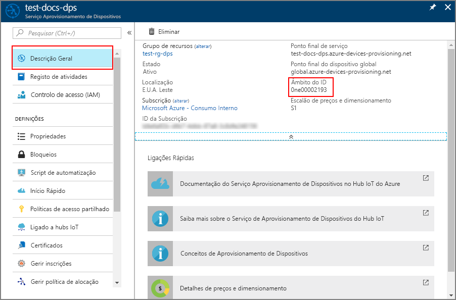

# <a name="how-to-use-custom-allocation-policies"></a>Como usar políticas de atribuição personalizadas

Uma política de atribuição personalizada dá-lhe mais controlo sobre como os dispositivos são atribuídos a um hub IoT. Isto é realizado utilizando código personalizado numa [Função Azure](../azure-functions/functions-overview.md) para atribuir dispositivos a um hub IoT. O serviço de fornecimento de dispositivos chama o seu código de função Azure, fornecendo todas as informações relevantes sobre o dispositivo e a inscrição. O seu código de função é executado e devolve as informações do hub IoT utilizadas para o fornecimento do dispositivo.

Ao utilizar políticas de atribuição personalizadas, define as suas próprias políticas de alocação quando as políticas fornecidas pelo Serviço de Provisionamento de Dispositivos não satisfazem os requisitos do seu cenário.

Por exemplo, talvez queira examinar o certificado que um dispositivo está a usar durante o fornecimento e atribuir o dispositivo a um hub IoT baseado numa propriedade de certificado. Ou, talvez tenha informações armazenadas numa base de dados para os seus dispositivos e precise consultar a base de dados para determinar a que hub IoT um dispositivo deve ser atribuído.

Este artigo demonstra uma política de atribuição personalizada usando uma Função Azure escrita em C#. São criados dois novos hubs IoT que representam uma Divisão de *Torradeiras Contoso* e uma Divisão de *Bombas de Calor Contoso.* Os dispositivos que solicitam o provisionamento devem dispor de um documento de identificação de registo com um dos seguintes sufixos a aceitar para o fornecimento:

* **-contoso-tstrsd-007**: Divisão de Torradeiras Contoso
* **-contoso-hpsd-088**: Divisão de Bombas de Calor de Contoso

Os dispositivos serão aprovisionados com base num destes sufixos necessários no ID de registo. Estes dispositivos serão simulados utilizando uma amostra de provisionamento incluída no [Azure IoT C SDK](https://github.com/Azure/azure-iot-sdk-c).

Realiza os seguintes passos neste artigo:

* Utilize o Azure CLI para criar dois hubs da divisão Contoso IoT ( Divisão de**Torradeiras Contoso** e Divisão de Bombas de **Calor Contoso)**
* Criar uma nova inscrição em grupo utilizando uma Função Azure para a política de atribuição personalizada
* Crie chaves para duas simulações de dispositivo.
* Criar o ambiente de desenvolvimento para o Azure IoT C SDK
* Simular os dispositivos e verificar se são provisionados de acordo com o código de exemplo na política de atribuição personalizada

[!INCLUDE [quickstarts-free-trial-note](../../includes/quickstarts-free-trial-note.md)]

## <a name="prerequisites"></a>Pré-requisitos

Os seguintes pré-requisitos são para um ambiente de desenvolvimento do Windows. Para Linux ou macOS, consulte a secção adequada em Preparar o [seu ambiente](https://github.com/Azure/azure-iot-sdk-c/blob/master/doc/devbox_setup.md) de desenvolvimento na documentação SDK.

* [Visual Studio](https://visualstudio.microsoft.com/vs/) 2019 com o 'Desenvolvimento desktop [com C++'](https://docs.microsoft.com/cpp/?view=vs-2019#pivot=workloads) habilitado. O Visual Studio 2015 e o Visual Studio 2017 também são apoiados.

* Versão mais recente do [Git](https://git-scm.com/download/) instalada.

[!INCLUDE [cloud-shell-try-it.md](../../includes/cloud-shell-try-it.md)]

## <a name="create-the-provisioning-service-and-two-divisional-iot-hubs"></a>Criar o serviço de provisionamento e dois hubs ioT divisionais

Nesta secção, você usa a Casca de Nuvem Azure para criar um serviço de provisionamento e dois hubs IoT representando a Divisão de **Torradeiras Contoso** e a divisão de Bombas de **Calor Contoso.**

> [!TIP]
> Os comandos utilizados neste artigo criam o serviço de provisionamento e outros recursos na localização dos EUA Ocidentais. Recomendamos que crie os seus recursos na região mais próxima que suporte o Serviço de Provisionamento de Dispositivos. Pode ver uma lista das localizações disponíveis ao executar o comando `az provider show --namespace Microsoft.Devices --query "resourceTypes[?resourceType=='ProvisioningServices'].locations | [0]" --out table` ou ao aceder à página [Estado do Azure](https://azure.microsoft.com/status/) e procurar "Serviço Aprovisionamento de Dispositivos". Nos comandos, as localizações podem ser especificadas num formato de palavra ou de várias palavras; por exemplo: westus, West US, WEST US, etc. O valor não é sensível ao caso. Se especificar a localização com o formato de várias palavras, ponha o valor entre aspas, como, por exemplo, `-- location "West US"`.
>

1. Use a Casca de Nuvem Azure para criar um grupo de recursos com o [grupo Az criar](/cli/azure/group#az-group-create) comando. Um grupo de recursos do Azure é um contentor lógico no qual os recursos do Azure são implementados e geridos.

    O exemplo seguinte cria um grupo de recursos chamado *contoso-us-resource-group* na região *de Westus.* Recomenda-se que utilize este grupo para todos os recursos criados neste artigo. Esta abordagem vai facilitar a limpeza depois de terminares.

    ```azurecli-interactive 
    az group create --name contoso-us-resource-group --location westus
    ```

2. Utilize a Casca de Nuvem Azure para criar um serviço de fornecimento de dispositivos com os [dps az iot criar](/cli/azure/iot/dps#az-iot-dps-create) comando. O serviço de provisionamento será adicionado ao grupo de *recursos contoso-us.*

    O exemplo seguinte cria um serviço de provisionamento chamado *contoso-provisioning-service-1098* na localização *westus.* Deve usar um nome de serviço único. Faça o seu próprio sufixo no nome de serviço no lugar de **1098**.

    ```azurecli-interactive 
    az iot dps create --name contoso-provisioning-service-1098 --resource-group contoso-us-resource-group --location westus
    ```

    Este comando pode levar alguns minutos para ser concluído.

3. Use a Casca de Nuvem Azure para criar o centro da Divisão De **Torradeiras Contoso** IoT com o [hub az iot criar](/cli/azure/iot/hub#az-iot-hub-create) comando. O centro ioT será adicionado ao grupo de *recursos contoso-us.*

    O exemplo seguinte cria um hub IoT chamado *contoso-torradeiras-hub-1098* na localização *westus.* Deve usar um nome de centro único. Faça o seu próprio sufixo no nome do hub no lugar de **1098**. O código de exemplo para `-toasters-` a política de atribuição personalizada requer no nome do hub.

    ```azurecli-interactive 
    az iot hub create --name contoso-toasters-hub-1098 --resource-group contoso-us-resource-group --location westus --sku S1
    ```

    Este comando pode levar alguns minutos para ser concluído.

4. Use a Casca de Nuvem Azure para criar o centro da Divisão IoT das **Bombas de Calor Contoso** com o [hub az iot criar](/cli/azure/iot/hub#az-iot-hub-create) comando. Este hub IoT também será adicionado ao grupo de *recursos contoso-nos- us.*

    O exemplo seguinte cria um hub IoT chamado *contoso-heatpumps-hub-1098* na localização *westus.* Deve usar um nome de centro único. Faça o seu próprio sufixo no nome do hub no lugar de **1098**. O código de exemplo para `-heatpumps-` a política de atribuição personalizada requer no nome do hub.

    ```azurecli-interactive 
    az iot hub create --name contoso-heatpumps-hub-1098 --resource-group contoso-us-resource-group --location westus --sku S1
    ```

    Este comando pode levar alguns minutos para ser concluído.

## <a name="create-the-custom-allocation-function"></a>Criar a função de alocação personalizada

Nesta secção, cria-se uma função Azure que implementa a sua política de atribuição personalizada. Esta função decide em que centro de IoT divisional um dispositivo deve ser registado com base em se o seu ID de registo contém a corda **-contoso-tstrsd-007** ou **-contoso-hpsd-088**. Também define o estado inicial do dispositivo twin com base no facto de o dispositivo ser uma torradeira ou uma bomba de calor.

1. Inicie sessão no [portal do Azure](https://portal.azure.com). A partir da sua página inicial, selecione **+ Crie um recurso**.

2. Na caixa de pesquisa *do Mercado,* escreva "App de Funções". A partir da lista de drop-down selecione **App função**, e, em seguida, selecione **Criar**.

3. Na **Aplicação de Funções** criar página, sob o separador **Basics,** introduza as seguintes definições para a sua nova aplicação de funções e selecione **Review + criar**:

    **Grupo de Recursos**: Selecione o **grupo contoso-us-recursos** para manter todos os recursos criados neste artigo em conjunto.

    **Nome da aplicação função**: Introduza um nome de aplicação de função único. Este exemplo utiliza **contoso-function-app-1098**.

    **Publique**: Verifique se o **Código** está selecionado.

    **Pilhas de tempo**de execução : Selecione **.NET Core** a partir da queda.

    **Região**: Selecione a mesma região que o seu grupo de recursos. Este exemplo utiliza **os EUA Ocidentais.**

    > [!NOTE]
    > Por padrão, os Insights de Aplicação estão ativados. A Aplicação Insights não é necessária para este artigo, mas pode ajudá-lo a entender e investigar quaisquer problemas que encontre com a atribuição personalizada. Se preferir, pode desativar os Insights de Aplicação selecionando o separador **monitore** e, em seguida, selecionando **Não** for **Enable Application Insights**.

    

4. Na página **Resumo,** selecione **Criar** para criar a aplicação de funções. A implementação poderá demorar vários minutos. Quando estiver concluído, selecione **Ir para o recurso**.

5. No painel esquerdo da página de **visão** **+** geral da aplicação de funções, selecione ao lado das **Funções** para adicionar uma nova função.

    

6. Nas **Funções Azure para .NET - começar** a página, para o passo ESCOLHA Um AMBIENTE DE **IMPLANTAÇÃO,** selecione o azulejo **In-portal** e, em seguida, selecione **Continuar**.

    

7. Na página seguinte, para o passo **CREATE A FUNCTION,** selecione o suporte **Webhook + API** e, em seguida, selecione **Criar**. É criada uma função chamada **HttpTrigger1** e o portal exibe o conteúdo do ficheiro de código **run.csx.**

8. Referência requer pacotes Nuget. Para criar o dispositivo inicial twin, a função de alocação personalizada utiliza classes que são definidas em dois pacotes Nuget que devem ser carregados no ambiente de hospedagem. Com as Funções Azure, os pacotes Nuget são referenciados utilizando um ficheiro *function.host.* Neste passo, guarde e carregue um ficheiro *de hospedar função.anfitrião.*

    1. Copie as seguintes linhas para o seu editor favorito e guarde o ficheiro no seu computador como *função.host*.

        ```xml
        <Project Sdk="Microsoft.NET.Sdk">  
            <PropertyGroup>  
                <TargetFramework>netstandard2.0</TargetFramework>  
            </PropertyGroup>  
            <ItemGroup>  
                <PackageReference Include="Microsoft.Azure.Devices.Provisioning.Service" Version="1.5.0" />  
                <PackageReference Include="Microsoft.Azure.Devices.Shared" Version="1.16.0" />  
            </ItemGroup>  
        </Project>
        ```

    2. Na função **HttpTrigger1,** expanda o separador **'Ver Ficheiros'** no lado direito da janela.

        

    3. Selecione **Upload,** navegue para o ficheiro **fun.proj** e selecione **Abrir** para carregar o ficheiro.

        

9. Substitua o código pela função **HttpTrigger1** com o seguinte código e selecione **Guardar:**

    ```csharp
    #r "Newtonsoft.Json"

    using System.Net;
    using Microsoft.AspNetCore.Mvc;
    using Microsoft.Extensions.Primitives;
    using Newtonsoft.Json;

    using Microsoft.Azure.Devices.Shared;               // For TwinCollection
    using Microsoft.Azure.Devices.Provisioning.Service; // For TwinState

    public static async Task<IActionResult> Run(HttpRequest req, ILogger log)
    {
        log.LogInformation("C# HTTP trigger function processed a request.");

        // Get request body
        string requestBody = await new StreamReader(req.Body).ReadToEndAsync();
        dynamic data = JsonConvert.DeserializeObject(requestBody);

        log.LogInformation("Request.Body:...");
        log.LogInformation(requestBody);

        // Get registration ID of the device
        string regId = data?.deviceRuntimeContext?.registrationId;

        string message = "Uncaught error";
        bool fail = false;
        ResponseObj obj = new ResponseObj();

        if (regId == null)
        {
            message = "Registration ID not provided for the device.";
            log.LogInformation("Registration ID : NULL");
            fail = true;
        }
        else
        {
            string[] hubs = data?.linkedHubs.ToObject<string[]>();

            // Must have hubs selected on the enrollment
            if (hubs == null)
            {
                message = "No hub group defined for the enrollment.";
                log.LogInformation("linkedHubs : NULL");
                fail = true;
            }
            else
            {
                // This is a Contoso Toaster Model 007
                if (regId.Contains("-contoso-tstrsd-007"))
                {
                    //Find the "-toasters-" IoT hub configured on the enrollment
                    foreach(string hubString in hubs)
                    {
                        if (hubString.Contains("-toasters-"))
                            obj.iotHubHostName = hubString;
                    }

                    if (obj.iotHubHostName == null)
                    {
                        message = "No toasters hub found for the enrollment.";
                        log.LogInformation(message);
                        fail = true;
                    }
                    else
                    {
                        // Specify the initial tags for the device.
                        TwinCollection tags = new TwinCollection();
                        tags["deviceType"] = "toaster";

                        // Specify the initial desired properties for the device.
                        TwinCollection properties = new TwinCollection();
                        properties["state"] = "ready";
                        properties["darknessSetting"] = "medium";

                        // Add the initial twin state to the response.
                        TwinState twinState = new TwinState(tags, properties);
                        obj.initialTwin = twinState;
                    }
                }
                // This is a Contoso Heat pump Model 008
                else if (regId.Contains("-contoso-hpsd-088"))
                {
                    //Find the "-heatpumps-" IoT hub configured on the enrollment
                    foreach(string hubString in hubs)
                    {
                        if (hubString.Contains("-heatpumps-"))
                            obj.iotHubHostName = hubString;
                    }

                    if (obj.iotHubHostName == null)
                    {
                        message = "No heat pumps hub found for the enrollment.";
                        log.LogInformation(message);
                        fail = true;
                    }
                    else
                    {
                        // Specify the initial tags for the device.
                        TwinCollection tags = new TwinCollection();
                        tags["deviceType"] = "heatpump";

                        // Specify the initial desired properties for the device.
                        TwinCollection properties = new TwinCollection();
                        properties["state"] = "on";
                        properties["temperatureSetting"] = "65";

                        // Add the initial twin state to the response.
                        TwinState twinState = new TwinState(tags, properties);
                        obj.initialTwin = twinState;
                    }
                }
                // Unrecognized device.
                else
                {
                    fail = true;
                    message = "Unrecognized device registration.";
                    log.LogInformation("Unknown device registration");
                }
            }
        }

        log.LogInformation("\nResponse");
        log.LogInformation((obj.iotHubHostName != null) ? JsonConvert.SerializeObject(obj) : message);

        return (fail)
            ? new BadRequestObjectResult(message) 
            : (ActionResult)new OkObjectResult(obj);
    }

    public class ResponseObj
    {
        public string iotHubHostName {get; set;}
        public TwinState initialTwin {get; set;}
    }
    ```

## <a name="create-the-enrollment"></a>Criar a inscrição

Nesta secção, você vai criar um novo grupo de inscrições que usa a política de atribuição personalizada. Para a simplicidade, este artigo usa a [chave simétrica](concepts-symmetric-key-attestation.md) com a inscrição. Para uma solução mais segura, considere usar o [atestado de certificado X.509](concepts-security.md#x509-certificates) com uma cadeia de confiança.

1. Ainda no [portal Azure,](https://portal.azure.com)abra o seu serviço de provisionamento.

2. Selecione **Gerir as matrículas** no painel esquerdo e, em seguida, selecione o botão do **grupo adicionar** na parte superior da página.

3. No **Grupo adicionar inscrição,** introduza as seguintes informações e selecione o botão **Guardar.**

    **Nome do grupo**: **Contos Entero-custom-allocated-devices**.

    **Tipo de atestado**: Selecione **a chave simétrica**.

    **Chaves de geração automática**: Esta caixa de verificação já deve ser verificada.

    **Selecione como pretende atribuir dispositivos a centros**: Selecione **Custom (Função Use Azure)**.

    

4. No **Add Registration Group,** selecione **Link um novo hub IoT** para ligar ambos os seus novos hubs ioT divisionários.

    Execute este passo para ambos os seus centros iot divisionários.

    **Subscrição**: Se tiver várias subscrições, escolha a subscrição onde criou os hubs IoT divisionais.

    **Hub IoT**: Selecione um dos centros de divisão que criou.

    **Política de Acesso**: Escolha **iothubowner**.

    

5. No **Add Enrollment Group,** uma vez ligados ambos os centros ioT divisionais, deve selecioná-los como o grupo IoT Hub para o grupo de inscrições, como mostrado abaixo:

    

6. No **Grupo de Inscrição add,** desloque-se até à secção **Função Select Azure,** selecione a aplicação 'Função' criada na secção anterior. Em seguida, selecione a função que criou e selecione Guardar para salvar o grupo de matrículas.

    

7. Depois de salvar a matrícula, reabra-a e tome nota da **Chave Primária.** Tem de poupar a inscrição primeiro para gerar as chaves. Esta chave será utilizada para gerar chaves únicas para dispositivos simulados mais tarde.

## <a name="derive-unique-device-keys"></a>Obter chaves únicas do dispositivo

Nesta secção, cria-se duas teclas únicas do dispositivo. Uma chave será usada para um dispositivo de torradeira simulado. A outra tecla será utilizada para um dispositivo simulado de bomba de calor.

Para gerar a chave do dispositivo, utiliza a **Chave Primária** que observou anteriormente para calcular o [HMAC-SHA256](https://wikipedia.org/wiki/HMAC) do ID de registo do dispositivo para cada dispositivo e converter o resultado em formato Base64. Para obter mais informações sobre a criação de chaves derivadas do dispositivo com grupos de matrículas, consulte a secção de matrículas em grupo do atestado da [chave simétrica](concepts-symmetric-key-attestation.md).

Por exemplo neste artigo, utilize as seguintes duas identificações de registo do dispositivo e calcule uma chave de dispositivo para ambos os dispositivos. Ambos os IDs de registo têm um sufixo válido para trabalhar com o código de exemplo para a política de atribuição personalizada:

* **breakroom499-contoso-tstrsd-007**
* **mainbuilding167-contoso-hpsd-088**

### <a name="linux-workstations"></a>Estações de trabalho linux

Se estiver a utilizar uma estação de trabalho Linux, pode utilizar o openssl para gerar as chaves derivadas do dispositivo, como mostra o seguinte exemplo.

1. Substitua o valor da **KEY** pela **Chave Primária** que observou anteriormente.

    ```bash
    KEY=oiK77Oy7rBw8YB6IS6ukRChAw+Yq6GC61RMrPLSTiOOtdI+XDu0LmLuNm11p+qv2I+adqGUdZHm46zXAQdZoOA==

    REG_ID1=breakroom499-contoso-tstrsd-007
    REG_ID2=mainbuilding167-contoso-hpsd-088

    keybytes=$(echo $KEY | base64 --decode | xxd -p -u -c 1000)
    devkey1=$(echo -n $REG_ID1 | openssl sha256 -mac HMAC -macopt hexkey:$keybytes -binary | base64)
    devkey2=$(echo -n $REG_ID2 | openssl sha256 -mac HMAC -macopt hexkey:$keybytes -binary | base64)

    echo -e $"\n\n$REG_ID1 : $devkey1\n$REG_ID2 : $devkey2\n\n"
    ```

    ```bash
    breakroom499-contoso-tstrsd-007 : JC8F96eayuQwwz+PkE7IzjH2lIAjCUnAa61tDigBnSs=
    mainbuilding167-contoso-hpsd-088 : 6uejA9PfkQgmYylj8Zerp3kcbeVrGZ172YLa7VSnJzg=
    ```

### <a name="windows-based-workstations"></a>Estações de trabalho baseadas em janelas

Se estiver a utilizar uma estação de trabalho baseada no Windows, pode utilizar o PowerShell para gerar a sua chave de dispositivo derivada, como mostra o seguinte exemplo.

1. Substitua o valor da **KEY** pela **Chave Primária** que observou anteriormente.

    ```powershell
    $KEY='oiK77Oy7rBw8YB6IS6ukRChAw+Yq6GC61RMrPLSTiOOtdI+XDu0LmLuNm11p+qv2I+adqGUdZHm46zXAQdZoOA=='

    $REG_ID1='breakroom499-contoso-tstrsd-007'
    $REG_ID2='mainbuilding167-contoso-hpsd-088'

    $hmacsha256 = New-Object System.Security.Cryptography.HMACSHA256
    $hmacsha256.key = [Convert]::FromBase64String($key)
    $sig1 = $hmacsha256.ComputeHash([Text.Encoding]::ASCII.GetBytes($REG_ID1))
    $sig2 = $hmacsha256.ComputeHash([Text.Encoding]::ASCII.GetBytes($REG_ID2))
    $derivedkey1 = [Convert]::ToBase64String($sig1)
    $derivedkey2 = [Convert]::ToBase64String($sig2)

    echo "`n`n$REG_ID1 : $derivedkey1`n$REG_ID2 : $derivedkey2`n`n"
    ```

    ```powershell
    breakroom499-contoso-tstrsd-007 : JC8F96eayuQwwz+PkE7IzjH2lIAjCUnAa61tDigBnSs=
    mainbuilding167-contoso-hpsd-088 : 6uejA9PfkQgmYylj8Zerp3kcbeVrGZ172YLa7VSnJzg=
    ```

Os dispositivos simulados utilizarão as teclas derivadas do dispositivo com cada identificação de registo para efetuar o atestado da chave simétrica.

## <a name="prepare-an-azure-iot-c-sdk-development-environment"></a>Preparar um ambiente de programação para o SDK C do Azure IoT

Nesta secção, prepara-se o ambiente de desenvolvimento utilizado para construir o [Azure IoT C SDK](https://github.com/Azure/azure-iot-sdk-c). O SDK inclui o código de amostra para o dispositivo simulado. Esse dispositivo simulado irá tentar fazer o aprovisionamento durante a respetiva sequência de arranque.

Esta secção está orientada para uma estação de trabalho baseada no Windows. Para um exemplo linux, consulte a configuração dos VMs em [Como fornecer multitenancy](how-to-provision-multitenant.md).

1. Descarregue o [sistema de construção CMake](https://cmake.org/download/).

    É importante que os pré-requisitos do Visual Studio (Visual Studio e a carga de trabalho "Desenvolvimento do ambiente de trabalho em C++") estejam instalados no computador, **antes** de iniciar a instalação de `CMake`. Depois de os pré-requisitos estarem assegurados e a transferência verificada, instale o sistema de compilação CMake.

2. Encontre o nome da etiqueta para o [mais recente lançamento](https://github.com/Azure/azure-iot-sdk-c/releases/latest) do SDK.

3. Abra uma linha de comandos ou a shell do Git Bash. Executar os seguintes comandos para clonar o mais recente lançamento do [repositório Azure IoT C SDK](https://github.com/Azure/azure-iot-sdk-c) GitHub. Utilize a etiqueta encontrada no passo anterior `-b` como valor para o parâmetro:

    ```cmd/sh
    git clone -b <release-tag> https://github.com/Azure/azure-iot-sdk-c.git
    cd azure-iot-sdk-c
    git submodule update --init
    ```

    Esta operação deve demorar vários minutos a ser concluída.

4. Crie um subdiretório `cmake` no diretório de raiz do repositório git e navegue para essa pasta. Executar os seguintes `azure-iot-sdk-c` comandos do diretório:

    ```cmd/sh
    mkdir cmake
    cd cmake
    ```

5. Execute o seguinte comando para compilar uma versão do SDK específica da plataforma de cliente de desenvolvimento. Será gerada uma solução do Visual Studio para o dispositivo simulado no diretório `cmake`. 

    ```cmd
    cmake -Dhsm_type_symm_key:BOOL=ON -Duse_prov_client:BOOL=ON  ..
    ```

    Se `cmake` não encontrar o seu compilador C++, poderá obter erros de construção enquanto executa o comando. Se isso acontecer, tente executar o comando no comando do [Estúdio Visual.](https://docs.microsoft.com/dotnet/framework/tools/developer-command-prompt-for-vs)

    Assim que a compilação for concluída com êxito, as últimas linhas de saída terão um aspeto semelhante ao seguinte:

    ```cmd/sh
    $ cmake -Dhsm_type_symm_key:BOOL=ON -Duse_prov_client:BOOL=ON  ..
    -- Building for: Visual Studio 15 2017
    -- Selecting Windows SDK version 10.0.16299.0 to target Windows 10.0.17134.
    -- The C compiler identification is MSVC 19.12.25835.0
    -- The CXX compiler identification is MSVC 19.12.25835.0

    ...

    -- Configuring done
    -- Generating done
    -- Build files have been written to: E:/IoT Testing/azure-iot-sdk-c/cmake
    ```

## <a name="simulate-the-devices"></a>Simular os dispositivos

Nesta secção, atualiza uma amostra de provisionamento chamada amostra de **cliente\_\_\_prov dev** localizada no Azure IoT C SDK que configurapreviamente.

Este código de amostra simula uma sequência de arranque do dispositivo que envia o pedido de provisionamento para a sua instância de Serviço de Provisionamento de Dispositivos. A sequência de arranque fará com que o dispositivo de torradeira seja reconhecido e atribuído ao hub IoT utilizando a política de atribuição personalizada.

1. No portal do Azure, selecione o separador **Descrição Geral** do Serviço de Aprovisionamento de Dispositivos e anote o valor de **_Âmbito do ID_**.

     

2. No Visual Studio, abra o ficheiro de solução **azure_iot_sdks.sln** que foi gerado pela execução de CMake anteriormente. O ficheiro de solução deve estar na seguinte localização:

    ```
    azure-iot-sdk-c\cmake\azure_iot_sdks.sln
    ```

3. Na janela *Solution Explorer* (Explorador de Soluções) do Visual Studio, navegue para a pasta **Provision\_Samples**. Expanda o projeto de exemplo com o nome **prov\_dev\_client\_sample**. Expanda **Source Files** (Ficheiros de Origem) e abra **prov\_dev\_client\_sample.c**.

4. Localize a constante `id_scope` e substitua o valor pelo seu **Âmbito do ID** que copiou anteriormente. 

    ```c
    static const char* id_scope = "0ne00002193";
    ```

5. Localize a definição da função `main()` no mesmo ficheiro. Certifique-se de que a variável `hsm_type` está definida como `SECURE_DEVICE_TYPE_SYMMETRIC_KEY`, conforme mostrado abaixo:

    ```c
    SECURE_DEVICE_TYPE hsm_type;
    //hsm_type = SECURE_DEVICE_TYPE_TPM;
    //hsm_type = SECURE_DEVICE_TYPE_X509;
    hsm_type = SECURE_DEVICE_TYPE_SYMMETRIC_KEY;
    ```

6. Clique com o botão direito do rato no projeto **prov\_dev\_client\_sample** e selecione **Definir como Projeto de Arranque**.

### <a name="simulate-the-contoso-toaster-device"></a>Simular o dispositivo de torradeira Contoso

1. Para simular o dispositivo de torradeira, encontre a chamada `prov_dev_set_symmetric_key_info()` em **prov\_dev\_client\_sample.c** que é comentada.

    ```c
    // Set the symmetric key if using they auth type
    //prov_dev_set_symmetric_key_info("<symm_registration_id>", "<symmetric_Key>");
    ```

    Descodere a chamada de função e substitua os valores do espaço reservado (incluindo os suportes angulares) pelo ID de registo da torradeira e pela chave do dispositivo derivado que gerou anteriormente. O valor-chave **JC8F96eayuQwwz+PkE7IzjH2lIAjCUnAa61tDigBnSs=** mostrado abaixo é apenas dado como exemplo.

    ```c
    // Set the symmetric key if using they auth type
    prov_dev_set_symmetric_key_info("breakroom499-contoso-tstrsd-007", "JC8F96eayuQwwz+PkE7IzjH2lIAjCUnAa61tDigBnSs=");
    ```

    Guarde o ficheiro.

2. No menu estúdio visual, selecione **Debug** > **Start sem depurar** para executar a solução. Na solicitação de reconstruir o projeto, selecione **Sim,** para reconstruir o projeto antes de executar.

    A saída seguinte é um exemplo do dispositivo torradeira simulado que consegue arrancar e ligar-se à instância do serviço de provisionamento a atribuir ao hub ioT das torradeiras pela política de atribuição personalizada:

    ```cmd
    Provisioning API Version: 1.3.6

    Registering Device

    Provisioning Status: PROV_DEVICE_REG_STATUS_CONNECTED
    Provisioning Status: PROV_DEVICE_REG_STATUS_ASSIGNING
    Provisioning Status: PROV_DEVICE_REG_STATUS_ASSIGNING

    Registration Information received from service: contoso-toasters-hub-1098.azure-devices.net, deviceId: breakroom499-contoso-tstrsd-007

    Press enter key to exit:
    ```

### <a name="simulate-the-contoso-heat-pump-device"></a>Simular o dispositivo de bomba de calor Contoso

1. Para simular o dispositivo de `prov_dev_set_symmetric_key_info()` bomba de calor, atualize a chamada para em **prov\_dev\_client\_sample.c** novamente com o ID de registo da bomba de calor e chave do dispositivo derivado que gerou anteriormente. O valor-chave **6uejA9PfkQgmYlj8Zerp3kcbeVrGZ172YLa7VSnJzg=** mostrado abaixo também é dado como exemplo.

    ```c
    // Set the symmetric key if using they auth type
    prov_dev_set_symmetric_key_info("mainbuilding167-contoso-hpsd-088", "6uejA9PfkQgmYylj8Zerp3kcbeVrGZ172YLa7VSnJzg=");
    ```

    Guarde o ficheiro.

2. No menu estúdio visual, selecione **Debug** > **Start sem depurar** para executar a solução. Na solicitação de reconstruir o projeto, selecione **Sim** para reconstruir o projeto antes de executar.

    A saída seguinte é um exemplo do dispositivo simulado de bomba de calor que consegue arrancar e ligar-se à instância de serviço de provisionamento a atribuir ao hub DeSértica bombas de calor IoT pela política de atribuição personalizada:

    ```cmd
    Provisioning API Version: 1.3.6

    Registering Device

    Provisioning Status: PROV_DEVICE_REG_STATUS_CONNECTED
    Provisioning Status: PROV_DEVICE_REG_STATUS_ASSIGNING
    Provisioning Status: PROV_DEVICE_REG_STATUS_ASSIGNING

    Registration Information received from service: contoso-heatpumps-hub-1098.azure-devices.net, deviceId: mainbuilding167-contoso-hpsd-088

    Press enter key to exit:
    ```

## <a name="troubleshooting-custom-allocation-policies"></a>Políticas de atribuição personalizada de resolução de problemas

A tabela que se segue mostra cenários esperados e os códigos de erro dos resultados que poderá receber. Utilize esta tabela para ajudar a resolver falhas de política de atribuição personalizada com as suas Funções Azure.

| Cenário | Resultado da inscrição do Serviço de Provisionamento | Provisioning SDK Resultados |
| -------- | --------------------------------------------- | ------------------------ |
| O webhook devolve 200 OK com 'iotHubHostName' definido para um nome de anfitrião de hub IoT válido | Estado do resultado: Atribuído  | SDK devolve PROV_DEVICE_RESULT_OK juntamente com informações do hub |
| O webhook devolve 200 OK com 'iotHubHostName' presente na resposta, mas definido para uma corda vazia ou nula | Estado do resultado: Falhado<br><br> Código de erro: CustomAllocationIotHubNotEspecificado (400208) | SDK devolve PROV_DEVICE_RESULT_HUB_NOT_SPECIFIED |
| O webhook devolve 401 não autorizados | Estado do resultado: Falhado<br><br>Código de erro: CustomAllocationUnauthorizedAccess (400209) | SDK regressa PROV_DEVICE_RESULT_UNAUTHORIZED |
| Foi criada uma inscrição individual para desativar o dispositivo | Estado do resultado: Deficiente | SDK regressa PROV_DEVICE_RESULT_DISABLED |
| O webhook devolve código de erro >= 429 | A orquestração do DPS vai voltar a tentar várias vezes. A política de retry é atualmente:<br><br>&nbsp;&nbsp;- Contagem de retry: 10<br>&nbsp;&nbsp;- Intervalo inicial: 1s<br>&nbsp;&nbsp;- Incremento: 9s | SDK ignorará o erro e submeterá outra mensagem de estado de obter no tempo especificado |
| O webhook devolve qualquer outro código de estado | Estado do resultado: Falhado<br><br>Código de erro: CustomAllocationFailed (400207) | SDK regressa PROV_DEVICE_RESULT_DEV_AUTH_ERROR |

## <a name="clean-up-resources"></a>Limpar recursos

Se pretende continuar a trabalhar com os recursos criados neste artigo, pode deixá-los. Se não pretende continuar a utilizar os recursos, use os seguintes passos para eliminar todos os recursos criados neste artigo para evitar encargos desnecessários.

Os passos aqui assumem que criou todos os recursos neste artigo, tal como instruído no mesmo grupo de recursos chamado **contoso-us-resource-group**.

> [!IMPORTANT]
> A eliminação de um grupo de recursos é irreversível. O grupo de recursos e todos os recursos nele contidos são eliminados permanentemente. Confirme que não elimina acidentalmente o grupo de recursos ou recursos errados. Se tiver criado o Hub IoT no interior de um grupo de recursos existente que contenha recursos que pretende manter, elimine apenas o recurso do Hub IoT, em vez de eliminar o grupo de recursos.
>

Para eliminar o grupo de recursos pelo nome:

1. Inicie sessão no [Portal do Azure](https://portal.azure.com) e selecione **Grupos de recursos**.

2. No **Filtro pelo nome...** textbox, digite o nome do grupo de recursos que contém os seus recursos, **contoso-us-resource-group**. 

3. À direita do seu grupo de recursos **...** na lista de resultados, selecione... em **seguida, elimine**o grupo de recursos .

4. Será-lhe pedido que confirme a eliminação do grupo de recursos. Digite novamente o nome do seu grupo de recursos para confirmar e, em seguida, **selecione Eliminar**. Após alguns instantes, o grupo de recursos e todos os recursos contidos no mesmo são eliminados.

## <a name="next-steps"></a>Passos seguintes

* Para aprender mais Reprovisionamento, consulte [conceitos de reprovisionamento de dispositivos IoT Hub](concepts-device-reprovision.md) 
* Para saber mais Deprovisionamento, consulte [Como desprovisionar dispositivos que foram previamente autoprovisionados](how-to-unprovision-devices.md) 
