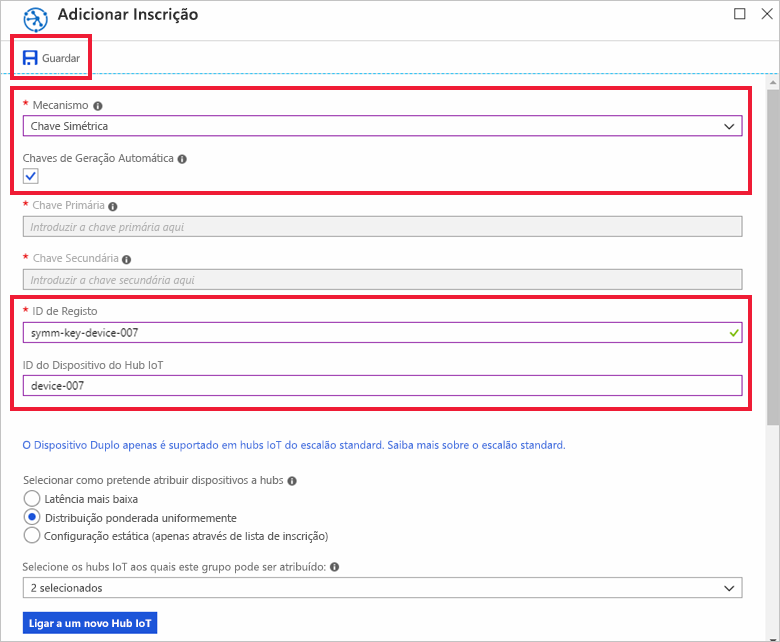

# <a name="quickstart-provision-a-device-with-symmetric-keys"></a>Quickstart: Provision a dispositivo com chaves simétricas

Neste arranque rápido, irá aprender a executar o código de provisão de dispositivos numa máquina de desenvolvimento Windows para o ligar a um Hub IoT como um dispositivo IoT. Configurará este dispositivo para utilizar uma autenticação de chave simétrica com uma instância de Serviço de Provisionamento de Dispositivos e será atribuído a um hub IoT. O código de amostra do [Azure IoT C SDK](https://github.com/Azure/azure-iot-sdk-c) será utilizado para o fornecimento do dispositivo. O dispositivo será reconhecido com base numa inscrição individual com uma instância do serviço de aprovisionamento e atribuído a um hub IoT.

Embora este artigo demonstre o provisionamento com uma inscrição individual, você pode usar grupos de inscrição. Há algumas diferenças na utilização de grupos de inscrição. Por exemplo, deve utilizar uma chave de dispositivo derivada com um ID de registo único para o dispositivo. Embora os grupos de inscrições de chave simétrica não estejam limitados a dispositivos legados, o artigo [Como aprovisionar dispositivos legados com o atestado de chave simétrica](how-to-legacy-device-symm-key.md) fornece um exemplo de grupo de inscrições. Para obter mais informações, veja [Inscrições em grupo para o Atestado de Chave Simétrica](concepts-symmetric-key-attestation.md#group-enrollments).

Se não estiver familiarizado com o processo de autoprovisionamento, reveja a visão geral [do provisionamento.](about-iot-dps.md#provisioning-process) 

Certifique-se também de que executa os passos descritos em [Configurar o Serviço de Aprovisionamento de Dispositivos no Hub IoT com o portal do Azure](./quick-setup-auto-provision.md) antes de continuar este início rápido. Este guia de início rápido exige que já tenha criado a instância do Serviço de Aprovisionamento de Dispositivos.

Este artigo é orientado para uma estação de trabalho baseada no Windows. No entanto, pode efetuar os procedimentos no Linux. Para obter um exemplo para Linux, veja [Como aprovisionar para multi-inquilinos](how-to-provision-multitenant.md).


[!INCLUDE [quickstarts-free-trial-note](../../includes/quickstarts-free-trial-note.md)]


## <a name="prerequisites"></a>Pré-requisitos

Os seguintes pré-requisitos são para um ambiente de desenvolvimento do Windows. Para Linux ou macOS, consulte a secção apropriada no preparar o [seu ambiente de desenvolvimento](https://github.com/Azure/azure-iot-sdk-c/blob/master/doc/devbox_setup.md) na documentação SDK.

* [Visual Studio](https://visualstudio.microsoft.com/vs/) 2019 com o ['desenvolvimento do ambiente de trabalho com C++'](/cpp/ide/using-the-visual-studio-ide-for-cpp-desktop-development) habilitado. Visual Studio 2015 e Visual Studio 2017 também são suportados.

* Versão mais recente do [Git](https://git-scm.com/download/) instalada.

<a id="setupdevbox"></a>

## <a name="prepare-an-azure-iot-c-sdk-development-environment"></a>Preparar um ambiente de programação para o SDK C do Azure IoT

Nesta secção, irá preparar um ambiente de programação utilizado para criar o [SDK C do Azure IoT](https://github.com/Azure/azure-iot-sdk-c). 

O SDK inclui o código de amostra de provisionamento para dispositivos. Esta tentativa de código de provisões durante a sequência de arranque do dispositivo.

1. Descarregue o [sistema de construção CMake](https://cmake.org/download/).

    É importante que os pré-requisitos do Visual Studio (Visual Studio e a carga de trabalho "Desenvolvimento do ambiente de trabalho em C++") estejam instalados no computador, **antes** de iniciar a instalação de `CMake`. Depois de os pré-requisitos estarem assegurados e a transferência verificada, instale o sistema de compilação CMake.

    Versões mais antigas do sistema de construção CMake não conseguem gerar o ficheiro de solução utilizado neste artigo. Certifique-se de que utiliza uma versão mais recente do CMake.

2. Clique **em Tags** e encontre o nome da etiqueta para a versão mais recente na [página de Lançamento do Azure IoT C SDK](https://github.com/Azure/azure-iot-sdk-c/releases/latest).

3. Abra uma linha de comandos ou a shell do Git Bash. Executar os seguintes comandos para clonar a mais recente versão do repositório [Azure IoT C SDK](https://github.com/Azure/azure-iot-sdk-c) GitHub. Utilize a etiqueta encontrada no passo anterior como o valor para o `-b` parâmetro:

    ```cmd/sh
    git clone -b <release-tag> https://github.com/Azure/azure-iot-sdk-c.git
    cd azure-iot-sdk-c
    git submodule update --init
    ```

    Esta operação deve demorar vários minutos a ser concluída.

4. Crie um subdiretório `cmake` no diretório de raiz do repositório git e navegue para essa pasta. Executar os seguintes comandos a partir do `azure-iot-sdk-c` diretório:

    ```cmd/sh
    mkdir cmake
    cd cmake
    ```

5. Execute o seguinte comando para compilar uma versão do SDK específica da plataforma de cliente de desenvolvimento. Uma solução Visual Studio para o código de provisionamento do dispositivo será gerada no `cmake` diretório. 

    ```cmd
    cmake -Dhsm_type_symm_key:BOOL=ON -Duse_prov_client:BOOL=ON  ..
    ```
    
    Se `cmake` não encontrar o compilador de C++, poderá obter erros de compilação ao executar o comando acima. Se isto acontecer, tente executar o comando seguinte na [linha de comandos do Visual Studio](/dotnet/framework/tools/developer-command-prompt-for-vs). 

    Assim que a compilação for concluída com êxito, as últimas linhas de saída terão um aspeto semelhante ao seguinte:

    ```cmd/sh
    $ cmake -Dhsm_type_symm_key:BOOL=ON -Duse_prov_client:BOOL=ON  ..
    -- Building for: Visual Studio 15 2017
    -- Selecting Windows SDK version 10.0.16299.0 to target Windows 10.0.17134.
    -- The C compiler identification is MSVC 19.12.25835.0
    -- The CXX compiler identification is MSVC 19.12.25835.0

    ...

    -- Configuring done
    -- Generating done
    -- Build files have been written to: E:/IoT Testing/azure-iot-sdk-c/cmake
    ```

## <a name="create-a-device-enrollment-entry-in-the-portal"></a>Criar uma entrada de inscrição de dispositivos no portal

1. Inscreva-se no [portal Azure,](https://portal.azure.com)selecione o botão **Todos os recursos** no menu esquerdo e abra o serviço de Provisionamento de Dispositivos.

2. Selecione o **separador Descodusagens** de Gestão e, em seguida, selecione o botão **de inscrição individual Adicionar** no topo. 

3. No painel **'Adicionar Inscrição',** introduza as seguintes informações e prima o botão **Guardar.**

   - **Mecanismo:** selecione **Chave Simétrica** como o *Mecanismo* de atestado de identidades.

   - **Teclas de geração automática**: Verifique esta caixa.

   - **ID de Registo**: introduza um ID de registo para identificar a inscrição. Utilize apenas carateres alfanuméricos em minúsculas e travessões ("-"). Por exemplo, **symm-key-device-007**.

   - **ID do Dispositivo do Hub IoT:** introduza o identificador de um dispositivo. Por exemplo, **device-007**.

     

4. Uma vez guardada a sua inscrição, a **Chave Primária** e a **Chave Secundária** serão geradas e adicionadas à inscrição. A inscrição do dispositivo de chave simétrica é apresentada como **symm-key-device-007** na coluna *ID de Registo* do separador *Inscrições Individuais*. 

    Abra a inscrição e copie o valor da **Chave Primária** gerada.


<a id="firstbootsequence"></a>

## <a name="run-the-provisioning-code-for-the-device"></a>Executar o código de provisionamento para o dispositivo

Nesta secção, atualize o código de exemplo para enviar a sequência de arranque do dispositivo para a instância do Serviço de Aprovisionamento de Dispositivos. Esta sequência de arranque fará com que o dispositivo seja reconhecido e atribuído a um hub IoT ligado à instância do Serviço de Aprovisionamento de Dispositivos.


1. No portal Azure, selecione o **separador 'Vista Geral'** para o serviço de Provisionamento de Dispositivos e note o valor **_ID Scope._**

     

2. No Visual Studio, abra o ficheiro de solução **azure_iot_sdks.sln** gerado ao executar o CMake. O ficheiro de solução deve estar na seguinte localização:

    ```
    \azure-iot-sdk-c\cmake\azure_iot_sdks.sln
    ```

    Se o ficheiro não foi gerado no seu diretório de cmake, certifique-se de que utilizou uma versão recente do sistema de construção CMake.

3. Na janela *Solution Explorer* (Explorador de Soluções) do Visual Studio, navegue para a pasta **Provision\_Samples**. Expanda o projeto de exemplo com o nome **prov\_dev\_client\_sample**. Expanda **Source Files** (Ficheiros de Origem) e abra **prov\_dev\_client\_sample.c**.

4. Localize a constante `id_scope` e substitua o valor pelo seu **Âmbito do ID** que copiou anteriormente. 

    ```c
    static const char* id_scope = "0ne00002193";
    ```

5. Localize a definição da função `main()` no mesmo ficheiro. Certifique-se de que a variável `hsm_type` está definida como `SECURE_DEVICE_TYPE_SYMMETRIC_KEY`, conforme mostrado abaixo:

    ```c
    SECURE_DEVICE_TYPE hsm_type;
    //hsm_type = SECURE_DEVICE_TYPE_TPM;
    //hsm_type = SECURE_DEVICE_TYPE_X509;
    hsm_type = SECURE_DEVICE_TYPE_SYMMETRIC_KEY;
    ```

6. Encontre a chamada para a `prov_dev_set_symmetric_key_info()` **amostra do cliente prov \_ \_ dev.c \_** que é comentada.

    ```c
    // Set the symmetric key if using they auth type
    //prov_dev_set_symmetric_key_info("<symm_registration_id>", "<symmetric_Key>");
    ```

    Descompromete a chamada de função e substitua os valores do espaço reservado (incluindo os suportes angulares) pelo seu ID de registo e valores de chave primárias.

    ```c
    // Set the symmetric key if using they auth type
    prov_dev_set_symmetric_key_info("symm-key-device-007", "your primary key here");
    ```
   
    Guarde o ficheiro.

7. Clique com o botão direito do rato no projeto **prov\_dev\_client\_sample** e selecione **Definir como Projeto de Arranque**. 

8. No menu Visual Studio, selecione **Debug**  >  **Start sem depurar** para executar a solução. Na reconstroem o pedido do projeto, selecione **Sim** para reconstruir o projeto antes de executar.

    A seguinte saída é um exemplo do dispositivo que se conecta com sucesso à instância de serviço de fornecimento a atribuir a um hub IoT:

    ```cmd
    Provisioning API Version: 1.2.8

    Registering Device

    Provisioning Status: PROV_DEVICE_REG_STATUS_CONNECTED
    Provisioning Status: PROV_DEVICE_REG_STATUS_ASSIGNING
    Provisioning Status: PROV_DEVICE_REG_STATUS_ASSIGNING

    Registration Information received from service: 
    test-docs-hub.azure-devices.net, deviceId: device-007    
    Press enter key to exit:
    ```

9. No portal, navegue para o hub IoT a que o seu dispositivo foi atribuído e selecione o **separador dispositivos IoT.** Ao providenciar com sucesso o fornecimento do dispositivo ao hub, o seu ID do dispositivo aparece na lâmina **IoT Devices,** com *status* conforme **ativado**. Pode ser necessário **premir** o botão Refresh na parte superior. 

     


## <a name="clean-up-resources"></a>Limpar os recursos

Se pretender continuar a trabalhar e explorar a amostra do cliente do dispositivo, não limpe os recursos criados neste quickstart. Se não pretender continuar, utilize os seguintes passos para eliminar todos os recursos criados por este arranque rápido.

1. Feche a janela da saída do exemplo de dispositivo cliente no seu computador.
1. A partir do menu à esquerda no portal Azure, selecione **Todos os recursos** e, em seguida, selecione o seu serviço de Provisionamento de Dispositivos. Abrir **As Inscrições** para o seu serviço e, em seguida, selecionar o separador **Inscrições Individuais.** Selecione a caixa de verificação ao lado do *ID de registo* do dispositivo que inscreveu neste arranque rápido e prima o botão **Eliminar** na parte superior do painel. 
1. A partir do menu à esquerda no portal Azure, selecione **Todos os recursos** e, em seguida, selecione o seu hub IoT. Abra **os dispositivos IoT** para o seu hub, selecione a caixa de verificação ao lado do *ID* do dispositivo que registou neste arranque rápido e, em seguida, pressione o botão **Eliminar** na parte superior do painel.

## <a name="next-steps"></a>Passos seguintes

Neste arranque rápido, executou o código de provisionamento do dispositivo na sua máquina Windows.  O dispositivo foi autenticado e a provisionado ao seu hub IoT utilizando uma chave simétrica. Para aprender a providenciar um dispositivo de certificado X.509, continue a iniciar rapidamente os dispositivos X.509. 

> [!div class="nextstepaction"]
> [Azure quickstart - Provision um dispositivo X.509 utilizando o Azure IoT C SDK](quick-create-simulated-device-x509.md)