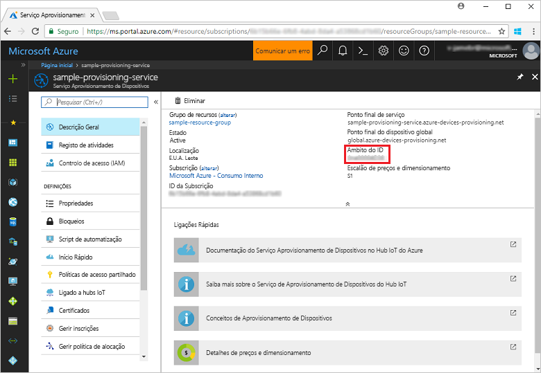
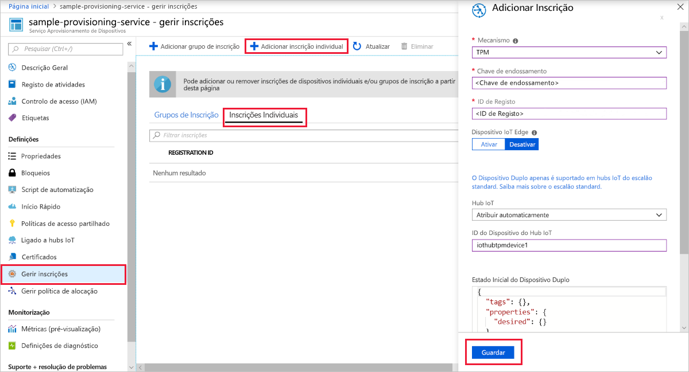
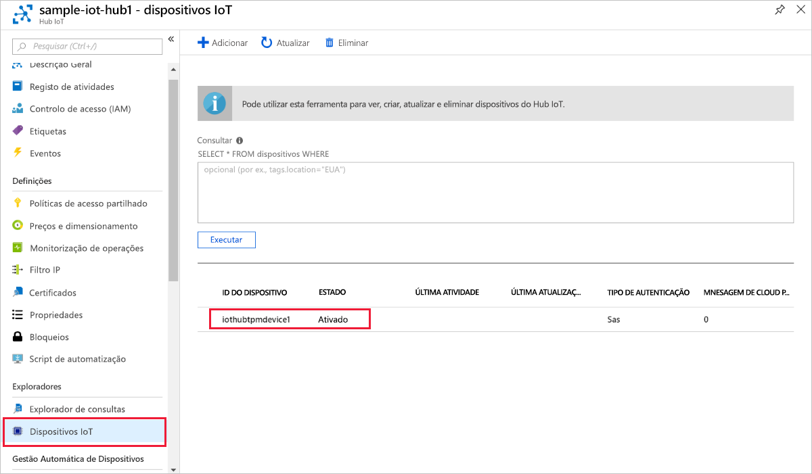

# <a name="quickstart-create-and-provision-a-simulated-tpm-device-using-c-device-sdk-for-iot-hub-device-provisioning-service"></a>Quickstart: Criar e providenciar um dispositivo TPM simulado utilizando o dispositivo C# SDK para serviço de provisionamento de dispositivos IoT Hub

[!INCLUDE [iot-dps-selector-quick-create-simulated-device-tpm](../../includes/iot-dps-selector-quick-create-simulated-device-tpm.md)]

Estes passos mostram-lhe como utilizar as [amostras Azure IoT para C#](https://github.com/Azure-Samples/azure-iot-samples-csharp) para simular um dispositivo TPM numa máquina de desenvolvimento que executa o Sistema operativo Windows. A amostra também liga o dispositivo simulado a um Hub IoT utilizando o Serviço de Provisionamento de Dispositivos. 

O código de exemplo utiliza o simulador de TPM do Windows como o [Módulo de Segurança de Hardware (HSM)](https://azure.microsoft.com/blog/azure-iot-supports-new-security-hardware-to-strengthen-iot-security/) do dispositivo. 

Se não estiver familiarizado com o processo de autoprovisionamento, reveja a visão geral [do provisionamento.](about-iot-dps.md#provisioning-process) Certifique-se também de que executa os passos descritos em [Configurar o Serviço de Aprovisionamento de Dispositivos no Hub IoT com o portal do Azure](./quick-setup-auto-provision.md) antes de continuar. 

O Serviço Aprovisionamento de Dispositivos no IoT do Azure suporta dois tipos de inscrição:

- [Grupos de inscrição](concepts-service.md#enrollment-group): utilizados para inscrever vários dispositivos relacionados.
- [Inscrições Individuais](concepts-service.md#individual-enrollment): utilizadas para inscrever um dispositivo individual.

Este artigo vai demonstrar as inscrições individuais.

[!INCLUDE [IoT Device Provisioning Service basic](../../includes/iot-dps-basic.md)]

<a id="setupdevbox"></a>
## <a name="prepare-the-development-environment"></a>Preparar o ambiente de desenvolvimento 

1. Certifique-se de que tem o [.NET Core 2.1 SDK ou posteriormente](https://www.microsoft.com/net/download/windows) instalado na sua máquina. 

1. Verifique se `git` está instalado no computador e que é adicionado às variáveis de ambiente às quais a janela de comandos pode aceder. Veja as [ferramentas de cliente Git da Software Freedom Conservancy](https://git-scm.com/download/) relativamente à mais recente versão das ferramentas de `git` a instalar, que incluem o **Git Bash**, a aplicação de linha de comandos que pode utilizar para interagir com o seu repositório Git local. 

1. Abra uma linha de comandos ou o Git Bash. Clone as amostras Azure IoT para C# GitHub repo:

    ```cmd
    git clone https://github.com/Azure-Samples/azure-iot-samples-csharp.git
    ```

## <a name="provision-the-simulated-device"></a>Aprovisionar o dispositivo simulado

1. Inicie sessão no portal do Azure. Selecione o botão **Todos os recursos** no menu à esquerda e abra o serviço de Provisionamento de Dispositivos. A partir da lâmina **de visão geral,** note o valor **_ID Scope._**

     

1. Numa linha de comandos, altere os diretórios para o diretório de projeto para o exemplo de aprovisionamento de dispositivos TPM.

    ```cmd
    cd .\azure-iot-samples-csharp\provisioning\Samples\device\TpmSample
    ```

1. Escreva o seguinte comando para criar e executar o exemplo de aprovisionamento de dispositivos TPM. Substitua o valor `<IDScope>` pelo Âmbito de ID para o serviço de aprovisionamento. 

    ```cmd
    dotnet run <IDScope>
    ```

    Este comando lançará o simulador de chips TPM numa mente de comando separada. No Windows, poderá encontrar um Alerta de Segurança do Windows que questione se pretende permitir que Simulator.exe se comuniquem em redes públicas. Para efeitos desta amostra, pode cancelar o pedido.

1. A janela de comando original exibe a **_chave de endosso,_** o **_ID de registo,_** e um **_ID do dispositivo_** sugerido necessário para a inscrição do dispositivo. Tome nota destes valores. Utilizará estes valores para criar uma inscrição individual na sua instância do Serviço de Provisionamento de Dispositivos. 
   > [!NOTE]
   > Não confunda a janela que contém a saída do comando com a janela que contém a saída do simulador do TPM. Pode ter de selecionar a janela de comando original para a levar para primeiro plano.

     

1. No portal Azure, a partir do menu Serviço de Provisionamento de **Dispositivos, selecione Gerir as inscrições**. Selecione o separador **Inscrições Individuais** e selecione o botão **de inscrição individual Adicionar** na parte superior. 

1. No painel **de inscrição adicionar,** insira as seguintes informações:
   - Selecione **TPM** como o *Mecanismo* de atestado de identidades.
   - Introduza a chave *de ID* de Registo e *Endosso* para o seu dispositivo TPM a partir dos valores que registou anteriormente.
   - Selecione um hub IoT ligado ao seu serviço de aprovisionamento.
   - Opcionalmente, pode fornecer as seguintes informações:
       - Introduza um *ID de dispositivo* único (pode utilizar o sugerido ou fornecer o seu próprio). Certifique-se de que evita dados confidenciais quando der o nome ao seu dispositivo. Se optar por não fornecer um, o ID de registo será usado para identificar o dispositivo.
       - Atualize o **estado inicial do dispositivo duplo** com a configuração inicial pretendida para o dispositivo.
   - Uma vez concluído, prima o botão **Guardar.** 

       

   Após a instalação bem-sucedida, o *ID de Registo* do seu dispositivo aparece na lista, no separador *Inscrições Individuais*. 

1. Prima *Introduza* na janela de comando (a que apresentou a **_tecla De endosso,_** **_ID de registo_** e **_iD do dispositivo_** sugerido ) para inscrever o dispositivo simulado. Repare nas mensagens que simulam o arranque e a ligação do dispositivo ao Serviço Aprovisionamento de Dispositivos para obter as informações do seu hub IoT. 

1. Certifique-se de que o dispositivo foi aprovisionado. No fornecimento bem sucedido do dispositivo simulado ao hub IoT ligado ao seu serviço de fornecimento, o ID do dispositivo aparece na lâmina dos **dispositivos IoT** do hub. 

     

    Se tiver alterado o *estado inicial do dispositivo duplo* face ao valor predefinido na entrada de inscrição do seu dispositivo, este pode extrair o estado pretendido do dispositivo duplo a partir do hub e agir em conformidade. Para obter mais informações, consulte [Compreender e utilizar gémeos do dispositivo no IoT Hub.](../iot-hub/iot-hub-devguide-device-twins.md)

## <a name="clean-up-resources"></a>Limpar os recursos

Se pretender continuar a trabalhar e explorar a amostra do cliente do dispositivo, não limpe os recursos criados neste quickstart. Se não pretender continuar, utilize os seguintes passos para eliminar todos os recursos criados por este arranque rápido.

1. Feche a janela da saída do exemplo de dispositivo cliente no seu computador.
1. Feche a janela do simulador TPM no seu computador.
1. A partir do menu à esquerda no portal Azure, selecione **Todos os recursos** e, em seguida, selecione o seu serviço de Provisionamento de Dispositivos. Na parte superior da lâmina de **visão geral,** prima **Delete** na parte superior do painel.  
1. A partir do menu à esquerda no portal Azure, selecione **Todos os recursos** e, em seguida, selecione o seu hub IoT. Na parte superior da lâmina de **visão geral,** prima **Delete** na parte superior do painel.  

## <a name="next-steps"></a>Passos seguintes

Neste arranque rápido, criou um dispositivo simulado TPM na sua máquina e forte-o para o seu hub IoT utilizando o Serviço de Provisionamento de Dispositivos IoT Hub. Para aprender a inscrever o seu dispositivo TPM programáticamente, continue a iniciar rapidamente a inscrição programática de um dispositivo TPM. 

> [!div class="nextstepaction"]
> [Azure quickstart - Inscreva o dispositivo TPM no Serviço de Provisionamento de Dispositivos Azure IoT Hub](quick-enroll-device-tpm-csharp.md)
