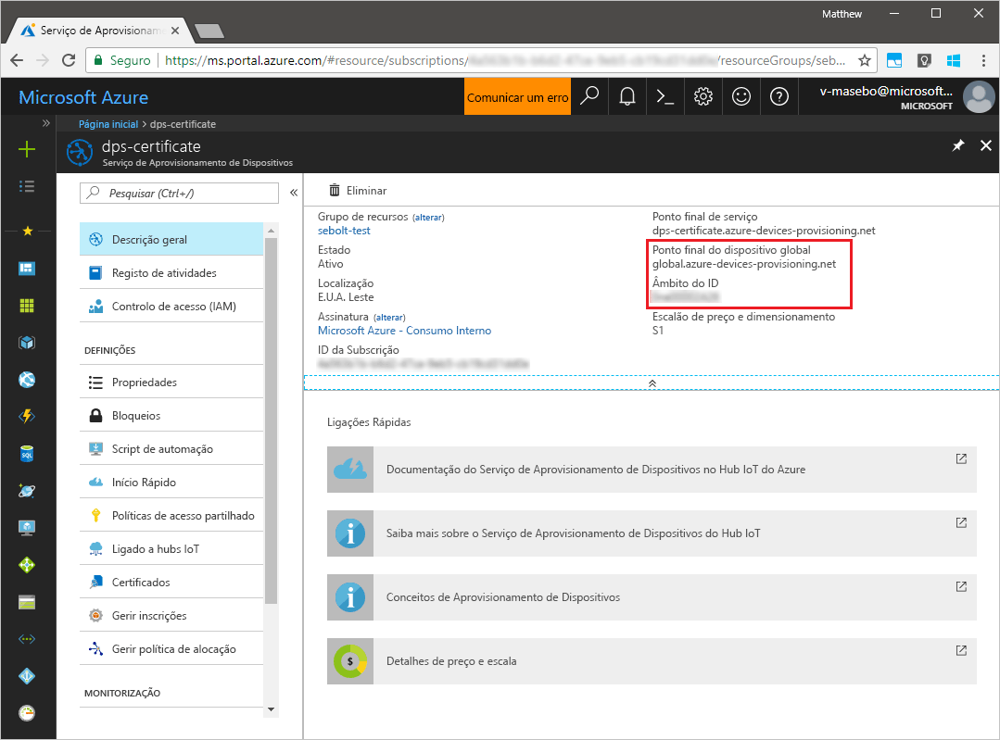
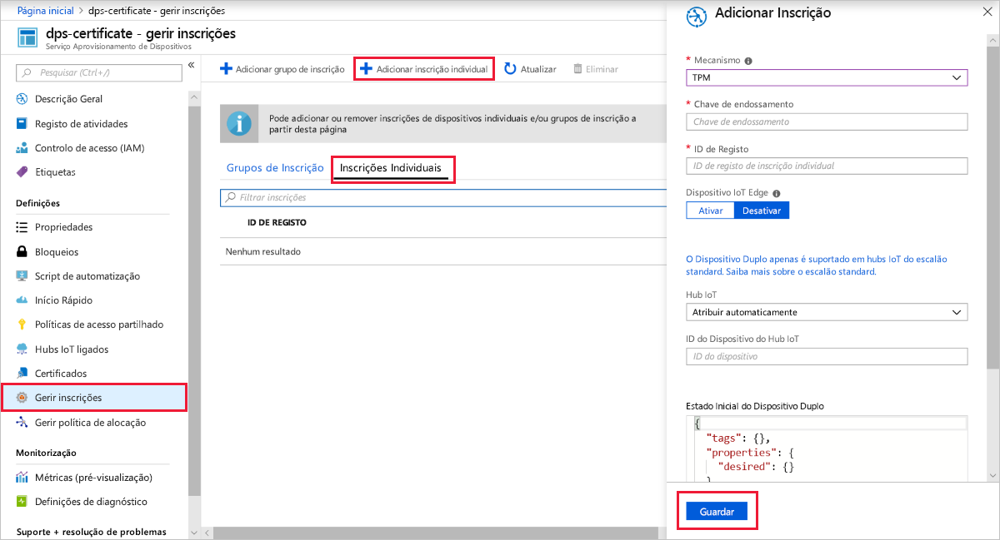
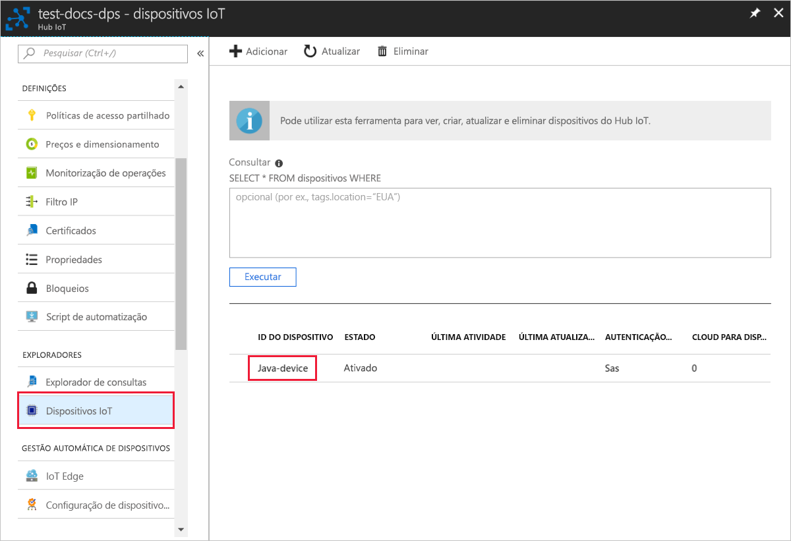

# <a name="quickstart-create-and-provision-a-simulated-tpm-device-using-java-device-sdk-for-azure-iot-hub-device-provisioning-service"></a>Quickstart: Criar e providenciar um dispositivo TPM simulado utilizando o dispositivo Java SDK para o serviço de provisionamento de dispositivos Azure IoT Hub

[!INCLUDE [iot-dps-selector-quick-create-simulated-device-tpm](../../includes/iot-dps-selector-quick-create-simulated-device-tpm.md)]

Neste arranque rápido, cria-se um dispositivo IoT simulado num computador Windows. O dispositivo simulado inclui um simulador TPM como módulo de segurança de hardware (HSM). Utiliza o código Java da amostra do dispositivo para ligar este dispositivo simulado ao seu hub IoT utilizando uma inscrição individual com o Serviço de Provisionamento de Dispositivos (DPS).

## <a name="prerequisites"></a>Pré-requisitos

- Familiarizado com [conceitos de provisionamento.](about-iot-dps.md#provisioning-process)
- Conclusão do Serviço de Provisionamento de [Dispositivos IoT Hub com o portal Azure](./quick-setup-auto-provision.md).
- Uma conta Azure com uma subscrição ativa. [Crie um de graça.](https://azure.microsoft.com/free/?ref=microsoft.com&utm_source=microsoft.com&utm_medium=docs&utm_campaign=visualstudio)
- [Kit de Desenvolvimento Java SE 8](/azure/developer/java/fundamentals/java-jdk-long-term-support).
- [Maven.](https://maven.apache.org/install.html)
- [Git.](https://git-scm.com/download/)

[!INCLUDE [IoT Device Provisioning Service basic](../../includes/iot-dps-basic.md)]

## <a name="prepare-the-environment"></a>Preparar o ambiente 

1. Certifique-se de que tem o [Java SE Development Kit 8](/azure/developer/java/fundamentals/java-jdk-long-term-support) instalado no seu computador.

1. Transfira e instale o [Maven](https://maven.apache.org/install.html).

1. Verifique se `git` está instalado no computador e que é adicionado às variáveis de ambiente às quais a janela de comandos pode aceder. Veja as [ferramentas de cliente Git da Software Freedom Conservancy](https://git-scm.com/download/) relativamente à mais recente versão das ferramentas de `git` a instalar, que incluem o **Git Bash**, a aplicação de linha de comandos que pode utilizar para interagir com o seu repositório Git local. 

1. Abra uma linha de comandos. Clone o repositório do GitHub para exemplo de código de simulação de dispositivo.
    
    ```cmd/sh
    git clone https://github.com/Azure/azure-iot-sdk-java.git --recursive
    ```

1. Executar o simulador [TPM](/windows/device-security/tpm/trusted-platform-module-overview) para ser o [HSM](https://azure.microsoft.com/blog/azure-iot-supports-new-security-hardware-to-strengthen-iot-security/) para o dispositivo simulado. Clique em **Permitir acesso** para permitir que as alterações às definições da _Firewall do Windows_. O simulador escuta através de um socket nas portas 2321 e 2322. Não feche esta janela; tem de manter este simulador em funcionamento até ao final deste guia de arranque rápido. 

    ```cmd/sh
    .\azure-iot-sdk-java\provisioning\provisioning-tools\tpm-simulator\Simulator.exe
    ```

    

1. Numa linha de comandos separada, navegue para a pasta de raiz e crie as dependências de exemplo.

    ```cmd/sh
    cd azure-iot-sdk-java
    mvn install -DskipTests=true
    ```

1. Navegue para a pasta de exemplo.

    ```cmd/sh
    cd provisioning/provisioning-samples/provisioning-tpm-sample
    ```

1. Inscreva-se no portal Azure, selecione o botão **Todos os recursos** no menu esquerdo e abra o serviço de Provisionamento de Dispositivos. Note o seu _ID Scope_ and _Provisioning Service Global Endpoint_.

    

1. Editar `src/main/java/samples/com/microsoft/azure/sdk/iot/ProvisioningTpmSample.java` para incluir o seu _ID Scope_ e Serviço de _Provisionamento Global Endpoint,_ como já foi notado anteriormente.  

    ```java
    private static final String idScope = "[Your ID scope here]";
    private static final String globalEndpoint = "[Your Provisioning Service Global Endpoint here]";
    private static final ProvisioningDeviceClientTransportProtocol PROVISIONING_DEVICE_CLIENT_TRANSPORT_PROTOCOL = ProvisioningDeviceClientTransportProtocol.HTTPS;
    ```
    Guarde o ficheiro.

1. Utilize os seguintes comandos para construir o projeto, navegar para a pasta alvo e executar o ficheiro .jar criado. Substitua o `version` espaço reservado pela sua versão de Java.

    ```cmd/sh
    mvn clean install
    cd target
    java -jar ./provisioning-tpm-sample-{version}-with-deps.jar
    ```

1. A execução do programa é iniciada. Note a _chave de endosso_ e _iD de registo_ para a secção seguinte e deixe o programa em execução.

    
    

## <a name="create-a-device-enrollment-entry"></a>Criar uma entrada de inscrição de dispositivos

O Serviço Aprovisionamento de Dispositivos no IoT do Azure suporta dois tipos de inscrição:

- [Grupos de inscrição](concepts-service.md#enrollment-group): utilizados para inscrever vários dispositivos relacionados.
- [Matrículas individuais](concepts-service.md#individual-enrollment): Usado para inscrever um único dispositivo.

Este artigo demonstra inscrições individuais.

1. Inscreva-se no portal Azure, selecione o botão **Todos os recursos** no menu esquerdo e abra o serviço de Provisionamento de Dispositivos.

1. A partir do menu serviço de fornecimento de **dispositivos, selecione Gerir as inscrições**. Selecione o separador **Inscrições Individuais** e selecione o botão **de inscrição individual** adicionar no topo. 

1. No painel **de inscrição adicionar,** insira as seguintes informações:
   - Selecione **TPM** como o *Mecanismo* de atestado de identidades.
   - Introduza a chave *de ID* de Registo e *Endosso* para o seu dispositivo TPM a partir dos valores que registou anteriormente.
   - Selecione um hub IoT ligado ao seu serviço de aprovisionamento.
   - Opcionalmente, pode fornecer as seguintes informações:
       - Introduza um *ID de dispositivo* único. Certifique-se de que evita dados confidenciais quando der o nome ao seu dispositivo. Se optar por não fornecer um, o ID de registo será usado para identificar o dispositivo.
       - Atualize o **estado inicial do dispositivo duplo** com a configuração inicial pretendida para o dispositivo.
   - Uma vez concluído, prima o botão **Guardar.** 

       

   Após a instalação bem-sucedida, o *ID de Registo* do seu dispositivo aparece na lista, no separador *Inscrições Individuais*. 


## <a name="simulate-the-device"></a>Simular o dispositivo

1. Na janela de comando que executa o código de amostra java na sua máquina, prima *Enter* para continuar a executar a aplicação. Repare nas mensagens que simulam o arranque e a ligação do dispositivo ao Serviço Aprovisionamento de Dispositivos para obter as informações do seu hub IoT.  

    

1. Ao providenciar com sucesso o fornecimento do seu dispositivo simulado ao hub IoT ligado ao seu serviço de fornecimento, o ID do dispositivo aparece na lâmina dos **dispositivos IoT** do hub.

     

    Se tiver alterado o *estado inicial do dispositivo duplo* face ao valor predefinido na entrada de inscrição do seu dispositivo, este pode extrair o estado pretendido do dispositivo duplo a partir do hub e agir em conformidade. Para obter mais informações, consulte [Compreender e utilizar gémeos do dispositivo no IoT Hub.](../iot-hub/iot-hub-devguide-device-twins.md)


## <a name="clean-up-resources"></a>Limpar os recursos

Se pretender continuar a trabalhar e explorar a amostra do cliente do dispositivo, não limpe os recursos criados neste quickstart. Se não pretender continuar, utilize os seguintes passos para eliminar todos os recursos criados por este arranque rápido.

1. Feche a janela da saída do exemplo de dispositivo cliente no seu computador.
1. Feche a janela do simulador TPM no seu computador.
1. A partir do menu à esquerda no portal Azure, selecione **Todos os recursos** e, em seguida, selecione o seu serviço de Provisionamento de Dispositivos. Abra a lâmina **'Gestão de Inscrições'** para o seu serviço e, em seguida, selecione o **separador Inscrições Individuais.** Selecione a caixa de verificação ao lado do *ID de registo* do dispositivo que inscreveu neste arranque rápido e prima o botão **Eliminar** na parte superior do painel. 
1. A partir do menu à esquerda no portal Azure, selecione **Todos os recursos** e, em seguida, selecione o seu hub IoT. Abra a lâmina dos **dispositivos IoT** para o seu hub, selecione a caixa de verificação ao lado do *ID* do dispositivo que registou neste arranque rápido e, em seguida, pressione o botão **Eliminar** na parte superior do painel.

## <a name="next-steps"></a>Passos seguintes

Neste arranque rápido, criou um dispositivo simulado TPM na sua máquina e forte-o para o seu hub IoT utilizando o Serviço de Provisionamento de Dispositivos IoT Hub. Para aprender a inscrever o seu dispositivo TPM programáticamente, continue a iniciar rapidamente a inscrição programática de um dispositivo TPM. 

> [!div class="nextstepaction"]
> [Azure quickstart - Inscreva o dispositivo TPM no Serviço de Provisionamento de Dispositivos Azure IoT Hub](quick-enroll-device-tpm-java.md)