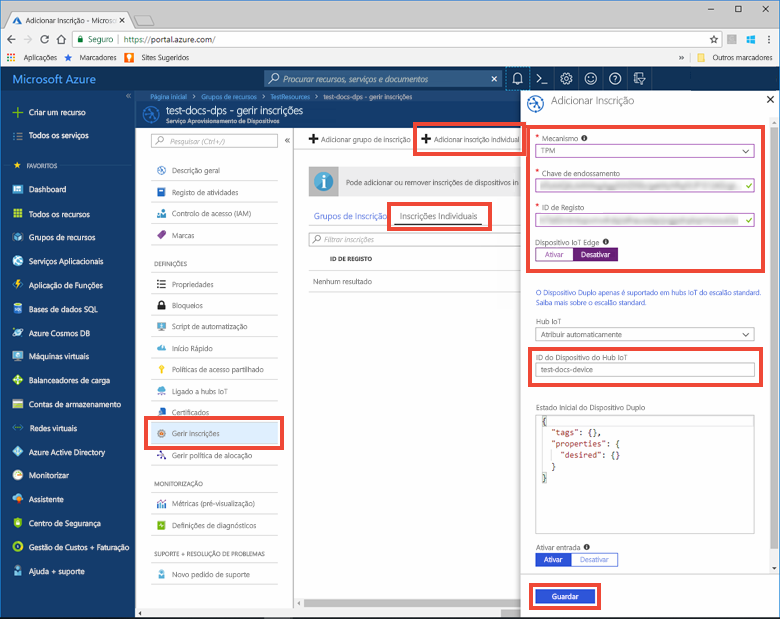
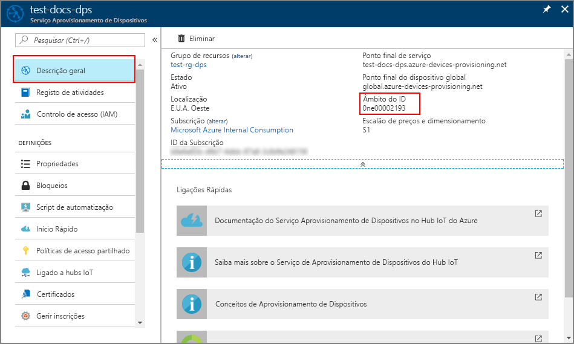
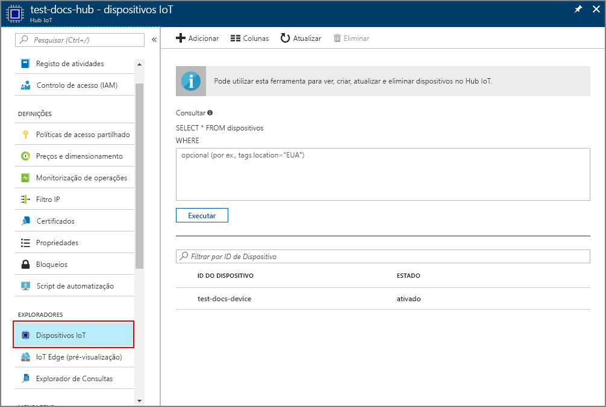

# <a name="quickstart-create-and-provision-a-simulated-tpm-device-using-nodejs-device-sdk-for-iot-hub-device-provisioning-service"></a>Quickstart: Criar e providenciar um dispositivo TPM simulado utilizando Node.js dispositivo SDK para serviço de provisionamento de dispositivos IoT Hub

[!INCLUDE [iot-dps-selector-quick-create-simulated-device-tpm](../../includes/iot-dps-selector-quick-create-simulated-device-tpm.md)]

Neste arranque rápido, cria-se um dispositivo IoT simulado num computador Windows. O dispositivo simulado inclui um simulador TPM como módulo de segurança de hardware (HSM). Utiliza a amostra do dispositivo Node.js código para ligar este dispositivo simulado ao seu hub IoT utilizando uma inscrição individual com o Serviço de Provisionamento de Dispositivos (DPS).

## <a name="prerequisites"></a>Pré-requisitos

- Familiarizado com [conceitos de provisionamento.](about-iot-dps.md#provisioning-process)
- Conclusão do Serviço de Provisionamento de [Dispositivos IoT Hub com o portal Azure](./quick-setup-auto-provision.md).
- Uma conta Azure com uma subscrição ativa. [Crie um de graça.](https://azure.microsoft.com/free/?ref=microsoft.com&utm_source=microsoft.com&utm_medium=docs&utm_campaign=visualstudio)
- [Node.js v4.0+](https://nodejs.org).
- [Git.](https://git-scm.com/download/)

[!INCLUDE [IoT Device Provisioning Service basic](../../includes/iot-dps-basic.md)]

## <a name="prepare-the-environment"></a>Preparar o ambiente 

1. Certifique-se de que tem o [Node.js v4.0 ou superior](https://nodejs.org) instalado no seu computador.

1. Verifique se `git` está instalado no computador e que é adicionado às variáveis de ambiente às quais a janela de comandos pode aceder. Veja as [ferramentas de cliente Git da Software Freedom Conservancy](https://git-scm.com/download/) relativamente à mais recente versão das ferramentas de `git` a instalar, que incluem o **Git Bash**, a aplicação de linha de comandos que pode utilizar para interagir com o seu repositório Git local. 


## <a name="simulate-a-tpm-device"></a>Simular um dispositivo TPM

1. Abra uma linha de comandos ou o Git Bash. Clone o repositório de GitHub `azure-utpm-c`:
    
    ```cmd/sh
    git clone https://github.com/Azure/azure-utpm-c.git --recursive
    ```

1. Navegue na pasta raiz do GitHub e faça o simulador [TPM](/windows/device-security/tpm/trusted-platform-module-overview) para ser o [HSM](https://azure.microsoft.com/blog/azure-iot-supports-new-security-hardware-to-strengthen-iot-security/) para o dispositivo simulado. O simulador escuta através de um socket nas portas 2321 e 2322. Não feche esta janela de comando; é necessário manter este simulador em funcionamento até ao final deste guia de arranque rápido: 

    ```cmd/sh
    .\azure-utpm-c\tools\tpm_simulator\Simulator.exe
    ```

1. Crie uma nova pasta vazia chamada **registerdevice**. Na pasta **registerdevice**, crie um ficheiro package.json com o seguinte comando na sua linha de comandos. Certifique-se de que responde a todas as perguntas colocadas por `npm` ou aceite as predefinições se as considerar adequadas para o seu caso:
   
    ```cmd/sh
    npm init
    ```

1. Instale os seguintes pacotes precursores:

    ```cmd/sh
    npm install node-gyp -g
    npm install ffi -g
    ```

    > [!NOTE]
    > Existem alguns problemas conhecidos na instalação dos pacotes acima indicados. Para os resolver estes problemas, execute `npm install --global --production windows-build-tools` com uma linha de comandos no modo **Executar como administrador**, execute `SET VCTargetsPath=C:\Program Files (x86)\MSBuild\Microsoft.Cpp\v4.0\V140` depois de substituir o caminho pela versão instalada e, em seguida, volte a executar os comandos de instalação acima indicados.
    >

1. Instale os seguintes pacotes que contêm os componentes utilizados durante o registo:

   - um cliente de segurança que funcione com TPM: `azure-iot-security-tpm`
   - um transporte para o dispositivo se ligar ao Serviço de Aprovisionamento de Dispositivos: `azure-iot-provisioning-device-http` ou `azure-iot-provisioning-device-amqp`
   - um cliente para utilizar o cliente de segurança e o transporte: `azure-iot-provisioning-device`

     Depois de o dispositivo ser registado, pode utilizar os pacotes do Cliente de Dispositivo de Hub IoT habituais para ligar o dispositivo com as credenciais fornecidas durante o registo. Vai precisar de:

   - o cliente de dispositivo: `azure-iot-device`
   - um transporte: `azure-iot-device-amqp`, `azure-iot-device-mqtt` ou `azure-iot-device-http`
   - o cliente de segurança que já instalou: `azure-iot-security-tpm`

     > [!NOTE]
     > Os exemplos abaixo utilizam os transportes `azure-iot-provisioning-device-http` e `azure-iot-device-mqtt`.
     > 

     Pode instalar todos estes pacotes em simultâneo com a execução do seguinte comando na sua linha de comandos na pasta **registerdevice**:

       ```cmd/sh
       npm install --save azure-iot-device azure-iot-device-mqtt azure-iot-security-tpm azure-iot-provisioning-device-http azure-iot-provisioning-device
       ```

1. Com um editor de texto, crie um novo ficheiro **ExtractDevice.js** na pasta **registerdevice**.

1. Adicione as seguintes instruções `require` no início do ficheiro **ExtractDevice.js**:
   
    ```
    'use strict';

    var tpmSecurity = require('azure-iot-security-tpm');
    var tssJs = require("tss.js");

    var myTpm = new tpmSecurity.TpmSecurityClient(undefined, new tssJs.Tpm(true));
    ```

1. Adicione a seguinte função para implementar o método:
   
    ```
    myTpm.getEndorsementKey(function(err, endorsementKey) {
      if (err) {
        console.log('The error returned from get key is: ' + err);
      } else {
        console.log('the endorsement key is: ' + endorsementKey.toString('base64'));
        myTpm.getRegistrationId((getRegistrationIdError, registrationId) => {
          if (getRegistrationIdError) {
            console.log('The error returned from get registration id is: ' + getRegistrationIdError);
          } else {
            console.log('The Registration Id is: ' + registrationId);
            process.exit();
          }
        });
      }
    });
    ```

1. Guarde e feche o ficheiro **ExtractDevice.js**. Execute o exemplo:

    ```cmd/sh
    node ExtractDevice.js
    ```

1. A janela de saída apresenta a **_chave de endosso_** e o **_ID de registo_** necessário para a inscrição do dispositivo. Anote estes valores. 


## <a name="create-a-device-entry"></a>Criar um entrada de dispositivo

O Serviço Aprovisionamento de Dispositivos no IoT do Azure suporta dois tipos de inscrição:

- [Grupos de inscrição](concepts-service.md#enrollment-group): utilizados para inscrever vários dispositivos relacionados.
- [Matrículas individuais](concepts-service.md#individual-enrollment): Usado para inscrever um único dispositivo.

Este artigo demonstra inscrições individuais.

1. Inscreva-se no portal Azure, selecione o botão **Todos os recursos** no menu esquerdo e abra o serviço de Provisionamento de Dispositivos.

1. A partir do menu serviço de fornecimento de **dispositivos, selecione Gerir as inscrições**. Selecione o separador **Inscrições Individuais** e selecione o botão **de inscrição individual** adicionar no topo. 

1. No painel **de inscrição adicionar,** insira as seguintes informações:
   - Selecione **TPM** como o *Mecanismo* de atestado de identidades.
   - Introduza a chave *de ID* de Registo e *Endosso* para o seu dispositivo TPM a partir dos valores que registou anteriormente.
   - Selecione um hub IoT ligado ao seu serviço de aprovisionamento.
   - Opcionalmente, pode fornecer as seguintes informações:
       - Introduza um *ID de dispositivo* único. Certifique-se de que evita dados confidenciais quando der o nome ao seu dispositivo. Se optar por não fornecer um, o ID de registo será usado para identificar o dispositivo.
       - Atualize o **estado inicial do dispositivo duplo** com a configuração inicial pretendida para o dispositivo.
   - Uma vez concluído, prima o botão **Guardar.** 

       

   Após a instalação bem-sucedida, o *ID de Registo* do seu dispositivo aparece na lista, no separador *Inscrições Individuais*. 


## <a name="register-the-device"></a>Registar o dispositivo

1. No portal Azure, selecione a lâmina **de visão geral** para o seu serviço de fornecimento de dispositivos e note os valores de Endpoint e **_ID Scope_** do dispositivo **_global._**

     

1. Com um editor de texto, crie um novo ficheiro **RegisterDevice.js** na pasta **registerdevice**.

1. Adicione as seguintes instruções `require` no início do ficheiro **RegisterDevice.js**:
   
    ```
    'use strict';

    var ProvisioningTransport = require('azure-iot-provisioning-device-http').Http;
    var iotHubTransport = require('azure-iot-device-mqtt').Mqtt;
    var Client = require('azure-iot-device').Client;
    var Message = require('azure-iot-device').Message;
    var tpmSecurity = require('azure-iot-security-tpm');
    var ProvisioningDeviceClient = require('azure-iot-provisioning-device').ProvisioningDeviceClient;
    ```

    > [!NOTE]
    > O **SDK de IoT do Azure para Node.js** suporta protocolos adicionais, como _AMQP_, _AMQP WS_ e _MQTT WS_.  Para obter mais exemplos, veja [SDK do Serviço de Aprovisionamento de Dispositivos para exemplos de Node.js](https://github.com/Azure/azure-iot-sdk-node/tree/master/provisioning/device/samples).
    > 

1. Adicione as variáveis **globalDeviceEndpoint** e **idScope**, e utilize-as para criar uma instância de **ProvisioningDeviceClient**. Substitua **{globalDeviceEndpoint}** e **{idScope}** pelos valores de **_Ponto Final do Dispositivo Global_** e **_Âmbito do ID_** do **Passo 1**:
   
    ```
    var provisioningHost = '{globalDeviceEndpoint}';
    var idScope = '{idScope}';

    var tssJs = require("tss.js");
    var securityClient = new tpmSecurity.TpmSecurityClient('', new tssJs.Tpm(true));
    // if using non-simulated device, replace the above line with following:
    //var securityClient = new tpmSecurity.TpmSecurityClient();

    var provisioningClient = ProvisioningDeviceClient.create(provisioningHost, idScope, new ProvisioningTransport(), securityClient);
    ```

1. Adicione a seguinte função para implementar o método no dispositivo:
   
    ```
    provisioningClient.register(function(err, result) {
      if (err) {
        console.log("error registering device: " + err);
      } else {
        console.log('registration succeeded');
        console.log('assigned hub=' + result.registrationState.assignedHub);
        console.log('deviceId=' + result.registrationState.deviceId);
        var tpmAuthenticationProvider = tpmSecurity.TpmAuthenticationProvider.fromTpmSecurityClient(result.registrationState.deviceId, result.registrationState.assignedHub, securityClient);
        var hubClient = Client.fromAuthenticationProvider(tpmAuthenticationProvider, iotHubTransport);

        var connectCallback = function (err) {
          if (err) {
            console.error('Could not connect: ' + err.message);
          } else {
            console.log('Client connected');
            var message = new Message('Hello world');
            hubClient.sendEvent(message, printResultFor('send'));
          }
        };

        hubClient.open(connectCallback);

        function printResultFor(op) {
          return function printResult(err, res) {
            if (err) console.log(op + ' error: ' + err.toString());
            if (res) console.log(op + ' status: ' + res.constructor.name);
            process.exit(1);
          };
        }
      }
    });
    ```

1. Guarde e feche o ficheiro **RegisterDevice.js**. Execute o exemplo:

    ```cmd/sh
    node RegisterDevice.js
    ```

1. Repare nas mensagens que simulam o arranque e a ligação do dispositivo ao Serviço Aprovisionamento de Dispositivos para obter as informações do seu hub IoT. Ao providenciar com sucesso o fornecimento do seu dispositivo simulado ao hub IoT ligado ao seu serviço de fornecimento, o ID do dispositivo aparece na lâmina dos **dispositivos IoT** do hub. 

     

    Se tiver alterado o *estado inicial do dispositivo duplo* face ao valor predefinido na entrada de inscrição do seu dispositivo, este pode extrair o estado pretendido do dispositivo duplo a partir do hub e agir em conformidade. Para obter mais informações, veja [Understand and use device twins in IoT Hub](../iot-hub/iot-hub-devguide-device-twins.md) (Compreender e utilizar dispositivos duplos no Hub IoT)


## <a name="clean-up-resources"></a>Limpar os recursos

Se pretender continuar a trabalhar e explorar a amostra do cliente do dispositivo, não limpe os recursos criados neste quickstart. Se não pretender continuar, utilize os seguintes passos para eliminar todos os recursos criados por este arranque rápido.

1. Feche a janela da saída do exemplo de dispositivo cliente no seu computador.
1. Feche a janela do simulador TPM no seu computador.
1. A partir do menu à esquerda no portal Azure, selecione **Todos os recursos** e, em seguida, selecione o seu serviço de Provisionamento de Dispositivos. Abra a lâmina **'Gestão de Inscrições'** para o seu serviço e, em seguida, selecione o **separador Inscrições Individuais.** Selecione a caixa de verificação ao lado do *ID de registo* do dispositivo que inscreveu neste arranque rápido e prima o botão **Eliminar** na parte superior do painel. 
1. A partir do menu à esquerda no portal Azure, selecione **Todos os recursos** e, em seguida, selecione o seu hub IoT. Abra a lâmina dos **dispositivos IoT** para o seu hub, selecione a caixa de verificação ao lado do *ID* do dispositivo que registou neste arranque rápido e, em seguida, pressione o botão **Eliminar** na parte superior do painel.


## <a name="next-steps"></a>Passos seguintes

Neste arranque rápido, criou um dispositivo simulado TPM na sua máquina e forte-o para o seu hub IoT utilizando o Serviço de Provisionamento de Dispositivos IoT Hub. Para aprender a inscrever o seu dispositivo TPM programáticamente, continue a iniciar rapidamente a inscrição programática de um dispositivo TPM. 

> [!div class="nextstepaction"]
> [Azure quickstart - Inscreva o dispositivo TPM no Serviço de Provisionamento de Dispositivos Azure IoT Hub](quick-enroll-device-tpm-node.md)