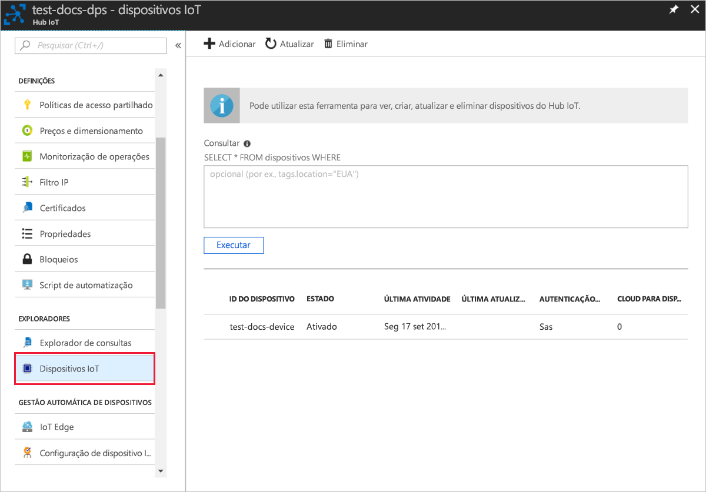

# <a name="quickstart-create-and-provision-a-simulated-tpm-device-using-nodejs-device-sdk-for-iot-hub-device-provisioning-service"></a>Quickstart: Create and provision a simulated TPM device using Node.js device SDK for IoT Hub Device Provisioning Service

[!INCLUDE [iot-dps-selector-quick-create-simulated-device-tpm](../../includes/iot-dps-selector-quick-create-simulated-device-tpm.md)]

Estes passos mostram como criar um dispositivo simulado no seu computador de desenvolvimento que executa o SO Windows, executa o simulador Windows TPM como o [Módulo de Segurança de Hardware (HSM)](https://azure.microsoft.com/blog/azure-iot-supports-new-security-hardware-to-strengthen-iot-security/) do dispositivo e utiliza o código de exemplo para ligar esse dispositivo com o Serviço Aprovisionamento de Dispositivos e o seu hub IoT. 

Se não estiver familiarizado com o processo de aprovisionamento automático, reveja também [Conceitos de aprovisionamento automático](concepts-auto-provisioning.md). Certifique-se também de que executa os passos descritos em [Configurar o Serviço de Aprovisionamento de Dispositivos no Hub IoT com o portal do Azure](./quick-setup-auto-provision.md) antes de continuar. 

O Serviço Aprovisionamento de Dispositivos no IoT do Azure suporta dois tipos de inscrição:
- [Grupos de inscrição](concepts-service.md#enrollment-group): utilizados para inscrever vários dispositivos relacionados.
- [Inscrições Individuais](concepts-service.md#individual-enrollment): utilizadas para inscrever um dispositivo individual.

Este artigo irá demonstrar as inscrições individuais.

[!INCLUDE [IoT Device Provisioning Service basic](../../includes/iot-dps-basic.md)]

## <a name="prepare-the-environment"></a>Preparar o ambiente 

1. Certifique-se de que tem o [Node.js v4.0 ou superior](https://nodejs.org) instalado no seu computador.

1. Verifique se `git` está instalado no computador e que é adicionado às variáveis de ambiente às quais a janela de comandos pode aceder. Veja as [ferramentas de cliente Git da Software Freedom Conservancy](https://git-scm.com/download/) relativamente à mais recente versão das ferramentas de `git` a instalar, que incluem o **Git Bash**, a aplicação de linha de comandos que pode utilizar para interagir com o seu repositório Git local. 


## <a name="simulate-a-tpm-device"></a>Simular um dispositivo TPM

1. Abra uma linha de comandos ou o Git Bash. Clone o repositório de GitHub `azure-utpm-c`:
    
    ```cmd/sh
    git clone https://github.com/Azure/azure-utpm-c.git --recursive
    ```

1. Navegue para a pasta raiz de GitHub e execute o simulador de [TPM](https://docs.microsoft.com/windows/device-security/tpm/trusted-platform-module-overview). O simulador escuta através de um socket nas portas 2321 e 2322. Do not close this command window; you need to keep this simulator running until the end of this quickstart guide: 

    ```cmd/sh
    .\azure-utpm-c\tools\tpm_simulator\Simulator.exe
    ```

1. Crie uma nova pasta vazia chamada **registerdevice**. Na pasta **registerdevice**, crie um ficheiro package.json com o seguinte comando na sua linha de comandos. Certifique-se de que responde a todas as perguntas colocadas por `npm` ou aceite as predefinições se as considerar adequadas para o seu caso:
   
    ```cmd/sh
    npm init
    ```

1. Instale os seguintes pacotes precursores:

    ```cmd/sh
    npm install node-gyp -g
    npm install ffi -g
    ```

    > [!NOTE]
    > Existem alguns problemas conhecidos na instalação dos pacotes acima indicados. Para os resolver estes problemas, execute `npm install --global --production windows-build-tools` com uma linha de comandos no modo **Executar como administrador**, execute `SET VCTargetsPath=C:\Program Files (x86)\MSBuild\Microsoft.Cpp\v4.0\V140` depois de substituir o caminho pela versão instalada e, em seguida, volte a executar os comandos de instalação acima indicados.
    >

1. Instale os seguintes pacotes que contêm os componentes utilizados durante o registo:

   - um cliente de segurança que funcione com TPM: `azure-iot-security-tpm`
   - um transporte para o dispositivo se ligar ao Serviço de Aprovisionamento de Dispositivos: `azure-iot-provisioning-device-http` ou `azure-iot-provisioning-device-amqp`
   - um cliente para utilizar o cliente de segurança e o transporte: `azure-iot-provisioning-device`

     Depois de o dispositivo ser registado, pode utilizar os pacotes do Cliente de Dispositivo de Hub IoT habituais para ligar o dispositivo com as credenciais fornecidas durante o registo. Irá precisar dos seguintes elementos:

   - o cliente de dispositivo: `azure-iot-device`
   - um transporte: `azure-iot-device-amqp`, `azure-iot-device-mqtt` ou `azure-iot-device-http`
   - o cliente de segurança que já instalou: `azure-iot-security-tpm`

     > [!NOTE]
     > Os exemplos abaixo utilizam os transportes `azure-iot-provisioning-device-http` e `azure-iot-device-mqtt`.
     > 

     Pode instalar todos estes pacotes em simultâneo com a execução do seguinte comando na sua linha de comandos na pasta **registerdevice**:

       ```cmd/sh
       npm install --save azure-iot-device azure-iot-device-mqtt azure-iot-security-tpm azure-iot-provisioning-device-http azure-iot-provisioning-device
       ```

1. Com um editor de texto, crie um novo ficheiro **ExtractDevice.js** na pasta **registerdevice**.

1. Adicione as seguintes instruções `require` no início do ficheiro **ExtractDevice.js**:
   
    ```
    'use strict';

    var tpmSecurity = require('azure-iot-security-tpm');
    var tssJs = require("tss.js");

    var myTpm = new tpmSecurity.TpmSecurityClient(undefined, new tssJs.Tpm(true));
    ```

1. Adicione a seguinte função para implementar o método:
   
    ```
    myTpm.getEndorsementKey(function(err, endorsementKey) {
      if (err) {
        console.log('The error returned from get key is: ' + err);
      } else {
        console.log('the endorsement key is: ' + endorsementKey.toString('base64'));
        myTpm.getRegistrationId((getRegistrationIdError, registrationId) => {
          if (getRegistrationIdError) {
            console.log('The error returned from get registration id is: ' + getRegistrationIdError);
          } else {
            console.log('The Registration Id is: ' + registrationId);
            process.exit();
          }
        });
      }
    });
    ```

1. Guarde e feche o ficheiro **ExtractDevice.js**. Execute o exemplo:

    ```cmd/sh
    node ExtractDevice.js
    ```

1. The output window displays the **_Endorsement key_** and the **_Registration ID_** needed for device enrollment. Anote estes valores. 


## <a name="create-a-device-entry"></a>Criar um entrada de dispositivo

1. Sign in to the Azure portal, select the **All resources** button on the left-hand menu and open your Device Provisioning service.

1. From the Device Provisioning Service menu, select **Manage enrollments**. Select **Individual Enrollments** tab and select the **Add individual enrollment** button at the top. 

1. In the **Add Enrollment** panel, enter the following information:
   - Selecione **TPM** como o *Mecanismo* de atestado de identidades.
   - Enter the *Registration ID* and *Endorsement key* for your TPM device from the values you noted previously.
   - Selecione um hub IoT ligado ao seu serviço de aprovisionamento.
   - Opcionalmente, pode fornecer as seguintes informações:
       - Enter a unique *Device ID*. Certifique-se de que evita dados confidenciais quando der o nome ao seu dispositivo. If you choose not to provide one, the registration ID will be used to identify the device instead.
       - Atualize o **estado inicial do dispositivo duplo** com a configuração inicial pretendida para o dispositivo.
   - Once complete, press the **Save** button. 

       

   Após a instalação bem-sucedida, o *ID de Registo* do seu dispositivo aparece na lista, no separador *Inscrições Individuais*. 


## <a name="register-the-device"></a>Registar o dispositivo

1. In the Azure portal, select the **Overview** blade for your Device Provisioning service and note the **_Global Device Endpoint_** and **_ID Scope_** values.

     

1. Com um editor de texto, crie um novo ficheiro **RegisterDevice.js** na pasta **registerdevice**.

1. Adicione as seguintes instruções `require` no início do ficheiro **RegisterDevice.js**:
   
    ```
    'use strict';

    var ProvisioningTransport = require('azure-iot-provisioning-device-http').Http;
    var iotHubTransport = require('azure-iot-device-mqtt').Mqtt;
    var Client = require('azure-iot-device').Client;
    var Message = require('azure-iot-device').Message;
    var tpmSecurity = require('azure-iot-security-tpm');
    var ProvisioningDeviceClient = require('azure-iot-provisioning-device').ProvisioningDeviceClient;
    ```

    > [!NOTE]
    > O **SDK de IoT do Azure para Node.js** suporta protocolos adicionais, como _AMQP_, _AMQP WS_ e _MQTT WS_.  Para obter mais exemplos, veja [SDK do Serviço de Aprovisionamento de Dispositivos para exemplos de Node.js](https://github.com/Azure/azure-iot-sdk-node/tree/master/provisioning/device/samples).
    > 

1. Adicione as variáveis **globalDeviceEndpoint** e **idScope**, e utilize-as para criar uma instância de **ProvisioningDeviceClient**. Substitua **{globalDeviceEndpoint}** e **{idScope}** pelos valores de **_Ponto Final do Dispositivo Global_** e **_Âmbito do ID_** do **Passo 1**:
   
    ```
    var provisioningHost = '{globalDeviceEndpoint}';
    var idScope = '{idScope}';

    var tssJs = require("tss.js");
    var securityClient = new tpmSecurity.TpmSecurityClient('', new tssJs.Tpm(true));
    // if using non-simulated device, replace the above line with following:
    //var securityClient = new tpmSecurity.TpmSecurityClient();

    var provisioningClient = ProvisioningDeviceClient.create(provisioningHost, idScope, new ProvisioningTransport(), securityClient);
    ```

1. Adicione a seguinte função para implementar o método no dispositivo:
   
    ```
    provisioningClient.register(function(err, result) {
      if (err) {
        console.log("error registering device: " + err);
      } else {
        console.log('registration succeeded');
        console.log('assigned hub=' + result.registrationState.assignedHub);
        console.log('deviceId=' + result.registrationState.deviceId);
        var tpmAuthenticationProvider = tpmSecurity.TpmAuthenticationProvider.fromTpmSecurityClient(result.registrationState.deviceId, result.registrationState.assignedHub, securityClient);
        var hubClient = Client.fromAuthenticationProvider(tpmAuthenticationProvider, iotHubTransport);

        var connectCallback = function (err) {
          if (err) {
            console.error('Could not connect: ' + err.message);
          } else {
            console.log('Client connected');
            var message = new Message('Hello world');
            hubClient.sendEvent(message, printResultFor('send'));
          }
        };

        hubClient.open(connectCallback);

        function printResultFor(op) {
          return function printResult(err, res) {
            if (err) console.log(op + ' error: ' + err.toString());
            if (res) console.log(op + ' status: ' + res.constructor.name);
            process.exit(1);
          };
        }
      }
    });
    ```

1. Guarde e feche o ficheiro **RegisterDevice.js**. Execute o exemplo:

    ```cmd/sh
    node RegisterDevice.js
    ```

1. Repare nas mensagens que simulam o arranque e a ligação do dispositivo ao Serviço Aprovisionamento de Dispositivos para obter as informações do seu hub IoT. On successful provisioning of your simulated device to the IoT hub linked with your provisioning service, the device ID appears on the hub's **IoT devices** blade. 

     

    Se tiver alterado o *estado inicial do dispositivo duplo* face ao valor predefinido na entrada de inscrição do seu dispositivo, este pode extrair o estado pretendido do dispositivo duplo a partir do hub e agir em conformidade. Para obter mais informações, veja [Understand and use device twins in IoT Hub](../iot-hub/iot-hub-devguide-device-twins.md) (Compreender e utilizar dispositivos duplos no Hub IoT)


## <a name="clean-up-resources"></a>Limpar recursos

If you plan to continue working on and exploring the device client sample, do not clean up the resources created in this quickstart. If you do not plan to continue, use the following steps to delete all resources created by this quickstart.

1. Feche a janela da saída do exemplo de dispositivo cliente no seu computador.
1. Feche a janela do simulador TPM no seu computador.
1. From the left-hand menu in the Azure portal, select **All resources** and then select your Device Provisioning service. Open the **Manage Enrollments** blade for your service, and then select the **Individual Enrollments** tab. Select the check box next to the *REGISTRATION ID* of the device you enrolled in this quickstart, and press the **Delete** button at the top of the pane. 
1. From the left-hand menu in the Azure portal, select **All resources** and then select your IoT hub. Open the **IoT devices** blade for your hub, select the check box next to the *DEVICE ID* of the device you registered in this quickstart, and then press the **Delete** button at the top of the pane.


## <a name="next-steps"></a>Passos seguintes

In this quickstart, you’ve created a TPM simulated device on your machine and provisioned it to your IoT hub using the IoT Hub Device Provisioning Service. To learn how to enroll your TPM device programmatically, continue to the quickstart for programmatic enrollment of a TPM device. 

> [!div class="nextstepaction"]
> [Azure quickstart - Enroll TPM device to Azure IoT Hub Device Provisioning Service](quick-enroll-device-tpm-node.md)
