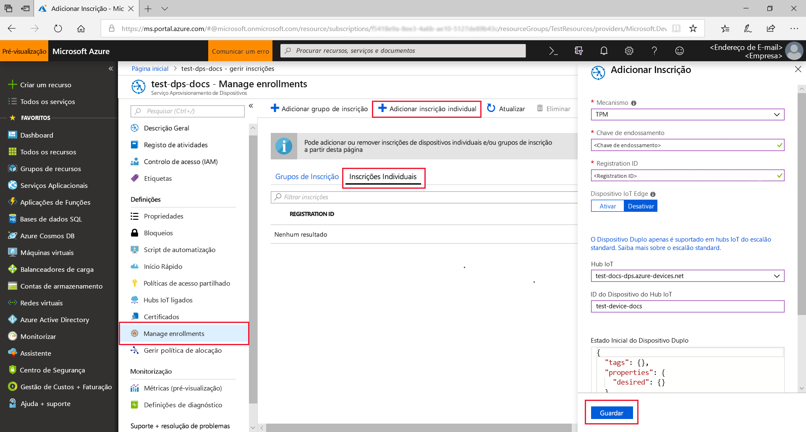
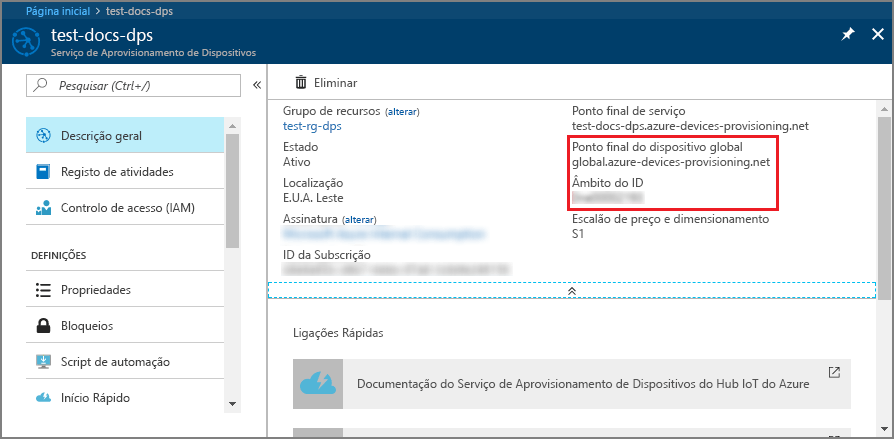
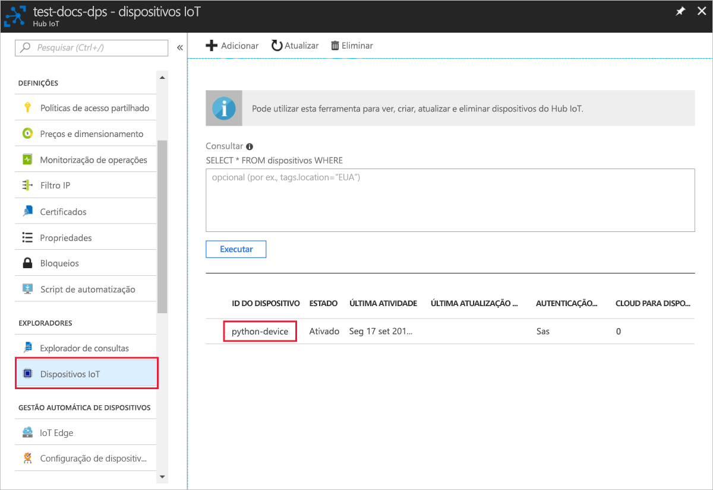

# <a name="quickstart-create-and-provision-a-simulated-tpm-device-using-python-device-sdk-for-iot-hub-device-provisioning-service"></a>Quickstart: Criar e providenciar um dispositivo TPM simulado utilizando o dispositivo Python SDK para serviço de provisionamento de dispositivos IoT Hub

[!INCLUDE [iot-dps-selector-quick-create-simulated-device-tpm](../../includes/iot-dps-selector-quick-create-simulated-device-tpm.md)]

Neste arranque rápido, cria-se um dispositivo IoT simulado num computador Windows. O dispositivo simulado inclui um simulador TPM como módulo de segurança de hardware (HSM). Utiliza o código Python da amostra do dispositivo para ligar este dispositivo simulado ao seu hub IoT utilizando uma inscrição individual com o Serviço de Provisionamento de Dispositivos (DPS).

## <a name="prerequisites"></a>Pré-requisitos

- Familiarizado com [conceitos de provisionamento.](about-iot-dps.md#provisioning-process)
- Conclusão do Serviço de Provisionamento de [Dispositivos IoT Hub com o portal Azure](./quick-setup-auto-provision.md).
- Uma conta Azure com uma subscrição ativa. [Crie um de graça.](https://azure.microsoft.com/free/?ref=microsoft.com&utm_source=microsoft.com&utm_medium=docs&utm_campaign=visualstudio)
- [Visual Studio 2015+](https://visualstudio.microsoft.com/vs/) com desenvolvimento desktop com C++.
- [Sistema de construção CMake](https://cmake.org/download/).
- [Git.](https://git-scm.com/download/)

> [!IMPORTANT]
> Este artigo aplica-se apenas ao V1 Python SDK precedido. Os clientes de dispositivos e serviços para o Serviço de Provisionamento de Dispositivos Iot Hub ainda não estão disponíveis em V2. A equipa está neste momento a trabalhar arduamente para trazer a V2 para apresentar paridade.

[!INCLUDE [IoT Device Provisioning Service basic](../../includes/iot-dps-basic.md)]

## <a name="prepare-the-environment"></a>Preparar o ambiente 

1. Certifique-se de que instalou o [Visual Studio](https://visualstudio.microsoft.com/vs/) 2015 ou mais tarde, com a carga de trabalho 'Desktop com C++' ativada para a instalação do Seu Estúdio Visual.

1. Transfira e instale o [sistema de compilação CMake](https://cmake.org/download/).

1. Verifique se `git` está instalado no computador e que é adicionado às variáveis de ambiente às quais a janela de comandos pode aceder. Veja as [ferramentas de cliente Git da Software Freedom Conservancy](https://git-scm.com/download/) relativamente à mais recente versão das ferramentas de `git` a instalar, que incluem o **Git Bash**, a aplicação de linha de comandos que pode utilizar para interagir com o seu repositório Git local. 

1. Abra uma linha de comandos ou o Git Bash. Clone o repositório do GitHub para exemplo de código de simulação de dispositivo.
    
    ```cmd/sh
    git clone --single-branch --branch v1-deprecated https://github.com/Azure/azure-iot-sdk-python.git --recursive
    ```

1. Crie uma pasta na sua cópia local deste repositório do GitHub para o processo de compilação CMake. 

    ```cmd/sh
    cd azure-iot-sdk-python/c
    mkdir cmake
    cd cmake
    ```

1. O exemplo de código utiliza um simulador Windows TPM. Execute o seguinte comando para ativar a autenticação de token SAS. Também gera uma solução do Visual Studio para o dispositivo simulado.

    ```cmd/sh
    cmake -Duse_prov_client:BOOL=ON -Duse_tpm_simulator:BOOL=ON ..
    ```

1. Numa localização de comando separada, navegue na pasta do simulador TPM e execute o simulador [TPM](/windows/device-security/tpm/trusted-platform-module-overview) para ser o [HSM](https://azure.microsoft.com/blog/azure-iot-supports-new-security-hardware-to-strengthen-iot-security/) para o dispositivo simulado. Clique em **Permitir o acesso**. O simulador escuta através de um socket nas portas 2321 e 2322. Não feche esta janela de comando; terá de manter este simulador em funcionamento até ao final deste guia de arranque rápido. 

    ```cmd/sh
    .\azure-iot-sdk-python\c\provisioning_client\deps\utpm\tools\tpm_simulator\Simulator.exe
    ```

    


## <a name="create-a-device-enrollment-entry"></a>Criar uma entrada de inscrição de dispositivos

O Serviço Aprovisionamento de Dispositivos no IoT do Azure suporta dois tipos de inscrição:

- [Grupos de inscrição](concepts-service.md#enrollment-group): utilizados para inscrever vários dispositivos relacionados.
- [Matrículas individuais](concepts-service.md#individual-enrollment): Usado para inscrever um único dispositivo.

Este artigo demonstra inscrições individuais.

1. Abra a solução gerada na pasta *cmake* com o nome `azure_iot_sdks.sln` e compile-a no Visual Studio.

1. Clique com o botão direito do rato no projeto **tpm_device_provision** e selecione **Configurar como Projeto de Arranque**. Execute a solução. A janela de saída apresenta a **_chave de endosso_** e o **_ID de registo_** necessário para a inscrição do dispositivo. Anote estes valores. 

    

1. Inscreva-se no portal Azure, selecione o botão **Todos os recursos** no menu esquerdo e abra o serviço de Provisionamento de Dispositivos.

1. A partir do menu serviço de fornecimento de **dispositivos, selecione Gerir as inscrições**. Selecione o separador **Inscrições Individuais** e selecione o botão **de inscrição individual** adicionar no topo. 

1. No painel **de inscrição adicionar,** insira as seguintes informações:
   - Selecione **TPM** como o *Mecanismo* de atestado de identidades.
   - Introduza a chave *de ID* de Registo e *Endosso* para o seu dispositivo TPM a partir dos valores que registou anteriormente.
   - Selecione um hub IoT ligado ao seu serviço de aprovisionamento.
   - Opcionalmente, pode fornecer as seguintes informações:
       - Introduza um *ID de dispositivo* único. Certifique-se de que evita dados confidenciais quando der o nome ao seu dispositivo. Se optar por não fornecer um, o ID de registo será usado para identificar o dispositivo.
       - Atualize o **estado inicial do dispositivo duplo** com a configuração inicial pretendida para o dispositivo.
   - Uma vez concluído, prima o botão **Guardar.** 

       

   Após a instalação bem-sucedida, o *ID de Registo* do seu dispositivo aparece na lista, no separador *Inscrições Individuais*. 


## <a name="simulate-the-device"></a>Simular o dispositivo

1. Transfira e instale o [Python 2.x ou 3.x](https://www.python.org/downloads/). Certifique-se de que utiliza a instalação de 32 ou 64 bits, conforme exigido pela sua configuração. Quando lhe for pedido durante a instalação, confirme que adiciona Python às variáveis de ambiente específicas da sua plataforma.
    - Se estiver a utilizar o SO Windows, o [pacote redistribuível Visual C++](https://support.microsoft.com/help/2977003/the-latest-supported-visual-c-downloads), para permitir a utilização de DLLs nativas de Python.

1. Siga [estas instruções](https://github.com/Azure/azure-iot-sdk-python/blob/v1-deprecated/doc/python-devbox-setup.md) para criar os pacotes Python.

   > [!NOTE]
   > Se executar `build_client.cmd` certifique-se de que utiliza o sinalizador `--use-tpm-simulator`.
   > 
   > [!NOTE]
   > Se estiver a utilizar `pip`, certifique-se de que instala também o pacote `azure-iot-provisioning-device-client`. Tenha em atenção que os pacotes PIP lançados estão a utilizar o TPM real, não o simulador. Para utilizar o simulador tem de compilar a partir da origem, utilizando o sinalizador `--use-tpm-simulator`.

1. Navegue para a pasta de exemplos.

    ```cmd/sh
    cd azure-iot-sdk-python/provisioning_device_client/samples
    ```

1. Através do IDE Python, edite o script python com o nome **provisioning\_device\_client\_sample.py**. Modifique as variáveis *GLOBAL \_ PROV \_ URI* e  *ID \_ SCOPE* para os valores anteriormente anotados. Verifique também se *SECURITY\_DEVICE\_TYPE* está definido como `ProvisioningSecurityDeviceType.TPM`

    ```python
    GLOBAL_PROV_URI = "{globalServiceEndpoint}"
    ID_SCOPE = "{idScope}"
    SECURITY_DEVICE_TYPE = ProvisioningSecurityDeviceType.TPM
    PROTOCOL = ProvisioningTransportProvider.HTTP
    ```

    

1. Execute o exemplo. 

    ```cmd/sh
    python provisioning_device_client_sample.py
    ```

1. Repare nas mensagens que simulam o arranque e a ligação do dispositivo ao Serviço Aprovisionamento de Dispositivos para obter as informações do seu hub IoT. 

    

1. Ao providenciar com sucesso o fornecimento do seu dispositivo simulado ao hub IoT ligado ao seu serviço de fornecimento, o ID do dispositivo aparece na lâmina dos **dispositivos IoT** do hub.

     

    Se tiver alterado o *estado inicial do dispositivo duplo* face ao valor predefinido na entrada de inscrição do seu dispositivo, este pode extrair o estado pretendido do dispositivo duplo a partir do hub e agir em conformidade. Para obter mais informações, veja [Understand and use device twins in IoT Hub](../iot-hub/iot-hub-devguide-device-twins.md) (Compreender e utilizar dispositivos duplos no Hub IoT)


## <a name="clean-up-resources"></a>Limpar os recursos

Se pretender continuar a trabalhar e explorar a amostra do cliente do dispositivo, não limpe os recursos criados neste quickstart. Se não pretender continuar, utilize os seguintes passos para eliminar todos os recursos criados por este arranque rápido.

1. Feche a janela da saída do exemplo de dispositivo cliente no seu computador.
1. Feche a janela do simulador TPM no seu computador.
1. A partir do menu à esquerda no portal Azure, selecione **Todos os recursos** e, em seguida, selecione o seu serviço de Provisionamento de Dispositivos. Abra a lâmina **'Gestão de Inscrições'** para o seu serviço e, em seguida, selecione o **separador Inscrições Individuais.** Selecione a caixa de verificação ao lado do *ID de registo* do dispositivo que inscreveu neste arranque rápido e prima o botão **Eliminar** na parte superior do painel. 
1. A partir do menu à esquerda no portal Azure, selecione **Todos os recursos** e, em seguida, selecione o seu hub IoT. Abra a lâmina dos **dispositivos IoT** para o seu hub, selecione a caixa de verificação ao lado do *ID* do dispositivo que registou neste arranque rápido e, em seguida, pressione o botão **Eliminar** na parte superior do painel.

## <a name="next-steps"></a>Passos seguintes

Neste arranque rápido, criou um dispositivo simulado TPM na sua máquina e forte-o para o seu hub IoT utilizando o Serviço de Provisionamento de Dispositivos IoT Hub. Para aprender a inscrever o seu dispositivo TPM programáticamente, continue a iniciar rapidamente a inscrição programática de um dispositivo TPM. 

> [!div class="nextstepaction"]
> [Azure quickstart - Inscreva o dispositivo TPM no Serviço de Provisionamento de Dispositivos Azure IoT Hub](quick-enroll-device-tpm-python.md)