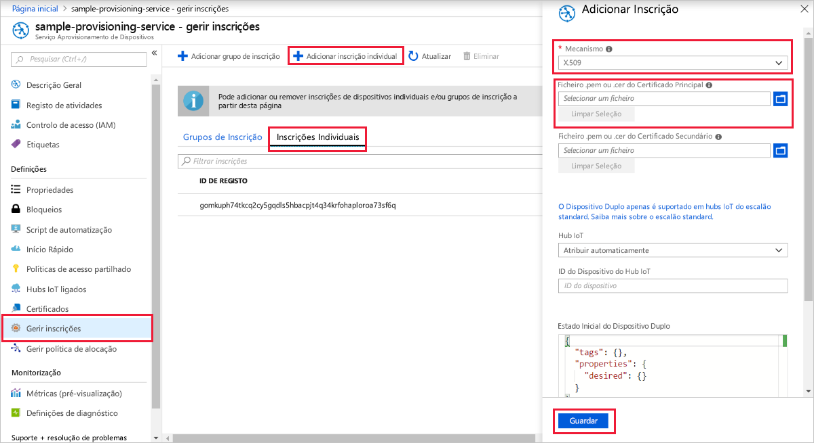
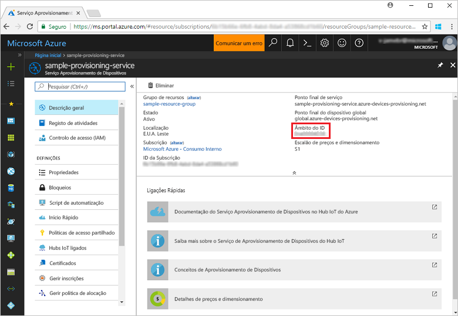
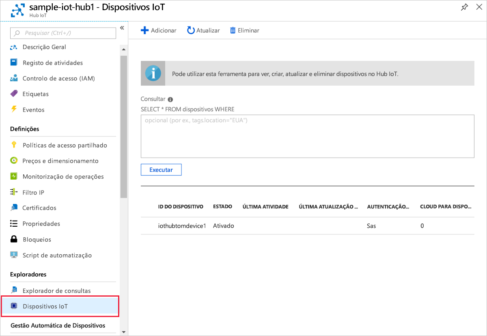

# <a name="quickstart-create-and-provision-an-x509-device-using-c-device-sdk-for-iot-hub-device-provisioning-service"></a>Quickstart: Criar e providenciar um dispositivo X.509 utilizando o dispositivo C# SDK para serviço de provisionamento de dispositivos IoT Hub

[!INCLUDE [iot-dps-selector-quick-create-simulated-device-x509](../../includes/iot-dps-selector-quick-create-simulated-device-x509.md)]

Estes passos mostram-lhe como utilizar o código do dispositivo a partir das [amostras Azure IoT para C#](https://github.com/Azure-Samples/azure-iot-samples-csharp) para forrar um dispositivo X.509. Neste artigo, irá executar o código de amostra do dispositivo na sua máquina de desenvolvimento para ligar a um Hub IoT utilizando o Serviço de Provisionamento de Dispositivos.

Se não estiver familiarizado com o processo de autoprovisionamento, reveja a visão geral [do provisionamento.](about-iot-dps.md#provisioning-process) Certifique-se também de que executa os passos descritos em [Configurar o Serviço de Aprovisionamento de Dispositivos no Hub IoT com o portal do Azure](./quick-setup-auto-provision.md) antes de continuar. 

O Serviço Aprovisionamento de Dispositivos no IoT do Azure suporta dois tipos de inscrição:
- [Grupos de inscrição](concepts-service.md#enrollment-group): utilizados para inscrever vários dispositivos relacionados.
- [Inscrições Individuais](concepts-service.md#individual-enrollment): utilizadas para inscrever um dispositivo individual.

Este artigo vai demonstrar as inscrições individuais.

[!INCLUDE [IoT Device Provisioning Service basic](../../includes/iot-dps-basic.md)]

<a id="setupdevbox"></a>
## <a name="prepare-the-development-environment"></a>Preparar o ambiente de desenvolvimento 

1. Verifique se `git` está instalado no computador e que é adicionado às variáveis de ambiente às quais a janela de comandos pode aceder. Veja as [ferramentas de cliente Git da Software Freedom Conservancy](https://git-scm.com/download/) relativamente à mais recente versão das ferramentas de `git` a instalar, que incluem o **Git Bash**, a aplicação de linha de comandos que pode utilizar para interagir com o seu repositório Git local. 

1. Abra uma linha de comandos ou o Git Bash. Clone as amostras Azure IoT para C# GitHub repo:
    
    ```bash
    git clone https://github.com/Azure-Samples/azure-iot-samples-csharp.git
    ```

1. Certifique-se de que tem o [.NET Core 3.0.0 SDK ou posteriormente](https://www.microsoft.com/net/download/windows) instalado na sua máquina. Pode utilizar o seguinte comando para verificar a sua versão.

    ```bash
    dotnet --info
    ```


## <a name="create-a-self-signed-x509-device-certificate"></a>Criar um certificado de dispositivo X.509 autoassinado

Nesta secção, irá criar um certificado de teste X.509 auto-assinado utilizando `iothubx509device1` como nome comum. É importante ter em consideração os seguintes pontos:

* Os certificados autoassinados são apenas para teste e não devem ser utilizados na produção.
* A data de expiração predefinida para um certificado autoassinado é de um ano.
* O ID do dispositivo IoT será o nome comum do sujeito no certificado. Certifique-se de que utiliza um nome de sujeito que cumpra os requisitos de [cadeia de identificação](../iot-hub/iot-hub-devguide-identity-registry.md#device-identity-properties)do dispositivo .

Utilizará o código de amostra do [X509Sample](https://github.com/Azure-Samples/azure-iot-samples-csharp/tree/master/provisioning/Samples/device/X509Sample) para criar o certificado a utilizar com a entrada individual de inscrição para o dispositivo.


1. Num pedido do PowerShell, mude os diretórios para o diretório do projeto para a amostra de provisão de dispositivos X.509.

    ```powershell
    cd .\azure-iot-samples-csharp\provisioning\Samples\device\X509Sample
    ```

2. O código de exemplo é configurado para utilizar certificados X.509 armazenados dentro de um ficheiro formatado PKCS12 protegido por palavra-passe (certificate.pfx). Além disso, você precisa de um arquivo de certificado chave público (certificado.cer) para criar uma inscrição individual mais tarde neste arranque rápido. Para gerar o certificado auto-assinado e os seus ficheiros .cer e .pfx associados, execute o seguinte comando:

    ```powershell
    PS D:\azure-iot-samples-csharp\provisioning\Samples\device\X509Sample> .\GenerateTestCertificate.ps1 iothubx509device1
    ```

3. O script pede-lhe uma palavra-passe PFX. Lembre-se desta palavra-passe, deve usá-la mais tarde quando executar a amostra. Pode correr `certutil` para despejar o certificado e verificar o nome do sujeito.

    ```powershell
    PS D:\azure-iot-samples-csharp\provisioning\Samples\device\X509Sample> certutil .\certificate.pfx
    Enter PFX password:
    ================ Certificate 0 ================
    ================ Begin Nesting Level 1 ================
    Element 0:
    Serial Number: 7b4a0e2af6f40eae4d91b3b7ff05a4ce
    Issuer: CN=iothubx509device1, O=TEST, C=US
     NotBefore: 2/1/2021 6:18 PM
     NotAfter: 2/1/2022 6:28 PM
    Subject: CN=iothubx509device1, O=TEST, C=US
    Signature matches Public Key
    Root Certificate: Subject matches Issuer
    Cert Hash(sha1): e3eb7b7cc1e2b601486bf8a733887a54cdab8ed6
    ----------------  End Nesting Level 1  ----------------
      Provider = Microsoft Strong Cryptographic Provider
    Signature test passed
    CertUtil: -dump command completed successfully.    
    ```

 ## <a name="create-an-individual-enrollment-entry-for-the-device"></a>Criar uma entrada individual de inscrição para o dispositivo


1. Inscreva-se no portal Azure, selecione o botão **Todos os recursos** no menu esquerdo e abra o seu serviço de ação.

2. A partir do menu serviço de fornecimento de **dispositivos, selecione Gerir as inscrições**. Selecione o separador **Inscrições Individuais** e selecione o botão **de inscrição individual** adicionar no topo. 

3. No painel **de inscrição adicionar,** insira as seguintes informações:
   - Selecione **X.509** como o *Mecanismo* de atestado de identidades.
   - Nos termos do *certificado Principal .pem ou .cer ficheiro*, escolha *Selecionar um ficheiro* para selecionar o certificado de ficheiro de **certificado.cer** criado nos passos anteriores.
   - Deixe **ID de Dispositivo** em branco. O dispositivo será aprovisionado com o seu ID de dispositivo definido como o nome comum (CN) no certificado X.509, **iothubx509device1**. Este nome comum será também o nome utilizado para o ID de inscrição individual. 
   - Opcionalmente, pode fornecer as seguintes informações:
       - Selecione um hub IoT ligado ao seu serviço de aprovisionamento.
       - Atualize o **estado inicial do dispositivo duplo** com a configuração inicial pretendida para o dispositivo.
   - Uma vez concluído, prima o botão **Guardar.** 

     [](./media/quick-create-simulated-device-x509-csharp/device-enrollment.png#lightbox)
    
   Após a instalação bem-sucedida, a sua entrada de inscrição X.509 aparece como **iothubx509device1** na coluna *ID de Registo* do separador *Inscrições Individuais*. 


## <a name="provision-the-device"></a>Fornecimento do dispositivo

1. A partir da lâmina **de visão geral** para o seu serviço de fornecimento, note o valor **_ID Scope._**

     


2. Escreva o seguinte comando para criar e executar o exemplo de aprovisionamento de dispositivos X.509. Substitua o valor `<IDScope>` pelo Âmbito de ID para o serviço de aprovisionamento. 

    O ficheiro do certificado por defeito para *./certificate.pfx* e pronta para a senha .pfx.  

    ```powershell
    dotnet run -- -s <IDScope>
    ```

    Se quiser passar tudo como parâmetro, pode utilizar o seguinte formato de exemplo.

    ```powershell
    dotnet run -- -s 0ne00000A0A -c certificate.pfx -p 1234
    ```


3. O dispositivo ligar-se-á ao DPS e será atribuído a um Hub IoT. O dispositivo enviará ainda uma mensagem de telemetria para o centro.

    ```output
    Loading the certificate...
    Found certificate: 10952E59D13A3E388F88E534444484F52CD3D9E4 CN=iothubx509device1, O=TEST, C=US; PrivateKey: True
    Using certificate 10952E59D13A3E388F88E534444484F52CD3D9E4 CN=iothubx509device1, O=TEST, C=US
    Initializing the device provisioning client...
    Initialized for registration Id iothubx509device1.
    Registering with the device provisioning service...
    Registration status: Assigned.
    Device iothubx509device2 registered to sample-iot-hub1.azure-devices.net.
    Creating X509 authentication for IoT Hub...
    Testing the provisioned device with IoT Hub...
    Sending a telemetry message...
    Finished.
    ```

4. Certifique-se de que o dispositivo foi aprovisionado. Ao providenciar com sucesso o fornecimento do dispositivo ao hub IoT ligado ao seu serviço de fornecimento, o ID do dispositivo aparece na lâmina dos **dispositivos IoT** do hub. 

     

    Se tiver alterado o *estado inicial do dispositivo duplo* face ao valor predefinido na entrada de inscrição do seu dispositivo, este pode extrair o estado pretendido do dispositivo duplo a partir do hub e agir em conformidade. Para obter mais informações, veja [Understand and use device twins in IoT Hub](../iot-hub/iot-hub-devguide-device-twins.md) (Compreender e utilizar dispositivos duplos no Hub IoT)


## <a name="clean-up-resources"></a>Limpar os recursos

Se pretender continuar a trabalhar e explorar a amostra do cliente do dispositivo, não limpe os recursos criados neste quickstart. Se não pretender continuar, utilize os seguintes passos para eliminar todos os recursos criados por este arranque rápido.

1. Feche a janela da saída do exemplo de dispositivo cliente no seu computador.
1. Feche a janela do simulador TPM no seu computador.
1. A partir do menu à esquerda no portal Azure, selecione **Todos os recursos** e, em seguida, selecione o seu serviço de Provisionamento de Dispositivos. Na parte superior da lâmina de **visão geral,** prima **Delete** na parte superior do painel.  
1. A partir do menu à esquerda no portal Azure, selecione **Todos os recursos** e, em seguida, selecione o seu hub IoT. Na parte superior da lâmina de **visão geral,** prima **Delete** na parte superior do painel.  

## <a name="next-steps"></a>Passos seguintes

Neste arranque rápido, adquirou um dispositivo X.509 ao seu hub IoT utilizando o Serviço de Provisionamento de Dispositivos Azure IoT Hub. Para aprender a inscrever o seu dispositivo X.509 programáticamente, continue a iniciar o quickstart para a inscrição programática de dispositivos X.509. 

> [!div class="nextstepaction"]
> [Azure quickstart - Inscreva dispositivos X.509 para O Serviço de Provisionamento de Dispositivos Azure IoT Hub](quick-enroll-device-x509-csharp.md)
