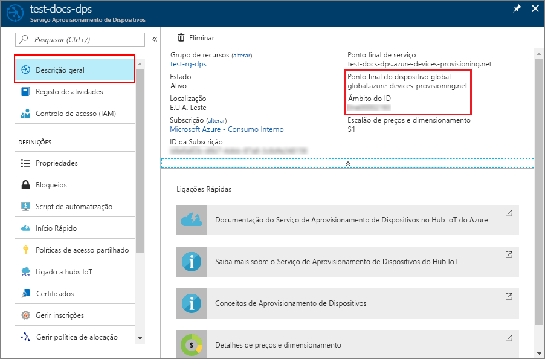
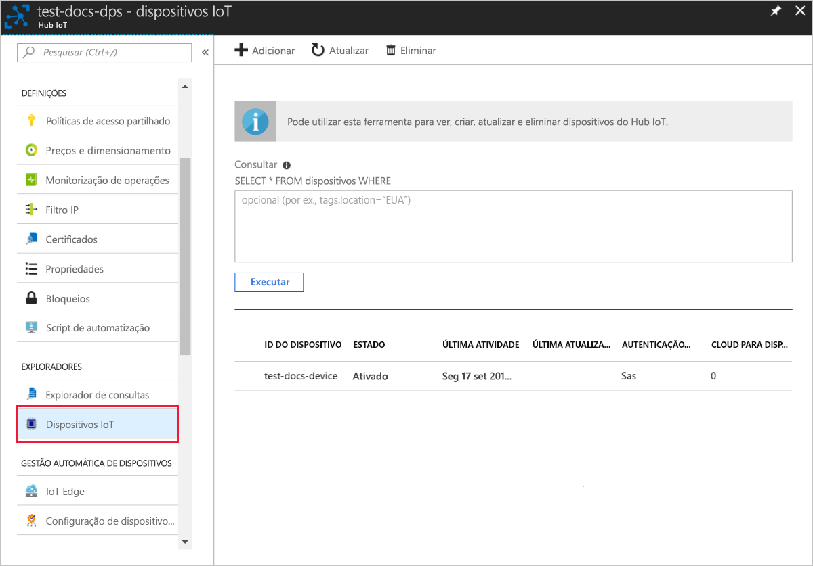

# <a name="quickstart-create-and-provision-an-x509-simulated-device-using-nodejs-device-sdk-for-iot-hub-device-provisioning-service"></a>Quickstart: Criar e providenciar um dispositivo simulado X.509 utilizando Node.js dispositivo SDK para serviço de provisionamento de dispositivos IoT Hub

[!INCLUDE [iot-dps-selector-quick-create-simulated-device-x509](../../includes/iot-dps-selector-quick-create-simulated-device-x509.md)]

Neste arranque rápido, cria-se um dispositivo X.509 simulado num computador Windows. Utiliza a amostra do dispositivo Node.js código para ligar este dispositivo simulado ao seu hub IoT utilizando uma inscrição individual com o Serviço de Provisionamento de Dispositivos (DPS).

## <a name="prerequisites"></a>Pré-requisitos

- Familiarizado com [conceitos de provisionamento.](about-iot-dps.md#provisioning-process)
- Conclusão do Serviço de Provisionamento de [Dispositivos IoT Hub com o portal Azure](./quick-setup-auto-provision.md).
- Uma conta Azure com uma subscrição ativa. [Crie um de graça.](https://azure.microsoft.com/free/?ref=microsoft.com&utm_source=microsoft.com&utm_medium=docs&utm_campaign=visualstudio)
- [Node.js v4.0+](https://nodejs.org).
- [Git.](https://git-scm.com/download/)
- [Abre-se.](https://www.openssl.org/)

[!INCLUDE [IoT Device Provisioning Service basic](../../includes/iot-dps-basic.md)]

## <a name="prepare-the-environment"></a>Preparar o ambiente 

1. Conclua os passos descritos em [Configurar o Serviço de Aprovisionamento de Dispositivos no Hub IoT com o portal do Azure](./quick-setup-auto-provision.md) antes de continuar.

2. Certifique-se de que tem o [Node.js v4.0 ou superior](https://nodejs.org) instalado no seu computador.

3. Certifique-se de que [o Git](https://git-scm.com/download/) está instalado na sua máquina e que é adicionado às variáveis ambientais acessíveis à janela de comando. 

4. Verifique se o [OpenSSL](https://www.openssl.org/) está instalado no computador e que é adicionado às variáveis de ambiente às quais a janela de comandos pode aceder. Esta biblioteca pode ser criada e instalada a partir da origem ou transferida e instalada a partir de [terceiros](https://wiki.openssl.org/index.php/Binaries) como [este](https://sourceforge.net/projects/openssl/). 

    > [!NOTE]
    > Se já tiver criado os certificados x.509 de _raiz_, _intermédios_, e/ou de _folha_, pode ignorar este passo e todos os passos seguintes relativos à geração de certificados.
    >

## <a name="create-a-self-signed-x509-device-certificate-and-individual-enrollment-entry"></a>Criar um certificado de dispositivo X.509 autoassinado e entrada de inscrição individual

Nesta secção, vai utilizar um certificado X.509 autoassinado e é importante ter em consideração o seguinte:

* Os certificados autoassinados são apenas para teste e não devem ser utilizados na produção.
* A data de expiração predefinida para um certificado autoassinado é de um ano.

Vai utilizar o código de exemplo do SDK do [Azure IoT para Node.js](https://github.com/Azure/azure-iot-sdk-node.git) para criar o certificado a ser utilizado na entrada de inscrição individual do dispositivo simulado.

O Serviço Aprovisionamento de Dispositivos no IoT do Azure suporta dois tipos de inscrição:

- [Grupos de inscrição](concepts-service.md#enrollment-group): utilizados para inscrever vários dispositivos relacionados.
- [Matrículas individuais](concepts-service.md#individual-enrollment): Usado para inscrever um único dispositivo.

Este artigo demonstra inscrições individuais.

1. Abra uma linha de comandos. Clone o repositório do GitHub para os exemplos de código:
    
    ```cmd/sh
    git clone https://github.com/Azure/azure-iot-sdk-node.git --recursive
    ```

2. Navegue até ao script de gerador de certificados e compile o projeto. 

    ```cmd/sh
    cd azure-iot-sdk-node/provisioning/tools
    npm install
    ```

3. Crie um certificado X.509 de _folha_ ao executar o script com o seu _certificate-name_. O nome comum do certificado de folha torna-se o [ID de registo](./concepts-service.md#registration-id), por conseguinte, não se esqueça de utilizar apenas carateres alfanuméricos em minúsculas e hífenes.

    ```cmd/sh
    node create_test_cert.js device {certificate-name}
    ```

4. Inscreva-se no [portal Azure,](https://portal.azure.com)selecione o botão **Todos os recursos** no menu esquerdo e abra a sua instância do Serviço de Provisionamento de Dispositivos.

5. A partir do menu serviço de fornecimento de **dispositivos, selecione Gerir as inscrições**. Selecione o separador **Inscrições Individuais** e selecione o botão **de inscrição individual** adicionar no topo. 

6. No painel **de inscrição adicionar,** insira as seguintes informações:
   - Selecione **X.509** como o *Mecanismo* de atestado de identidades.
   - Sob o *certificado primário .pem ou .cer ficheiro*, escolha *Selecionar um ficheiro* para selecionar o ficheiro de certificado **{certificate-name}_cert.pem** criado nos passos anteriores.  
   - Opcionalmente, pode fornecer as seguintes informações:
     - Selecione um hub IoT ligado ao seu serviço de aprovisionamento.
     - Introduza um ID de dispositivo exclusivo. Certifique-se de que evita dados confidenciais quando der o nome ao seu dispositivo. 
     - Atualize o **estado inicial do dispositivo duplo** com a configuração inicial pretendida para o dispositivo.
     - Uma vez concluído, prima o botão **Guardar.** 

     [](./media/quick-create-simulated-device-x509-node/device-enrollment.png#lightbox)

     Na inscrição bem sucedida, o seu dispositivo X.509 aparece como **{certificatename}** sob a coluna *de ID de registo* no separador *Matrículas Individuais.* Note este valor para mais tarde.

## <a name="simulate-the-device"></a>Simular o dispositivo

O [SDK de Dispositivo Node.js do Hub IoT do Azure](https://github.com/Azure/azure-iot-sdk-node) fornece uma forma fácil de simular um dispositivo. Para leitura adicional, veja [Conceitos do dispositivo](./concepts-service.md).

1. No portal Azure, selecione a lâmina **de visão geral** para o seu serviço de fornecimento de dispositivos e note os valores de Endpoint e **_ID Scope_** do dispositivo **_GLobal._**

     

2. Copie o _certificado_ e a _chave_ para a pasta de exemplo.

    ```cmd/sh
    copy .\{certificate-name}_cert.pem ..\device\samples\{certificate-name}_cert.pem
    copy .\{certificate-name}_key.pem ..\device\samples\{certificate-name}_key.pem
    ```

3. Navegue para o script de teste do dispositivo e compile o projeto. 

    ```cmd/sh
    cd ..\device\samples
    npm install
    ```

4. Edite o ficheiro **register\_x509.js**. Guarde o ficheiro depois de efetuar as seguintes alterações.
    - Substitua `provisioning host` pelo **_Ponto Final do Dispositivo Global_** indicado no **Passo 1** acima.
    - `id scope`Substitua-a pelo **_ID Scope_** indicado no **passo 1** acima. 
    - `registration id`Substitua-a pelo **_ID de registo_** indicado na secção anterior.
    - Substitua `cert filename` e `key filename` pelos ficheiros que copiou no **Passo 2** acima. 

5. Execute o script e verifique se o dispositivo foi aprovisionado com êxito.

    ```cmd/sh
    node register_x509.js
    ```   

6. No portal, navegue para o hub IoT ligado ao seu serviço de fornecimento e abra a lâmina dos **dispositivos IoT.** No fornecimento bem sucedido do dispositivo X.509 simulado ao hub, o seu ID do dispositivo aparece na lâmina dos **dispositivos IoT,** com *status* conforme **ativado**. Pode ser necessário premir o botão **Refresh** na parte superior se já tiver aberto a lâmina antes de executar a aplicação do dispositivo de amostra. 

     

    Se tiver alterado o *estado inicial do dispositivo duplo* face ao valor predefinido na entrada de inscrição do seu dispositivo, este pode extrair o estado pretendido do dispositivo duplo a partir do hub e agir em conformidade. Para obter mais informações, consulte [Compreender e utilizar gémeos do dispositivo no IoT Hub.](../iot-hub/iot-hub-devguide-device-twins.md)


## <a name="clean-up-resources"></a>Limpar os recursos

Se pretender continuar a trabalhar e explorar a amostra do cliente do dispositivo, não limpe os recursos criados neste quickstart. Se não pretender continuar, utilize os seguintes passos para eliminar todos os recursos criados por este arranque rápido.

1. Feche a janela da saída do exemplo de dispositivo cliente no seu computador.
2. A partir do menu à esquerda no portal Azure, selecione **Todos os recursos** e, em seguida, selecione o seu serviço de Provisionamento de Dispositivos. Abra a lâmina **'Gestão de Inscrições'** para o seu serviço e, em seguida, selecione o **separador Inscrições Individuais.** Selecione a caixa de verificação ao lado do *ID de registo* do dispositivo que inscreveu neste arranque rápido e prima o botão **Eliminar** na parte superior do painel. 
3. A partir do menu à esquerda no portal Azure, selecione **Todos os recursos** e, em seguida, selecione o seu hub IoT. Abra a lâmina dos **dispositivos IoT** para o seu hub, selecione a caixa de verificação ao lado do *ID* do dispositivo que registou neste arranque rápido e, em seguida, pressione o botão **Eliminar** na parte superior do painel.


## <a name="next-steps"></a>Passos seguintes

Neste arranque rápido, criou um dispositivo X.509 simulado e forte-o para o seu hub IoT utilizando o Serviço de Provisionamento de Dispositivos Azure IoT Hub no portal. Para aprender a inscrever o seu dispositivo X.509 programáticamente, continue a iniciar o quickstart para a inscrição programática de dispositivos X.509. 

> [!div class="nextstepaction"]
> [Azure quickstart - Inscreva dispositivos X.509 para O Serviço de Provisionamento de Dispositivos Azure IoT Hub](quick-enroll-device-x509-node.md)