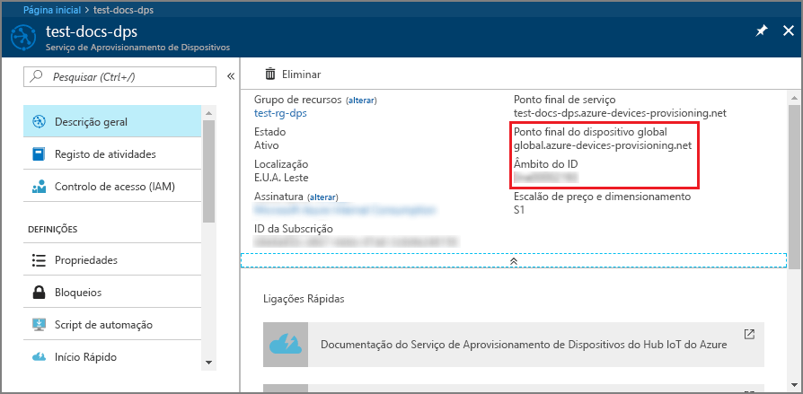
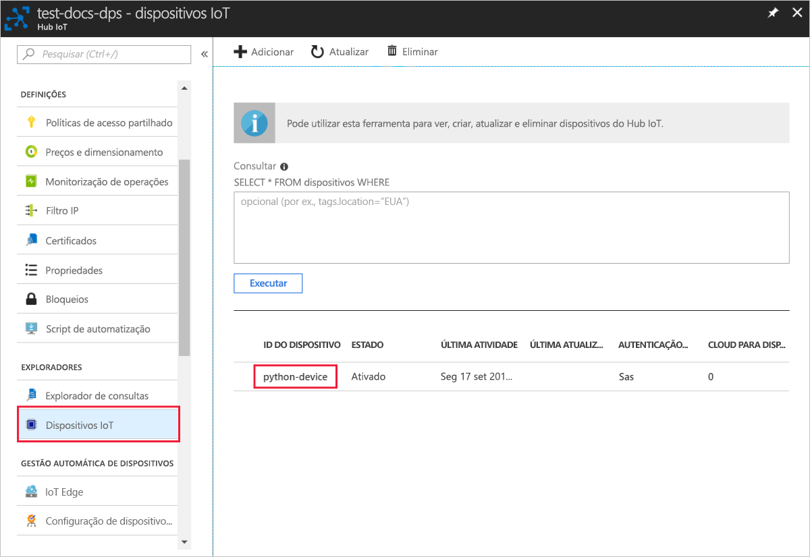

# <a name="quickstart-create-and-provision-a-simulated-x509-device-using-python-device-sdk-for-iot-hub-device-provisioning-service"></a>Quickstart: Criar e providenciar um dispositivo X.509 simulado utilizando o dispositivo Python SDK para serviço de provisionamento de dispositivos IoT Hub

[!INCLUDE [iot-dps-selector-quick-create-simulated-device-x509](../../includes/iot-dps-selector-quick-create-simulated-device-x509.md)]

Neste arranque rápido, você disponibiliza uma máquina de desenvolvimento como um dispositivo Python X.509. Utilize o código do dispositivo de amostra do [Azure IoT Python SDK](https://github.com/Azure/azure-iot-sdk-python) para ligar o dispositivo ao seu hub IoT. Neste exemplo, é utilizada uma inscrição individual com o Serviço de Provisionamento de Dispositivos (DPS).

## <a name="prerequisites"></a>Pré-requisitos

- Familiarizado com [conceitos de provisionamento.](about-iot-dps.md#provisioning-process)
- Conclusão do Serviço de Provisionamento de [Dispositivos IoT Hub com o portal Azure](./quick-setup-auto-provision.md).
- Uma conta Azure com uma subscrição ativa. [Crie um de graça.](https://azure.microsoft.com/free/?ref=microsoft.com&utm_source=microsoft.com&utm_medium=docs&utm_campaign=visualstudio)
- [Python 3.6 ou mais tarde](https://www.python.org/downloads/)
- [Git.](https://git-scm.com/download/)


[!INCLUDE [IoT Device Provisioning Service basic](../../includes/iot-dps-basic.md)]

## <a name="prepare-the-environment"></a>Preparar o ambiente 

1. Verifique se `git` está instalado no computador e que é adicionado às variáveis de ambiente às quais a janela de comandos pode aceder. Veja as [ferramentas de cliente Git da Software Freedom Conservancy](https://git-scm.com/download/) relativamente à mais recente versão das ferramentas de `git` a instalar, que incluem o **Git Bash**, a aplicação de linha de comandos que pode utilizar para interagir com o seu repositório Git local. 

2. Abre um pedido de Git Bash. Clone o gitHub repo para [Azure IoT Python SDK](https://github.com/Azure/azure-iot-sdk-python).
    
    ```cmd/sh
    git clone https://github.com/Azure/azure-iot-sdk-python.git --recursive
    ```


## <a name="create-a-self-signed-x509-device-certificate"></a>Criar um certificado de dispositivo X.509 autoassinado 

Nesta secção, irá criar um certificado X.509 auto-assinado. É importante ter em consideração os seguintes pontos:

* Os certificados autoassinados são apenas para teste e não devem ser utilizados na produção.
* A data de expiração predefinida para um certificado autoassinado é de um ano.

Se ainda não tiver os certificados do seu dispositivo para autenticar um dispositivo, pode criar um certificado auto-assinado com o OpenSSL para testes com este artigo.  O OpenSSL está incluído na instalação Git. 

1. Executar o seguinte comando no pedido de Git Bash.

    # <a name="windows"></a>[Windows](#tab/windows)
    
    ```bash
    winpty openssl req -outform PEM -x509 -sha256 -newkey rsa:4096 -keyout ./python-device.key.pem -out ./python-device.pem -days 365 -extensions usr_cert -subj "//CN=Python-device-01"
    ```

    > [!IMPORTANT]
    > O corte avançado extra dado para o nome do sujeito ( `//CN=Python-device-01` ) só é necessário para escapar da cadeia com Git nas plataformas do Windows. 

    # <a name="linux"></a>[Linux](#tab/linux)
    
    ```bash
    openssl req -outform PEM -x509 -sha256 -newkey rsa:4096 -keyout ./python-device.key.pem -out ./python-device.pem -days 365 -extensions usr_cert -subj "/CN=Python-device-01"
    ```
    
    ---
    
2. Quando lhe pedirem para introduzir a **frase de passe PEM:**, use a frase de passe `1234` para testar com este artigo.    

3. Quando perguntar novamente **Verificar - Introduza a frase do passe PEM:**, use novamente a frase `1234` passe.    

Um ficheiro de certificado de teste *(python-device.pem)* e um ficheiro de chave privada *(python-device.key.pem*) são gerados no diretório onde executou o `openssl` comando.


## <a name="create-an-individual-enrollment-entry-in-dps"></a>Criar uma inscrição individual em DPS


O Serviço Aprovisionamento de Dispositivos no IoT do Azure suporta dois tipos de inscrição:

- [Grupos de inscrição](concepts-service.md#enrollment-group): utilizados para inscrever vários dispositivos relacionados.
- [Matrículas individuais](concepts-service.md#individual-enrollment): Usado para inscrever um único dispositivo.

Este artigo demonstra uma inscrição individual para um único dispositivo a ser a provisionado com um hub IoT.

1. Inscreva-se no portal Azure, selecione o botão **Todos os recursos** no menu esquerdo e abra o seu serviço de ação.

2. A partir do menu serviço de fornecimento de **dispositivos, selecione Gerir as inscrições**. Selecione o separador **Inscrições Individuais** e selecione o botão **de inscrição individual** adicionar no topo. 

3. No painel **de inscrição adicionar,** insira as seguintes informações:
   - Selecione **X.509** como o *Mecanismo* de atestado de identidades.
   - Sob o *certificado Primário .pem ou .cer ficheiro*, escolha *Selecionar um ficheiro* para selecionar o ficheiro de certificado **python-device.pem** se estiver a utilizar o certificado de teste criado anteriormente.
   - Opcionalmente, pode fornecer as seguintes informações:
     - Selecione um hub IoT ligado ao seu serviço de aprovisionamento.
     - Atualize o **estado inicial do dispositivo duplo** com a configuração inicial pretendida para o dispositivo.
   - Uma vez concluído, prima o botão **Guardar.** 

     [](./media/python-quick-create-simulated-device-x509/device-enrollment.png#lightbox)

   Após a inscrição com sucesso, o seu dispositivo X.509 aparece como **Python-device-01** sob a coluna *de ID de registo* no separador *Matrículas Individuais.* Este valor de registo provém do nome do sujeito no certificado do dispositivo. 

## <a name="simulate-the-device"></a>Simular o dispositivo

A amostra de provisão Python, [provision_x509.py](https://github.com/Azure/azure-iot-sdk-python/blob/master/azure-iot-device/samples/async-hub-scenarios/provision_x509.py) está localizada no `azure-iot-sdk-python/azure-iot-device/samples/async-hub-scenarios` diretório. Esta amostra utiliza seis variáveis ambientais para autenticar e providenciar um dispositivo IoT utilizando DPS. Estas variáveis ambientais são:

| Nome da variável              | Description                                     |
| :------------------------- | :---------------------------------------------- |
| `PROVISIONING_HOST`        |  Este valor é o ponto final global utilizado para a ligação ao seu recurso DPS |    
| `PROVISIONING_IDSCOPE`     |  Este valor é o ID Scope para o seu recurso DPS |    
| `DPS_X509_REGISTRATION_ID` |  Este valor é a identificação do seu dispositivo. Também deve corresponder ao nome do sujeito no certificado do dispositivo |    
| `X509_CERT_FILE`           |  O nome de arquivo do certificado do seu dispositivo |    
| `X509_KEY_FILE`            |  O nome de ficheiro de chave privada para o certificado do seu dispositivo |
| `PASS_PHRASE`              |  A frase de passe que usou para encriptar o certificado e o ficheiro de chave privada `1234` (). |    

1. A partir do menu Serviço de Provisionamento de Dispositivos, selecione **Overview**. Note o seu _ID Scope_ e _o ponto final do dispositivo Global._

    

2. No seu pedido Git Bash, utilize os seguintes comandos adicione as variáveis ambientais para o ponto final global do dispositivo e iD Scope.

    ```bash
    $export PROVISIONING_HOST=global.azure-devices-provisioning.net
    $export PROVISIONING_IDSCOPE=<ID scope for your DPS resource>
    ```

3. O ID de registo do dispositivo IoT deve coincidir com o nome do sujeito no certificado do dispositivo. Se gerou um certificado de teste auto-assinado, `Python-device-01` é o nome do sujeito e identificação de registo para o dispositivo. 

    Se já tiver um certificado de dispositivo, pode utilizar `certutil` para verificar o nome comum do sujeito utilizado para o seu dispositivo, como indicado abaixo para um certificado de teste auto-assinado:

    ```bash
    $ certutil python-device.pem
    X509 Certificate:
    Version: 3
    Serial Number: fa33152fe1140dc8
    Signature Algorithm:
        Algorithm ObjectId: 1.2.840.113549.1.1.11 sha256RSA
        Algorithm Parameters:
        05 00
    Issuer:
        CN=Python-device-01
      Name Hash(sha1): 1dd88de40e9501fb64892b698afe12d027011000
      Name Hash(md5): a62c784820daa931b9d3977739b30d12
    
     NotBefore: 1/29/2021 7:05 PM
     NotAfter: 1/29/2022 7:05 PM
    
    Subject:
        ===> CN=Python-device-01 <===
      Name Hash(sha1): 1dd88de40e9501fb64892b698afe12d027011000
      Name Hash(md5): a62c784820daa931b9d3977739b30d12
    ```

    No pedido de Git Bash, desaprote o ambiente variável para o ID de registo da seguinte forma:

    ```bash
    $export DPS_X509_REGISTRATION_ID=Python-device-01
    ```

4. No pedido de Git Bash, desaperte as variáveis ambientais para o ficheiro de certificado, o ficheiro de chave privada e passe a frase.

    ```bash
    $export X509_CERT_FILE=./python-device.pem
    $export X509_KEY_FILE=./python-device.key.pem
    $export PASS_PHRASE=1234
    ```

5. Reveja o código para [provision_x509.py](https://github.com/Azure/azure-iot-sdk-python/blob/master/azure-iot-device/samples/async-hub-scenarios/provision_x509.py) Se não utilizar a **versão Python 3.7** ou posterior, faça a alteração de [código aqui mencionada](https://github.com/Azure/azure-iot-sdk-python/tree/master/azure-iot-device/samples/async-hub-scenarios#advanced-iot-hub-scenario-samples-for-the-azure-iot-hub-device-sdk) para substituir e guardar a `asyncio.run(main())` sua alteração. 

6. Execute o exemplo. A amostra liga-se, a provisiona o dispositivo a um hub e envia algumas mensagens de teste para o centro.

    ```bash
    $ winpty python azure-iot-sdk-python/azure-iot-device/samples/async-hub-scenarios/provision_x509.py
    RegistrationStage(RequestAndResponseOperation): Op will transition into polling after interval 2.  Setting timer.
    The complete registration result is
    Python-device-01
    TestHub12345.azure-devices.net
    initialAssignment
    null
    Will send telemetry from the provisioned device
    sending message #4
    sending message #7
    sending message #2
    sending message #8
    sending message #5
    sending message #9
    sending message #1
    sending message #6
    sending message #10
    sending message #3
    done sending message #4
    done sending message #7
    done sending message #2
    done sending message #8
    done sending message #5
    done sending message #9
    done sending message #1
    done sending message #6
    done sending message #10
    done sending message #3
    ```

7. No portal, navegue para o hub IoT ligado ao seu serviço de fornecimento e abra a lâmina de **dispositivos IoT** localizada sob a secção **Explorers** no menu esquerdo. Após o aprovisionamento bem-sucedido do dispositivo X.509 simulado no hub, o ID de dispositivo aparece no painel **Explorador de Dispositivos**, com o *ESTADO***ativado**. Pode ser necessário premir o botão **Refresh** na parte superior se já tiver aberto a lâmina antes de executar a aplicação do dispositivo de amostra. 

     

> [!NOTE]
> Se tiver alterado o *estado inicial do dispositivo duplo* face ao valor predefinido na entrada de inscrição do seu dispositivo, este pode extrair o estado pretendido do dispositivo duplo a partir do hub e agir em conformidade. Para obter mais informações, consulte [Compreender e utilizar gémeos do dispositivo no IoT Hub.](../iot-hub/iot-hub-devguide-device-twins.md)
>

## <a name="clean-up-resources"></a>Limpar os recursos

Se pretender continuar a trabalhar e explorar a amostra do cliente do dispositivo, não limpe os recursos criados neste quickstart. Se não pretender continuar, utilize os seguintes passos para eliminar todos os recursos criados por este arranque rápido.

1. Feche a janela da saída do exemplo de dispositivo cliente no seu computador.
2. A partir do menu à esquerda no portal Azure, selecione **Todos os recursos** e, em seguida, selecione o seu serviço de Provisionamento de Dispositivos. Abra a lâmina **'Gestão de Inscrições'** para o seu serviço e, em seguida, selecione o **separador Inscrições Individuais.** Selecione a caixa de verificação ao lado do *ID de registo* do dispositivo que inscreveu neste arranque rápido e prima o botão **Eliminar** na parte superior do painel. 
3. A partir do menu à esquerda no portal Azure, selecione **Todos os recursos** e, em seguida, selecione o seu hub IoT. Abra a lâmina dos **dispositivos IoT** para o seu hub, selecione a caixa de verificação ao lado do *ID* do dispositivo que registou neste arranque rápido e, em seguida, pressione o botão **Eliminar** na parte superior do painel.

## <a name="next-steps"></a>Passos seguintes

Neste arranque rápido, criou um dispositivo X.509 simulado na sua máquina de desenvolvimento e forte-o para o seu hub IoT utilizando o Serviço de Provisionamento de Dispositivos Azure IoT Hub no portal. Para aprender a inscrever o seu dispositivo X.509 programáticamente, continue a iniciar o quickstart para a inscrição programática de dispositivos X.509. 

> [!div class="nextstepaction"]
> [Azure quickstart - Inscreva dispositivos X.509 para O Serviço de Provisionamento de Dispositivos Azure IoT Hub](quick-enroll-device-x509-python.md)
