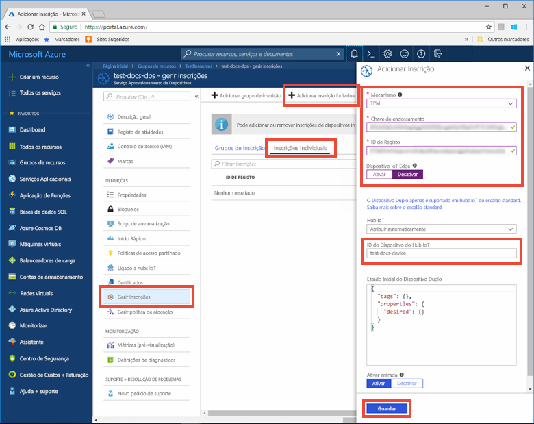

# <a name="quickstart-provision-a-simulated-tpm-device-using-the-azure-iot-c-sdk"></a>Início Rápido: Aprovisionar um dispositivo TPM simulado com o SDK C do Azure IoT

[!INCLUDE [iot-dps-selector-quick-create-simulated-device-tpm](../../includes/iot-dps-selector-quick-create-simulated-device-tpm.md)]

Neste início rápido, vai aprender a criar e executar um simulador de dispositivos Trusted Platform Module (TPM) numa máquina de desenvolvimento do Windows. Vai ligar este dispositivo simulado a um hub IoT através de uma instância do Serviço de Aprovisionamento de Dispositivos. Será utilizado código de exemplo do [SDK C do Azure IoT](https://github.com/Azure/azure-iot-sdk-c) para ajudar a inscrever o dispositivo numa instância do Serviço de Aprovisionamento de Dispositivos e simular uma sequência de arranque para o mesmo.

Se não estiver familiarizado com o processo de aprovisionamento automático, reveja [Conceitos de aprovisionamento automático](concepts-auto-provisioning.md). Certifique-se também de que executa os passos descritos em [Configurar o Serviço de Aprovisionamento de Dispositivos no Hub IoT com o portal do Azure](./quick-setup-auto-provision.md) antes de continuar este início rápido. 

O Serviço Aprovisionamento de Dispositivos no IoT do Azure suporta dois tipos de inscrição:
- [Grupos de inscrição](concepts-service.md#enrollment-group): utilizados para inscrever vários dispositivos relacionados.
- [Inscrições Individuais](concepts-service.md#individual-enrollment): utilizadas para inscrever um dispositivo individual.

Este artigo irá demonstrar as inscrições individuais.

[!INCLUDE [quickstarts-free-trial-note](../../includes/quickstarts-free-trial-note.md)]

## <a name="prerequisites"></a>Pré-requisitos

* O [Visual Studio](https://visualstudio.microsoft.com/vs/) 2015 ou posterior com a carga de [trabalho C++' desenvolvimento de desktop com '](https://www.visualstudio.com/vs/support/selecting-workloads-visual-studio-2017/) habilitada.
* Versão mais recente do [Git](https://git-scm.com/download/) instalada.


<a id="setupdevbox"></a>

## <a name="prepare-a-development-environment-for-the-azure-iot-c-sdk"></a>Preparar um ambiente de desenvolvimento para o SDK C do Azure IoT

Nesta secção, vai preparar um ambiente de desenvolvimento utilizado para criar o [SDK C do Azure IoT](https://github.com/Azure/azure-iot-sdk-c) e o exemplo do simulador de dispositivos [TPM](https://docs.microsoft.com/windows/device-security/tpm/trusted-platform-module-overview).

1. Baixe o [sistema de Build CMake](https://cmake.org/download/).

    É importante que os pré-requisitos do Visual Studio (Visual Studio e a carga de trabalho "Desenvolvimento do ambiente de trabalho em C++") estejam instalados no computador, **antes** de iniciar a instalação de `CMake`. Depois de os pré-requisitos estarem assegurados e a transferência verificada, instale o sistema de compilação CMake.

2. Abra uma linha de comandos ou a shell do Git Bash. Execute o seguinte comando para clonar o [SDK C do Azure IoT](https://github.com/Azure/azure-iot-sdk-c) no repositório do GitHub:
    
    ```cmd/sh
    git clone https://github.com/Azure/azure-iot-sdk-c.git --recursive
    ```
    Esta operação deve demorar vários minutos a ser concluída.


3. Crie um subdiretório `cmake` no diretório de raiz do repositório git e navegue para essa pasta. 

    ```cmd/sh
    cd azure-iot-sdk-c
    mkdir cmake
    cd cmake
    ```

## <a name="build-the-sdk-and-run-the-tpm-device-simulator"></a>Compilar o SDK e executar o simulador de dispositivos TPM

Nesta secção, vai compilar o SDK C do Azure IoT, que inclui o código de exemplo do simulador de dispositivos TPM. Este exemplo fornece um [mecanismo de atestado](concepts-security.md#attestation-mechanism) TPM através da autenticação de Token de Assinatura de Acesso Partilhado (SAS).

1. A partir do subdiretório `cmake` criado no repositório git azure-iot-sdk-c, execute o comando seguinte para compilar o exemplo. Será também gerada uma solução do Visual Studio para o dispositivo simulado por este comando de compilação.

    ```cmd/sh
    cmake -Duse_prov_client:BOOL=ON -Duse_tpm_simulator:BOOL=ON ..
    ```

    Se `cmake` não encontrar o compilador de C++, poderá obter erros de compilação ao executar o comando acima. Se isto acontecer, tente executar o comando seguinte na [linha de comandos do Visual Studio](https://docs.microsoft.com/dotnet/framework/tools/developer-command-prompt-for-vs). 

    Assim que a compilação for concluída com êxito, as últimas linhas de saída terão um aspeto semelhante ao seguinte:

    ```cmd/sh
    $ cmake -Duse_prov_client:BOOL=ON -Duse_tpm_simulator:BOOL=ON ..
    -- Building for: Visual Studio 15 2017
    -- Selecting Windows SDK version 10.0.16299.0 to target Windows 10.0.17134.
    -- The C compiler identification is MSVC 19.12.25835.0
    -- The CXX compiler identification is MSVC 19.12.25835.0

    ...

    -- Configuring done
    -- Generating done
    -- Build files have been written to: E:/IoT Testing/azure-iot-sdk-c/cmake
    ```

2. Navegue para a pasta raiz do repositório git que clonou e execute o simulador [TPM](https://docs.microsoft.com/windows/device-security/tpm/trusted-platform-module-overview) através do caminho mostrado abaixo. Este simulador escuta através de um socket nas portas 2321 e 2322. Não feche esta janela de comando; terá de manter este simulador em execução até ao fim deste início rápido. 

   Se está na pasta *cmake*, execute os seguintes comandos:

    ```cmd/sh
    cd ..
    .\provisioning_client\deps\utpm\tools\tpm_simulator\Simulator.exe
    ```

    Não verá qualquer saída do simulador. Deixe-o continuar a execução da simulação de um dispositivo TPM.

<a id="simulatetpm"></a>

## <a name="read-cryptographic-keys-from-the-tpm-device"></a>Ler as chaves criptográficas do dispositivo TPM

Nesta secção, vai compilar e executar um exemplo que irá ler a chave de endossamento e o ID de registo do simulador TPM em execução e a escutar nas portas 2321 e 2322. Estes valores serão utilizados na inscrição de dispositivos na instância do Serviço Aprovisionamento de Dispositivos.

1. Inicie o Visual Studio e abra o novo ficheiro de solução com o nome `azure_iot_sdks.sln`. Este ficheiro de solução está localizado na pasta `cmake` que criou anteriormente na raiz do repositório git azure-iot-sdk-c.

2. No menu do Visual Studio, selecione **Build** (Compilar)  > **Build Solution** (Compilar Solução) para criar todos os projetos na solução.

3. Na janela *Solution Explorer* (Explorador de Soluções) do Visual Studio, navegue para a pasta **Provision\_Tools**. Clique com o botão direito do rato no projeto **tpm_device_provision** e selecione **Configurar como Projeto de Arranque**. 

4. No menu do Visual Studio, selecione **Debug** (Depurar)  > **Start without debugging** (Iniciar sem depuração) para executar a solução. O aplicativo lê e exibe uma **_ID de registro_** e uma **_chave de endosso_** . Observe ou copie esses valores. Serão utilizados na secção seguinte na inscrição de dispositivos. 


<a id="portalenrollment"></a>

## <a name="create-a-device-enrollment-entry-in-the-portal"></a>Criar uma entrada de inscrição de dispositivos no portal

1. Entre no portal do Azure, selecione o botão **todos os recursos** no menu esquerdo e abra o serviço de provisionamento de dispositivos.

1. Selecione a guia **gerenciar** registros e, em seguida, selecione o botão **adicionar registro individual** na parte superior. 

1. No painel **adicionar registro** , insira as seguintes informações:
   - Selecione **TPM** como o *Mecanismo* de atestado de identidades.
   - Insira a *ID de registro* e a *chave de endosso* do seu dispositivo TPM a partir dos valores que você anotou anteriormente.
   - Selecione um hub IoT ligado ao seu serviço de aprovisionamento.
   - Opcionalmente, pode fornecer as seguintes informações:
       - Insira uma *ID de dispositivo* exclusiva (você pode usar os documentos de teste sugeridos **-dispositivo** ou fornecer seu próprio). Certifique-se de que evita dados confidenciais quando der o nome ao seu dispositivo. Se você optar por não fornecer um, a ID de registro será usada para identificar o dispositivo.
       - Atualize o **estado inicial do dispositivo duplo** com a configuração inicial pretendida para o dispositivo.
   - Depois de concluído, pressione o botão **salvar** . 

        

      Após a instalação bem-sucedida, o *ID de Registo* do seu dispositivo aparece na lista, no separador *Inscrições Individuais*. 


<a id="firstbootsequence"></a>

## <a name="simulate-first-boot-sequence-for-the-device"></a>Simular a sequência de primeiro arranque para o dispositivo

Nesta secção, vai configurar o código de exemplo para utilizar o [Advanced Message Queuing Protocol (AMQP)](https://wikipedia.org/wiki/Advanced_Message_Queuing_Protocol) para enviar a sequência de arranque do dispositivo para a instância do Serviço de Aprovisionamento de Dispositivos. Esta sequência de arranque fará com que o dispositivo seja reconhecido e atribuído a um hub IoT ligado à instância do Serviço de Aprovisionamento de Dispositivos.

1. No portal do Azure, selecione o separador **Descrição Geral** do seu Serviço Aprovisionamento de Dispositivos e copie o valor **_Âmbito do ID_** .

     

2. Na janela *Solution Explorer* (Explorador de Soluções) do Visual Studio, navegue para a pasta **Provision\_Samples**. Expanda o projeto de exemplo com o nome **prov\_dev\_client\_sample**. Expanda **Source Files** (Ficheiros de Origem) e abra **prov\_dev\_client\_sample.c**.

3. Junto à parte superior do ficheiro, localize as declarações `#define` para cada protocolo de dispositivo, conforme mostrado abaixo. Certifique-se de que apenas `SAMPLE_AMQP` tem os comentários anulados.

    Atualmente, o [protocolo MQTT não é suportado para Inscrição Individual de TPM](https://github.com/Azure/azure-iot-sdk-c#provisioning-client-sdk).

    ```c
    //
    // The protocol you wish to use should be uncommented
    //
    //#define SAMPLE_MQTT
    //#define SAMPLE_MQTT_OVER_WEBSOCKETS
    #define SAMPLE_AMQP
    //#define SAMPLE_AMQP_OVER_WEBSOCKETS
    //#define SAMPLE_HTTP
    ```

4. Localize a constante `id_scope` e substitua o valor pelo seu **Âmbito do ID** que copiou anteriormente. 

    ```c
    static const char* id_scope = "0ne00002193";
    ```

5. Localize a definição da função `main()` no mesmo ficheiro. Certifique-se de que a variável `hsm_type` está definida como `SECURE_DEVICE_TYPE_TPM` em vez de `SECURE_DEVICE_TYPE_X509`, conforme mostrado abaixo.

    ```c
    SECURE_DEVICE_TYPE hsm_type;
    hsm_type = SECURE_DEVICE_TYPE_TPM;
    //hsm_type = SECURE_DEVICE_TYPE_X509;
    ```

6. Clique com o botão direito do rato no projeto **prov\_dev\_client\_sample** e selecione **Definir como Projeto de Arranque**. 

7. No menu do Visual Studio, selecione **Debug** (Depurar)  > **Start without debugging** (Iniciar sem depuração) para executar a solução. No prompt para recriar o projeto, selecione **Sim**para recompilar o projeto antes de executá-lo.

    A saída seguinte é um exemplo do cliente do dispositivo de aprovisionamento a arrancar e a ligar com êxito a uma instância do Serviço de Aprovisionamento de Dispositivos para obter informações e registar o hub IoT:

    ```cmd
    Provisioning API Version: 1.2.7
    Provisioning Status: PROV_DEVICE_REG_STATUS_CONNECTED

    Registering... Press enter key to interrupt.

    Provisioning Status: PROV_DEVICE_REG_STATUS_CONNECTED
    Provisioning Status: PROV_DEVICE_REG_STATUS_ASSIGNING
    Provisioning Status: PROV_DEVICE_REG_STATUS_ASSIGNING

    Registration Information received from service:
    test-docs-hub.azure-devices.net, deviceId: test-docs-device
    ```

8. Depois que o dispositivo simulado for provisionado para o Hub IoT pelo serviço de provisionamento, a ID do dispositivo será exibida com os **dispositivos IOT**do Hub. 

     


## <a name="clean-up-resources"></a>Limpar recursos

Se você planeja continuar trabalhando e explorando o exemplo de cliente do dispositivo, não limpe os recursos criados neste guia de início rápido. Se você não planeja continuar, use as etapas a seguir para excluir todos os recursos criados por este guia de início rápido.

1. Feche a janela da saída do exemplo de dispositivo cliente no seu computador.
2. Feche a janela do simulador TPM no seu computador.
3. No menu à esquerda na portal do Azure, selecione **todos os recursos** e, em seguida, selecione o serviço de provisionamento de dispositivos. Abra **gerenciar registros** para o serviço e, em seguida, selecione a guia registros **individuais** . Marque a caixa de seleção ao lado da *ID de registro* do dispositivo registrado neste guia de início rápido e pressione o botão **excluir** na parte superior do painel. 
4. No menu à esquerda na portal do Azure, selecione **todos os recursos** e, em seguida, selecione o Hub IOT. Abra **dispositivos IOT** para seu hub, marque a caixa de seleção ao lado da *ID do dispositivo* do dispositivo registrado neste guia de início rápido e, em seguida, pressione o botão **excluir** na parte superior do painel.

## <a name="next-steps"></a>Passos seguintes

Neste guia de início rápido, você criou um dispositivo simulado do TPM em seu computador e o provisionou no Hub IoT usando o serviço de provisionamento de dispositivos do Hub IoT. Para saber como registrar seu dispositivo TPM programaticamente, continue no início rápido para o registro programático de um dispositivo TPM. 

> [!div class="nextstepaction"]
> [Guia de início rápido do Azure-registrar dispositivo TPM no serviço de provisionamento de dispositivos no Hub IoT do Azure](quick-enroll-device-tpm-java.md)
