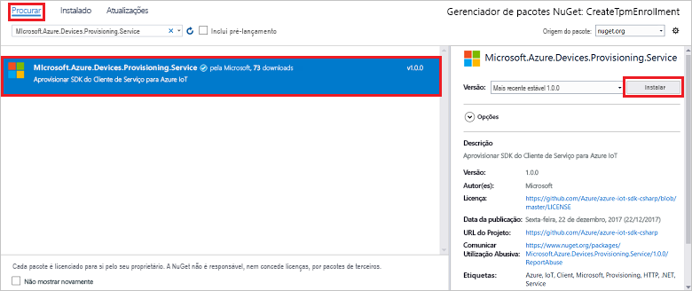

# <a name="quickstart-enroll-tpm-device-to-iot-hub-device-provisioning-service-using-c-service-sdk"></a>Quickstart: Inscreva o dispositivo TPM no Serviço de Provisionamento de Dispositivos IoT Hub utilizando o serviço C# SDK

[!INCLUDE [iot-dps-selector-quick-enroll-device-tpm](../../includes/iot-dps-selector-quick-enroll-device-tpm.md)]

Este artigo mostra como criar programáticamente uma inscrição individual para um dispositivo TPM no Serviço de Provisionamento de Dispositivos Azure IoT Hub utilizando o [Serviço C# SDK](https://github.com/Azure/azure-iot-sdk-csharp) e uma aplicação C# .NET Core. Pode inscrever opcionalmente um dispositivo TPM simulado para o serviço de fornecimento utilizando esta entrada de inscrição individual. Embora estes passos funcionem tanto em computadores Windows como Linux, este artigo utiliza um computador de desenvolvimento windows.

## <a name="prepare-the-development-environment"></a>Preparar o ambiente de desenvolvimento

1. Verifique se tem [o Visual Studio 2019](https://www.visualstudio.com/vs/) instalado no seu computador.

1. Verifique se tem o [.NET Core SDK](https://dotnet.microsoft.com/download) instalado no seu computador.

1. Complete os passos na [Configuração do Serviço de Provisionamento de Dispositivos IoT Hub com o portal Azure](./quick-setup-auto-provision.md) antes de continuar.

1. (Opcional) Se pretender inscrever um dispositivo simulado no final deste arranque rápido, siga o procedimento na [Criação e provisa um dispositivo TPM simulado utilizando o dispositivo C# SDK](quick-create-simulated-device-tpm-csharp.md) até ao passo em que obtém uma chave de endosso para o dispositivo. Guarde a chave de endosso, iD de registo e, opcionalmente, o ID do dispositivo, porque precisa usá-los mais tarde neste arranque rápido.

   > [!NOTE]
   > Não siga os passos para criar uma inscrição individual utilizando o portal Azure.

## <a name="get-the-connection-string-for-your-provisioning-service"></a>Obter a cadeia de ligação para o serviço de aprovisionamento

Para o exemplo neste início rápido, precisa da cadeia de ligação para o seu serviço de aprovisionamento.

1. Inscreva-se no portal Azure, selecione **Todos os recursos** e, em seguida, o seu Serviço de Provisionamento de Dispositivos.

1. Escolha **políticas de acesso compartilhado** e, em seguida, selecione a política de acesso que pretende utilizar para abrir as suas propriedades. Na **Política de Acesso,** copie e guarde a cadeia de ligação da chave primária.

    

## <a name="create-the-individual-enrollment-sample"></a>Criar o exemplo de inscrição individual

Esta secção mostra como criar uma aplicação de consola .NET Core que adiciona uma inscrição individual para um dispositivo TPM ao seu serviço de fornecimento. Com algumas modificações, também pode seguir estes passos para criar uma aplicação de consola [Windows IoT Core](https://developer.microsoft.com/en-us/windows/iot) para adicionar à inscrição individual. Para saber mais sobre o desenvolvimento com o IoT Core, consulte a [documentação do desenvolvedor do Windows IoT Core](/windows/iot-core/).

1. Abra o Estúdio Visual e selecione **Criar um novo projeto.** In **Create a new project**, escolha o modelo de projeto da App consola **(.NET Core)** para C# e selecione **Next**.

1. Nomeie o projeto *CreateTpmEnrollment,* e prima **Criar**.

    

1. Quando a solução abrir no Visual Studio, no painel **Solution Explorer,** clique com a direita no projeto **CreateTpmEnrollment.** **Selecione Gerir pacotes nuget**.

1. No **NuGet Package Manager**, selecione **Browse**, procure e escolha **Microsoft.Azure.Devices.Provisioning.Service** e, em seguida, prima **Instalar**.

   

   Este passo descarrega, instala e adiciona uma referência ao pacote SDK NuGet [do Serviço de Provisionamento Azure IoT](https://www.nuget.org/packages/Microsoft.Azure.Devices.Provisioning.Service/) e às suas dependências.

1. Adicione as `using` seguintes declarações após as outras `using` declarações no topo `Program.cs` de:
  
   ```csharp
   using System.Threading.Tasks;
   using Microsoft.Azure.Devices.Provisioning.Service;
   ```

1. Adicione os seguintes campos à `Program` classe, fazendo as alterações listadas abaixo.

   ```csharp
   private static string ProvisioningConnectionString = "{ProvisioningServiceConnectionString}";
   private const string RegistrationId = "sample-registrationid-csharp";
   private const string TpmEndorsementKey =
       "AToAAQALAAMAsgAgg3GXZ0SEs/gakMyNRqXXJP1S124GUgtk8qHaGzMUaaoABgCAAEMAEAgAAAAAAAEAxsj2gUS" +
       "cTk1UjuioeTlfGYZrrimExB+bScH75adUMRIi2UOMxG1kw4y+9RW/IVoMl4e620VxZad0ARX2gUqVjYO7KPVt3d" +
       "yKhZS3dkcvfBisBhP1XH9B33VqHG9SHnbnQXdBUaCgKAfxome8UmBKfe+naTsE5fkvjb/do3/dD6l4sGBwFCnKR" +
       "dln4XpM03zLpoHFao8zOwt8l/uP3qUIxmCYv9A7m69Ms+5/pCkTu/rK4mRDsfhZ0QLfbzVI6zQFOKF/rwsfBtFe" +
       "WlWtcuJMKlXdD8TXWElTzgh7JS4qhFzreL0c1mI0GCj+Aws0usZh7dLIVPnlgZcBhgy1SSDQMQ==";
       
   // Optional parameters
   private const string OptionalDeviceId = "myCSharpDevice";
   private const ProvisioningStatus OptionalProvisioningStatus = ProvisioningStatus.Enabled;
   ```

   * Substitua o `ProvisioningServiceConnectionString` valor do espaço reservado pela cadeia de ligação do serviço de fornecimento para o quais pretende criar a inscrição.

   * Opcionalmente, pode alterar o ID do registo, a chave de endossamento, o ID do dispositivo e o estado de aprovisionamento.

   * Se estiver a utilizar este quickstart juntamente com o [Create e providenciar um dispositivo TPM simulado utilizando o dispositivo C# SDK](quick-create-simulated-device-tpm-csharp.md) quickstart para forrê-lo, substitua a chave de endosso e o ID de registo pelos valores que notou nesse arranque rápido. Pode substituir o ID do dispositivo pelo valor sugerido nesse arranque rápido, utilizar o seu próprio valor ou utilizar o valor predefinido nesta amostra.

1. Adicione o seguinte método à `Program` classe.  Este código cria a entrada individual de inscrição e, em seguida, chama o `CreateOrUpdateIndividualEnrollmentAsync` método de adicionar a `ProvisioningServiceClient` inscrição individual ao serviço de fornecimento.

   ```csharp
   public static async Task RunSample()
   {
       Console.WriteLine("Starting sample...");

       using (ProvisioningServiceClient provisioningServiceClient =
               ProvisioningServiceClient.CreateFromConnectionString(ProvisioningConnectionString))
       {
           #region Create a new individualEnrollment config
           Console.WriteLine("\nCreating a new individualEnrollment...");
           Attestation attestation = new TpmAttestation(TpmEndorsementKey);
           IndividualEnrollment individualEnrollment =
                   new IndividualEnrollment(
                           RegistrationId,
                           attestation);

           // The following parameters are optional. Remove them if you don't need them.
           individualEnrollment.DeviceId = OptionalDeviceId;
           individualEnrollment.ProvisioningStatus = OptionalProvisioningStatus;
           #endregion

           #region Create the individualEnrollment
           Console.WriteLine("\nAdding new individualEnrollment...");
           IndividualEnrollment individualEnrollmentResult =
               await provisioningServiceClient.CreateOrUpdateIndividualEnrollmentAsync(individualEnrollment).ConfigureAwait(false);
           Console.WriteLine("\nIndividualEnrollment created with success.");
           Console.WriteLine(individualEnrollmentResult);
           #endregion
        
       }
   }
   ```

1. Por último, substitua o `Main` método pelas seguintes linhas:

   ```csharp
    static async Task Main(string[] args)
    {
        await RunSample();
        Console.WriteLine("\nHit <Enter> to exit ...");
        Console.ReadLine();
    }
   ```

1. Compilar a solução.

## <a name="run-the-individual-enrollment-sample"></a>Executar o exemplo de inscrição individual
  
Execute o exemplo no Visual Studio para criar a inscrição individual para o seu dispositivo TPM.

Aparecerá uma janela de pedido de comando e começará a mostrar mensagens de confirmação. Na criação bem sucedida, a janela Command Prompt exibe as propriedades da nova inscrição individual.

Pode verificar se a inscrição individual foi criada. Vá ao resumo do Serviço de Provisionamento de Dispositivos e **selecione Gerir as inscrições,** em seguida, selecione **Inscrições Individuais**. Deverá ver uma nova entrada de inscrição que corresponde ao ID de registo utilizado no exemplo.


Selecione a entrada para verificar a chave de endosso e outras propriedades para a entrada.

Se tiver seguido os passos no [Create e providenciar um dispositivo TPM simulado utilizando o quickstart do dispositivo C#,](quick-create-simulated-device-tpm-csharp.md) pode continuar com os restantes passos nesse arranque rápido para inscrever o seu dispositivo simulado. Certifique-se de que ignora os passos para criar uma inscrição individual com o portal do Azure.

## <a name="clean-up-resources"></a>Limpar os recursos

Se planeia explorar a amostra de serviço C#, não limpe os recursos criados neste arranque rápido. Caso contrário, utilize os seguintes passos para eliminar todos os recursos criados por este arranque rápido.

1. Feche a janela de saída da amostra C# no seu computador.

1. Navegue para o seu serviço de Provisionamento de Dispositivos no portal Azure, **selecione Gerir as inscrições** e, em seguida, selecione o separador **Inscrições Individuais.** Selecione a caixa de verificação ao lado do *ID de registo* para a entrada de inscrição que criou usando este arranque rápido e prima o botão **Eliminar** na parte superior do painel.

1. Se seguir os passos na [Criação e providenciar um dispositivo TPM simulado utilizando o dispositivo C# SDK](quick-create-simulated-device-tpm-csharp.md) para criar um dispositivo TPM simulado, faça os seguintes passos:

    1. Feche a janela do simulador TPM e a janela de saída de exemplo para o dispositivo simulado.

    1. No portal do Azure, navegue para o Hub IoT onde o seu dispositivo foi aprovisionado. No menu em **Explorers**, selecione **dispositivos IoT**, selecione a caixa de verificação ao lado do *ID* do dispositivo que registou neste arranque rápido e, em seguida, prima o botão **Eliminar** na parte superior do painel.

## <a name="next-steps"></a>Passos seguintes

Neste arranque rápido, criou programáticamente uma entrada individual de inscrição para um dispositivo TPM. Opcionalmente, criou um dispositivo simulado TPM no seu computador e forte-o para o seu hub IoT utilizando o Serviço de Provisionamento de Dispositivos Azure IoT Hub. Para ficar a conhecer aprofundadamente o aprovisionamento de dispositivos, prossiga no tutorial para a configuração do Serviço Aprovisionamento de Dispositivos no portal do Azure.

> [!div class="nextstepaction"]
> [Azure IoT Hub Device Provisioning Service tutorials](./tutorial-set-up-cloud.md) (Tutoriais do Serviço Aprovisionamento de Dispositivos no Hub IoT do Azure)