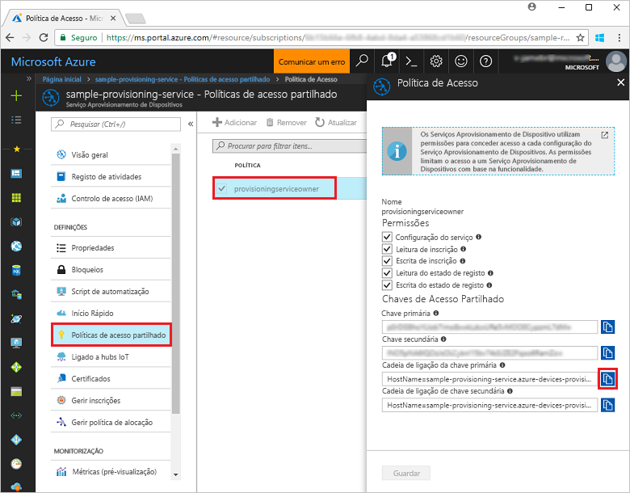
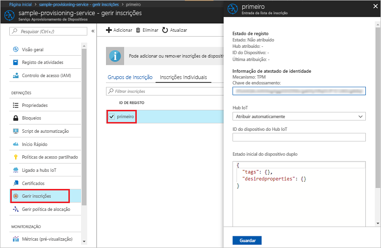

# <a name="quickstart-enroll-tpm-device-to-iot-hub-device-provisioning-service-using-nodejs-service-sdk"></a>Quickstart: Inscreva o dispositivo TPM no Serviço de Provisionamento de Dispositivos IoT Hub utilizando Node.js serviço SDK

[!INCLUDE [iot-dps-selector-quick-enroll-device-tpm](../../includes/iot-dps-selector-quick-enroll-device-tpm.md)]

Neste arranque rápido, cria programaticamente uma inscrição individual para um dispositivo TPM no Serviço de Provisionamento de Dispositivos Azure IoT Hub utilizando o Serviço de Serviço de Node.js SDK e uma aplicação Node.js de amostra. Opcionalmente, pode inscrever um dispositivo TPM simulado no serviço de aprovisionamento com esta entrada de inscrição individual.

## <a name="prerequisites"></a>Pré-requisitos

- Conclusão da [Configuração do Serviço de Provisionamento de Dispositivos IoT Hub com o portal Azure](./quick-setup-auto-provision.md).
- Uma conta Azure com uma subscrição ativa. [Crie um de graça.](https://azure.microsoft.com/free/?ref=microsoft.com&utm_source=microsoft.com&utm_medium=docs&utm_campaign=visualstudio)
- [Node.js v4.0+](https://nodejs.org). Este quickstart instala o [Node.js Service SDK](https://github.com/Azure/azure-iot-sdk-node) abaixo.
- Chave de endosso (opcional). Siga os passos na [Criação e forre um dispositivo simulado](quick-create-simulated-device.md) até obter a chave. Não crie uma inscrição individual utilizando o portal Azure.

## <a name="create-the-individual-enrollment-sample"></a>Criar o exemplo de inscrição individual 

 
1. A partir de uma janela de comando na sua pasta de trabalho, execute:
  
    ```cmd\sh
    npm install azure-iot-provisioning-service
    ```  

2. Com um editor de texto, crie um ficheiro **create_individual_enrollment.js** na sua pasta de trabalho. Adicione o seguinte código ao ficheiro e guarde:

    ```
    'use strict';

    var provisioningServiceClient = require('azure-iot-provisioning-service').ProvisioningServiceClient;

    var serviceClient = provisioningServiceClient.fromConnectionString(process.argv[2]);
    var endorsementKey = process.argv[3];

    var enrollment = {
      registrationId: 'first',
      attestation: {
        type: 'tpm',
        tpm: {
          endorsementKey: endorsementKey
        }
      }
    };

    serviceClient.createOrUpdateIndividualEnrollment(enrollment, function(err, enrollmentResponse) {
      if (err) {
        console.log('error creating the individual enrollment: ' + err);
      } else {
        console.log("enrollment record returned: " + JSON.stringify(enrollmentResponse, null, 2));
      }
    });
    ```

## <a name="run-the-individual-enrollment-sample"></a>Executar o exemplo de inscrição individual
  
1. Para executar o exemplo, precisa da cadeia de ligação para o seu serviço de aprovisionamento. 
    1. Inscreva-se no portal Azure, selecione o botão **Todos os recursos** no menu esquerdo e abra o serviço de Provisionamento de Dispositivos. 
    2. Selecione **políticas de acesso compartilhado** e, em seguida, selecione a política de acesso que pretende utilizar para abrir as suas propriedades. Na janela **Política de Acesso**, copie e tome nota da cadeia de ligação da chave primária. 

        


2. Também precisa da chave de endossamento para o seu dispositivo. Se seguiu o manual de início rápido [Criar e aprovisionar um dispositivo simulado](quick-create-simulated-device.md) para criar um dispositivo TPM simulado, utilize a chave criada para esse dispositivo. Caso contrário, para criar uma amostra de inscrição individual, pode utilizar a seguinte chave de averbamento fornecida com o [ serviço deNode.js SDK](https://github.com/Azure/azure-iot-sdk-node):

    ```
    AToAAQALAAMAsgAgg3GXZ0SEs/gakMyNRqXXJP1S124GUgtk8qHaGzMUaaoABgCAAEMAEAgAAAAAAAEAxsj2gUScTk1UjuioeTlfGYZrrimExB+bScH75adUMRIi2UOMxG1kw4y+9RW/IVoMl4e620VxZad0ARX2gUqVjYO7KPVt3dyKhZS3dkcvfBisBhP1XH9B33VqHG9SHnbnQXdBUaCgKAfxome8UmBKfe+naTsE5fkvjb/do3/dD6l4sGBwFCnKRdln4XpM03zLpoHFao8zOwt8l/uP3qUIxmCYv9A7m69Ms+5/pCkTu/rK4mRDsfhZ0QLfbzVI6zQFOKF/rwsfBtFeWlWtcuJMKlXdD8TXWElTzgh7JS4qhFzreL0c1mI0GCj+Aws0usZh7dLIVPnlgZcBhgy1SSDQMQ==
    ```

3. Para criar uma inscrição individual para o seu dispositivo TPM, execute o seguinte comando (inclua as aspas à volta dos argumentos do comando):
 
     ```cmd\sh
     node create_individual_enrollment.js "<the connection string for your provisioning service>" "<endorsement key>"
     ```
 
3. Após a criação com êxito, a janela de comando apresenta as propriedades da nova inscrição individual.

     

4. Verifique se foi criada uma inscrição individual. No portal do Azure, no painel de resumo do Serviço de Aprovisionamento de Dispositivos, selecione **Gerir inscrições**. Selecione o separador **Inscrições Individuais** e selecione a nova entrada de inscrição *(primeiro*) para verificar a chave de averbamento e outras propriedades para a entrada.

     
 
Agora que criou uma inscrição individual para um dispositivo TPM, se pretender inscrever um dispositivo simulado, pode continuar com os restantes passos em [Criar e aprovisionar um dispositivo simulado](quick-create-simulated-device.md). Certifique-se de saltar os passos para criar uma inscrição individual usando o portal Azure nesse arranque rápido.

## <a name="clean-up-resources"></a>Limpar os recursos
Se planeia explorar as amostras de serviço Node.js, não limpe os recursos criados neste arranque rápido. Se não pretender continuar, utilize os seguintes passos para eliminar todos os recursos criados por este arranque rápido.

1. Feche a janela da saída do exemplo de Node.js no seu computador.
1. Se criou um dispositivo TPM simulado, feche a janela do simulador TPM.
2. Navegue para o seu serviço de Provisionamento de Dispositivos no portal Azure, **selecione Gerir as inscrições** e, em seguida, selecione o separador **Inscrições Individuais.** Selecione a caixa de verificação ao lado do *ID de registo* para a entrada de inscrição que criou usando este arranque rápido e prima o botão **Eliminar** na parte superior do painel. 
 
## <a name="next-steps"></a>Passos seguintes
Neste arranque rápido, criou programáticamente uma entrada individual de inscrição para um dispositivo TPM e, opcionalmente, criou um dispositivo simulado TPM na sua máquina e forte-o para o seu hub IoT utilizando o Serviço de Provisionamento de Dispositivos Azure IoT Hub. Para ficar a conhecer aprofundadamente o aprovisionamento de dispositivos, prossiga no tutorial para a configuração do Serviço Aprovisionamento de Dispositivos no portal do Azure. 
 
> [!div class="nextstepaction"]
> [Azure IoT Hub Device Provisioning Service tutorials](./tutorial-set-up-cloud.md) (Tutoriais do Serviço Aprovisionamento de Dispositivos no Hub IoT do Azure)