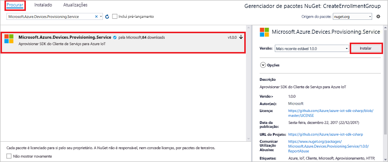

# <a name="quickstart-enroll-x509-devices-to-the-device-provisioning-service-using-c"></a>Início Rápido: Inscrever dispositivos X.509 no Serviço de Aprovisionamento de Dispositivos com C#

[!INCLUDE [iot-dps-selector-quick-enroll-device-x509](../../includes/iot-dps-selector-quick-enroll-device-x509.md)]

Este início rápido mostra como utilizar o C# para criar programaticamente um [Grupo de inscrição](concepts-service.md#enrollment-group) que utiliza certificados X.509 de AC de raiz ou intermediários. O grupo de inscrições é criado utilizando a aplicação [Microsoft Azure IoT SDK para .NET](https://github.com/Azure/azure-iot-sdk-csharp) e uma aplicação C# .NET Core. Um grupo de inscrição controla o acesso ao serviço de aprovisionamento de dispositivos que partilham um certificado de assinatura comum na respetiva cadeia de certificados. Para saber mais, veja [Controlar o acesso a dispositivos para o serviço de aprovisionamento com certificados X.509](./concepts-x509-attestation.md#controlling-device-access-to-the-provisioning-service-with-x509-certificates). Para obter mais informações sobre como utilizar a Infraestrutura de Chaves Públicas (PKI) baseada em certificados X.509 com o Hub IoT do Azure e o Serviço de Aprovisionamento de Dispositivos, veja [Descrição geral da segurança do certificado de AC X.509](../iot-hub/iot-hub-x509ca-overview.md). 

Este quickstart espera que já tenha criado um hub IoT e uma instância de Serviço de Provisionamento de Dispositivos. Se ainda não criou estes recursos, preencha o [Serviço de Provisionamento de Dispositivos IoT Hub com o portal Azure](./quick-setup-auto-provision.md) quickstart antes de continuar com este artigo.

Embora os passos neste artigo funcionem tanto em computadores Windows como Linux, este artigo utiliza um computador de desenvolvimento Windows.

[!INCLUDE [quickstarts-free-trial-note](../../includes/quickstarts-free-trial-note.md)]

## <a name="prerequisites"></a>Pré-requisitos

* Instalar [o Visual Studio 2019](https://www.visualstudio.com/vs/).
* Instale [.NET Core SDK](https://www.microsoft.com/net/download/windows).
* Instale [git](https://git-scm.com/download/).

## <a name="prepare-test-certificates"></a>Preparar os certificados de teste

Neste início rápido, precisa de ter um ficheiro .pem ou .cer com a parte pública de um certificado X.509 de AC de raiz ou intermediário. Este certificado tem de ser carregado para o serviço de aprovisionamento e verificado pelo serviço.

O [Azure IoT C SDK](https://github.com/Azure/azure-iot-sdk-c) contém ferramentas de teste que podem ajudá-lo a criar uma cadeia de certificados X.509, carregar uma raiz ou certificado intermédio dessa cadeia e fazer prova de posse com o serviço para verificar o certificado.

> [!CAUTION]
> Utilize certificados criados apenas com a ferramenta SDK para testes de desenvolvimento.
> Não utilize estes certificados em produção.
> Contêm senhas codificadas, como *1234,* que expiram após 30 dias.
> Para saber como obter certificados adequados para utilização de produção, veja [Como obter um certificado X.509 de AC](../iot-hub/iot-hub-x509ca-overview.md#how-to-get-an-x509-ca-certificate) na documentação do Hub IoT do Azure.
>

Para utilizar esta ferramenta de teste para gerar certificados, faça os seguintes passos:

1. Encontre o nome da etiqueta para a [última versão](https://github.com/Azure/azure-iot-sdk-c/releases/latest) do Azure IoT C SDK.

2. Abra uma linha de comandos ou shell do Git Bash e mude para uma pasta de trabalho no seu computador. Executar os seguintes comandos para clonar a mais recente versão do repositório [Azure IoT C SDK](https://github.com/Azure/azure-iot-sdk-c) GitHub. Utilize a etiqueta encontrada no passo anterior como o valor para o `-b` parâmetro:

    ```cmd/sh
    git clone -b <release-tag> https://github.com/Azure/azure-iot-sdk-c.git
    cd azure-iot-sdk-c
    git submodule update --init
    ```

    Esta operação deve demorar vários minutos a ser concluída.

   As ferramentas de teste estão localizada em *azure-iot-sdk-c/tools/CACertificates* do repositório que clonou.

3. Siga os passos em [Gerir certificados de AC de teste para exemplos e tutoriais](https://github.com/Azure/azure-iot-sdk-c/blob/master/tools/CACertificates/CACertificateOverview.md).

Para além da ferramenta no C SDK, a [amostra de verificação do certificado do Grupo](https://github.com/Azure-Samples/azure-iot-samples-csharp/tree/master/provisioning/Samples/service/GroupCertificateVerificationSample) no Microsoft *Azure IoT SDK para .NET* mostra como fazer o comprovativo de posse em C# com um certificado de CA intermédio ou raiz X.509 existente.

## <a name="get-the-connection-string-for-your-provisioning-service"></a>Obter a cadeia de ligação para o serviço de aprovisionamento

Para o exemplo neste início rápido, precisa da cadeia de ligação para o seu serviço de aprovisionamento.

1. Inscreva-se no portal Azure, selecione **Todos os recursos** e, em seguida, o seu Serviço de Provisionamento de Dispositivos.

1. Selecione **Políticas de acesso compartilhado** e, em seguida, escolha a política de acesso que pretende usar para abrir as suas propriedades. Na **Política de Acesso,** copie e guarde a cadeia de ligação da chave primária.

    

## <a name="create-the-enrollment-group-sample"></a>Criar o exemplo do grupo de inscrição 

Esta secção mostra como criar uma aplicação de consola .NET Core que adiciona um grupo de inscrição ao seu serviço de fornecimento. Com algumas modificações, também pode seguir estes passos para criar uma aplicação de consola [Windows IoT Core](https://developer.microsoft.com/en-us/windows/iot) para adicionar o grupo de inscrição. Para saber mais sobre como programar com o IoT Core, veja a [Documentação para programadores do Windows IoT Core](/windows/iot-core/).

1. Abra o Estúdio Visual e selecione **Criar um novo projeto.** In **Create a new project**, escolha a App consola **(.NET Core)** para o modelo de projeto C# e selecione **Next**.

1. Nomeie o projeto *CreateEnrollmentGroup* e, em seguida, prima **Criar**.

    

1. Quando a solução abrir no Estúdio Visual, no painel **Solution Explorer,** clique com o botão direito no projeto **CreateEnrollmentGroup** e, em seguida, selecione **Gerir pacotes NuGet**.

1. No **NuGet Package Manager**, selecione **Browse**, procure e escolha **Microsoft.Azure.Devices.Provisioning.Service** e, em seguida, prima **Instalar**.

    

   Este passo descarrega, instala e adiciona uma referência ao pacote SDK NuGet [do Serviço de Provisionamento Azure IoT](https://www.nuget.org/packages/Microsoft.Azure.Devices.Provisioning.Service/) e às suas dependências.

1. Adicione as `using` seguintes declarações após as outras `using` declarações no topo `Program.cs` de:

   ```csharp
   using System.Security.Cryptography.X509Certificates;
   using System.Threading.Tasks;
   using Microsoft.Azure.Devices.Provisioning.Service;
   ```

1. Adicione os seguintes campos à `Program` classe e faça as alterações listadas.  

   ```csharp
   private static string ProvisioningConnectionString = "{ProvisioningServiceConnectionString}";
   private static string EnrollmentGroupId = "enrollmentgrouptest";
   private static string X509RootCertPath = @"{Path to a .cer or .pem file for a verified root CA or intermediate CA X.509 certificate}";
   ```

   * Substitua o `ProvisioningServiceConnectionString` valor do espaço reservado pela cadeia de ligação do serviço de fornecimento para o quais pretende criar a inscrição.

   * Substitua o `X509RootCertPath` valor do espaço reservado pelo caminho para um ficheiro .pem ou .cer. Este ficheiro representa a parte pública de um certificado CA X.509 intermédio ou raiz que foi previamente carregado e verificado com o seu serviço de fornecimento.

   * Pode alterar opcionalmente o `EnrollmentGroupId` valor. A cadeia só pode conter carateres minúsculos e hífenes.

   > [!IMPORTANT]
   > No código de produção, tenha em atenção as seguintes considerações de segurança:
   >
   > * A pré-programação da cadeia de ligação para o administrador do serviço de aprovisionamento vai contra as melhores práticas de segurança. Em vez disso, a cadeia de ligação deve ser mantida de forma segura, tal como num ficheiro de configuração seguro ou no registo.
   > * Carregue apenas a parte pública do certificado de assinatura. Nunca carregue ficheiros .pfx (PKCS12) ou .pem que contêm chaves privadas para o serviço de aprovisionamento.

1. Adicione o seguinte método à `Program` classe. Este código cria uma entrada de grupo de inscrição e, em seguida, chama o `CreateOrUpdateEnrollmentGroupAsync` método para adicionar o grupo de `ProvisioningServiceClient` inscrição ao serviço de fornecimento.

   ```csharp
   public static async Task RunSample()
   {
       Console.WriteLine("Starting sample...");
 
       using (ProvisioningServiceClient provisioningServiceClient =
               ProvisioningServiceClient.CreateFromConnectionString(ProvisioningConnectionString))
       {
           #region Create a new enrollmentGroup config
           Console.WriteLine("\nCreating a new enrollmentGroup...");
           var certificate = new X509Certificate2(X509RootCertPath);
           Attestation attestation = X509Attestation.CreateFromRootCertificates(certificate);
           EnrollmentGroup enrollmentGroup =
                   new EnrollmentGroup(
                           EnrollmentGroupId,
                           attestation)
                   {
                       ProvisioningStatus = ProvisioningStatus.Enabled
                   };
           Console.WriteLine(enrollmentGroup);
           #endregion
 
           #region Create the enrollmentGroup
           Console.WriteLine("\nAdding new enrollmentGroup...");
           EnrollmentGroup enrollmentGroupResult =
               await provisioningServiceClient.CreateOrUpdateEnrollmentGroupAsync(enrollmentGroup).ConfigureAwait(false);
           Console.WriteLine("\nEnrollmentGroup created with success.");
           Console.WriteLine(enrollmentGroupResult);
           #endregion
 
       }
   }
   ```

1. Por último, substitua o `Main` método pelas seguintes linhas:

   ```csharp
    static async Task Main(string[] args)
    {
        await RunSample();
        Console.WriteLine("\nHit <Enter> to exit ...");
        Console.ReadLine();
    }
   ```

1. Compilar a solução.

## <a name="run-the-enrollment-group-sample"></a>Executar o exemplo do grupo de inscrição
  
Execute o exemplo no Visual Studio para criar o grupo de inscrição. Aparecerá uma janela de pedido de comando e começará a mostrar mensagens de confirmação. Na criação bem sucedida, a janela Command Prompt exibe as propriedades do novo grupo de inscrições.

Pode verificar se o grupo de inscrição foi criado. Vá ao resumo do Serviço de Provisionamento de Dispositivos e **selecione Gerir as inscrições,** em seguida, selecione **Grupos de Inscrição**. Deverá ver uma nova entrada de inscrição que corresponde ao ID de registo utilizado no exemplo.


Selecione a entrada para verificar a impressão digital do certificado e outras propriedades para a entrada.

## <a name="clean-up-resources"></a>Limpar os recursos

Se planeia explorar a amostra de serviço C#, não limpe os recursos criados neste arranque rápido. Caso contrário, utilize os seguintes passos para eliminar todos os recursos criados por este arranque rápido.

1. Feche a janela de saída da amostra C# no seu computador.

1. Navegue para o seu serviço de Provisionamento de Dispositivos no portal Azure, **selecione Gerir as inscrições** e, em seguida, selecione **Grupos de Inscrição**. Selecione o *ID de registo* para a entrada de inscrição que criou utilizando este arranque rápido e prima **Delete**.

1. A partir do seu serviço de Provisionamento de Dispositivos no portal Azure, selecione **Certificados,** escolha o certificado que carregou para este arranque rápido e prima **Apagar** no topo dos **Dados** do Certificado .  

## <a name="next-steps"></a>Passos seguintes

Neste quickstart, criou um grupo de inscrições para um certificado DE CA intermédio ou raiz X.509 utilizando o Serviço de Provisionamento de Dispositivos Azure IoT Hub. Para ficar a conhecer aprofundadamente o aprovisionamento de dispositivos, prossiga no tutorial para a configuração do Serviço Aprovisionamento de Dispositivos no portal do Azure.

> [!div class="nextstepaction"]
> [Azure IoT Hub Device Provisioning Service tutorials](./tutorial-set-up-cloud.md) (Tutoriais do Serviço Aprovisionamento de Dispositivos no Hub IoT do Azure)