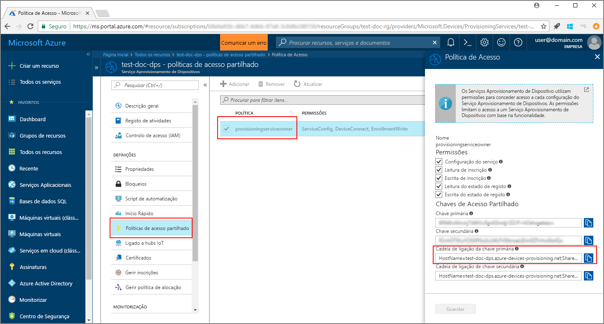
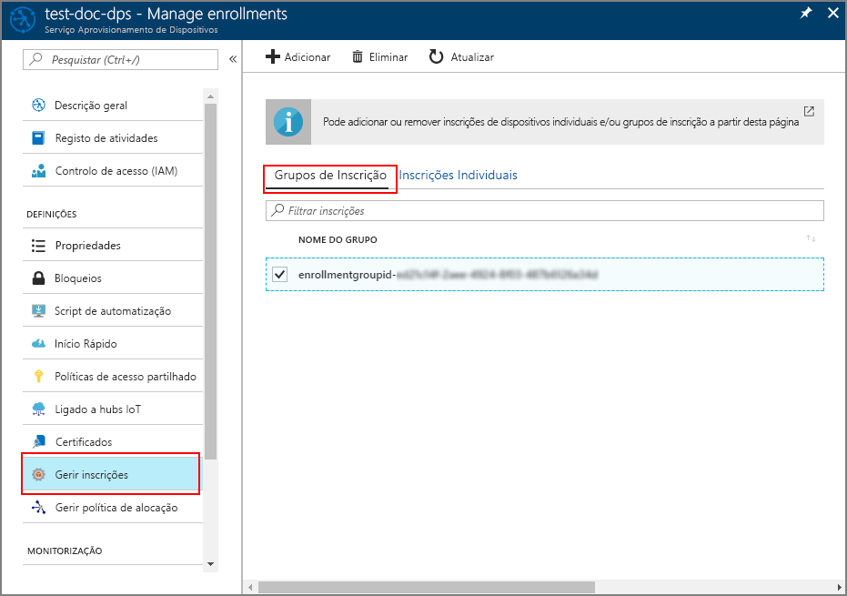

# <a name="quickstart-enroll-x509-devices-to-the-device-provisioning-service-using-java"></a>Início Rápido: Inscrever dispositivos X.509 no Serviço de Aprovisionamento de Dispositivos com Java

[!INCLUDE [iot-dps-selector-quick-enroll-device-x509](../../includes/iot-dps-selector-quick-enroll-device-x509.md)]

Neste arranque rápido, você usa Java para inscrever programáticamente um grupo de dispositivos simulados X.509 para o Serviço de Provisionamento de Dispositivos Azure IoT Hub. Os dispositivos são matriculados numa instância de serviço de prestação através da criação de um grupo de inscrição ou de uma inscrição individual. Este quickstart mostra como criar ambos os tipos de matrículas usando o Java Service SDK e uma aplicação Java de amostra.

## <a name="prerequisites"></a>Pré-requisitos

- Conclusão da [Configuração do Serviço de Provisionamento de Dispositivos IoT Hub com o portal Azure](./quick-setup-auto-provision.md).
- Uma conta Azure com uma subscrição ativa. [Crie um de graça.](https://azure.microsoft.com/free/?ref=microsoft.com&utm_source=microsoft.com&utm_medium=docs&utm_campaign=visualstudio)
- [Kit de Desenvolvimento Java SE 8](/azure/developer/java/fundamentals/java-jdk-long-term-support). Este quickstart instala o [Java Service SDK](https://azure.github.io/azure-iot-sdk-java/master/service/) abaixo. Funciona tanto no Windows como no Linux. Este arranque rápido utiliza o Windows.
- [Maven 3](https://maven.apache.org/download.cgi).
- [Git.](https://git-scm.com/download/)

<a id="javasample"></a>

## <a name="download-and-modify-the-java-sample-code"></a>Transferir e modificar o código de exemplo de Java

Esta secção utiliza um certificado X.509 autoassinado e é importante ter em consideração os seguintes pontos:

* Os certificados autoassinados são apenas para teste e não devem ser utilizados na produção.
* A data de expiração predefinida para um certificado autoassinado é de um ano.

Os passos seguintes mostram como adicionar os detalhes de aprovisionamento do seu dispositivo X.509 ao código de exemplo. 

1. Abra uma linha de comandos. Clone o repo GitHub para a amostra de código de inscrição do dispositivo utilizando o [Java Service SDK](https://azure.github.io/azure-iot-sdk-java/master/service/):
    
    ```cmd\sh
    git clone https://github.com/Azure/azure-iot-sdk-java.git --recursive
    ```

2. No código fonte transferido, navegue até à pasta de exemplo **_azure-iot-sdk-java/provisioning/provisioning-samples/service-enrollment-group-sample_**. Abra o ficheiro **_/src/main/java/samples/com/microsoft/azure/sdk/iot/ServiceEnrollmentGroupSample.java_** num editor à sua escolha e adicione os seguintes detalhes:

    1. Adicione `[Provisioning Connection String]` para o seu serviço de aprovisionamento, a partir do portal da seguinte forma:
        1. Navegue para o seu serviço de prestação no [portal Azure](https://portal.azure.com). 
        2. Abra as **Políticas de acesso partilhado** e selecione uma política que tenha a permissão *EnrollmentWrite*.
        3. Copie a **Cadeia de ligação da chave primária**. 

              

        4. No ficheiro de código de exemplo **_ServiceEnrollmentGroupSample.java_**, substitua a cadeia `[Provisioning Connection String]` pela **Cadeia de ligação da chave primária**.

            ```Java
            private static final String PROVISIONING_CONNECTION_STRING = "[Provisioning Connection String]";
            ```

    2. Adicione o certificado de raiz para o grupo de dispositivos. Se precisar de um certificado de raiz de exemplo, utilize a ferramenta _X.509 certificate generator_ da seguinte forma:
        1. Numa janela de comando, navegue até à pasta **_azure-iot-sdk-java/provisioning/provisioning-tools/provisioning-x509-cert-generator_**.
        2. Compile a ferramenta através da execução do seguinte comando:

            ```cmd\sh
            mvn clean install
            ```

        4. Execute a ferramenta com os comandos seguintes:

            ```cmd\sh
            cd target
            java -jar ./provisioning-x509-cert-generator-{version}-with-deps.jar
            ```

        5. Quando lhe for pedido, pode introduzir opcionalmente um _Nome Comum_ para os certificados.
        6. A ferramenta gera localmente um **Certificado de Cliente**, a **Chave Privada do Certificado de Cliente** e o **Certificado de Raiz**.
        7. Copie o **Certificado de Raiz**, incluindo as linhas **_-----BEGIN CERTIFICATE-----_** e **_-----END CERTIFICATE-----_**. 
        8. Atribua o valor do **Certificado de Raiz** ao parâmetro **PUBLIC_KEY_CERTIFICATE_STRING**, conforme apresentado abaixo:

            ```Java
            private static final String PUBLIC_KEY_CERTIFICATE_STRING =
            "-----BEGIN CERTIFICATE-----\n" +
            "XXXXXXXXXXXXXXXXXXXXXXXXXXXXXXXXXXXXXXXXXXXXXXXXXXXXXXXXXXXXXXXX\n" +
            "XXXXXXXXXXXXXXXXXXXXXXXXXXXXXXXXXXXXXXXXXXXXXXXXXXXXXXXXXXXXXXXX\n" +
            "XXXXXXXXXXXXXXXXXXXXXXXXXXXXXXXXXXXXXXXXXXXXXXXXXXXXXXXXXXXXXXXX\n" +
            "XXXXXXXXXXXXXXXXXXXXXXXXXXXXXXXXXXXXXXXXXXXXXXXXXXXXXXXXXXXXXXXX\n" +
            "XXXXXXXXXXXXXXXXXXXXXXXXXXXXXXXXXXXXXXXXXXXXXXXXXXXXXXXXXXXXXXXX\n" +
            "XXXXXXXXXXXXXXXXXXXXXXXXXXXXXXXXXXXXXXXXXXXXXXXXXXXXXXXXXXXXXXXX\n" +
            "XXXXXXXXXXXXXXXXXXXXXXXXXXXXXXXXXXXXXXXXXXXXXXXXXXXXXXXXXXXXXXXX\n" +
            "XXXXXXXXXXXXXXXXXXXXXXXXXXXXXXXXXXXXXXXXXXXXXXXXXXXXXXXXXXXXXXXX\n" +
            "XXXXXXXXXXXXXXXXXXXXXXXXXXXXXXXXXXXXXXXXXXXXXXXXXXXXXXXXXXXXXXXX\n" +
            "XXXXXXXXXXXXXXXXXXXXXXXXXXXXXXXXXXXXXXXXXXXXXXXXXXXXXXXXXXXXXXXX\n" +
            "-----END CERTIFICATE-----\n";
            ```

        9. Feche a janela de comando ou introduza **n** quando lhe for pedido um *Código de Verificação*. 
 
    3. Opcionalmente, pode configurar o seu serviço de aprovisionamento através do código de exemplo:
        - Para adicionar esta configuração ao exemplo, siga estes passos:
            1. Navegue até ao hub IoT ligado ao seu serviço de aprovisionamento no [portal do Azure](https://portal.azure.com). Abra o separador **Descrição geral** para o hub e copie o **Hostname**. Atribua este **Hostname** ao parâmetro *IOTHUB_HOST_NAME*.

                ```Java
                private static final String IOTHUB_HOST_NAME = "[Host name].azure-devices.net";
                ```
            2. Atribua um nome amigável ao parâmetro *DEVICE_ID* e mantenha o *PROVISIONING_STATUS* como o valor *ATIVADO* predefinido. 

        - OU, se optar por não configurar o serviço de aprovisionamento, certifique-se de que comenta ou elimina as seguintes instruções no ficheiro _ServiceEnrollmentGroupSample.java_:

            ```Java
            enrollmentGroup.setIotHubHostName(IOTHUB_HOST_NAME);                // Optional parameter.
            enrollmentGroup.setProvisioningStatus(ProvisioningStatus.ENABLED);  // Optional parameter.
            ```

    4. Estude o código de exemplo. Este cria, atualiza, consulta e elimina uma inscrição de grupo para dispositivos X.509. Para verificar a inscrição com êxito no portal, comente temporariamente as seguintes linhas de código no final do ficheiro _ServiceEnrollmentGroupSample.java_:

        ```Java
        // ************************************** Delete info of enrollmentGroup ***************************************
        System.out.println("\nDelete the enrollmentGroup...");
        provisioningServiceClient.deleteEnrollmentGroup(enrollmentGroupId);
        ```

    5. Guarde o ficheiro _ServiceEnrollmentGroupSample.java_. 
 

<a id="runjavasample"></a>

## <a name="build-and-run-sample-group-enrollment"></a>Compilar e executar a inscrição de grupo de exemplo

O Serviço Aprovisionamento de Dispositivos no IoT do Azure suporta dois tipos de inscrição:

- [Grupos de inscrição](concepts-service.md#enrollment-group): utilizados para inscrever vários dispositivos relacionados.
- [Matrículas individuais](concepts-service.md#individual-enrollment): Usado para inscrever um único dispositivo.

Este procedimento utiliza um grupo de inscrições. A secção seguinte usa uma inscrição individual.

1. Abra uma janela de comando e navegue até à pasta **_azure-iot-sdk-java/provisioning/provisioning-samples/service-enrollment-group-sample_**.

2. Compile o código de exemplo, utilizando este comando:

    ```cmd\sh
    mvn install -DskipTests
    ```

   Este comando descarrega o pacote Maven [`com.microsoft.azure.sdk.iot.provisioning.service`](https://mvnrepository.com/artifact/com.microsoft.azure.sdk.iot.provisioning/provisioning-service-client) para a sua máquina. Este pacote inclui os binários para o SDK do serviço Java, que o código de exemplo precisa de compilar. Se tiver executado a ferramenta _X.509 certificate generator_ na secção anterior, este pacote já estará transferido no seu computador. 

3. Execute o exemplo, utilizando estes comandos na janela de comando:

    ```cmd\sh
    cd target
    java -jar ./service-enrollment-group-sample-{version}-with-deps.jar
    ```

4. Observe a janela de saída para ver se a inscrição foi executada com êxito.

5. Navegue até ao serviço de aprovisionamento no portal do Azure. Clique em **Gerir inscrições**. Note que o seu grupo de dispositivos X.509 aparece no separador **Grupos de Inscrição,** com um *nome de grupo* autogerado . 

      

## <a name="modifications-to-enroll-a-single-x509-device"></a>Modificações para inscrever um dispositivo X.509 único

Para inscrever um dispositivo X.509 único, modifique o código de exemplo de *inscrição individual* utilizado em [Inscrever o dispositivo TPM no Serviço de Aprovisionamento de Dispositivos no Hub IoT com o SDK do serviço Java](quick-enroll-device-tpm-java.md#javasample) da seguinte forma:

1. Copie o *Nome Comum* do seu certificado de cliente X.509 para a área de transferência. Se pretender utilizar a ferramenta _X.509 certificate generator_ conforme apresentado na [secção do código de exemplo anterior](#javasample), introduza um _Nome Comum_ para o seu certificado ou utilize o **microsoftriotcore** predefinido. Utilize este **Nome Comum** como o valor para a variável *REGISTRATION_ID*. 

    ```Java
    // Use common name of your X.509 client certificate
    private static final String REGISTRATION_ID = "[RegistrationId]";
    ```

2. Mude o nome da variável *TPM_ENDORSEMENT_KEY* para *PUBLIC_KEY_CERTIFICATE_STRING*. Copie o certificado de cliente ou o **Client Cert** da saída da ferramenta _X.509 certificate generator_, como o valor para a variável *PUBLIC_KEY_CERTIFICATE_STRING*. 

    ```Java
    // Rename the variable *TPM_ENDORSEMENT_KEY* as *PUBLIC_KEY_CERTIFICATE_STRING*
    private static final String PUBLIC_KEY_CERTIFICATE_STRING =
            "-----BEGIN CERTIFICATE-----\n" +
            "XXXXXXXXXXXXXXXXXXXXXXXXXXXXXXXXXXXXXXXXXXXXXXXXXXXXXXXXXXXXXXXX\n" +
            "XXXXXXXXXXXXXXXXXXXXXXXXXXXXXXXXXXXXXXXXXXXXXXXXXXXXXXXXXXXXXXXX\n" +
            "XXXXXXXXXXXXXXXXXXXXXXXXXXXXXXXXXXXXXXXXXXXXXXXXXXXXXXXXXXXXXXXX\n" +
            "XXXXXXXXXXXXXXXXXXXXXXXXXXXXXXXXXXXXXXXXXXXXXXXXXXXXXXXXXXXXXXXX\n" +
            "XXXXXXXXXXXXXXXXXXXXXXXXXXXXXXXXXXXXXXXXXXXXXXXXXXXXXXXXXXXXXXXX\n" +
            "XXXXXXXXXXXXXXXXXXXXXXXXXXXXXXXXXXXXXXXXXXXXXXXXXXXXXXXXXXXXXXXX\n" +
            "XXXXXXXXXXXXXXXXXXXXXXXXXXXXXXXXXXXXXXXXXXXXXXXXXXXXXXXXXXXXXXXX\n" +
            "XXXXXXXXXXXXXXXXXXXXXXXXXXXXXXXXXXXXXXXXXXXXXXXXXXXXXXXXXXXXXXXX\n" +
            "XXXXXXXXXXXXXXXXXXXXXXXXXXXXXXXXXXXXXXXXXXXXXXXXXXXXXXXXXXXXXXXX\n" +
            "XXXXXXXXXXXXXXXXXXXXXXXXXXXXXXXXXXXXXXXXXXXXXXXXXXXXXXXXXXXXXXXX\n" +
            "-----END CERTIFICATE-----\n";
    ```
3. Na função **principal**, substitua a linha `Attestation attestation = new TpmAttestation(TPM_ENDORSEMENT_KEY);` pelo seguinte para utilizar o certificado de cliente X.509:
    ```Java
    Attestation attestation = X509Attestation.createFromClientCertificates(PUBLIC_KEY_CERTIFICATE_STRING);
    ```

4. Guarde, construa e execute o ficheiro de amostra *de inscrição individual,* utilizando os passos na secção [Construir e executar o código de amostra para inscrição individual](quick-enroll-device-tpm-java.md#runjavasample).


## <a name="clean-up-resources"></a>Limpar os recursos
Se planeia explorar a amostra de serviço java, não limpe os recursos criados neste quickstart. Se não pretender continuar, utilize os seguintes passos para eliminar todos os recursos criados por este arranque rápido.

1. Feche a janela da saída do exemplo de Java no seu computador.
1. Feche a janela do _X509 Cert Generator_ no seu computador.
1. Navegue para o seu serviço de Provisionamento de Dispositivos no portal Azure, **selecione Gerir as inscrições** e, em seguida, selecione o **separador Grupos de Inscrição.** Selecione a caixa de verificação ao lado do *NOME DE GRUPO* para os dispositivos X.509 que inscreveu com este arranque rápido e pressione o botão **Eliminar** na parte superior do painel.  

## <a name="next-steps"></a>Passos seguintes
Neste arranque rápido, inscreveu um grupo simulado de dispositivos X.509 no seu serviço de Provisionamento de Dispositivos. Para ficar a conhecer aprofundadamente o aprovisionamento de dispositivos, prossiga no tutorial para a configuração do Serviço Aprovisionamento de Dispositivos no portal do Azure. 

> [!div class="nextstepaction"]
> [Azure IoT Hub Device Provisioning Service tutorials](./tutorial-set-up-cloud.md) (Tutoriais do Serviço Aprovisionamento de Dispositivos no Hub IoT do Azure)