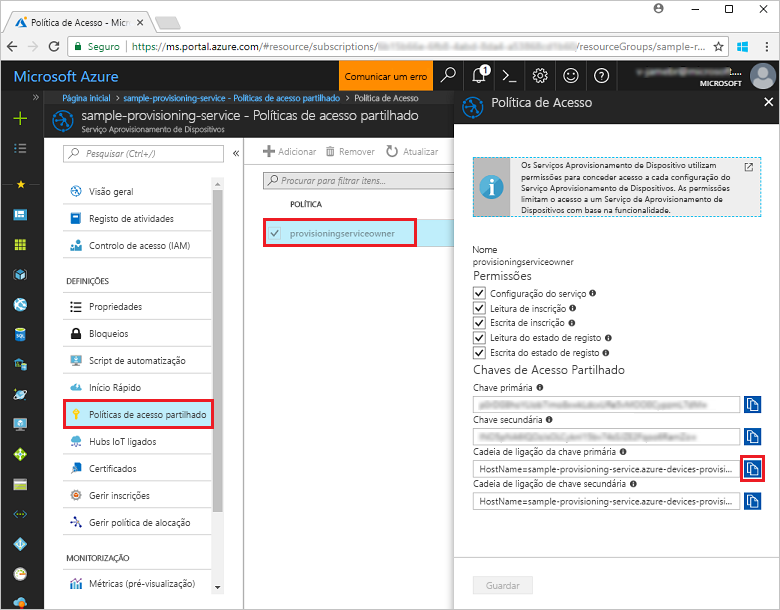
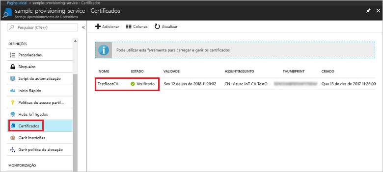
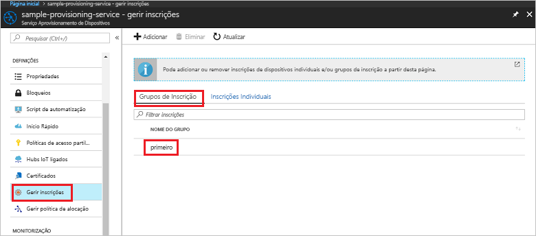

# <a name="quickstart-enroll-x509-devices-to-the-device-provisioning-service-using-nodejs"></a>Início Rápido: Inscrever dispositivos X.509 no Serviço de Aprovisionamento de Dispositivos com Node.js

[!INCLUDE [iot-dps-selector-quick-enroll-device-x509](../../includes/iot-dps-selector-quick-enroll-device-x509.md)]

Neste arranque rápido, você usa Node.js para criar programáticamente um grupo de inscrição que usa certificados CA X.509 intermédios ou raiz. O grupo de inscrição é criado com o SDK de IoT para Node.js e uma aplicação Node.js de exemplo.

## <a name="prerequisites"></a>Pré-requisitos

- Conclusão da [Configuração do Serviço de Provisionamento de Dispositivos IoT Hub com o portal Azure](./quick-setup-auto-provision.md).
- Uma conta Azure com uma subscrição ativa. [Crie um de graça.](https://azure.microsoft.com/free/?ref=microsoft.com&utm_source=microsoft.com&utm_medium=docs&utm_campaign=visualstudio)
- [Node.js v4.0+](https://nodejs.org). Este quickstart instala o [IoT SDK para Node.js](https://github.com/Azure/azure-iot-sdk-node) abaixo.
- [Git.](https://git-scm.com/download/)
- [Azure IoT C SDK](https://github.com/Azure/azure-iot-sdk-c).

## <a name="prepare-test-certificates"></a>Preparar os certificados de teste

Neste início rápido, precisa de ter um ficheiro .pem ou .cer com a parte pública de um certificado X.509 de AC de raiz ou intermediário. Este certificado tem de ser carregado para o serviço de aprovisionamento e verificado pelo serviço.

Para obter mais informações sobre como utilizar a Infraestrutura de Chaves Públicas (PKI) baseada em certificados X.509 com o Hub IoT do Azure e o Serviço de Aprovisionamento de Dispositivos, veja [Descrição geral da segurança do certificado de AC X.509](../iot-hub/iot-hub-x509ca-overview.md).

O [SDK de C do IoT do Azure](https://github.com/Azure/azure-iot-sdk-c) contém as ferramentas de teste que podem ajudar a criar uma cadeia de certificados X.509, carregar um certificado de raiz ou intermediário dessa cadeia e realizar uma prova de posse com o serviço para verificar o certificado. Os certificados criados com as ferramentas do SDK foram concebidos para utilização **apenas para testes de desenvolvimento**. Estes certificados **não podem ser utilizados em produção**. Contêm palavras-passe hard-coded ("1234") que expiram após 30 dias. Para saber como obter certificados adequados para utilização de produção, veja [Como obter um certificado X.509 de AC](../iot-hub/iot-hub-x509ca-overview.md#how-to-get-an-x509-ca-certificate) na documentação do Hub IoT do Azure.

Para utilizar estas ferramentas de teste para gerar certificados, execute os seguintes passos:
 
1. Encontre o nome da etiqueta para a [última versão](https://github.com/Azure/azure-iot-sdk-c/releases/latest) do Azure IoT C SDK.

2. Abra uma linha de comandos ou shell do Git Bash e mude para uma pasta de trabalho no seu computador. Executar os seguintes comandos para clonar a mais recente versão do repositório [Azure IoT C SDK](https://github.com/Azure/azure-iot-sdk-c) GitHub. Utilize a etiqueta encontrada no passo anterior como o valor para o `-b` parâmetro:

    ```cmd/sh
    git clone -b <release-tag> https://github.com/Azure/azure-iot-sdk-c.git
    cd azure-iot-sdk-c
    git submodule update --init
    ```

    Esta operação deve demorar vários minutos a ser concluída.

   As ferramentas de teste estão localizada em *azure-iot-sdk-c/tools/CACertificates* do repositório que clonou.

3. Siga os passos em [Gerir certificados de AC de teste para exemplos e tutoriais](https://github.com/Azure/azure-iot-sdk-c/blob/master/tools/CACertificates/CACertificateOverview.md). 


## <a name="create-the-enrollment-group-sample"></a>Criar o exemplo do grupo de inscrição 

O Serviço Aprovisionamento de Dispositivos no IoT do Azure suporta dois tipos de inscrição:

- [Grupos de inscrição](concepts-service.md#enrollment-group): utilizados para inscrever vários dispositivos relacionados.
- [Matrículas individuais](concepts-service.md#individual-enrollment): Usado para inscrever um único dispositivo.

Um grupo de inscrição controla o acesso ao serviço de aprovisionamento de dispositivos que partilham um certificado de assinatura comum na respetiva cadeia de certificados. Para saber mais, veja [Controlar o acesso a dispositivos para o serviço de aprovisionamento com certificados X.509](./concepts-x509-attestation.md#controlling-device-access-to-the-provisioning-service-with-x509-certificates).
 
1. A partir de uma janela de comando na sua pasta de trabalho, execute:
  
     ```cmd\sh
     npm install azure-iot-provisioning-service
     ```  

2. Com um editor de texto, crie um ficheiro **create_enrollment_group.js** na sua pasta de trabalho. Adicione o seguinte código ao ficheiro e guarde:

    ```
    'use strict';
    var fs = require('fs');

    var provisioningServiceClient = require('azure-iot-provisioning-service').ProvisioningServiceClient;

    var serviceClient = provisioningServiceClient.fromConnectionString(process.argv[2]);

    var enrollment = {
      enrollmentGroupId: 'first',
      attestation: {
        type: 'x509',
        x509: {
          signingCertificates: {
            primary: {
              certificate: fs.readFileSync(process.argv[3], 'utf-8').toString()
            }
          }
        }
      },
      provisioningStatus: 'disabled'
    };

    serviceClient.createOrUpdateEnrollmentGroup(enrollment, function(err, enrollmentResponse) {
      if (err) {
        console.log('error creating the group enrollment: ' + err);
      } else {
        console.log("enrollment record returned: " + JSON.stringify(enrollmentResponse, null, 2));
        enrollmentResponse.provisioningStatus = 'enabled';
        serviceClient.createOrUpdateEnrollmentGroup(enrollmentResponse, function(err, enrollmentResponse) {
          if (err) {
            console.log('error updating the group enrollment: ' + err);
          } else {
            console.log("updated enrollment record returned: " + JSON.stringify(enrollmentResponse, null, 2));
          }
        });
      }
    });
    ```

## <a name="run-the-enrollment-group-sample"></a>Executar o exemplo do grupo de inscrição
 
1. Para executar o exemplo, precisa da cadeia de ligação para o seu serviço de aprovisionamento. 
    1. Inscreva-se no portal Azure, selecione o botão **Todos os recursos** no menu esquerdo e abra o serviço de Provisionamento de Dispositivos. 
    2. Clique **em Políticas de acesso Compartilhado** e, em seguida, selecione a política de acesso que pretende utilizar para abrir as suas propriedades. Na janela **Política de Acesso**, copie e tome nota da cadeia de ligação da chave primária. 

        


3. Conforme indicado em [Preparar os certificados de teste](quick-enroll-device-x509-node.md#prepare-test-certificates), também precisa de um ficheiro .pem com um certificado X.509 de AC de raiz ou intermediário que foi anteriormente carregado e verificado com o serviço de aprovisionamento. Para verificar se o seu certificado foi carregado e verificado, na página de resumo do Serviço de Provisionamento de Dispositivos no portal Azure, selecione **Certificados**. Encontre o certificado que pretende utilizar para a inscrição do grupo e certifique-se de que o valor do estado é *verificado*.

     

1. Para criar um [grupo de inscrição](concepts-service.md#enrollment-group) para o seu certificado, executar o seguinte comando (incluir as cotações em torno dos argumentos de comando):
 
     ```cmd\sh
     node create_enrollment_group.js "<the connection string for your provisioning service>" "<your certificate's .pem file>"
     ```
 
3. Após a criação com êxito, a janela de comando apresenta as propriedades do novo grupo de inscrição.

     

4. Certifique-se de que o grupo de inscrição foi criado. No portal do Azure, no painel de resumo do Serviço de Aprovisionamento de Dispositivos, selecione **Gerir inscrições**. Selecione o separador **Grupos de Inscrição** e certifique-se de que a nova entrada de inscrição (*primeiro*) está presente.

     
 
## <a name="clean-up-resources"></a>Limpar os recursos
Se planeia explorar as amostras de serviço Node.js, não limpe os recursos criados neste arranque rápido. Se não pretender continuar, utilize os seguintes passos para eliminar todos os recursos Azure criados por este arranque rápido.
 
1. Feche a janela da saída do exemplo de Node.js no seu computador.
2. Navegue para o seu serviço de Provisionamento de Dispositivos no portal Azure, **selecione Gerir as inscrições** e, em seguida, selecione o **separador Grupos de Inscrição.** Selecione a caixa de verificação ao lado do *NOME DE GRUPO* para os dispositivos X.509 que inscreveu com este arranque rápido e pressione o botão **Eliminar** na parte superior do painel.    
3. A partir do seu serviço de Provisionamento de Dispositivos no portal Azure, selecione **Certificados,** selecione o certificado que carregou para este arranque rápido e pressione o botão **Eliminar** na parte superior da janela Detalhes do **Certificado.**  
 
## <a name="next-steps"></a>Passos seguintes

Neste quickstart, criou uma inscrição em grupo para um certificado de CA intermédio ou raiz X.509 utilizando o Serviço de Provisionamento de Dispositivos Azure IoT Hub. Para ficar a conhecer aprofundadamente o aprovisionamento de dispositivos, prossiga no tutorial para a configuração do Serviço Aprovisionamento de Dispositivos no portal do Azure. 

Consulte também a [ amostra de a provisionamento](https://github.com/Azure/azure-iot-sdk-node/tree/master/provisioning/device/samples)do dispositivoNode.js .
 
> [!div class="nextstepaction"]
> [Azure IoT Hub Device Provisioning Service tutorials](./tutorial-set-up-cloud.md) (Tutoriais do Serviço Aprovisionamento de Dispositivos no Hub IoT do Azure)