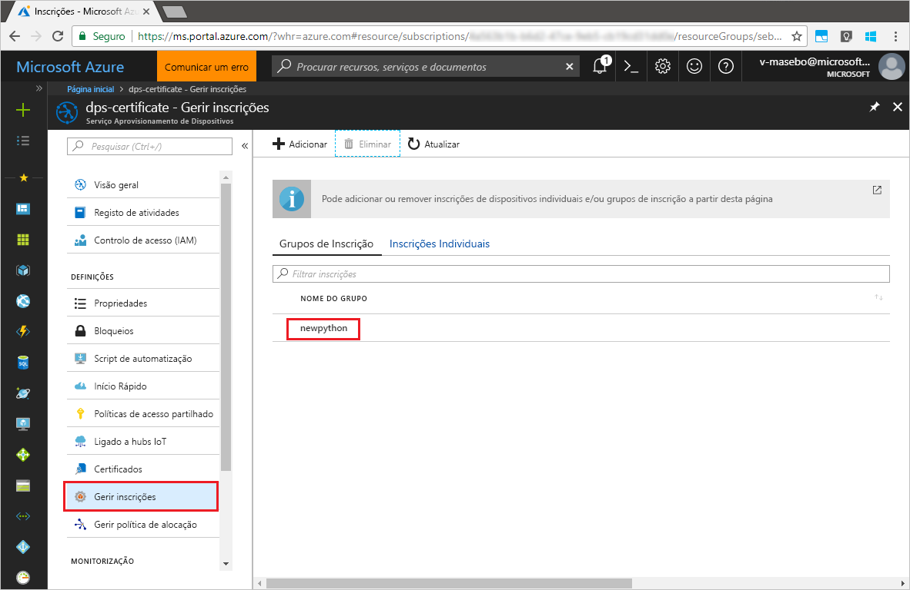

# <a name="quickstart-enroll-x509-devices-to-the-device-provisioning-service-using-python"></a>Início Rápido: Inscrever dispositivos X.509 no Serviço de Aprovisionamento de Dispositivos com Python

[!INCLUDE [iot-dps-selector-quick-enroll-device-x509](../../includes/iot-dps-selector-quick-enroll-device-x509.md)]

Neste arranque rápido, você usa Python para criar programáticamente um grupo de inscrição que usa certificados CA X.509 intermédios ou raiz. Um grupo de inscrição controla o acesso ao serviço de aprovisionamento de dispositivos que partilham um certificado de assinatura comum na respetiva cadeia de certificados. O grupo de inscrição é criado com o SDK do Serviço de Aprovisionamento Python e uma aplicação Python de exemplo.

## <a name="prerequisites"></a>Pré-requisitos

- Conclusão da [Configuração do Serviço de Provisionamento de Dispositivos IoT Hub com o portal Azure](./quick-setup-auto-provision.md).
- Uma conta Azure com uma subscrição ativa. [Crie um de graça.](https://azure.microsoft.com/free/?ref=microsoft.com&utm_source=microsoft.com&utm_medium=docs&utm_campaign=visualstudio)
- [Python 2.x ou 3.x](https://www.python.org/downloads/). Adicione Python às variáveis ambientais específicas da sua plataforma. Este quickstart instala o [Serviço de Provisionamento Python SDK](https://github.com/Azure/azure-iot-sdk-python/tree/v1-deprecated/provisioning_service_client) abaixo.
- [Pip,](https://pip.pypa.io/en/stable/installing/)se não estiver incluído com a sua distribuição de Python.
- [Git.](https://git-scm.com/download/)

> [!IMPORTANT]
> Este artigo aplica-se apenas ao V1 Python SDK precedido. Os clientes de dispositivos e serviços para o Serviço de Provisionamento de Dispositivos IoT Hub ainda não estão disponíveis em V2. A equipa está neste momento a trabalhar arduamente para trazer a V2 para apresentar paridade.

## <a name="prepare-test-certificates"></a>Preparar os certificados de teste

Neste início rápido, precisa de ter um ficheiro .pem ou .cer com a parte pública de um certificado X.509 de AC de raiz ou intermediário. Este certificado tem de ser carregado para o serviço de aprovisionamento e verificado pelo serviço.

Para obter mais informações sobre como utilizar a Infraestrutura de Chaves Públicas (PKI) baseada em certificados X.509 com o Hub IoT do Azure e o Serviço de Aprovisionamento de Dispositivos, veja [Descrição geral da segurança do certificado de AC X.509](../iot-hub/iot-hub-x509ca-overview.md).

O [SDK de C do IoT do Azure](https://github.com/Azure/azure-iot-sdk-c) contém as ferramentas de teste que podem ajudar a criar uma cadeia de certificados X.509, carregar um certificado de raiz ou intermediário dessa cadeia e realizar uma prova de posse com o serviço para verificar o certificado. Os certificados criados com as ferramentas do SDK foram concebidos para utilização **apenas para testes de desenvolvimento**. Estes certificados **não podem ser utilizados em produção**. Contêm palavras-passe hard-coded ("1234") que expiram após 30 dias. Para saber como obter certificados adequados para utilização de produção, veja [Como obter um certificado X.509 de AC](../iot-hub/iot-hub-x509ca-overview.md#how-to-get-an-x509-ca-certificate) na documentação do Hub IoT do Azure.

Para utilizar estas ferramentas de teste para gerar certificados, execute os seguintes passos:

1. Encontre o nome da etiqueta para a [última versão](https://github.com/Azure/azure-iot-sdk-c/releases/latest) do Azure IoT C SDK.

2. Abra uma linha de comandos ou shell do Git Bash e mude para uma pasta de trabalho no seu computador. Executar os seguintes comandos para clonar a mais recente versão do repositório [Azure IoT C SDK](https://github.com/Azure/azure-iot-sdk-c) GitHub. Utilize a etiqueta encontrada no passo anterior como o valor para o `-b` parâmetro:

    ```cmd/sh
    git clone -b <release-tag> https://github.com/Azure/azure-iot-sdk-c.git
    cd azure-iot-sdk-c
    git submodule update --init
    ```

    Esta operação deve demorar vários minutos a ser concluída.

   As ferramentas de teste estão localizada em *azure-iot-sdk-c/tools/CACertificates* do repositório que clonou.

3. Siga os passos em [Gerir certificados de AC de teste para exemplos e tutoriais](https://github.com/Azure/azure-iot-sdk-c/blob/master/tools/CACertificates/CACertificateOverview.md). 

## <a name="modify-the-python-sample-code"></a>Modificar o código de exemplo do Python

Esta secção mostra como adicionar os detalhes de aprovisionamento do seu dispositivo X.509 ao código de exemplo. 

1. Num editor de texto, crie um novo ficheiro **EnrollmentGroup.py**.

1. Adicione as seguintes `import` afirmações e variáveis no início do ficheiro **EnrollmentGroup.py**. Em seguida, `dpsConnectionString` substitua a sua cadeia de ligação encontrada nas **políticas de acesso partilhado** no seu Serviço de **Provisionamento de Dispositivos** no **portal Azure**. Substitua o marcador de posição do certificado pelo certificado criado anteriormente em [Preparar os certificados de teste](quick-enroll-device-x509-python.md#prepare-test-certificates). Por fim, crie um `registrationid` exclusivo e certifique-se de que este consiste apenas em carateres alfanuméricos em minúsculas e hífenes.  
   
    ```python
    from provisioningserviceclient import ProvisioningServiceClient
    from provisioningserviceclient.models import EnrollmentGroup, AttestationMechanism

    CONNECTION_STRING = "{dpsConnectionString}"

    SIGNING_CERT = """-----BEGIN CERTIFICATE-----
    XXXXXXXXXXXXXXXXXXXXXXXXXXXXXXXXXXXXXXXXXXXXXXXXXXXXXXXXXXXXXXXX
    XXXXXXXXXXXXXXXXXXXXXXXXXXXXXXXXXXXXXXXXXXXXXXXXXXXXXXXXXXXXXXXX
    XXXXXXXXXXXXXXXXXXXXXXXXXXXXXXXXXXXXXXXXXXXXXXXXXXXXXXXXXXXXXXXX
    XXXXXXXXXXXXXXXXXXXXXXXXXXXXXXXXXXXXXXXXXXXXXXXXXXXXXXXXXXXXXXXX
    XXXXXXXXXXXXXXXXXXXXXXXXXXXXXXXXXXXXXXXXXXXXXXXXXXXXXXXXXXXXXXXX
    XXXXXXXXXXXXXXXXXXXXXXXXXXXXXXXXXXXXXXXXXXXXXXXXXXXXXXXXXXXXXXXX
    XXXXXXXXXXXXXXXXXXXXXXXXXXXXXXXXXXXXXXXXXXXXXXXXXXXXXXXXXXXXXXXX
    XXXXXXXXXXXXXXXXXXXXXXXXXXXXXXXXXXXXXXXXXXXXXXXXXXXXXXXXXXXXXXXX
    XXXXXXXXXXXXXXXXXXXXXXXXXXXXXXXXXXXXXXXXXXXXXXXXXXXXXXXXXXXXXXXX
    XXXXXXXXXXXXXXXXXXXXXXXXXXXXXXXXXXXXXXXXXXXXXXXXXXXXXXXXXXXXXXXX
    XXXXXXXXXXXXXXXXXXXXXXXXXXXXXXXXXXXXXXXXXXXXXXXXXXXXXXXXXXXXXXXX
    XXXXXXXXXXXXXXXXXXXXXXXXXXXXXXXXXXXXXXXXXXXXXXXXXXXXXXXXXXXXXXXX
    XXXXXXXXXXXXXXXXXXXXXXXXXXXXXXXXXXXXXXXXXXXXXXXXXXXXXXXXXXXXXXXX
    XXXXXXXXXXXXXXXXXXXXXXXXXXXXXXXXXXXXXXXXXXXXXXXXXXXXXXXXXXXXXXXX
    XXXXXXXXXXXXXXXXXXXXXXXXXXXXXXXXXXXXXXXXXXXXXXXXXXXXXXXX
    -----END CERTIFICATE-----"""

    GROUP_ID = "{registrationid}"
    ```

1. Adicione a seguinte função e chamada de função para implementar a criação de inscrição em grupos:
   
    ```python
    def main():
        print ( "Initiating enrollment group creation..." )

        psc = ProvisioningServiceClient.create_from_connection_string(CONNECTION_STRING)
        att = AttestationMechanism.create_with_x509_signing_certs(SIGNING_CERT)
        eg = EnrollmentGroup.create(GROUP_ID, att)

        eg = psc.create_or_update(eg)
    
        print ( "Enrollment group created." )

    if __name__ == '__main__':
        main()
    ```

1. Guarde e feche o ficheiro **EnrollmentGroup.py**.
 

## <a name="run-the-sample-group-enrollment"></a>Executar a inscrição de grupo de exemplo

O Serviço Aprovisionamento de Dispositivos no IoT do Azure suporta dois tipos de inscrição:

- [Grupos de inscrição](concepts-service.md#enrollment-group): utilizados para inscrever vários dispositivos relacionados.
- [Matrículas individuais](concepts-service.md#individual-enrollment): Usado para inscrever um único dispositivo.

A criação de inscrições Individuais através do 7[SDK do Serviço de Aprovisionamento Python](https://github.com/Azure/azure-iot-sdk-python/tree/v1-deprecated/provisioning_service_client) é ainda um trabalho em curso. Para saber mais, veja [Controlar o acesso a dispositivos para o serviço de aprovisionamento com certificados X.509](./concepts-x509-attestation.md#controlling-device-access-to-the-provisioning-service-with-x509-certificates).

1. Abra uma linha de comandos e execute o seguinte comando para instalar o [azure-iot-provisioning-device-client](https://pypi.org/project/azure-iot-provisioning-device-client).

    ```cmd/sh
    pip install azure-iothub-provisioningserviceclient    
    ```

2. Na linha de comandos, execute o script.

    ```cmd/sh
    python EnrollmentGroup.py
    ```

3. Observe a saída para ver se a inscrição foi executada com êxito.

4. Navegue até ao serviço de aprovisionamento no portal do Azure. Clique em **Gerir inscrições**. Repare que o seu grupo de dispositivos X.509 é apresentado no separador **Grupos de Inscrição**, com o nome `registrationid` criado anteriormente. 

      


## <a name="clean-up-resources"></a>Limpar os recursos
Se planeia explorar a amostra de serviço java, não limpe os recursos criados neste quickstart. Se não pretender continuar, utilize os seguintes passos para eliminar todos os recursos criados por este arranque rápido.

1. Feche a janela da saída do exemplo de Java no seu computador.
1. Feche a janela do _X509 Cert Generator_ no seu computador.
1. Navegue para o seu serviço de Provisionamento de Dispositivos no portal Azure, **selecione Gerir as inscrições** e, em seguida, selecione o **separador Grupos de Inscrição.** Selecione a caixa de verificação ao lado do *NOME DE GRUPO* para os dispositivos X.509 que inscreveu com este arranque rápido e pressione o botão **Eliminar** na parte superior do painel.    


## <a name="next-steps"></a>Passos seguintes
Neste arranque rápido, inscreveu um grupo simulado de dispositivos X.509 no seu serviço de Provisionamento de Dispositivos. Para ficar a conhecer aprofundadamente o aprovisionamento de dispositivos, prossiga no tutorial para a configuração do Serviço Aprovisionamento de Dispositivos no portal do Azure. 

> [!div class="nextstepaction"]
> [Azure IoT Hub Device Provisioning Service tutorials](./tutorial-set-up-cloud.md) (Tutoriais do Serviço Aprovisionamento de Dispositivos no Hub IoT do Azure)