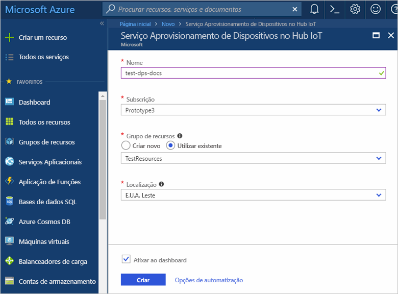
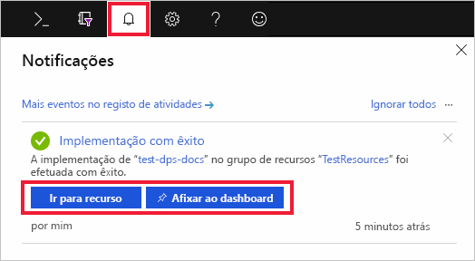
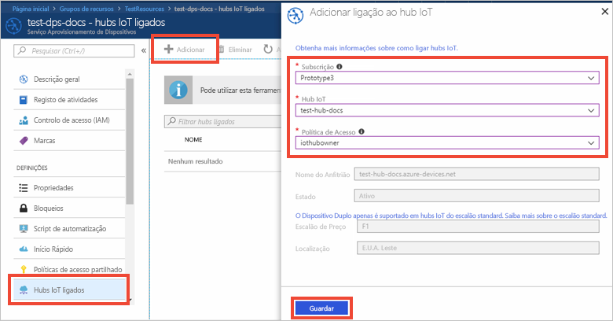

# Quickstart: Crie o serviço de provisionamento de dispositivos IoT Hub com o portal Azure

O Serviço de Provisionamento de Dispositivos IoT Hub pode ser utilizado com o IoT Hub para permitir o fornecimento de zero toques, just-in-time ao pretendido hub IoT sem necessidade de intervenção humana, permitindo aos clientes o fornecimento de milhões de dispositivos IoT de forma segura e escalável. O Serviço de Provisionamento de Dispositivos Azure IoT Hub suporta dispositivos IoT com TPM, chave simétrica e autenticações de certificadoS X.509. Para mais informações, consulte a [visão geral do Serviço de Fornecimento de Dispositivos IoT Hub](./about-iot-dps.md)

Neste arranque rápido, você aprenderá a configurar o Serviço de Provisionamento de Dispositivos IoT Hub no Portal Azure para o fornecimento dos seus dispositivos com os seguintes passos:

* Use o portal Azure para criar um Hub IoT
* Utilizar o portal do Azure para criar um Serviço Aprovisionamento de Dispositivos no Hub IoT e obter o âmbito do ID
* Ligar o hub IoT ao Serviço Aprovisionamento de Dispositivos

## Pré-requisitos

Você precisará de uma assinatura Azure para começar com este artigo. Pode criar uma [conta gratuita,](https://azure.microsoft.com/free/?WT.mc_id=A261C142F)se ainda não o fez.

## Criar um hub IoT

[!INCLUDE [iot-hub-include-create-hub](../../includes/iot-hub-include-create-hub.md)]

## Criar um novo serviço de provisionamento de dispositivos IoT Hub

1. Selecione o + Volte a criar um botão **de recurso.**

2. *Pesse no Mercado* pelo **Serviço de Provisionamento de Dispositivos.** Selecione **o serviço de provisionamento do dispositivo IoT Hub** e acerte no botão **Criar.** 

3. Forneça as seguintes informações sobre a sua nova instância de Serviço de Provisionamento de Dispositivos e acerte **criar**.

    * **Nome:** Forneça um nome único para a sua nova instância de Serviço de Provisionamento de Dispositivos. Se o nome introduzido estiver disponível, aparece uma marca de verificação verde.
    * **Assinatura:** Escolha a subscrição que pretende utilizar para criar esta instância de Serviço de Provisionamento de Dispositivos.
    * **Grupo de recursos**: este campo permite criar um novo grupo de recursos ou selecionar um já existente para conter a nova instância. Selecione o mesmo grupo de recursos que contém o hub Iot que criou acima, por exemplo, **TestResources**. Ao colocar todos os recursos relacionados num grupo, pode geri-los em conjunto. Por exemplo, eliminar o grupo de recursos elimina todos os recursos que se encontram nesse grupo. Para obter mais informações, consulte os grupos de [recursos Do Gestor de Recursos Azure.](../azure-resource-manager/management/manage-resource-groups-portal.md)
    * **Localização:** Selecione a localização mais próxima dos seus dispositivos.

        

4. Selecione o botão de notificação para monitorizar a criação da instância de recursos. Uma vez que o serviço seja implementado com sucesso, selecione **Pin para painel de instrumentos**, e, em seguida, vá para o **recurso**.

    

## Ligue o hub IoT e o seu serviço de fornecimento de dispositivos

Nesta secção, irá adicionar uma configuração à instância do Serviço de Provisionamento de Dispositivos. Esta configuração define o hub IoT para o qual os dispositivos serão aprovisionados.

1. Selecione o botão **Todos os recursos** a partir do menu à esquerda do portal Azure. Selecione a instância do Serviço Aprovisionamento de Dispositivos que criou na secção anterior. 

    Se o seu menu estiver configurado usando **Flyout** em vez do modo **Docked** nas definições do portal, terá de clicar nas 3 linhas da parte superior esquerda para abrir o menu do portal à esquerda.  

2. A partir do menu do Serviço de Provisionamento de Dispositivos, selecione **os hubs Linked IoT**. Acerte no botão **+ Adicionar** visto na parte superior. 

3. Na página do **link Add para ioT,** forneça as seguintes informações para ligar a sua nova instância do Serviço de Provisionamento de Dispositivos a um hub IoT. Em seguida, bata **em Save**. 

    * **Assinatura:** Selecione a subscrição que contém o hub IoT que pretende ligar com a sua nova instância do Serviço de Provisionamento de Dispositivos.
    * **Hub iot:** Selecione o hub IoT para ligar com a sua nova instância de Serviço de Provisionamento de Dispositivos.
    * **Política de Acesso**: selecione **iothubowner** como as credenciais para estabelecer a ligação ao hub IoT.  

        

3. Agora, deverá ver o hub selecionado no painel **Hubs IoT ligados**. Talvez precises de ir ao **Refresh** para que apareça.

## Limpar os recursos

Outros guias de introdução desta coleção têm por base este guia de introdução. Se pretender continuar a trabalhar com guias de introdução subsequentes ou com os tutoriais, não limpe os recursos criados neste guia de introdução. Se não pretender continuar, utilize os passos seguintes para eliminar todos os recursos criados por este guia de introdução no portal do Azure.

1. A partir do menu à esquerda no portal Azure, selecione **Todos os recursos** e, em seguida, selecione o seu Serviço de Provisionamento de Dispositivos. Na parte superior do painel de detalhes do dispositivo, **selecione Delete**.  
2. A partir do menu à esquerda no portal Azure, selecione **Todos os recursos** e, em seguida, selecione o seu hub IoT. Na parte superior do painel de detalhes do cubo, **selecione Delete**.  

## Passos seguintes

Neste quickstart, você implantou um hub IoT e uma instância de Serviço de Provisionamento de Dispositivos, e ligou os dois recursos. Para aprender a usar esta configuração para forrá um dispositivo simulado, continue até ao início rápido para criar um dispositivo simulado.

> [!div class="nextstepaction"]
> [Quickstart para criar um dispositivo simulado](./quick-create-simulated-device-symm-key.md)
