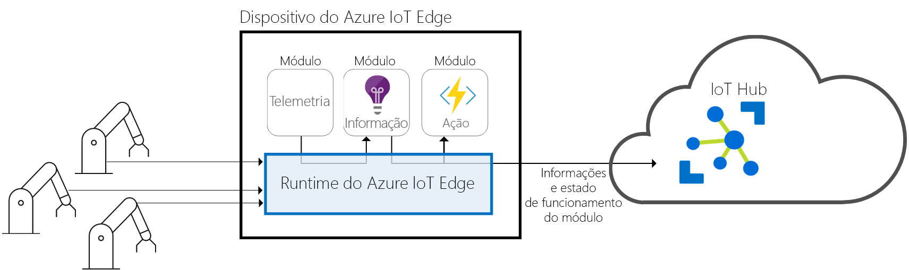
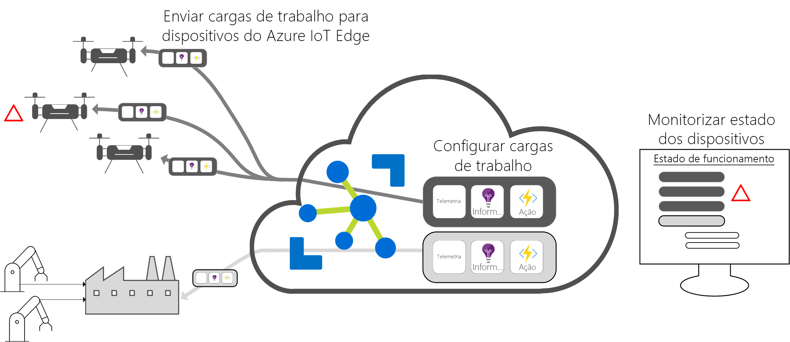

# O que é o Hub IoT Edge

[!INCLUDE [iot-edge-version-all-supported](../../includes/iot-edge-version-all-supported.md)]

O Azure IoT Edge move as análises e a lógica empresarial personalizada da cloud para os dispositivos, para que a sua organização se possa dedicar às informações relevantes e não à gestão de dados. Dimensione a sua solução IoT embalando a sua lógica de negócio em recipientes padrão, então pode colocar esses recipientes em qualquer um dos seus dispositivos e monitorá-lo a partir da nuvem.

Nas soluções IoT, o valor empresarial é impulsionado pelas análises, mas nem todas as análises têm de estar na cloud. Se quiser responder a emergências o mais rapidamente possível, pode executar cargas de trabalho de deteção de anomalias no limite. Se quiser reduzir os custos de largura de banda e evitar a transferência de terabytes de dados brutos, pode limpar e agregar os dados localmente, então apenas envie os insights para a nuvem para análise.

O Azure IoT Edge é composto por três componentes:

* **Os módulos IoT Edge** são contentores que gerem serviços Azure, serviços de terceiros ou o seu próprio código. Os módulos são implementados nos dispositivos do IoT Edge e executados localmente nos mesmos.
* O **tempo de funcionaamento do IoT Edge** funciona em cada dispositivo IoT Edge e gere os módulos implantados em cada dispositivo.
* Uma **interface baseada em nuvem permite-lhe** monitorizar e gerir remotamente dispositivos IoT Edge.

>[!NOTE]
>O Azure IoT Edge está disponível no escalão gratuito e standard do Hub IoT. O escalão gratuito destina-se apenas a testes e avaliação. Para obter mais informações sobre os escalões básico e standard, veja [How to choose the right IoT Hub tier](../iot-hub/iot-hub-scaling.md) (Como escolher o escalão do Hub IoT certo).

## Módulos do IoT Edge

Os módulos IoT Edge são unidades de execução, implementadas como recipientes compatíveis com Docker, que executam a sua lógica de negócio no limite. Podem ser configurados vários módulos para comunicarem entre si, criando um pipeline para processamento de dados. Pode desenvolver módulos personalizados ou empacotar determinados serviços do Azure em módulos que disponibilizam informações offline e na periferia.

### Inteligência artificial no limite

O Azure IoT Edge permite-lhe implementar processamento complexo de eventos, machine learning, reconhecimento de imagem e outra IA de alto valor sem escrevê-lo internamente. Serviços Azure como Azure Functions, Azure Stream Analytics e Azure Machine Learning podem ser executados no local através do Azure IoT Edge. Mas não se limita aos serviços Azure. Qualquer pessoa é capaz de criar módulos de IA e disponibilizá-los à comunidade para uso através do Azure Marketplace.

### Traga o seu próprio código

E se quiser implementar o seu próprio código nos seus dispositivos, o Azure IoT Edge também o suporta. O Azure IoT Edge tem o mesmo modelo de programação dos serviços do Azure IoT. Pode executar o mesmo código num dispositivo ou na nuvem. O Azure IoT Edge suporta o Linux e o Windows, para que possa programar para uma plataforma à sua escolha. Suporta Java, .NET Core 2.0, Node.js, C e Python para que os seus desenvolvedores possam codificar numa linguagem que já conhecem e utilizar a lógica de negócio existente.

## Runtime do IoT Edge

O runtime do Azure IoT Edge permite lógica personalizada e da cloud nos dispositivos IoT Edge. O tempo de funcionaamento encontra-se no dispositivo IoT Edge e realiza operações de gestão e comunicação. O runtime realiza várias funções:

* Instala e atualiza cargas de trabalho no dispositivo.
* Mantém as normas de segurança do Azure IoT Edge no dispositivo.
* Garante que os módulos do IoT Edge estão sempre em execução.
* Reporta o estado de funcionamento dos módulos à cloud, para monitorização remota.
* Gere a comunicação entre dispositivos de folha a jusante e um dispositivo IoT Edge, entre módulos num dispositivo IoT Edge, e entre um dispositivo IoT Edge e a nuvem.

A forma como usas um dispositivo Azure IoT Edge depende de ti. O tempo de funcionamento é frequentemente utilizado para implantar IA em dispositivos gateway que agregam e processam dados de outros dispositivos no local, mas este modelo de implementação é apenas uma opção.

O tempo de execução Azure IoT Edge funciona num grande conjunto de dispositivos IoT que permite usá-lo de uma grande variedade de maneiras. Suporta sistemas operativos Linux e Windows e resumos detalhes de hardware. Use um dispositivo menor que um Raspberry Pi 3 se não estiver a processar muitos dados, ou utilize um servidor industrial para executar cargas de trabalho intensivas em recursos.

## Interface na cloud do IoT Edge

É difícil gerir o ciclo de vida do software para milhões de dispositivos IoT que são muitas vezes diferentes marcas e modelos ou geograficamente dispersos. As cargas de trabalho são criadas e configuradas para um determinado tipo de dispositivos, implementadas em todos os seus dispositivos e monitorizadas para detetar dispositivos que possam estar a funcionar mal. Estas atividades não podem ser feitas individualmente por dispositivo; têm de o ser em escala.

O Azure IoT Edge integra-se facilmente com os aceleradores de soluções do Azure IoT para proporcionar um plano de controlo para as necessidades da sua solução. Os serviços na nuvem permitem-lhe:

* Criem e configurem cargas de trabalho para serem executadas num tipo de dispositivo específico.
* Enviem cargas de trabalho para um conjunto de dispositivos.
* Monitorizem as cargas de trabalho em execução em dispositivos no terreno.

## Passos seguintes

Experimente estes conceitos implantando o seu primeiro módulo IoT Edge num dispositivo:

<!-- 1.1 -->
:::moniker range="iotedge-2018-06"

* [Implementar módulos para um dispositivo Linux IoT Edge](quickstart-linux.md)
* [Implementar módulos para um dispositivo Windows IoT Edge](quickstart.md)

:::moniker-end

<!-- 1.2 -->
:::moniker range=">=iotedge-2020-11"

[Implementar módulos para um dispositivo IoT Edge](quickstart-linux.md)

:::moniker-end
