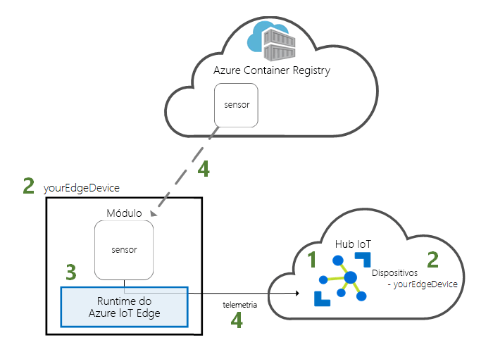
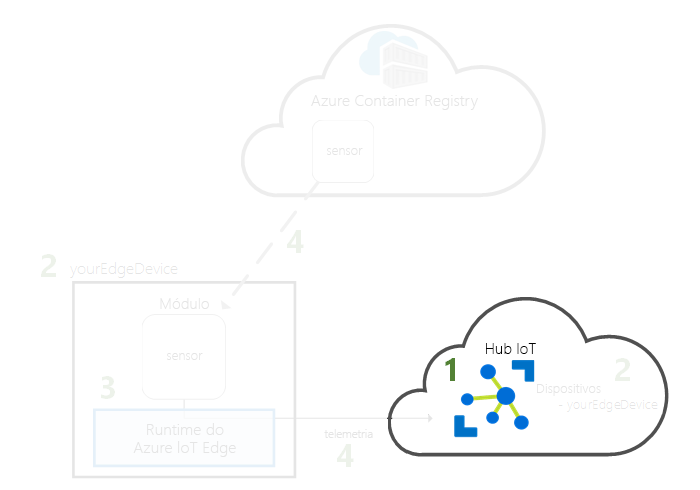
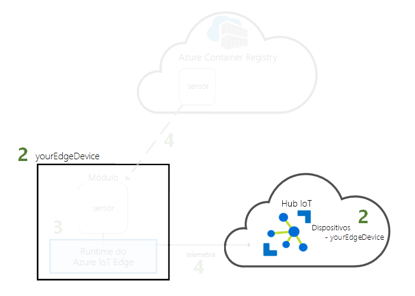
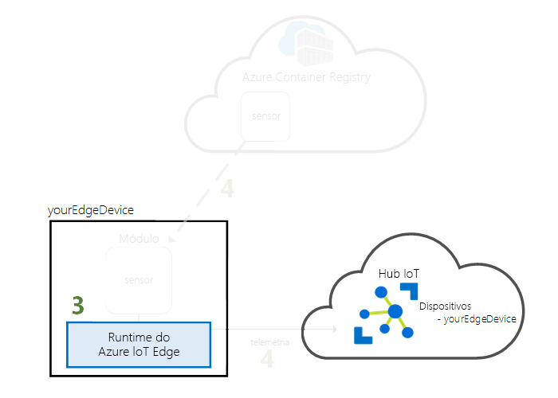
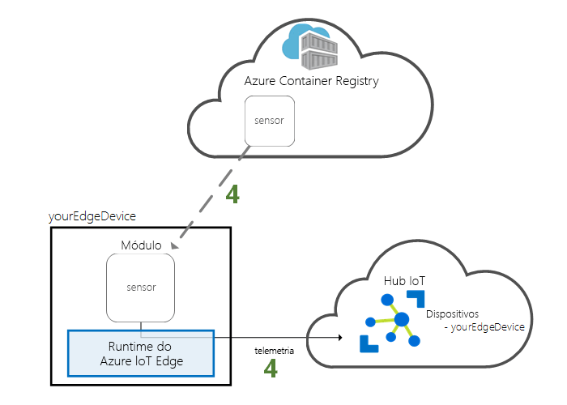

# <a name="quickstart-deploy-your-first-iot-edge-module-to-a-virtual-linux-device"></a>Quickstart: Implemente o seu primeiro módulo IoT Edge num dispositivo Linux virtual

[!INCLUDE [iot-edge-version-201806-or-202011](../../includes/iot-edge-version-201806-or-202011.md)]

Teste a Azure IoT Edge neste arranque rápido implantando código contentorizado num dispositivo virtual Linux IoT Edge. O IoT Edge permite-lhe gerir remotamente código nos seus dispositivos para que possa enviar mais cargas de trabalho para a borda. Para este arranque rápido, recomendamos a utilização de uma máquina virtual Azure para o seu dispositivo IoT Edge, que lhe permite criar rapidamente uma máquina de teste e, em seguida, eliminá-la quando terminar.

Neste início rápido, vai aprender a:

* Criar um Hub IoT.
* Registar um dispositivo IoT Edge no seu hub IoT.
* Instale e inicie o tempo de funcionaamento do IoT Edge num dispositivo virtual.
* Implementar remotamente um módulo num dispositivo IoT Edge.



Este quickstart acompanha-o através da criação de uma máquina virtual Linux que está configurada para ser um dispositivo IoT Edge. Em seguida, coloque um módulo do portal Azure para o seu dispositivo. O módulo utilizado neste arranque rápido é um sensor simulado que gera dados de temperatura, humidade e pressão. Os outros tutoriais do Azure IoT Edge baseiam-se no trabalho que faz aqui, implantando módulos adicionais que analisam os dados simulados para insights de negócios.

Se não tiver uma subscrição ativa do Azure, crie uma [conta gratuita](https://azure.microsoft.com/free) antes de começar.

## <a name="prerequisites"></a>Pré-requisitos

Prepare o seu ambiente para o Azure CLI.

[!INCLUDE [azure-cli-prepare-your-environment-no-header.md](../../includes/azure-cli-prepare-your-environment-no-header.md)]

Recursos da cloud:

* Um grupo de recursos para gerir todos os recursos que utilizar neste início rápido. Utilizamos o nome de grupo de recursos de exemplo **IoTEdgeResources** ao longo deste quickstart e dos seguintes tutoriais.

   ```azurecli-interactive
   az group create --name IoTEdgeResources --location westus2
   ```

## <a name="create-an-iot-hub"></a>Criar um hub IoT

Inicie o quickstart criando um hub IoT com Azure CLI.



O nível gratuito do Hub IoT funciona para este início rápido. Se já usou o IoT Hub no passado e já criou um hub, pode usar esse hub IoT.

O código a seguir cria um hub **de F1** gratuito no grupo de recursos **IoTEdgeResources**. `{hub_name}`Substitua-o por um nome único para o seu hub IoT. Pode levar alguns minutos para criar um hub IoT.

   ```azurecli-interactive
   az iot hub create --resource-group IoTEdgeResources --name {hub_name} --sku F1 --partition-count 2
   ```

   Se obtiver um erro porque já existe um hub gratuito na sua subscrição, altere o SKU para **S1**. Cada subscrição só pode ter um Hub IoT gratuito. Se tiver um erro que o nome IoT Hub não está disponível, significa que outra pessoa já tem um hub com esse nome. Tente um novo nome.

## <a name="register-an-iot-edge-device"></a>Registar um dispositivo do IoT Edge

Registe um dispositivo do IoT Edge no seu hub IoT recentemente criado.



Crie uma identidade do dispositivo para o seu dispositivo IoT Edge para que possa comunicar com o seu hub IoT. A identidade do dispositivo reside na cloud e verá uma cadeia de ligação do dispositivo única para associar um dispositivo físico a uma identidade do dispositivo.

Uma vez que os dispositivos IoT Edge se comportam e podem ser geridos de forma diferente dos dispositivos IoT típicos, declare esta identidade como sendo para um dispositivo IoT Edge com a `--edge-enabled` bandeira.

1. Na Azure Cloud Shell, insira o seguinte comando para criar um dispositivo chamado **MyEdgeDevice** no seu hub.

   ```azurecli-interactive
   az iot hub device-identity create --device-id myEdgeDevice --edge-enabled --hub-name {hub_name}
   ```

   Se tiver um erro sobre as teclas de política do iothubowner, certifique-se de que a sua Cloud Shell está a executar a versão mais recente da extensão azure-iot.

2. Veja a cadeia de ligação do seu dispositivo, que liga o seu dispositivo físico à sua identidade no IoT Hub. Contém o nome do seu hub IoT, o nome do seu dispositivo e, em seguida, uma chave partilhada que autentica ligações entre os dois. Voltaremos a referir-nos a esta cadeia de ligação na secção seguinte quando configurar o seu dispositivo IoT Edge.

   ```azurecli-interactive
   az iot hub device-identity connection-string show --device-id myEdgeDevice --hub-name {hub_name}
   ```

   

## <a name="configure-your-iot-edge-device"></a>Configure o seu dispositivo IoT Edge

Crie uma máquina virtual com o tempo de execução Azure IoT Edge.



O runtime do IoT Edge é implementado em todos os dispositivos do IoT Edge. Tem três componentes. O *daemon de segurança IoT Edge* começa cada vez que um dispositivo IoT Edge arranca e arranca o dispositivo iniciando o agente IoT Edge. O *agente IoT Edge* facilita a implementação e monitorização de módulos no dispositivo IoT Edge, incluindo o hub IoT Edge. O *hub IoT Edge* gere comunicações entre módulos no dispositivo IoT Edge, e entre o dispositivo e o IoT Hub.

Durante a configuração do runtime, apresenta a cadeia de ligação do dispositivo. Esta é a corda que recuperaste do Azure CLI. Essa cadeia associa o dispositivo físico à identidade do dispositivo IoT Edge no Azure.

### <a name="deploy-the-iot-edge-device"></a>Implementar o dispositivo IoT Edge

Esta secção utiliza um modelo de Gestor de Recursos Azure para criar uma nova máquina virtual e instalar o tempo de execução IoT Edge nele. Se pretender utilizar o seu próprio dispositivo Linux, pode seguir os passos de instalação no [Tempo de funcionamento do Azure IoT Edge](how-to-install-iot-edge.md)e, em seguida, voltar a este arranque rápido.

<!-- 1.1 -->
:::moniker range="iotedge-2018-06"

Utilize o seguinte comando CLI para criar o seu dispositivo IoT Edge com base no modelo de [implantação iotedge-vm pré-construído.](https://github.com/Azure/iotedge-vm-deploy)

* Para utilizadores de bash ou Cloud Shell, copie o seguinte comando num editor de texto, substitua o texto do espaço reservado pelas suas informações e, em seguida, copie para a sua janela bash ou Cloud Shell:

   ```azurecli-interactive
   az deployment group create \
   --resource-group IoTEdgeResources \
   --template-uri "https://aka.ms/iotedge-vm-deploy" \
   --parameters dnsLabelPrefix='<REPLACE_WITH_VM_NAME>' \
   --parameters adminUsername='azureUser' \
   --parameters deviceConnectionString=$(az iot hub device-identity connection-string show --device-id myEdgeDevice --hub-name <REPLACE_WITH_HUB_NAME> -o tsv) \
   --parameters authenticationType='password' \
   --parameters adminPasswordOrKey="<REPLACE_WITH_PASSWORD>"
   ```

* Para os utilizadores do PowerShell, copie o seguinte comando na sua janela PowerShell e, em seguida, substitua o texto do espaço reservado pelas suas próprias informações:

   ```azurecli
   az deployment group create `
   --resource-group IoTEdgeResources `
   --template-uri "https://aka.ms/iotedge-vm-deploy" `
   --parameters dnsLabelPrefix='<REPLACE_WITH_VM_NAME>' `
   --parameters adminUsername='azureUser' `
   --parameters deviceConnectionString=$(az iot hub device-identity connection-string show --device-id myEdgeDevice --hub-name <REPLACE_WITH_HUB_NAME> -o tsv) `
   --parameters authenticationType='password' `
   --parameters adminPasswordOrKey="<REPLACE_WITH_PASSWORD>"
   ```

:::moniker-end
<!-- end 1.1 -->

<!-- 1.2 -->
:::moniker range=">=iotedge-2020-11"

Utilize o seguinte comando CLI para criar o seu dispositivo IoT Edge com base no modelo de [implantação iotedge-vm pré-construído.](https://github.com/Azure/iotedge-vm-deploy/tree/1.2.0-rc4)

* Para utilizadores de bash ou Cloud Shell, copie o seguinte comando num editor de texto, substitua o texto do espaço reservado pelas suas informações e, em seguida, copie para a sua janela bash ou Cloud Shell:

   ```azurecli-interactive
   az deployment group create \
   --resource-group IoTEdgeResources \
   --template-uri "https://raw.githubusercontent.com/Azure/iotedge-vm-deploy/1.2.0-rc4/edgeDeploy.json" \
   --parameters dnsLabelPrefix='<REPLACE_WITH_VM_NAME>' \
   --parameters adminUsername='azureUser' \
   --parameters deviceConnectionString=$(az iot hub device-identity connection-string show --device-id myEdgeDevice --hub-name <REPLACE_WITH_HUB_NAME> -o tsv) \
   --parameters authenticationType='password' \
   --parameters adminPasswordOrKey="<REPLACE_WITH_PASSWORD>"
   ```

* Para os utilizadores do PowerShell, copie o seguinte comando na sua janela PowerShell e, em seguida, substitua o texto do espaço reservado pelas suas próprias informações:

   ```azurecli
   az deployment group create `
   --resource-group IoTEdgeResources `
   --template-uri "https://raw.githubusercontent.com/Azure/iotedge-vm-deploy/1.2.0-rc4/edgeDeploy.json" `
   --parameters dnsLabelPrefix='<REPLACE_WITH_VM_NAME>' `
   --parameters adminUsername='azureUser' `
   --parameters deviceConnectionString=$(az iot hub device-identity connection-string show --device-id myEdgeDevice --hub-name <REPLACE_WITH_HUB_NAME> -o tsv) `
   --parameters authenticationType='password' `
   --parameters adminPasswordOrKey="<REPLACE_WITH_PASSWORD>"
   ```
:::moniker-end
<!-- end 1.2 -->

Este modelo tem os seguintes parâmetros:

| Parâmetro | Descrição |
| --------- | ----------- |
| **grupo de recursos** | O grupo de recursos no qual os recursos serão criados. Utilize os **IoTEdgeResources** padrão que temos vindo a usar ao longo deste artigo ou forneça o nome de um grupo de recursos existente na sua subscrição. |
| **modelo-uri** | Um ponteiro para o modelo do Gestor de Recursos que estamos a usar. |
| **dnsLabelPrefix** | Uma corda que será usada para criar o nome de hospedeiro da máquina virtual. Substitua o texto do espaço reservado por um nome para a sua máquina virtual. |
| **adminUsername** | Um nome de utilizador para a conta de administração da máquina virtual. Utilize o exemplo **azureUser** ou forneça um novo nome de utilizador. |
| **dispositivoConnectionString** | A cadeia de ligação da identidade do dispositivo no IoT Hub, que é usada para configurar o tempo de funcionamento do IoT Edge na máquina virtual. O comando CLI dentro deste parâmetro agarra a cadeia de ligação para si. Substitua o texto do espaço reservado pelo nome do seu hub IoT. |
| **authenticationType** | O método de autenticação para a conta de administração. Este quickstart utiliza a autenticação **de palavra-passe,** mas também pode definir este parâmetro para **sshPublicKey**. |
| **adminPasswordOrKey** | A palavra-passe ou valor da chave SSH para a conta de administração. Substitua o texto do espaço reservado por uma palavra-passe segura. A sua palavra-passe deve ter pelo menos 12 caracteres e ter três de quatro dos seguintes: caracteres minúsculos, caracteres maiúsculas, dígitos e caracteres especiais. |

Uma vez concluída a implementação, deverá receber uma saída formatada por JSON no CLI que contenha as informações SSH para ligar à máquina virtual. Copiar o valor da entrada **pública de SSH** da secção **de saídas:**

   

### <a name="view-the-iot-edge-runtime-status"></a>Ver o estado de runtime do IoT Edge

O resto dos comandos neste quickstart ocorrem no seu próprio dispositivo IoT Edge, para que possa ver o que está a acontecer no dispositivo. Se estiver a utilizar uma máquina virtual, ligue-se a essa máquina utilizando agora o nome de utilizador de administração que configura e o nome DNS que foi descoduado pelo comando de implementação. Também pode encontrar o nome DNS na página geral da sua máquina no portal Azure. Utilize o seguinte comando para se ligar à máquina virtual. Substitua `{admin username}` e por os seus `{DNS name}` próprios valores.

   ```console
   ssh {admin username}@{DNS name}
   ```

Uma vez ligado à sua máquina virtual, verifique se o tempo de funcionaamento foi instalado com sucesso e configurado no seu dispositivo IoT Edge.

<!--1.1 -->
:::moniker range="iotedge-2018-06"

1. Verifique se o daemon de segurança IoT Edge está funcionando como um serviço de sistema.

   ```bash
   sudo systemctl status iotedge
   ```

   

   >[!TIP]
   >Precisa de privilégios elevados para executar os comandos `iotedge`. Depois de terminar sessão do seu computador e iniciar sessão novamente pela primeira vez depois de instalar o runtime do IoT Edge, as suas permissões são atualizadas automaticamente. Até lá, use `sudo` na frente dos comandos.

2. Se precisar de resolver problemas relacionados com o serviço, obtenha os registos do serviço.

   ```bash
   journalctl -u iotedge
   ```

3. Veja todos os módulos em execução no seu dispositivo IoT Edge. Uma vez que o serviço foi iniciado pela primeira vez, deverá ver apenas o módulo **edgeAgent** em execução. O módulo EdgeAgent funciona por predefinição e ajuda a instalar e iniciar quaisquer módulos adicionais que implemente no seu dispositivo.

   ```bash
   sudo iotedge list
   ```

   
:::moniker-end
<!-- end 1.1 -->

<!-- 1.2 -->
:::moniker range=">=iotedge-2020-11"

1. Verifique se o IoT Edge está a funcionar. O seguinte comando deve devolver um estado de **Ok** se o IoT Edge estiver em execução ou fornecer quaisquer erros de serviço.

   ```bash
   sudo iotedge system status
   ```

   >[!TIP]
   >Precisa de privilégios elevados para executar os comandos `iotedge`. Depois de terminar sessão do seu computador e iniciar sessão novamente pela primeira vez depois de instalar o runtime do IoT Edge, as suas permissões são atualizadas automaticamente. Até lá, use `sudo` na frente dos comandos.

2. Se precisar de resolver problemas relacionados com o serviço, obtenha os registos do serviço.

   ```bash
   sudo iotedge system logs
   ```

3. Veja todos os módulos em execução no seu dispositivo IoT Edge. Uma vez que o serviço foi iniciado pela primeira vez, deverá ver apenas o módulo **edgeAgent** em execução. O módulo EdgeAgent funciona por predefinição e ajuda a instalar e iniciar quaisquer módulos adicionais que implemente no seu dispositivo.

   ```bash
   sudo iotedge list
   ```

:::moniker-end
<!-- end 1.2 -->

O seu dispositivo IoT Edge está agora configurado. Está pronto para executar módulos implementados na cloud.

## <a name="deploy-a-module"></a>Implementar um módulo

Gira o seu dispositivo Azure IoT Edge a partir da cloud para implementar um módulo que irá enviar dados telemétricos para o Hub IoT.



<!-- [!INCLUDE [iot-edge-deploy-module](../../includes/iot-edge-deploy-module.md)]

Include content included below to support versioned steps in Linux quickstart. Can update include file once Windows quickstart supports v1.2 -->

Uma das principais capacidades do Azure IoT Edge é a implementação de código para os seus dispositivos IoT Edge a partir da nuvem. *Os módulos IoT Edge* são pacotes executáveis implementados como recipientes. Nesta secção, irá implantar um módulo pré-construído a partir da [secção IoT Edge Modules do Azure Marketplace](https://azuremarketplace.microsoft.com/marketplace/apps/category/internet-of-things?page=1&subcategories=iot-edge-modules) diretamente do Azure IoT Hub.

O módulo que implementa nesta secção simula um sensor e envia dados gerados. Este módulo é um código útil quando está a começar com o IoT Edge porque pode usar os dados simulados para desenvolvimento e teste. Se quiser ver exatamente o que este módulo faz, pode ver o [código-fonte do sensor de temperatura simulado](https://github.com/Azure/iotedge/blob/027a509549a248647ed41ca7fe1dc508771c8123/edge-modules/SimulatedTemperatureSensor/src/Program.cs).

Siga estes passos para iniciar o assistente **de Conjunto de Módulos** para implementar o seu primeiro módulo a partir do Azure Marketplace.

1. Inscreva-se no [portal Azure](https://portal.azure.com) e vá para o seu hub IoT.

1. A partir do menu à esquerda, em **Gestão Automática de Dispositivos,** selecione **IoT Edge**.

1. Selecione o ID do dispositivo do dispositivo alvo na lista de dispositivos.

1. Na barra superior, selecione **Módulos de Conjunto**.

   

### <a name="modules"></a>Módulos

O primeiro passo do assistente é escolher quais os módulos que pretende executar no seu dispositivo.

Nos **Módulos IoT Edge,** abra o menu **Add** drop-down e, em seguida, selecione **o Módulo de Mercado**.

   

No **IoT Edge Module Marketplace,** procure e selecione o `Simulated Temperature Sensor` módulo. O módulo é adicionado à secção IoT Edge Modules com o estado de **funcionamento** pretendido.

<!-- 1.2 -->
:::moniker range=">=iotedge-2020-11"

Selecione **Definições de tempo de execução** para abrir as definições para os módulos edgeHub e edgeAgent. Esta secção de definições é onde é possível gerir os módulos de tempo de execução adicionando variáveis ambientais ou alterando as opções de criação.

Atualize o campo **Image** para os módulos edgeHub e edgeAgent para utilizar a marca de versão 1.2. Por exemplo:

* `mcr.microsoft.com/azureiotedge-hub:1.2`
* `mcr.microsoft.com/azureiotedge-agent:1.2`

**Selecione Guardar** para aplicar as alterações nos módulos de tempo de execução.

:::moniker-end
<!--end 1.2-->

Selecione **Seguinte: Rotas** para continuar até ao próximo passo do assistente.

   

### <a name="routes"></a>Rotas

No separador **Rotas,** remova a rota padrão, **rota** e, em seguida, selecione **Seguinte: Review + create** para continuar para o próximo passo do assistente.

   >[!Note]
   >As rotas são construídas utilizando pares de nome e valor. Devia ver duas rotas nesta página. A rota padrão, **rota,** envia todas as mensagens para ioT Hub (que é chamado `$upstream` de ). Uma segunda rota, **SimulatedTemperatureSensorToIoTHub,** foi criada automaticamente quando adicionou o módulo do Azure Marketplace. Esta rota envia todas as mensagens do módulo de temperatura simulada para o IoT Hub. Pode apagar a rota padrão porque é redundante neste caso.

   

### <a name="review-and-create"></a>Rever e criar

Reveja o ficheiro JSON e, em seguida, **selecione Criar**. O ficheiro JSON define todos os módulos que implementa no seu dispositivo IoT Edge. Você verá o módulo **SimulaedTemperatureSensor** e os dois módulos de tempo de execução, **edgeAgent** e **edgeHub**.

   >[!Note]
   >Quando submete uma implementação nova para um dispositivo do IoT Edge, nada é enviado para o seu dispositivo. Em vez disso, o dispositivo consulta regularmente o Hub IoT para obter novas instruções. Se o dispositivo encontrar um manifesto de implementação atualizado, este irá utilizar as informações sobre a nova implementação para obter as imagens do módulo da cloud e, em seguida, começa a executar os módulos localmente. Este processo pode demorar alguns minutos.

Depois de criar os detalhes da implementação do módulo, o assistente devolve-o à página de detalhes do dispositivo. Ver o estado de implantação no **separador Módulos.**

Deverá ver três módulos: **$edgeAgent,** **$edgeHub** e **Simulação DetemperatureSensor**. Se um ou mais dos módulos tiver **SIM** em **ESPECIFICAÇÃO EM IMPLEMENTAÇÃO,** mas não sob **O DISPOSITIVO REPORTADO POR DISPOSITIVO,** o seu dispositivo IoT Edge ainda os está a iniciar. Espere alguns minutos e, em seguida, refresque a página.

   

## <a name="view-generated-data"></a>Ver os dados gerados

Neste início rápido, criou um novo dispositivo IoT Edge e instalou o runtime do IoT Edge no mesmo. Em seguida, utilizou o portal Azure para implantar um módulo IoT Edge para funcionar no dispositivo sem ter de fazer alterações no próprio dispositivo.

Neste caso, o módulo que empurrou gera dados de ambiente de amostra que pode usar para testes mais tarde. O sensor simulado está a monitorizar uma máquina e o ambiente à volta da máquina. Por exemplo, este sensor poderá estar num espaço de servidor, numa fábrica ou numa turbina eólica. A mensagem inclui temperatura ambiente e humidade, temperatura e pressão do computador e um carimbo de data/hora. Os tutoriais IoT Edge utilizam os dados criados por este módulo como dados de teste para análise.

Abra novamente a linha de comandos no seu dispositivo do IoT Edge ou utilize a ligação SSH a partir da CLI do Azure. Certifique-se de que o módulo implementado a partir da cloud está em execução no seu dispositivo do IoT Edge:

   ```bash
   sudo iotedge list
   ```

<!-- 1.1 -->
:::moniker range="iotedge-2018-06"
   
:::moniker-end

<!-- 1.2 -->
:::moniker range=">=iotedge-2020-11"
   
:::moniker-end

Veja as mensagens enviadas a partir do módulo sensor de temperatura:

   ```bash
   sudo iotedge logs SimulatedTemperatureSensor -f
   ```

   >[!TIP]
   >Os comandos IoT Edge são sensíveis a casos quando se referem aos nomes dos módulos.

   

Também pode ver as mensagens chegarem ao seu hub IoT utilizando a [extensão Azure IoT Hub para Código de Estúdio Visual](https://marketplace.visualstudio.com/items?itemName=vsciot-vscode.azure-iot-toolkit).

## <a name="clean-up-resources"></a>Limpar os recursos

Se quiser avançar para os tutoriais do IoT Edge, pode utilizar o dispositivo que registou e configurou neste início rápido. Caso contrário, pode eliminar os recursos Azure que criou para evitar encargos.

Se tiver criado a sua máquina virtual e o hub IoT num novo grupo de recursos, pode eliminar esse grupo e todos os recursos associados. Verifique novamente o conteúdo do grupo de recursos para se certificar de que não há nada que queira guardar. Se não quiser eliminar todo o grupo, pode eliminar recursos individuais.

> [!IMPORTANT]
> A eliminação de um grupo de recursos é irreversível.

Remova o grupo de **IoTEdgeResources**. Pode levar alguns minutos para apagar um grupo de recursos.

```azurecli-interactive
az group delete --name IoTEdgeResources --yes
```

Pode confirmar que o grupo de recursos é removido visualizando a lista de grupos de recursos.

```azurecli-interactive
az group list
```

## <a name="next-steps"></a>Passos seguintes

Neste arranque rápido, criou um dispositivo IoT Edge e utilizou a interface de nuvem Azure IoT Edge para implementar código no dispositivo. Agora tem um dispositivo de teste a gerar dados não processados sobre o seu ambiente.

O próximo passo é configurar o seu ambiente de desenvolvimento local para que possa começar a criar módulos IoT Edge que executam a sua lógica de negócio.

> [!div class="nextstepaction"]
> [Comece a desenvolver módulos IoT Edge para dispositivos Linux](tutorial-develop-for-linux.md)
