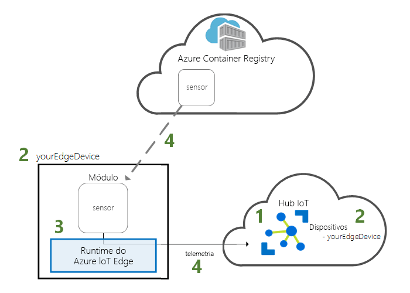
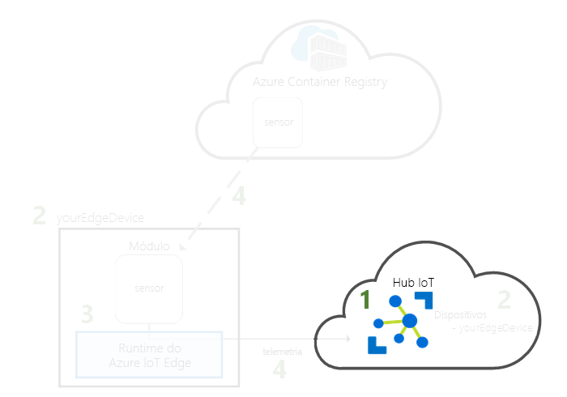
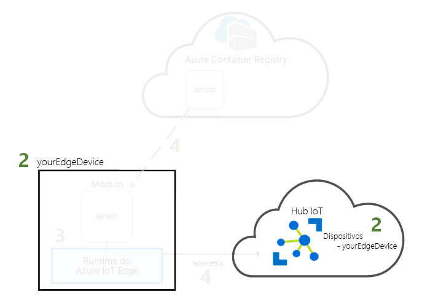
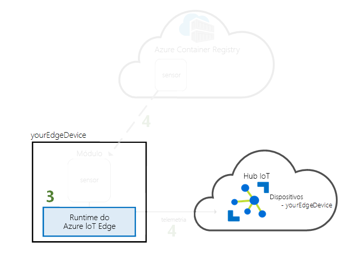
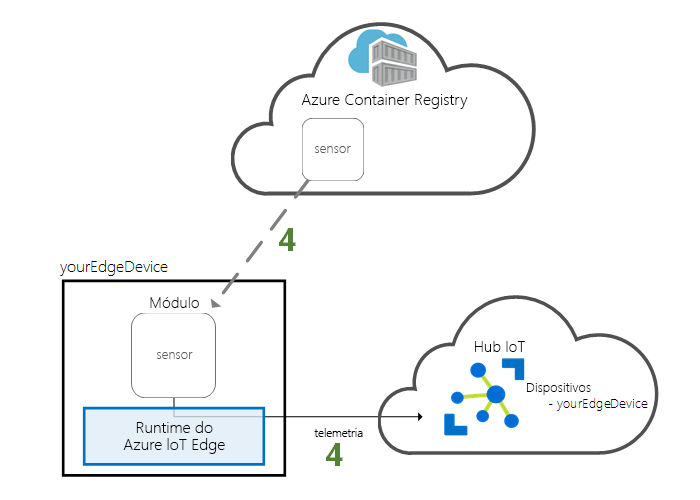

# <a name="quickstart-deploy-your-first-iot-edge-module-to-a-windows-device-preview"></a>Quickstart: Implemente o seu primeiro módulo IoT Edge num dispositivo Windows (Pré-visualização)

Experimente o Azure IoT Edge neste arranque rápido, implantando código contentorizado num dispositivo Linux no Windows IoT Edge. O IoT Edge permite-lhe gerir remotamente código nos seus dispositivos para que possa enviar mais cargas de trabalho para a borda. Para este arranque rápido, recomendamos usar o seu próprio dispositivo para ver como é fácil utilizar o Azure IoT Edge para o Linux no Windows.

Neste início rápido, vai aprender a:

* Criar um hub IoT.
* Registar um dispositivo IoT Edge no seu hub IoT.
* Instale e inicie o IoT Edge para Linux no tempo de funcionaamento do Windows no seu dispositivo.
* Desloque remotamente um módulo para um dispositivo IoT Edge e envie telemetria.



Este quickstart acompanha-o a configurar o seu Azure IoT Edge para Linux no dispositivo Windows. Em seguida, coloque um módulo do portal Azure para o seu dispositivo. O módulo utilizado neste arranque rápido é um sensor simulado que gera dados de temperatura, humidade e pressão. Os outros tutoriais do Azure IoT Edge baseiam-se no trabalho que faz aqui, implantando módulos adicionais que analisam os dados simulados para insights de negócios.

Se não tiver uma subscrição ativa do Azure, crie uma [conta gratuita](https://azure.microsoft.com/free) antes de começar.

>[!NOTE]
>IoT Edge for Linux on Windows está em [pré-visualização pública](https://azure.microsoft.com/support/legal/preview-supplemental-terms/).

## <a name="prerequisites"></a>Pré-requisitos

Prepare o seu ambiente para o Azure CLI.

[!INCLUDE [azure-cli-prepare-your-environment-no-header.md](../../includes/azure-cli-prepare-your-environment-no-header.md)]

Recursos da cloud:

* Um grupo de recursos para gerir todos os recursos que utilizar neste início rápido.

   ```azurecli-interactive
   az group create --name IoTEdgeResources --location westus2
   ```

Dispositivo IoT Edge

* O seu dispositivo tem de ser um PC ou servidor do Windows, versão 1809 ou posterior
* Pelo menos 4 GB de memória, recomendado 8 GB de memória
* 10 GB de espaço livre em disco

## <a name="create-an-iot-hub"></a>Criar um hub IoT

Inicie o quickstart criando um hub IoT com Azure CLI.



O nível gratuito do Hub IoT funciona para este início rápido. Se já usou o IoT Hub no passado e já criou um hub, pode usar esse hub IoT.

O código a seguir cria um hub **de F1** gratuito no grupo de recursos `IoTEdgeResources` . `{hub_name}`Substitua-o por um nome único para o seu hub IoT. Pode levar alguns minutos para criar um hub IoT.

   ```azurecli-interactive
   az iot hub create --resource-group IoTEdgeResources --name {hub_name} --sku F1 --partition-count 2
   ```

   Se obtiver um erro porque já existe um hub gratuito na sua subscrição, altere o SKU para **S1**. Se tiver um erro que o nome IoT Hub não está disponível, significa que outra pessoa já tem um hub com esse nome. Tente um novo nome.

## <a name="register-an-iot-edge-device"></a>Registar um dispositivo do IoT Edge

Registe um dispositivo do IoT Edge no seu hub IoT recentemente criado.



Crie uma identidade de dispositivo para o seu dispositivo simulado para que este consiga comunicar com o seu hub IoT. A identidade do dispositivo reside na cloud e verá uma cadeia de ligação do dispositivo única para associar um dispositivo físico a uma identidade do dispositivo.

Uma vez que os dispositivos IoT Edge se comportam e podem ser geridos de forma diferente dos dispositivos IoT típicos, declare esta identidade como sendo para um dispositivo IoT Edge com a `--edge-enabled` bandeira.

1. Na Azure Cloud Shell, insira o seguinte comando para criar um dispositivo chamado **MyEdgeDevice** no seu hub.

   ```azurecli-interactive
   az iot hub device-identity create --device-id myEdgeDevice --edge-enabled --hub-name {hub_name}
   ```

   Se tiver um erro sobre as teclas de política do iothubowner, certifique-se de que a sua Cloud Shell está a executar a versão mais recente da extensão azure-iot.

2. Veja a cadeia de ligação do seu dispositivo, que liga o seu dispositivo físico à sua identidade no IoT Hub. Contém o nome do seu hub IoT, o nome do seu dispositivo e, em seguida, uma chave partilhada que autentica ligações entre os dois.

   ```azurecli-interactive
   az iot hub device-identity connection-string show --device-id myEdgeDevice --hub-name {hub_name}
   ```

3. Copie o valor da chave `connectionString` da saída em JSON e guarde-o. Este valor é a cadeia de ligação do dispositivo. Irá utilizar esta cadeia de ligação para configurar o runtime do IoT Edge na secção seguinte.

   

## <a name="install-and-start-the-iot-edge-runtime"></a>Instalar e iniciar o runtime do IoT Edge

Instale o IoT Edge para o Linux no Windows no seu dispositivo e configuure-o com uma cadeia de ligação do dispositivo.



1. [Baixar o Windows Admin Center](https://aka.ms/WACDownloadEFLOW).
2. Siga o assistente de instalação para configurar o Windows Admin Center no seu dispositivo.
3. Uma vez que esteja no Windows Admin Center, no topo direito do ecrã, selecione o **Ícone de Engrenagem de Definições**  
4. A partir do menu de definições, em Gateway, selecione **Extensões**
5. Da lista de **extensões disponíveis** selecione **Azure IoT Edge**
6. **Instale** a extensão

7. Uma vez instalada a extensão, navegue para a página principal do painel de instrumentos selecionando o **Windows Admin Center** no canto superior esquerdo do seu ecrã.

8. Verá a ligação do anfitrião local representando o PC onde está a executar o Windows Admin Center.

   :::image type="content" source="media/quickstart/windows-admin-center-start-page.png" alt-text="Screenshot - Página inicial do Administrador do Windows":::

9. Selecione **Adicionar**.

   :::image type="content" source="media/quickstart/windows-admin-center-start-page-add.png" alt-text="Screenshot - Botão de adicionar página inicial do Windows Admin":::

10. Localize o azulejo Azure IoT Edge e selecione **Criar novo**. Isto irá iniciar o assistente de instalação.

    :::image type="content" source="media/quickstart/select-tile-screen.png" alt-text="Screenshot - Azure IoT Edge For Linux on Windows Tile":::

11. Proceda através do assistente de instalação para aceitar o EULA e escolha **a seguir**

    :::image type="content" source="media/quickstart/wizard-welcome-screen.png" alt-text="Screenshot - Wizard Welcome":::

12. Escolha os **dados de diagnóstico opcionais** para fornecer dados de diagnóstico alargados que ajudam a Microsoft a monitorizar e manter a qualidade do serviço, e clique em **Seguinte: Implementar**

    :::image type="content" source="media/quickstart/diagnostic-data-screen.png" alt-text="Screenshot - Dados de Diagnóstico":::

13. No ecrã do **dispositivo alvo Select,** selecione o dispositivo-alvo pretendido para validar que cumpre os requisitos mínimos. Para este arranque rápido, estamos a instalar o IoT Edge no dispositivo local, por isso escolha a ligação local. Uma vez confirmado, escolha **Next** para continuar

    :::image type="content" source="media/quickstart/wizard-select-target-device-screen.png" alt-text="Screenshot - Selecione Dispositivo-Alvo":::

14. Aceite as definições predefinidos escolhendo a **Seguir**.

15. O ecrã de implementação mostra o processo de descarregamento do pacote, instalação do pacote, configuração do anfitrião e configuração final do Linux VM.  Uma implementação bem sucedida será a seguinte:

    :::image type="content" source="media/quickstart/wizard-deploy-success-screen.png" alt-text="Screenshot - Wizard Deploy Success":::

16. Clique **em seguida: Conecte-se** para continuar até ao passo final para forrar o seu dispositivo Azure IoT Edge com o seu ID dispositivo a partir da sua instância do hub IoT.

17. Copie a cadeia de ligação do seu dispositivo no Azure IoT Hub e cole-a no campo de cordas de ligação do dispositivo. Em seguida, escolha **Provisioning com o método selecionado.**

    > [!NOTE]
    > Consulte o passo 3 na secção anterior, [Registe um dispositivo IoT Edge,](#register-an-iot-edge-device)para recuperar a sua corda de ligação.

    :::image type="content" source="media/quickstart/wizard-provision.png" alt-text="Screenshot - Provisão de Assistente":::

18. Uma vez que o provisionamento esteja completo, **selecione Finish** para completar e voltar ao ecrã de partida do Windows Admin Center. Deverá agora ser capaz de ver o seu dispositivo listado como um dispositivo IoT Edge.

    :::image type="content" source="media/quickstart/windows-admin-center-device-screen.png" alt-text="Screenshot - Windows Admin Center Azure IoT Edge Device":::

19. Selecione o seu dispositivo Azure IoT Edge para ver o seu painel de instrumentos. Deve ver se as cargas de trabalho do seu dispositivo twin no Azure IoT Hub foram implantadas. A **Lista de Módulos IoT Edge** deve mostrar um módulo em funcionamento, **edgeAgent,** e o **IoT Edge Status** deve **apresentar-se ativo (em execução)**.

O seu dispositivo IoT Edge está agora configurado. Está pronto para executar módulos implementados na cloud.

## <a name="deploy-a-module"></a>Implementar um módulo

Gerencie o seu dispositivo Azure IoT Edge a partir da nuvem para implementar um módulo que envia dados de telemetria para o IoT Hub.



[!INCLUDE [iot-edge-deploy-module](../../includes/iot-edge-deploy-module.md)]

## <a name="view-generated-data"></a>Ver os dados gerados

Neste início rápido, criou um novo dispositivo IoT Edge e instalou o runtime do IoT Edge no mesmo. Em seguida, utilizou o portal Azure para implantar um módulo IoT Edge para funcionar no dispositivo sem ter de fazer alterações no próprio dispositivo.

Neste caso, o módulo que empurrou gera dados de ambiente de amostra que pode usar para testes mais tarde. O sensor simulado está a monitorizar uma máquina e o ambiente à volta da máquina. Por exemplo, este sensor poderá estar num espaço de servidor, numa fábrica ou numa turbina eólica. A mensagem inclui temperatura ambiente e humidade, temperatura e pressão do computador e um carimbo de data/hora. Os tutoriais IoT Edge utilizam os dados criados por este módulo como dados de teste para análise.

Confirme que o módulo implantado a partir da nuvem está a funcionar no seu dispositivo IoT Edge navegando para a Concha de Comando no Windows Admin Center.

1. Ligue-se ao seu recém-criado dispositivo IoT Edge

   :::image type="content" source="media/quickstart/connect-edge-screen.png" alt-text="Screenshot - Dispositivo de ligação":::

2. Na página **'Vista Geral'** verá a Lista de **Módulos IoT Edge** e **o Status IoT Edge,** onde pode ver os vários módulos que foram implantados, bem como o estado do dispositivo.  

3. Sob **ferramentas** selecione **Comando Shell**. O invólucro de comando é um terminal PowerShell que utiliza automaticamente ssh (concha segura) para ligar ao Linux VM do seu dispositivo Azure IoT Edge no seu PC Windows.

   :::image type="content" source="media/quickstart/command-shell-screen.png" alt-text="Screenshot - Comando Shell":::

4. Para verificar os três módulos do seu dispositivo, executar o seguinte **comando de bash**:

   ```bash
   sudo iotedge list
   ```

   :::image type="content" source="media/quickstart/iotedge-list-screen.png" alt-text="Screenshot - Lista de Membrana de Comando":::

5. Veja as mensagens enviadas do módulo do sensor de temperatura para a nuvem.

   ```bash
   iotedge logs SimulatedTemperatureSensor -f
   ```

   >[!TIP]
   >Os comandos IoT Edge são sensíveis a casos quando se referem aos nomes dos módulos.

   :::image type="content" source="media/quickstart/temperature-sensor-screen.png" alt-text="Screenshot - Sensor de Temperatura":::

Também pode ver as mensagens chegarem ao seu hub IoT utilizando a [extensão Azure IoT Hub para Código de Estúdio Visual](https://marketplace.visualstudio.com/items?itemName=vsciot-vscode.azure-iot-toolkit).

## <a name="clean-up-resources"></a>Limpar os recursos

Se quiser avançar para os tutoriais do IoT Edge, pode utilizar o dispositivo que registou e configurou neste início rápido. Caso contrário, pode eliminar os recursos Azure que criou para evitar encargos.

Se tiver criado a sua máquina virtual e o hub IoT num novo grupo de recursos, pode eliminar esse grupo e todos os recursos associados. Verifique novamente o conteúdo do grupo de recursos para se certificar de que não há nada que queira guardar. Se não quiser eliminar todo o grupo, pode eliminar recursos individuais.

> [!IMPORTANT]
> A eliminação de um grupo de recursos é irreversível.

Remova o grupo de **IoTEdgeResources**. Pode levar alguns minutos para apagar um grupo de recursos.

```azurecli-interactive
az group delete --name IoTEdgeResources
```

Pode confirmar que o grupo de recursos é removido visualizando a lista de grupos de recursos.

```azurecli-interactive
az group list
```

### <a name="clean-removal-of-azure-iot-edge-for-linux-on-windows"></a>Remoção limpa de Azure IoT Edge para Linux no Windows

Pode desinstalar o Azure IoT Edge para o Linux no Windows a partir do seu dispositivo IoT Edge através da extensão do painel de instrumentos no Windows Admin Center.

1. Ligue-se ao Azure IoT Edge para Linux na ligação do dispositivo Windows no Windows Admin Center. A extensão da ferramenta do painel Azure será carregada.
2. Selecione **Desinstalar**. Assim que o Azure IoT Edge for Linux no Windows for removido, o Windows Admin Center navegará para a página inicial e removerá a entrada do dispositivo Azure IoT Edge da lista.

Outra forma de remover o Azure IoT Edge do seu sistema Windows é ir para **iniciar**  >  **definições**  >  **aplicações**  >  **Azure IoT Edge**  >  **Desinstale** no seu dispositivo IoT Edge. Isto removerá o Azure IoT Edge do seu dispositivo IoT Edge, mas deixará a ligação para trás no Windows Admin Center. O Windows Admin Center também pode ser desinstalado a partir do menu Definições.

## <a name="next-steps"></a>Passos seguintes

Neste arranque rápido, criou um dispositivo IoT Edge e utilizou a interface de nuvem Azure IoT Edge para implementar código no dispositivo. Agora tem um dispositivo de teste a gerar dados não processados sobre o seu ambiente.

O próximo passo é configurar o seu ambiente de desenvolvimento local para que possa começar a criar módulos IoT Edge que executam a sua lógica de negócio.

> [!div class="nextstepaction"]
> [Comece a desenvolver módulos IoT Edge](tutorial-develop-for-linux.md)
