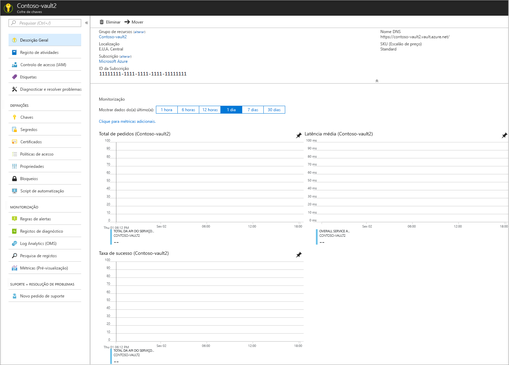

# Quickstart: Criar um cofre de chaves utilizando o portal Azure

Azure Key Vault é um serviço de nuvem que fornece uma loja segura para [chaves,](../keys/index.yml) [segredos](../secrets/index.yml)e [certificados.](../certificates/index.yml) Para obter mais informações sobre o Cofre de Chaves, consulte [Sobre o Cofre da Chave Azure;](overview.md) para obter mais informações sobre o que pode ser armazenado num cofre de chaves, consulte [sobre chaves, segredos e certificados.](about-keys-secrets-certificates.md)

Se não tiver uma subscrição do Azure, crie uma [conta gratuita](https://azure.microsoft.com/free/?WT.mc_id=A261C142F) antes de começar.

[!INCLUDE [cloud-shell-try-it.md](../../../includes/cloud-shell-try-it.md)]

Neste arranque rápido, cria-se um cofre-chave com o [portal Azure.](https://portal.azure.com) 

## Iniciar sessão no Azure

Inicie sessão no portal do Azure em https://portal.azure.com.

## Criar um cofre

1. A partir do menu do portal Azure, ou na página **Inicial,** selecione **Criar um recurso**.
2. Na caixa de busca, introduza **o Cofre de Chaves**.
3. Na lista de resultados, selecione **Key Vault**.
4. Na secção Key Vault, selecione **Criar**.
5. Na secção **Criar cofre de chaves**, forneça as seguintes informações:
    - **Nome**: é necessário um nome exclusivo. Para este arranque rápido, **usamos Contoso-vault2.** 
    - **Subscrição**: selecione uma subscrição.
    - No **Grupo de Recursos,** escolha **Criar novo** e insira um nome de grupo de recursos.
    - No menu pendente **Localização**, selecione uma localização.
    - Deixe as outras opções com os valores predefinidos.
6. Depois de fornecer as informações acima, selecione **Criar**.

Tome nota das duas propriedades listadas abaixo:

* **Nome do Cofre**: no exemplo, o nome é **Contoso-Vault2**. Irá utilizar este nome para outros passos.
* **URI do Cofre**: no exemplo, isto é https://contoso-vault2.vault.azure.net/. As aplicações que utilizam o cofre através da respetiva API têm de utilizar este URI.

Nesta altura, a sua conta do Azure é a única autorizada a realizar as operações neste novo cofre.

## Limpar os recursos

Outros inícios rápidos e tutoriais do Key Vault têm por base este início rápido. Se quiser continuar a trabalhar com os inícios rápidos e tutoriais subsequentes, pode manter estes recursos.
Quando já não for necessário, elimine o grupo de recursos, que elimina o Key Vault e todos os recursos relacionados. Para eliminar o grupo de recursos através do portal:

1. O nome do grupo de recursos na caixa Pesquisar, na parte superior do portal. Quando vir o grupo de recursos utilizado neste início rápido nos resultados da pesquisa, selecione-o.
2. Selecione **Eliminar grupo de recursos**.
3. Na caixa **ESCREVA O NOME DO GRUPO DE RECURSOS:**, escreva o nome do grupo de recursos e selecione **Eliminar**.

## Passos seguintes

Neste arranque rápido, criou um Cofre-Chave usando o portal Azure. Para saber mais sobre o Key Vault e como integrá-lo com as suas aplicações, continue para os artigos abaixo.

- Leia uma [visão geral do cofre da chave Azure](overview.md)
- Reveja a visão geral da segurança do [Cofre da Chave Azure](security-overview.md)
- Consulte o [guia do desenvolvedor do Azure Key Vault](developers-guide.md)
