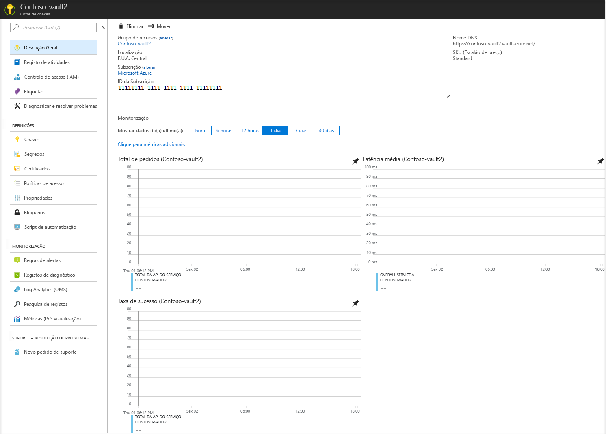

# Início Rápido: Definir e obter um segredo do Azure Key Vault com o portal do Azure

O Azure Key Vault é um serviço cloud que funciona como um arquivo de segredos seguro. Pode armazenar chaves, palavras-passe, certificados e outros segredos em segurança. Os cofres de chaves do Azure podem ser criados e geridos através do portal do Azure. Neste início rápido, vai criar um cofre de chaves e utilizá-lo para armazenar um segredo. Para obter mais informações sobre o Key Vault, reveja a [Descrição Geral](../general/overview.md).

Para mais informações sobre segredos, consulte (about-secrets.md).

## Pré-requisitos

- Uma subscrição Azure - [crie uma gratuitamente](https://azure.microsoft.com/free/?WT.mc_id=A261C142F).

## Iniciar sessão no Azure

Inicie sessão no portal do Azure em https://portal.azure.com.

## Criar um cofre

1. A partir do menu do portal Azure, ou na página **Inicial,** selecione **Criar um recurso**.
2. Na caixa Pesquisar, introduza **Key Vault**.
3. Na lista de resultados, selecione **Key Vault**.
4. Na secção Key Vault, selecione **Criar**.
5. Na secção **Criar cofre de chaves**, forneça as seguintes informações:
    - **Nome**: é necessário um nome exclusivo. Para este arranque rápido, **usamos Contoso-vault2.** 
    - **Subscrição**: selecione uma subscrição.
    - No **Grupo de Recursos,** escolha **Criar novo** e insira um nome de grupo de recursos.
    - No menu pendente **Localização**, selecione uma localização.
    - Deixe as outras opções com os valores predefinidos.
6. Depois de fornecer as informações acima, selecione **Criar**.

Tome nota das duas propriedades listadas abaixo:

* **Nome do Cofre**: no exemplo, o nome é **Contoso-Vault2**. Irá utilizar este nome para outros passos.
* **URI do Cofre**: no exemplo, isto é https://contoso-vault2.vault.azure.net/. As aplicações que utilizam o cofre através da respetiva API têm de utilizar este URI.

Também pode criar o Key Vault com Azure CLI e PowerShell: Criar cofre de chaves utilizando o Cofre de Chaves [PowerShell](../general/quick-create-powershell.md) 
 [Create usando O Azure CLI](../general/quick-create-cli.md)

Nesta altura, a sua conta do Azure é a única autorizada a realizar as operações neste novo cofre.

## Adicionar um segredo ao Key Vault

Para adicionar um segredo ao cofre, apenas tem de efetuar alguns passos adicionais. Neste caso, vamos adicionar uma palavra-passe que possa ser utilizada por uma aplicação. A palavra-passe chama-se **ExemploPassword** e armazenamos o valor de **hVFkk965BuUv** na sua.

1. Nas páginas das propriedades do Cofre-Chave, selecione **Secrets**.
2. Clique em **Gerar/Importar**.
3. No ecrã **Criar um segredo**, selecione os seguintes valores:
    - **Opções de carregamento**: Manual.
    - **Nome**: ExamplePassword.
    - **Valor**: hVFkk965BuUv
    - Deixe as outras opções com os valores predefinidos. Clique em **Criar**.

Depois de receber a mensagem de que o segredo foi criado com êxito, pode clicar no mesmo na lista. 

## Recupere um segredo do Cofre de Chaves

Se clicar na versão atual, pode ver o valor que especificou no passo anterior.

Ao clicar no botão "Mostrar Valor Secreto" no painel direito, pode ver o valor oculto. 

## Limpar recursos

Outros inícios rápidos e tutoriais do Key Vault têm por base este início rápido. Se quiser continuar a trabalhar com os inícios rápidos e tutoriais subsequentes, pode manter estes recursos.
Quando já não for necessário, elimine o grupo de recursos, que elimina o Key Vault e todos os recursos relacionados. Para eliminar o grupo de recursos através do portal:

1. O nome do grupo de recursos na caixa Pesquisar, na parte superior do portal. Quando vir o grupo de recursos utilizado neste início rápido nos resultados da pesquisa, selecione-o.
2. Selecione **Eliminar grupo de recursos**.
3. Na caixa **ESCREVA O NOME DO GRUPO DE RECURSOS:**, escreva o nome do grupo de recursos e selecione **Eliminar**.

## Passos seguintes

Neste arranque rápido, criaste um Cofre-Chave e guardaste um segredo nele. Para saber mais sobre o Key Vault e como integrá-lo com as suas aplicações, continue para os artigos abaixo.

- Leia uma [visão geral do cofre da chave Azure](../general/overview.md)
- Ler [Acesso seguro a um cofre de chaves](../general/secure-your-key-vault.md)
- Ver [utilizar o cofre de chaves com app Service Web App](../general/tutorial-net-create-vault-azure-web-app.md)
- Ver [Use Key Vault com aplicação implantada em VM](../general/tutorial-net-virtual-machine.md)
- Consulte o [guia do desenvolvedor do Azure Key Vault](../general/developers-guide.md)
- Rever [as melhores práticas do Azure Key Vault](../general/best-practices.md)
