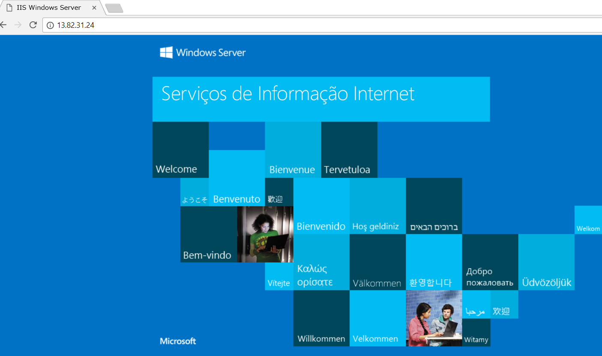

# Início rápido: Criar um Balanceador de Carga Standard para fazer o balanceamento de carga das VMs com o Portal do Azure

O balanceamento de carga oferece um nível mais elevado de disponibilidade e dimensionamento ao propagar os pedidos recebidos por várias máquinas virtuais. Pode utilizar o Portal do Azure para criar um balanceador de carga que faça o balanceamento de carga das máquinas virtuais (VMs). Este início rápido mostra-lhe como fazer o balanceamento de carga de VMs mediante a utilização de um Balanceador de Carga Standard.

Se não tiver uma subscrição do Azure, crie uma [conta gratuita](https://azure.microsoft.com/free/?WT.mc_id=A261C142F) antes de começar. 

## Iniciar sessão no Azure

Inicie sessão no Portal do Azure em [https://portal.azure.com](https://portal.azure.com).

## Criar um Balanceador de Carga Standard

Nesta secção, vai criar um balanceador de carga Standard que ajuda a máquinas virtuais de balanceamento de carga. O Balanceador de Carga Standard só suporta endereços IP Públicos Standard. Quando cria um Balanceador de Carga Standard, também tem de criar um endereço IP Público Standard novo que seja configurado como o front-end (denominado *LoadBalancerFrontend* por predefinição) para o mesmo. 

1. No canto superior esquerdo do ecrã, selecione **criar um recurso** > **rede** > **Balanceador de carga**.
2. Na **Noções básicas** separador da **criar Balanceador de carga** página, introduza ou selecione as seguintes informações, aceite as predefinições para as restantes definições e, em seguida, selecione **rever + criar**:

    | Definição                 | Valor                                              |
    | ---                     | ---                                                |
    | Subscrição               | Selecione a sua subscrição.    |    
    | Grupo de recursos         | Selecione **criar novo** e escreva *myResourceGroupSLB* na caixa de texto.|
    | Name                   | *myLoadBalancer*                                   |
    | Região         | Selecione **Europa Ocidental**.                                        |
    | Type          | Selecione **público**.                                        |
    | SKU           | Selecione **padrão**.                          |
    | Endereço IP público | Selecione **Criar novo**. |
    | Nome do endereço IP público              | Tipo *myPublicIP* na caixa de texto.   |
    |Zona de disponibilidade| Selecione **redundância de zona**.    |
3. Na **rever + criar** separador, selecione **criar**.   

    

## Criar recursos do Balanceador de carga

Nesta secção, configure as definições de Balanceador de carga para um conjunto de endereços de back-end, uma sonda de estado de funcionamento e especificar uma regra de Balanceador.

### Criar um conjunto de endereços de back-end

Para distribuir o tráfego para as VMs, um conjunto de endereços de back-end contém o IP de endereços virtuais (NICs) ligadas ao balanceador de carga. Criar o conjunto de endereços de back-end *myBackendPool* para incluir máquinas virtuais para o tráfego de internet de balanceamento de carga.

1. Selecione **todos os serviços** no menu da esquerda, selecione **todos os recursos**e, em seguida, selecione **myLoadBalancer** na lista de recursos.
2. Sob **configurações**, selecione **conjuntos back-end**, em seguida, selecione **Add**.
3. Sobre o **adicionar um conjunto de back-end** página, para nome, tipo *myBackendPool*, como o nome para seu conjunto de back-end e, em seguida, selecione **Add**.

### Criar uma sonda de estado de funcionamento

Para permitir que o Balanceador de carga monitorizar o estado da sua aplicação, pode utilizar uma sonda de estado de funcionamento. A sonda de estado de funcionamento dinamicamente adiciona ou remove as VMs a rotação do Balanceador de carga com base na respetiva resposta às verificações do Estado de funcionamento. Crie uma sonda de estado de funcionamento, *myHealthProbe*, para monitorizar o estado de funcionamento das VMs.

1. Selecione **todos os serviços** no menu da esquerda, selecione **todos os recursos**e, em seguida, selecione **myLoadBalancer** na lista de recursos.
2. Sob **configurações**, selecione **sondas de estado de funcionamento**, em seguida, selecione **Add**.
    
    | Definição | Valor |
    | ------- | ----- |
    | Name | Introduza *myHealthProbe*. |
    | Protocolo | Selecione **HTTP**. |
    | Porta | Enter *80*.|
    | Intervalo | Introduza *15* para o número de **intervalo** em segundos, entre tentativas da sonda. |
    | Limiar com funcionamento incorreto | Selecione *2* para o número de **limiar de mau estado de funcionamento** ou falhas consecutivas da sonda que devem ocorrer antes de uma VM é considerada em mau estado de funcionamento.|
    | Sonda de estado de funcionamento | Selecione *myHealthProbe*. |
4. Selecione **OK**.

### Crie uma regra de Balanceador de Carga
Pode utilizar uma regra de Balanceador de Carga para definir a forma como o tráfego é distribuído pelas VMs. Pode definir a configuração de IP de front-end do tráfego de entrada e o conjunto de IPs de back-end para receber o tráfego, juntamente com a porta de origem e de destino necessárias. Criar uma regra de Balanceador de carga *myLoadBalancerRuleWeb* para escutar a porta 80 no front-end *FrontendLoadBalancer* e enviar o tráfego de rede com balanceamento de carga para o conjunto de endereços de back-end *myBackEndPool* também através da porta 80. 

1. Selecione **todos os serviços** no menu da esquerda, selecione **todos os recursos**e, em seguida, selecione **myLoadBalancer** na lista de recursos.
2. Sob **configurações**, selecione **regras de balanceamento de carga**, em seguida, selecione **Add**.
3. Utilize estes valores para configurar a regra de balanceamento de carga:
    
    | Definição | Valor |
    | ------- | ----- |
    | Name | Introduza *myHTTPRule*. |
    | Protocolo | Selecione **TCP**. |
    | Porta | Enter *80*.|
    | Porta back-end | Enter *80*. |
    | Conjunto back-end | Selecione *myBackendPool*.|
    | Sonda de estado de funcionamento | Selecione *myHealthProbe*. |
4. Deixe o resto das predefinições e selecione **OK**.
4. Selecione **OK**.

## Criar servidores de back-end

Nesta secção, criar uma rede virtual, duas máquinas virtuais para o conjunto de back-end do Balanceador de carga e, em seguida, instalar o IIS nas máquinas virtuais para o ajudar a testar o Balanceador de carga.

### Criar uma rede virtual
1. No lado do canto superior esquerdo do ecrã, selecione **criar um recurso** > **rede** > **rede Virtual**.

1. Na **criar rede virtual**, introduza ou selecione estas informações:

    | Definição | Valor |
    | ------- | ----- |
    | Name | Introduza *myVNet*. |
    | Espaço de endereços | Enter *10.1.0.0/16*. |
    | Subscrição | Selecione a sua subscrição.|
    | Grupo de recursos | Selecione o recurso existente - *myResourceGroupSLB*. |
    | Localização | Selecione **Europa Ocidental**.|
    | Sub-rede - nome | Introduza *myBackendSubnet*. |
    | Sub-rede - Intervalo de endereços | Enter *10.1.0.0/24*. |
1. Deixe o resto dos padrões e selecione **criar**.

### Criar máquinas virtuais
Balanceador de carga Standard só suporta VMs com endereços de IP padrão no conjunto de back-end. Nesta secção, vai criar duas VMs (*myVM1* e *myVM2*) com um endereço IP público Standard em duas zonas diferentes (*zona 1* e *zona 2*) que são adicionados ao agrupamento de back-end de Balanceador de carga Standard, que foi criado anteriormente.

1. No lado do canto superior esquerdo do portal, selecione **criar um recurso** > **computação** > **Windows Server 2016 Datacenter**. 
   
1. Na **criar uma máquina virtual**, escreva ou selecione os seguintes valores no **Noções básicas** separador:
   - **Subscrição** > **grupo de recursos**: Selecione **myResourceGroupSLB**.
   - **Detalhes de instância** > **nome da Máquina Virtual**: Tipo *myVM1*.
   - **Detalhes de instância** > **região** > selecione **Europa Ocidental**.
   - **Detalhes de instância** > **opções de disponibilidade** > selecione **zonas de disponibilidade**. 
   - **Detalhes de instância** > **zona de disponibilidade** > selecione **1**.
  
1. Selecione o **Networking** separador ou selecione **seguinte: Discos**, em seguida, **seguinte: Funcionamento em rede**. 
   
   - Certifique-se de que estão selecionadas as seguintes:
       - **Rede virtual**: *myVnet*
       - **Sub-rede**: *myBackendSubnet*
       - **IP público** > selecione **criar novo**e, no **Criar endereço IP público** janela, para **SKU**, selecione **padrão**, e para **zona de disponibilidade**, selecione **redundância de zona**e, em seguida, selecione **OK**.
   - Para criar um novo grupo de segurança rede (NSG), um tipo de firewall, em **grupo de segurança de rede**, selecione **avançadas**. 
       1. Na **configurar grupo de segurança de rede** campo, selecione **criar nova**. 
       1. Tipo *myNetworkSecurityGroup*e selecione **OK**.
   - Para garantir a VM uma parte do conjunto de back-end do Balanceador de carga, conclua os seguintes passos:
        - Na **balanceamento de carga**, para **colocar esta máquina virtual por trás de uma solução de balanceamento de carga existente?**, selecione **Sim**.
        - Na **definições de balanceamento de carga**, para **opções de balanceamento de carga**, selecione **Balanceador de carga do Azure**.
        - Para **selecionar um balanceador de carga**, *myLoadBalancer*. 
1. Selecione o **gerenciamento** separador ou selecione **próxima** > **gestão**. Sob **monitorização**, defina **diagnósticos de arranque** para **desativar**. 
1. Selecione **Rever + criar**.   
1. Reveja as definições e, em seguida, selecione **criar**.
1. Siga os passos para criar uma segunda VM denominada *myVM2*, com um endereço IP público Standard SKU com o nome *myVM2-ip*, e **zona de disponibilidade** definição de **2** e todas as outras definições igual *myVM1*. 

### Criar regra NSG

Nesta secção, vai criar uma regra de grupo de segurança de rede para permitir ligações de entrada através de HTTP.

1. Selecione **todos os serviços** no menu da esquerda, selecione **todos os recursos**e, depois, de recursos lista select **myNetworkSecurityGroup** que se encontra no **myResourceGroupSLB** grupo de recursos.
2. Em **Definições**, selecione **Regras de segurança de entrada** e, em seguida, selecione **Adicionar**.
3. Introduza estes valores para a regra de segurança de entrada com o nome *myHTTPRule* para permitir ligações HTTP de entrada através da porta 80:
    - *Service Tag* - na **Origem**.
    - *Internet* - na **Etiqueta do serviço de origem**
    - *80* - nos **Intervalos de portas de destino**
    - *TCP* - no **Protocolo**
    - *Allow* - na **Ação**
    - *100* - na **Prioridade**
    - *myHTTPRule* - no nome
    - *Allow HTTP* - na descrição
4. Selecione **OK**.
 
### Instalar o IIS

1. Selecione **todos os serviços** no menu da esquerda, selecione **todos os recursos**e, em seguida, na lista de recursos, selecione **myVM1** que se encontra no  *myResourceGroupSLB* grupo de recursos.
2. Na página **Descrição geral**, selecione **Ligar** para estabelecer o RDP para a VM.
3. Inicie sessão na VM com o nome de utilizador *azureuser*.
4. No ambiente de trabalho do servidor, navegue para **Ferramentas Administrativas do Windows**>**Gestor de Servidor**.
5. No Gestor de servidor, selecione **para adicionar funções e funcionalidades**.
6. No **Assistente Adicionar Funções e Funcionalidades**, utilize os seguintes valores:
    - Na **selecionar tipo de instalação** , selecione **instalação baseada em funções ou baseada em recursos**.
    - Na **selecionar servidor de destino** , selecione **myVM1**
    - Na **selecionar função de servidor** , selecione **servidor Web (IIS)**
    - Siga as instruções para concluir o resto do assistente 
7. Repita os passos 1 a 6 para a máquina virtual *myVM2*.

## Testar o Balanceador de carga
1. Localize o endereço IP público do Balanceador de Carga no ecrã **Descrição geral**. Selecione **todos os serviços** no menu da esquerda, selecione **todos os recursos**e, em seguida, selecione **myPublicIP**.

2. Copie o endereço IP público e cole-o na barra de endereço do browser. A página predefinida do servidor Web do IIS é apresentada no browser.

      

Para ver o Balanceador de carga distribuir o tráfego por todas as três VMs que executar a sua aplicação, pode forçar a atualização seu navegador da web.

## Limpar recursos

Quando já não for necessário, elimine o grupo de recursos, Balanceador de carga e todos os recursos relacionados. Para tal, selecione o grupo de recursos (*myResourceGroupSLB*) que contenha o Balanceador de carga e, em seguida, selecione **eliminar**.

## Passos Seguintes

Neste início rápido, criou um Standard Balanceador de carga, anexou VMs ao mesmo, configurou a regra de tráfego do Balanceador de carga, sonda de estado de funcionamento e, em seguida, testou o Balanceador de carga. Para saber mais sobre o Balanceador de Carga do Azure, avance para os tutoriais do Balanceador de Carga do Azure.

> [!div class="nextstepaction"]
> [Tutoriais do Balanceador de Carga do Azure](tutorial-load-balancer-standard-public-zone-redundant-portal.md)
