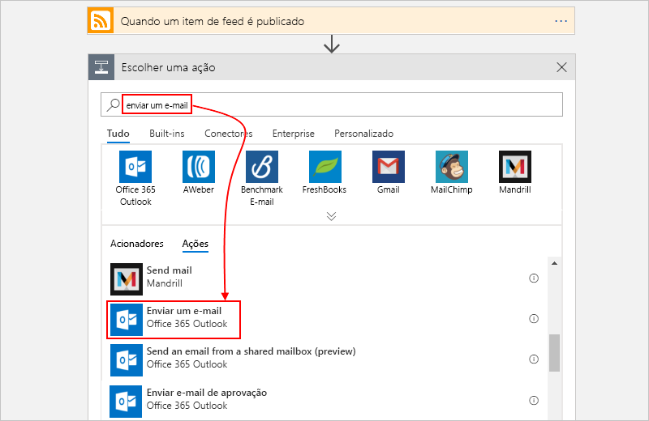
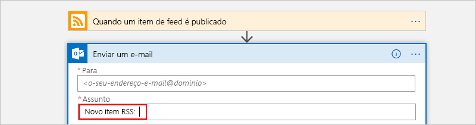
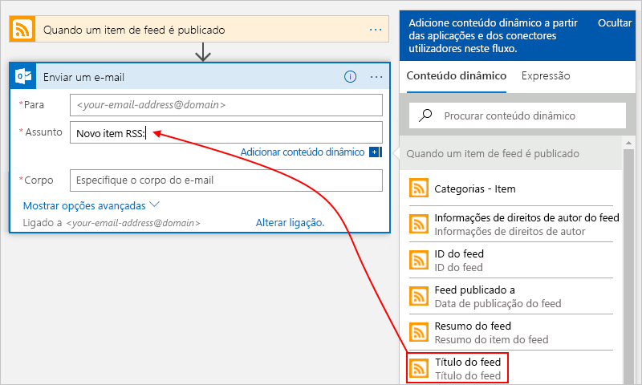
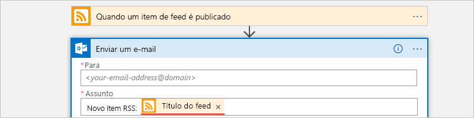
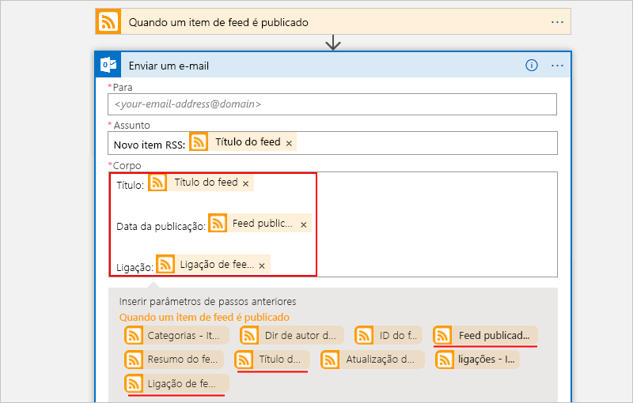

# Quickstart: Crie o seu primeiro fluxo de trabalho utilizando aplicações da Azure Logic - portal Azure

Este quickstart introduz os conceitos gerais básicos por trás de como construir o seu primeiro fluxo de trabalho utilizando [aplicações lógicas Azure](../logic-apps/logic-apps-overview.md), como criar uma aplicação lógica em branco, adicionar um gatilho e uma ação, e depois testar a sua aplicação lógica. Neste arranque rápido, você constrói uma aplicação lógica que verifica regularmente o feed RSS de um site para novos itens. Se existirem novos itens, a aplicação lógica envia uma mensagem de e-mail para cada item. Quando terminar, a aplicação lógica é semelhante a este fluxo de trabalho a alto nível:

Para este cenário, necessita de uma conta de e-mail de um serviço que é suportado por Aplicações Lógicas Azure, como Office 365 Outlook, Outlook.com ou Gmail. Para outros serviços de e-mail suportados, [reveja a lista de conectores aqui](https://docs.microsoft.com/connectors/). Neste exemplo, a aplicação lógica utiliza o Office 365 Outlook. Se utilizar um serviço de e-mail diferente, os passos gerais gerais gerais gerais gerais são os mesmos, mas a interface de utilizador pode diferir ligeiramente.

Além disso, se não tiver uma subscrição do Azure, [inscreva-se numa conta do Azure gratuita](https://azure.microsoft.com/free/).

## Iniciar sessão no portal do Azure

Inicie sessão no [portal do Azure](https://portal.azure.com) com as credenciais da sua conta do Azure.

## Criar uma aplicação lógica

1. A partir da página inicial do Azure, na caixa de pesquisa, encontre e selecione **Aplicações Lógicas**.

   

1. Na página apps **lógicas,** selecione **Adicionar**.

   

1. No painel da **Aplicação Lógica,** forneça detalhes sobre a sua aplicação lógica, como mostrado abaixo. Depois de terminar, selecione **Criar**.

   

   | Propriedade | Valor | Descrição |
   |----------|-------|-------------|
   | **Nome** | < *> de nome lógica-app* | O nome da sua aplicação lógica, que pode conter apenas letras, números, hífenes (`-`), sublinha (`_`), parênteses (`(`, `)`) e períodos (`.`). Este exemplo usa "My-First-Logic-App". |
   | **Subscrição** | <*Azure-subscription-name*> | O seu nome de subscrição Azure |
   | **Grupo de recursos** | <> de nome de *grupo azure-recursos* | O nome do grupo de [recursos Azure](../azure-resource-manager/management/overview.md) usado para organizar recursos relacionados. Este exemplo usa "My-First-LA-RG". |
   | **Localização** | <> *da região de Azure* | A região onde armazenar informações de aplicações lógicas. Este exemplo usa "West US". |
   | **Log Analytics** | Desativado | Mantenha a definição **Desativado** para o registo de diagnósticos. |
   ||||

1. Depois de o Azure implementar a sua aplicação, na barra de ferramentas Azure, selecione **Notificações** > **vá recorrer para** a sua aplicação lógica implementada.

   

   Ou, pode encontrar e selecionar a sua aplicação lógica digitando o nome na caixa de pesquisa.

   O Estruturador da Aplicação Lógica é aberto e mostra uma página com um vídeo de introdução e os acionadores habitualmente utilizados. Em **Modelos**, selecione **Aplicação Lógica em Branco**.

   

Em seguida, adicione um [acionador](../logic-apps/logic-apps-overview.md#logic-app-concepts) que é desencadeado quando um novo item do feed RSS é apresentado. Todas as aplicações lógicas têm de iniciar com um acionador, que é desencadeado quando um evento específico acontece ou quando uma condição específica é cumprida. Cada vez que o gatilho dispara, o motor Azure Logic Apps cria uma instância de aplicação lógica que inicia e executa o seu fluxo de trabalho.

## Adicione o gatilho RSS

1. No **Logic App Designer,** sob a caixa de pesquisa, selecione **All**.

1. Na caixa de pesquisa, introduza `rss` para encontrar o conector RSS. A partir da lista de gatilhos, selecione o gatilho **Quando um item de alimentação é publicado.**

   

1. Forneça esta informação para o seu gatilho como mostrado e descrito aqui:

   

   | Propriedade | Valor | Descrição |
   |----------|-------|-------------|
   | **O URL do feed RSS** | `http://feeds.reuters.com/reuters/topNews` | A ligação para o feed RSS que quer monitorizar |
   | **Intervalo** | 1 | O número de intervalos de espera entre verificações |
   | **Frequência** | Minuto | A unidade de tempo para cada intervalo entre verificações  |
   ||||

   Em conjunto, o intervalo e a frequência definem o agendamento para o acionador da aplicação lógica. Esta aplicação lógica verifica o feed a cada minuto.

1. Para colapsar os detalhes do gatilho por enquanto, clique dentro da barra de título do gatilho.

   

1. Guarde a aplicação lógica. Na barra de ferramentas de design, selecione **Guardar**.

A sua aplicação lógica está agora ativa, mas não faz mais nada que não verificar o feed RSS. Por isso, adicione uma ação que responde quando o acionador é acionado.

## Adicione a ação "enviar e-mail"

Adicione agora uma [ação](../logic-apps/logic-apps-overview.md#logic-app-concepts) que envia um e-mail quando um novo item aparecer no feed RSS.

1. Sob o **gatilho Quando um item de alimentação é publicado,** selecione **Novo passo**.

   

1. Em **'Escolha uma ação'** e a caixa de pesquisa, selecione **All**.

1. Na caixa de pesquisa, introduza `send an email` para encontrar conectores que ofereçam esta ação. Na lista de ações, selecione a ação de "enviar um e-mail" para o serviço de e-mail que pretende utilizar. Este exemplo utiliza o conector Office 365 Outlook, que tem o Envio de uma ação de **e-mail.**

   

   Para filtrar a lista de ações para um serviço ou aplicação específico, pode selecionar primeiro essa aplicação ou serviço:

   * Relativamente a contas escolares ou profissionais do Azure, selecione Office 365 Outlook (Outlook do Office 365).
   * Quanto a contas Microsoft pessoais, selecione Outlook.com.

1. Se o seu conector de e-mail selecionado lhe pedir para autenticar a sua identidade, complete esse passo agora para criar uma ligação entre a sua aplicação lógica e o seu serviço de e-mail.

   > [!NOTE]
   > Neste exemplo específico, autentica manualmente a sua identidade. No entanto, os conectores que exigem a autenticação diferem nos tipos de autenticação que suportam. Também tem opções para configurar a forma como pretende lidar com a autenticação. Por exemplo, quando utiliza modelos do Gestor de Recursos Azure para implementação, pode parametificar e melhorar a segurança nas inputs que pretende alterar com frequência ou facilmente, como informações de ligação. Para mais informações, consulte estes tópicos:
   >
   > * [Parâmetros de modelo para implantação](../logic-apps/logic-apps-azure-resource-manager-templates-overview.md#template-parameters)
   > * [Autorizar ligações OAuth](../logic-apps/logic-apps-deploy-azure-resource-manager-templates.md#authorize-oauth-connections)
   > * [Autenticar acesso com identidades geridas](../logic-apps/create-managed-service-identity.md)
   > * [Autenticar ligações para implementação de aplicações lógicas](../logic-apps/logic-apps-azure-resource-manager-templates-overview.md#authenticate-connections)

1. Na ação **Enviar uma mensagem de e-mail**, especifique os dados que pretende que a mensagem inclua.

   1. Na caixa **Para**, introduza o endereço de e-mail do destinatário. Para efeitos de teste, pode utilizar o seu endereço de e-mail.

      Por agora, ignore a lista **Adicionar conteúdo dinâmico** que é apresentada. Quando clica no interior de algumas caixas de edição, esta lista aparece e mostra os parâmetros disponíveis do passo anterior que pode incluir como entradas no fluxo de trabalho.

   1. Na caixa **Assunto**, introduza este texto com um espaço em branco à direita: `New RSS item: `

      

   1. Na lista **Adicionar conteúdo dinâmico**, selecione **Título de feed** para incluir o título do item RSS.

      

      Quando estiver pronto, o assunto do e-mail terá o aspeto deste exemplo:

      

      Se um ciclo "For each" aparecer no estruturador, significa que selecionou token para uma matriz, como o token **categories-item**. Para estes tipos de tokens, o estruturador adiciona automaticamente este ciclo à volta da ação que faz referência a esse token. Desta forma, a aplicação lógica realiza a mesma ação em cada item da matriz. Para remover o laço, selecione as **elipses** **(...** ) na barra de título do loop e, em seguida, selecione **Delete**.

   1. Na caixa **Corpo**, introduza este texto e selecione estes tokens para o corpo da mensagem de e-mail. Para adicionar linhas em branco a uma caixa de edição, prima Shift + Enter.

      

      | Propriedade | Descrição |
      |----------|-------------|
      | **Título do feed** | O título do item |
      | **Feed publicado em** | A data e hora de publicação do item |
      | **Ligação principal do feed** | O URL do item |
      |||

1. Guarde a aplicação lógica.

Em seguida, teste a aplicação lógica.

## Executar a aplicação lógica

Para iniciar manualmente a sua aplicação lógica, na barra de ferramentas de design, selecione **Run**. Em alternativa, aguarde que a aplicação lógica verifique o feed RSS de acordo com o agendamento especificado (a cada minuto). Se o feed RSS tiver itens novos, a sua aplicação lógica envia um e-mail para cada item novo. Caso contrário, a aplicação lógica aguarda até o intervalo seguinte antes de verificar novamente. Se não receber nenhum e-mail, veja a pasta de e-mail de lixo.

Por exemplo, eis um exemplo de uma mensagem de e-mail enviada por esta aplicação lógica.

Tecnicamente, quando o gatilho verifica o feed RSS e encontra novos itens, o gatilho dispara e o motor Azure Logic Apps cria uma instância do fluxo de trabalho da sua lógica que executa as ações no fluxo de trabalho. Se o acionador não encontrar itens novos, este não é acionado e "ignora" a criação de instâncias do fluxo de trabalho.

Parabéns, você agora construiu com sucesso e executou a sua primeira aplicação lógica com o portal Azure.

## Limpar recursos

Quando já não precisar deste exemplo, elimine o grupo de recursos que contém a aplicação lógica e os recursos relacionados.

1. No menu Principal Azure, selecione **Grupos de Recursos**e, em seguida, selecione o grupo de recursos da sua aplicação lógica. No painel de **visão geral,** selecione **Eliminar o grupo de recursos**.

   

1. Quando aparecer o painel de confirmação, introduza o nome do grupo de recursos e selecione **Delete**.

   

> [!NOTE]
> Quando elimina uma aplicação lógica, não são instanciadas novas execuções. Todas as execuções em curso e pendentes são canceladas. Se tiver milhares de execuções, o cancelamento pode demorar muito tempo a concluir.

## Passos seguintes

Neste início rápido, criou a sua primeira aplicação lógica que verifica a existência de atualizações RSS com base no seu agendamento especificado (a cada minuto) e realiza uma ação (envia e-mail) quando existem atualizações. Para saber mais, continue com este tutorial que cria fluxos de trabalho mais avançados com base num agendamento:

> [!div class="nextstepaction"]
> [Verificar o tráfego com uma aplicação lógica baseada num agendamento](../logic-apps/tutorial-build-schedule-recurring-logic-app-workflow.md)
