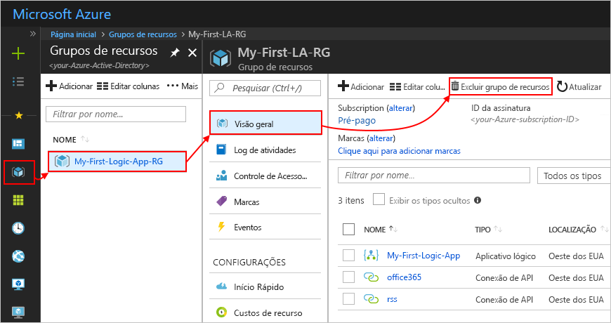

# Quickstart: Crie o seu primeiro fluxo de trabalho de Apps Lógicas - Portal Azure

Este quickstart explica como construir o seu primeiro fluxo de trabalho em [Azure Logic Apps](logic-apps-overview.md) através do [portal Azure](https://portal.azure.com). Este guia introdutório também explica conceitos básicos do serviço De aplicações lógicas, incluindo como criar uma nova aplicação lógica, adicionar um gatilho e ação à sua aplicação lógica, e testar a sua aplicação lógica. Siga este quickstart para construir uma aplicação lógica de exemplo que verifica regularmente um feed RSS e envia uma notificação de e-mail para novos itens. A imagem que se segue mostra o fluxo de trabalho de alto nível desta aplicação lógica de exemplo:

Se quiser aprender a criar e gerir a sua primeira aplicação lógica através de outras interfaces e aplicações, consulte os arranques rápidos destas outras Apps lógicas: 

* [Criar e gerir aplicações lógicas utilizando a Interface Azure Command-Line (Azure CLI)](quickstart-logic-apps-azure-cli.md)
* [Criar e gerir aplicativos lógicos no Código do Estúdio Visual](quickstart-create-logic-apps-visual-studio-code.md)
* [Criar e gerir aplicativos lógicos no Estúdio Visual](quickstart-create-logic-apps-with-visual-studio.md)

## Pré-requisitos

* Uma conta e subscrição do Azure. Se não tiver uma, [inscreva-se numa conta Azure gratuita.](https://azure.microsoft.com/free/?WT.mc_id=A261C142F)

* Uma conta de e-mail de um serviço que é suportado por Aplicações Lógicas (como Office 365 Outlook ou Outlook.com). Para outros fornecedores de e-mail apoiados, [reveja a lista de conectores.](/connectors/)

    > [!IMPORTANT]
    > Se estiver a utilizar o conector do [Gmail,](/connectors/gmail/)note que apenas as contas G Suite podem utilizar este conector sem restrições em Aplicações Lógicas. Se tiver uma conta gmail de consumo, só pode utilizar este conector com serviços específicos aprovados pela Google, a menos que [crie uma aplicação para clientes da Google para utilizar para autenticação com o seu conector Gmail](/connectors/gmail/#authentication-and-bring-your-own-application). Para obter mais informações, consulte [as políticas de segurança de dados e privacidade para conectores google em Azure Logic Apps](../connectors/connectors-google-data-security-privacy-policy.md).

* Se a sua aplicação lógica necessitar de comunicar através de uma firewall que limite o tráfego a endereços IP específicos, essa firewall precisa de permitir o acesso tanto aos endereços IP [de entrada](logic-apps-limits-and-config.md#inbound) *como* [de saída](logic-apps-limits-and-config.md#outbound) utilizados pelo serviço De aplicações lógicas ou ao tempo de funcionamento na região de Azure, onde existe a sua aplicação lógica. Se a sua aplicação lógica também utilizar [conectores geridos](../connectors/apis-list.md#managed-api-connectors)– como o conector Office 365 Outlook ou o conector SQL, ou utilizar [conectores personalizados](/connectors/custom-connectors/)– a firewall também precisa de permitir o acesso de *todos os* [endereços IP de saída geridos](logic-apps-limits-and-config.md#outbound) do conector na região Azure da sua aplicação lógica.

## Criar uma aplicação lógica

1. Inicie sessão no [portal do Azure](https://portal.azure.com) com as credenciais da sua conta do Azure.

1. Na caixa de pesquisa do portal Azure, insira `logic apps` e selecione **Aplicações Lógicas**.

   

1. Na página **'Aplicações lógicas',** selecione **Adicionar**.

   

1. No painel **de aplicações lógicas,** forneça detalhes básicos e configurações para a sua aplicação lógica. Crie um novo [grupo de recursos](../azure-resource-manager/management/overview.md#terminology) para efeitos desta aplicação lógica de exemplo.

   | Propriedade | Valor | Descrição |
   |----------|-------|-------------|
   | **Nome** | <*lógica-app-nome*> | O nome da sua aplicação lógica, que deve ser única em todas as regiões. O nome só pode conter letras, números, hífens `-` (), sublinhados `_` ( , parênteses ( `(` , ) e `)` períodos `.` (). Este exemplo utiliza "My-First-Logic-App". |
   | **Subscrição** | <*Nome de subscrição Azure*> | O nome da sua assinatura Azure. |
   | **Grupo de recursos** | <*Nome de grupo Azure-recursos*> | O nome do grupo de [recursos Azure](../azure-resource-manager/management/overview.md#terminology) em que está a criar a aplicação lógica. O nome do grupo de recursos deve ser único em todas as regiões. Este exemplo usa "My-First-LA-RG". |
   | **Localização** | <*Região de Azure*> | A região de Azure onde armazenar a sua informação lógica de aplicações. Este exemplo usa "West US". |
   | **Log Analytics** | Desligado | A definição para a sessão de diagnóstico, que está **desligada** por defeito. Para este exemplo, mantenha a definição **Off.** |
   ||||

   

1. Quando estiver pronto, selecione **Review + Create**. Confirme os detalhes que forneceu e selecione **Criar**.

1. Depois de a Azure implementar com sucesso a sua aplicação, selecione **Ir para o recurso**. Ou, pode encontrar e selecionar a sua aplicação lógica digitando o nome na caixa de pesquisa.

   

   O Estruturador da Aplicação Lógica é aberto e mostra uma página com um vídeo de introdução e os acionadores habitualmente utilizados. Em **Modelos**, selecione **Aplicação Lógica em Branco**.

   

Em seguida, [adicione um gatilho à sua aplicação lógica.](#add-rss-trigger)

## Adicione o gatilho RSS

Todas as aplicações lógicas devem começar com um [gatilho](../logic-apps/logic-apps-overview.md#how-do-logic-apps-work), que dispara quando um evento específico acontece, ou quando uma condição específica é cumprida. Cada vez que o gatilho encontra novos itens, dispara e o motor De Aplicações Lógicas cria uma instância lógica que inicia e executa o seu fluxo de trabalho. Se o gatilho não encontrar novos itens, o gatilho não dispara e não cria um caso ou executa o fluxo de trabalho nesta verificação.

Neste exemplo de arranque rápido, depois de [criar uma aplicação lógica](#create-your-logic-app), adiciona-se um gatilho que verifica novos itens num feed RSS e dispara quando há novos itens. Também pode criar aplicações lógicas com diferentes tipos de gatilhos, como no tutorial para [criar fluxos de trabalho baseados em aprovação automática.](tutorial-process-mailing-list-subscriptions-workflow.md)

1. No **Logic App Designer,** sob a caixa de pesquisa, selecione **All**.

1. Para encontrar o conector RSS, na caixa de pesquisa, insira `rss` . Na lista **'Gatilhos',** selecione o gatilho RSS, **quando for publicado um item de alimentação**.

   

1. Forneça o URL de alimentação RSS para o seu gatilho. Em seguida, defina o horário do seu gatilho definindo o intervalo e a frequência.

   | Propriedade | Valor | Descrição |
   | -------- | ----- | ----------- |
   | **O URL do feed RSS** | <*RSS-feed-URL*> | O URL do feed RSS que deseja monitorizar. Este exemplo utiliza o feed RSS do Wall Street Journal em `https://feeds.a.dj.com/rss/RSSMarketsMain.xml` . No entanto, para efeitos deste exemplo, pode utilizar qualquer feed RSS que não necessite de autorização HTTP. Escolha um feed RSS que publique com frequência, para que possa testar a sua aplicação lógica facilmente mais tarde. |
   | **Intervalo** | 1 | O número de intervalos a aguardar entre as verificações de alimentação RSS. Este exemplo utiliza intervalos de 1 minuto. |
   | **Frequência** | Minuto | A unidade de tempo para cada intervalo entre as verificações de alimentação RSS. Este exemplo utiliza intervalos de 1 minuto. |
   ||||

   

1. Desmaie os detalhes do gatilho por enquanto clicando dentro da sua barra de título.

   

1. Guarde a sua aplicação lógica selecionando **Save** na barra de ferramentas do designer.

A sua aplicação lógica está agora ao vivo, no entanto, não faz outra coisa senão verificar o feed RSS. Em seguida, [adicione uma ação](#add-email-action) para definir o que acontece quando o seu gatilho dispara.

## Adicione a ação "enviar e-mail"

Depois de [adicionar um gatilho para a sua aplicação lógica,](#add-rss-trigger)deve então adicionar uma [ação](../logic-apps/logic-apps-overview.md#logic-app-concepts) para determinar a resposta quando a sua aplicação lógica verifica o feed RSS e aparece um novo item. Também pode criar aplicações lógicas com ações muito mais complexas, como no tutorial para [o processamento de e-mails com Apps Lógicas, Funções Azure e Azure Storage.](./tutorial-process-email-attachments-workflow.md)

> [!NOTE]
> Este exemplo utiliza o Office 365 Outlook como serviço de e-mail. Se estiver a utilizar outro serviço de e-mail suportado na sua aplicação lógica, a interface do utilizador pode parecer diferente. No entanto, os conceitos básicos de ligação a outro serviço de e-mail permanecem os mesmos.

1. Sob o gatilho **Quando um item de alimentação é publicado,** selecione Novo **passo**.

   

1. Em **Escolha uma ação** e a caixa de pesquisa, selecione **All**.

1. Na caixa de pesquisa, `send an email` insira para que possa encontrar conectores que ofereçam esta ação. Para filtrar a lista de ações para uma aplicação ou serviço específico, pode selecionar primeiro essa aplicação ou serviço.

   Por exemplo, se estiver a utilizar uma conta de trabalho ou escola da Microsoft e quiser utilizar o Office 365 Outlook, selecione **Office 365 Outlook**. Ou, se estiver a utilizar uma conta pessoal da Microsoft, pode selecionar Outlook.com. Este exemplo continua com o Office 365 Outlook:

   

   Agora pode encontrar e selecionar mais facilmente a ação que pretende utilizar, por `send an email` exemplo:

   

1. Se o conector de e-mail selecionado lhe pedir para autenticar a sua identidade, complete esse passo agora. Tem de criar uma ligação entre a sua aplicação lógica e o seu serviço de e-mail para que este exemplo funcione. 

    > [!NOTE]
    > Este exemplo mostra a autenticação manual do conector Do Office 365 Outlook. No entanto, outros conectores podem suportar diferentes tipos de autenticação.
    > Também pode lidar com a autenticação para as suas aplicações lógicas de diferentes formas, dependendo do seu caso de utilização. Por exemplo, se utilizar os modelos do Gestor de Recursos Azure para implantação, pode parametrizar para melhorar a segurança nas entradas que mudam frequentemente, como detalhes de ligação. Para obter mais informações, veja estes tópicos:
   > * [Parâmetros do modelo para implantação](../logic-apps/logic-apps-azure-resource-manager-templates-overview.md#template-parameters)
   > * [Autorizar ligações OAuth](../logic-apps/logic-apps-deploy-azure-resource-manager-templates.md#authorize-oauth-connections)
   > * [Autenticar acesso com identidades geridas](../logic-apps/create-managed-service-identity.md)
   > * [Autenticar ligações para implementação de aplicações lógicas](../logic-apps/logic-apps-azure-resource-manager-templates-overview.md#authenticate-connections)

1. No Enviar uma ação **por e-mail,** especifique quais as informações a incluir na notificação por e-mail.

   1. Na caixa **Para**, introduza o endereço de e-mail do destinatário. Para este exemplo, utilize o seu endereço de e-mail.

        > [!NOTE]
        > A lista **de conteúdos dinâmicos Add** aparece quando clica dentro da caixa **''To'** e de certas outras caixas de entrada no Logic Apps Designer. Este exemplo utiliza conteúdo dinâmico num passo posterior. A lista **de conteúdos dinâmicos Add** mostra quaisquer saídas disponíveis do passo anterior, que pode utilizar como entradas para a ação atual.

   1. Na caixa **Assunto,** insira o assunto para a sua notificação por e-mail. Para este exemplo, insira o seguinte texto com um espaço em branco em fuga: `New RSS item: `

      

   1. A partir da lista **de conteúdos dinâmicos Add,** selecione **o título 'Feed',** que é a saída do gatilho, **quando for publicado um item de alimentação**. A sua notificação por e-mail utiliza esta saída para obter o título do artigo RSS.

      

      > [!TIP]
      > Na lista de conteúdos dinâmicos, se não aparecerem saídas do gatilho **Quando um item de alimentação é publicado,** junto ao cabeçalho da ação, selecione Ver **mais**.
      > 
      > 

      Quando estiver pronto, o assunto do e-mail terá o aspeto deste exemplo:

      

      Se aparecer um laço "Para cada um" no designer, então selecionou um símbolo para uma matriz; por exemplo, o **token categorias-Item.** Para estes tipos de tokens, o estruturador adiciona automaticamente este ciclo à volta da ação que faz referência a esse token. Desta forma, a aplicação lógica realiza a mesma ação em cada item da matriz. Para remover o laço, selecione as **elipses** **(...**) na barra de título do loop e, em seguida, selecione **Delete**.

   1. Na caixa **Body,** insira o conteúdo para o corpo de e-mail. Neste exemplo, o conteúdo inclui três propriedades com texto descritivo para cada: `Title:` , a propriedade do título de **alimentação;** `Date published:` , o Feed publicado **na** propriedade; `Link:` e, a propriedade de **feed principal** link. Para adicionar linhas em branco a uma caixa de edição, prima Shift + Enter.

      | Propriedade | Descrição |
      |----------|-------------|
      | **Título do feed** | O título do item |
      | **Feed publicado em** | A data e hora de publicação do item |
      | **Ligação principal do feed** | O URL do item |
      |||

      

1. Guarde a sua aplicação lógica. **Selecione Guardar** no menu do designer.

Em seguida, [teste que a sua aplicação lógica funciona.](#test-logic-app)

## Executar a aplicação lógica

Depois de criar a sua aplicação lógica de exemplo, confirme que o seu fluxo de trabalho está configurado corretamente. Pode esperar que a aplicação lógica verifique o seu feed RSS com base no calendário especificado. Ou, pode executar manualmente a sua aplicação lógica selecionando **Run** na barra de ferramentas Logic Apps Designer, como mostra na imagem seguinte. 

Se o feed RSS tiver itens novos, a sua aplicação lógica envia um e-mail para cada item novo. Caso contrário, a sua aplicação lógica aguarda até ao intervalo seguinte para verificar novamente o feed RSS. 

A imagem que se segue mostra uma notificação de e-mail de amostra a partir desta aplicação lógica de exemplo. O e-mail inclui os detalhes de cada item de feed RSS selecionado no designer, bem como o texto descritivo adicionado para cada um.

Se não estiver a receber e-mails de notificação da aplicação lógica como esperado:

* Verifique a pasta de lixo ou spam da sua conta de e-mail, caso a mensagem tenha sido filtrada incorretamente.
* Certifique-se de que o feed RSS que está a utilizar publicou artigos desde a última verificação agendada ou manual.

## Limpar os recursos

Quando terminar de testar esta aplicação lógica de amostra, limpe a aplicação lógica e quaisquer recursos relacionados, eliminando o grupo de recursos que criou para este exemplo.

> [!NOTE]
> Quando [elimina uma aplicação lógica,](manage-logic-apps-with-azure-portal.md#delete-logic-apps)não são instantâneas novas execuções. Todas as execuções em curso e pendentes são canceladas. Se tiver milhares de execuções, o cancelamento pode demorar muito tempo a concluir.

1. Na caixa de pesquisa Azure, insira `resource groups` e, em seguida, selecione **grupos de Recursos**.

   

1. Encontre e selecione o grupo de recursos da sua aplicação lógica. No **painel de visão** geral, selecione **Eliminar o grupo de recursos**.

   

1. Quando o painel de confirmação aparecer, insira o nome do grupo de recursos e selecione **Delete**.

   

## Passos seguintes

Neste quickstart, criou a sua primeira aplicação lógica no portal Azure para verificar um feed RSS para atualizações num horário e enviar uma notificação por e-mail sobre cada novo item de feed. 

Para aprender a criar fluxos de trabalho mais avançados baseados em horários em Aplicações Lógicas, consulte o seguinte tutorial:

> [!div class="nextstepaction"]
> [Verificar o tráfego com uma aplicação lógica baseada num agendamento](../logic-apps/tutorial-build-schedule-recurring-logic-app-workflow.md)