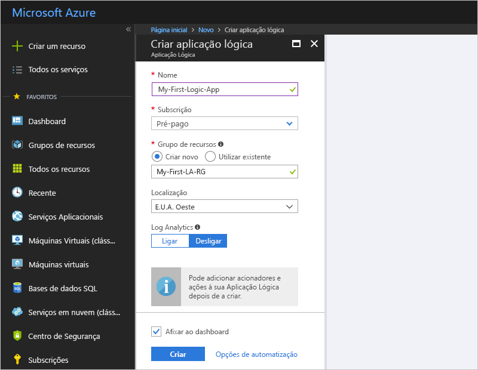

# Início rápido: criar seu primeiro fluxo de trabalho usando os aplicativos lógicos do Azure-portal do Azure

Este guia de início rápido apresenta os conceitos gerais básicos por trás de como criar seu primeiro fluxo de trabalho usando [aplicativos lógicos do Azure](../logic-apps/logic-apps-overview.md), como criar um aplicativo lógico em branco, adicionar um gatilho e uma ação e, em seguida, testar seu aplicativo lógico. Neste guia de início rápido, você cria um aplicativo lógico que verifica regularmente o RSS feed de um site para novos itens. Se existirem novos itens, a aplicação lógica envia uma mensagem de e-mail para cada item. Quando terminar, a aplicação lógica é semelhante a este fluxo de trabalho a alto nível:

Para esse cenário, você precisa de uma conta de email de um serviço com suporte dos aplicativos lógicos do Azure, como o Office 365 Outlook, Outlook.com ou gmail. Para outros serviços de email com suporte, [examine a lista de conectores aqui](https://docs.microsoft.com/connectors/). Neste exemplo, o aplicativo lógico usa o Outlook do Office 365. Se você usar um serviço de email diferente, as etapas gerais geral serão as mesmas, mas a interface do usuário poderá ser ligeiramente diferente.

Além disso, se não tiver uma subscrição do Azure, [inscreva-se numa conta do Azure gratuita](https://azure.microsoft.com/free/).

## Iniciar sessão no portal do Azure

Inicie sessão no [portal do Azure](https://portal.azure.com) com as credenciais da sua conta do Azure.

## Criar uma aplicação lógica

1. Na home page do Azure, na caixa de pesquisa, localize e selecione **aplicativos lógicos**.

   

1. Na página **aplicativos lógicos** , selecione **Adicionar**.

   

1. No painel **aplicativo lógico** , forneça detalhes sobre seu aplicativo lógico, conforme mostrado abaixo. Depois de terminar, selecione **criar**.

   

   | Propriedade | Valor | Descrição |
   |----------|-------|-------------|
   | **Nome** | <*lógica-nome do aplicativo*> | O nome do aplicativo lógico, que pode conter apenas letras, números, hifens (`-`), sublinhados (`_`), parênteses (`(`, `)`) e pontos (`.`). Este exemplo usa "My-First-Logic-app". |
   | **Subscrição** | <*Azure-subscription-name*> | O nome da sua assinatura do Azure |
   | **Grupo de recursos** | <*Azure-Resource-Group-name*> | O nome do [grupo de recursos do Azure](../azure-resource-manager/resource-group-overview.md) usado para organizar os recursos relacionados. Este exemplo usa "My-First-LA-RG". |
   | **Localização** | <*do Azure-region*> | A região onde armazenar as informações do aplicativo lógico. Este exemplo usa "oeste dos EUA". |
   | **Log Analytics** | Desativado | Mantenha a definição **Desativado** para o registo de diagnósticos. |
   ||||

1. Depois que o Azure implantar seu aplicativo, na barra de ferramentas do Azure, selecione **notificações** > **ir para o recurso** para seu aplicativo lógico implantado.

   

   Ou, você pode encontrar e selecionar seu aplicativo lógico digitando o nome na caixa de pesquisa.

   O Estruturador da Aplicação Lógica é aberto e mostra uma página com um vídeo de introdução e os acionadores habitualmente utilizados. Em **Modelos**, selecione **Aplicação Lógica em Branco**.

   

Em seguida, adicione um [acionador](../logic-apps/logic-apps-overview.md#logic-app-concepts) que é desencadeado quando um novo item do feed RSS é apresentado. Todas as aplicações lógicas têm de iniciar com um acionador, que é desencadeado quando um evento específico acontece ou quando uma condição específica é cumprida. Cada vez que o gatilho é acionado, o mecanismo de aplicativos lógicos do Azure cria uma instância de aplicativo lógico que inicia e executa o fluxo de trabalho.

## Adicionar o gatilho de RSS

1. No **Designer de aplicativo lógico**, na caixa de pesquisa, selecione **tudo**.

1. Na caixa de pesquisa, digite `rss` para localizar o conector RSS. Na lista de gatilhos, selecione o gatilho **quando um item de feed é publicado** .

   

1. Forneça essas informações para seu gatilho, conforme mostrado e descrito aqui:

   

   | Propriedade | Valor | Descrição |
   |----------|-------|-------------|
   | **O URL do feed RSS** | `http://feeds.reuters.com/reuters/topNews` | A ligação para o feed RSS que quer monitorizar |
   | **Intervalo** | 1 | O número de intervalos de espera entre verificações |
   | **Frequência** | Minuto | A unidade de tempo para cada intervalo entre verificações  |
   ||||

   Em conjunto, o intervalo e a frequência definem o agendamento para o acionador da aplicação lógica. Esta aplicação lógica verifica o feed a cada minuto.

1. Para recolher os detalhes do gatilho por enquanto, clique dentro da barra de título do gatilho.

   

1. Guarde a aplicação lógica. Na barra de ferramentas do designer, selecione **salvar**.

A sua aplicação lógica está agora ativa, mas não faz mais nada que não verificar o feed RSS. Por isso, adicione uma ação que responde quando o acionador é acionado.

## Adicionar a ação "enviar email"

Agora, adicione uma [ação](../logic-apps/logic-apps-overview.md#logic-app-concepts) que envia um email quando um novo item é exibido no RSS feed.

1. No gatilho **quando um item do feed é publicado** , selecione **nova etapa**.

   

1. Em **escolher uma ação** e a caixa de pesquisa, selecione **tudo**.

1. Na caixa de pesquisa, insira `send an email` para localizar conectores que oferecem essa ação. Na lista ações, selecione a ação "enviar um email" para o serviço de email que você deseja usar. Este exemplo usa o conector do Outlook do Office 365, que tem a ação **enviar um email** .

   

   Para filtrar a lista de ações para um serviço ou aplicação específico, pode selecionar primeiro essa aplicação ou serviço:

   * Relativamente a contas escolares ou profissionais do Azure, selecione Office 365 Outlook (Outlook do Office 365).
   * Quanto a contas Microsoft pessoais, selecione Outlook.com.

1. Se o seu conector de email selecionado solicitar que você autentique sua identidade, conclua essa etapa agora para criar uma conexão entre seu aplicativo lógico e seu serviço de email.

   > [!NOTE]
   > Neste exemplo específico, você autentica manualmente sua identidade. No entanto, os conectores que exigem autenticação diferem nos tipos de autenticação aos quais dão suporte. Você também tem opções para configurar a maneira como deseja lidar com a autenticação. Por exemplo, ao usar modelos de Azure Resource Manager para implantação, você pode parametrizar e proteger as entradas que você deseja alterar com frequência ou facilidade, como informações de conexão. Para obter mais informações, consulte estes tópicos:
   >
   > * [Parâmetros de modelo para implantação](../logic-apps/logic-apps-azure-resource-manager-templates-overview.md#template-parameters)
   > * [Autorizar conexões OAuth](../logic-apps/logic-apps-deploy-azure-resource-manager-templates.md#authorize-oauth-connections)
   > * [Autenticar o acesso com identidades gerenciadas](../logic-apps/create-managed-service-identity.md)
   > * [Autenticar conexões para implantação de aplicativo lógico](../logic-apps/logic-apps-azure-resource-manager-templates-overview.md#authenticate-connections)

1. Na ação **Enviar uma mensagem de e-mail**, especifique os dados que pretende que a mensagem inclua.

   1. Na caixa **Para**, introduza o endereço de e-mail do destinatário. Para fins de teste, você pode usar seu endereço de email.

      Por agora, ignore a lista **Adicionar conteúdo dinâmico** que é apresentada. Quando clica no interior de algumas caixas de edição, esta lista aparece e mostra os parâmetros disponíveis do passo anterior que pode incluir como entradas no fluxo de trabalho.

   1. Na caixa **Assunto**, introduza este texto com um espaço em branco à direita: `New RSS item: `

      

   1. Na lista **Adicionar conteúdo dinâmico**, selecione **Título de feed** para incluir o título do item RSS.

      

      Quando estiver pronto, o assunto do e-mail terá o aspeto deste exemplo:

      

      Se um ciclo "For each" aparecer no estruturador, significa que selecionou token para uma matriz, como o token **categories-item**. Para estes tipos de tokens, o estruturador adiciona automaticamente este ciclo à volta da ação que faz referência a esse token. Desta forma, a aplicação lógica realiza a mesma ação em cada item da matriz. Para remover o loop, selecione as **reticências** ( **...** ) na barra de título do loop e, em seguida, selecione **excluir**.

   1. Na caixa **Corpo**, introduza este texto e selecione estes tokens para o corpo da mensagem de e-mail. Para adicionar linhas em branco a uma caixa de edição, prima Shift + Enter.

      

      | Propriedade | Descrição |
      |----------|-------------|
      | **Título do feed** | O título do item |
      | **Feed publicado em** | A data e hora de publicação do item |
      | **Ligação principal do feed** | O URL do item |
      |||

1. Guarde a aplicação lógica.

Em seguida, teste a aplicação lógica.

## Executar a aplicação lógica

Para iniciar manualmente seu aplicativo lógico, na barra da barra de ferramentas do designer, selecione **executar**. Em alternativa, aguarde que a aplicação lógica verifique o feed RSS de acordo com o agendamento especificado (a cada minuto). Se o feed RSS tiver itens novos, a sua aplicação lógica envia um e-mail para cada item novo. Caso contrário, a aplicação lógica aguarda até o intervalo seguinte antes de realizar uma nova consulta. Se não receber nenhum e-mail, veja a pasta de e-mail de lixo.

Por exemplo, eis um exemplo de uma mensagem de e-mail enviada por esta aplicação lógica.

Tecnicamente, quando o gatilho verifica o RSS feed e localiza novos itens, o gatilho é acionado e o mecanismo de aplicativos lógicos do Azure cria uma instância do fluxo de trabalho do aplicativo lógico que executa as ações no fluxo de trabalho. Se o acionador não encontrar itens novos, este não é acionado e "ignora" a criação de instâncias do fluxo de trabalho.

Parabéns, você agora criou e executou com êxito seu primeiro aplicativo lógico com o portal do Azure.

## Limpar recursos

Quando já não precisar deste exemplo, elimine o grupo de recursos que contém a aplicação lógica e os recursos relacionados.

1. No menu principal do Azure, selecione **grupos de recursos**e, em seguida, selecione o grupo de recursos do aplicativo lógico. No painel **visão geral** , selecione **excluir grupo de recursos**.

   

1. Quando o painel de confirmação for exibido, insira o nome do grupo de recursos e selecione **excluir**.

   

> [!NOTE]
> Quando elimina uma aplicação lógica, não são instanciadas novas execuções. Todas as execuções em curso e pendentes são canceladas. Se tiver milhares de execuções, o cancelamento pode demorar muito tempo a concluir.

## Passos seguintes

Neste início rápido, criou a sua primeira aplicação lógica que verifica a existência de atualizações RSS com base no seu agendamento especificado (a cada minuto) e realiza uma ação (envia e-mail) quando existem atualizações. Para saber mais, continue com este tutorial que cria fluxos de trabalho mais avançados com base num agendamento:

> [!div class="nextstepaction"]
> [Verificar o tráfego com uma aplicação lógica baseada num agendamento](../logic-apps/tutorial-build-schedule-recurring-logic-app-workflow.md)
