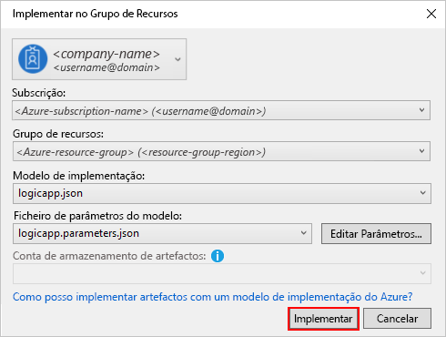

# Quickstart: Criar tarefas, processos e fluxos de trabalho automatizados com o Azure Logic Apps – Visual Studio

Com [a Azure Logic Apps](../logic-apps/logic-apps-overview.md) e o Visual Studio, pode criar fluxos de trabalho para automatizar tarefas e processos que integrem apps, dados, sistemas e serviços entre empresas e organizações. Este início rápido mostra como criar e desenvolver estes fluxos de trabalho através da criação de aplicações lógicas no Visual Studio e da respetiva implementação no Azure. Embora possa executar estas tarefas no portal Azure, o Visual Studio permite-lhe adicionar as suas aplicações lógicas ao controlo de origem, publicar diferentes versões e criar modelos de Gestor de Recursos Azure para diferentes ambientes de implementação.

Se é novo no Azure Logic Apps e apenas quer os conceitos básicos, experimente o [quickstart para criar uma aplicação lógica no portal Azure.](../logic-apps/quickstart-create-first-logic-app-workflow.md) O Logic App Designer funciona da mesma forma tanto no portal Azure como no Visual Studio.

Neste arranque rápido, cria-se a mesma aplicação lógica com o Visual Studio que o quickstart do portal Azure. Também pode aprender a [criar uma aplicação de exemplo no Código do Estúdio Visual,](quickstart-create-logic-apps-visual-studio-code.md)e [criar e gerir aplicações lógicas através da Interface Azure Command-Line (Azure CLI)](quickstart-logic-apps-azure-cli.md). Esta aplicação lógica monitoriza o feed RSS de um site e envia e-mail para cada novo item nesse feed. A sua aplicação lógica acabada parece com este fluxo de trabalho de alto nível:

## Pré-requisitos

* Uma conta e subscrição do Azure. Se não tiver uma subscrição, [inscreva-se numa conta do Azure gratuita](https://azure.microsoft.com/free/). Se tiver uma assinatura do Governo Azure, siga estes passos adicionais para [configurar o Visual Studio para a Azure Government Cloud](#azure-government).

* Transfira e instale estas ferramentas, se ainda não as tiver:

  * [Visual Studio 2019, 2017 ou 2015 - Edição comunitária ou superior.](https://aka.ms/download-visual-studio) Este quickstart usa Visual Studio Community 2017.

    > [!IMPORTANT]
    > Quando instalar o Visual Studio 2019 ou 2017, certifique-se de que seleciona a carga de trabalho de desenvolvimento do **Azure.**

  * [Microsoft Azure SDK para .NET (2.9.1 ou mais tarde)](https://azure.microsoft.com/downloads/). Saiba mais sobre o [SDK do Azure para .NET](/dotnet/azure/intro).

  * [Azure PowerShell](https://github.com/Azure/azure-powershell#installation)

  * As mais recentes Ferramentas de Aplicações Lógicas Azure para a extensão do Estúdio Visual para a versão que deseja:

    * [Visual Studio 2019](https://aka.ms/download-azure-logic-apps-tools-visual-studio-2019)

    * [Visual Studio 2017](https://aka.ms/download-azure-logic-apps-tools-visual-studio-2017)

    * [Visual Studio 2015](https://aka.ms/download-azure-logic-apps-tools-visual-studio-2015)
  
    Pode transferir e instalar as Ferramentas do Azure Logic Apps diretamente a partir do Visual Studio Marketplace ou saiba [como instalar esta extensão a partir do Visual Studio](/visualstudio/ide/finding-and-using-visual-studio-extensions). Certifique-se de que reinicia o Visual Studio depois de concluir a instalação.

* Acesso à Web durante a utilização do Estruturador da Aplicação Lógica incorporado

  O designer precisa de uma ligação à internet para criar recursos no Azure e para ler propriedades e dados de conectores na sua aplicação lógica.

* Uma conta de e-mail suportada por Apps Lógicas, como o Outlook para o Microsoft 365, Outlook.com ou Gmail. Para outros fornecedores, reveja [a lista de conectores aqui.](/connectors/) Este exemplo utiliza o Office 365 Outlook. Se utilizar outro fornecedor, os passos gerais são os mesmos, mas a IU poderá ser ligeiramente diferente.

  > [!IMPORTANT]
  > Se quiser utilizar o conector do Gmail, apenas as contas de negócios da G-Suite podem utilizar este conector sem restrições em aplicações lógicas. Se tiver uma conta de consumo do Gmail, pode utilizar este conector apenas com serviços específicos aprovados pela Google, ou pode [criar uma aplicação para clientes da Google para utilizar para autenticação com o seu conector Gmail.](/connectors/gmail/#authentication-and-bring-your-own-application) Para obter mais informações, consulte [as políticas de segurança de dados e privacidade para conectores google em Azure Logic Apps](../connectors/connectors-google-data-security-privacy-policy.md).

* Se a sua aplicação lógica necessitar de comunicar através de uma firewall que limite o tráfego a endereços IP específicos, essa firewall precisa de permitir o acesso tanto aos endereços IP [de entrada](logic-apps-limits-and-config.md#inbound) *como* [de saída](logic-apps-limits-and-config.md#outbound) utilizados pelo serviço De aplicações lógicas ou ao tempo de funcionamento na região de Azure, onde existe a sua aplicação lógica. Se a sua aplicação lógica também utilizar [conectores geridos](../connectors/apis-list.md#managed-api-connectors)– como o conector Office 365 Outlook ou o conector SQL, ou utilizar [conectores personalizados](/connectors/custom-connectors/)– a firewall também precisa de permitir o acesso de *todos os* [endereços IP de saída geridos](logic-apps-limits-and-config.md#outbound) do conector na região Azure da sua aplicação lógica.

## Configurar o Visual Studio para o Azure Government

### Visual Studio 2017

Pode utilizar a [extensão Azure Environment Seletor Visual Studio,](https://devblogs.microsoft.com/azuregov/introducing-the-azure-environment-selector-visual-studio-extension/)que pode descarregar e instalar a partir do [Visual Studio Marketplace.](https://marketplace.visualstudio.com/items?itemName=SteveMichelotti.AzureEnvironmentSelector)

### Visual Studio 2019

Para trabalhar com subscrições do Governo Azure em Azure Logic Apps, você precisa [adicionar um ponto final de descoberta para Azure Government Cloud ao Visual Studio](../azure-government/documentation-government-connect-vs.md). No entanto, *antes de iniciar seduca no Visual Studio com a sua conta do Governo Azure,* tem de mudar o nome do ficheiro JSON gerado depois de adicionar o ponto final da descoberta seguindo estes passos:

1. Feche o Visual Studio.

1. Encontre o ficheiro JSON gerado nomeado `Azure U.S. Government-A3EC617673C6C70CC6B9472656832A26.Configuration` neste local:

   `%localappdata%\.IdentityService\AadConfigurations`
 
1. Mude o nome do ficheiro JSON para `AadProvider.Configuration.json` .

1. Reinicie o Visual Studio.

1. Continue com os passos para assinar com a sua conta do Governo Azure.

Para reverter esta configuração, elimine o ficheiro JSON no seguinte local e reinicie o Visual Studio:

`%localappdata%\.IdentityService\AadConfigurations\AadProvider.Configuration.json`

## Criar projeto do Grupo de Recursos do Azure

Para começar, crie um [Projeto do Grupo de Recursos do Azure](../azure-resource-manager/templates/create-visual-studio-deployment-project.md). Saiba mais sobre [recursos e grupos de recursos do Azure](../azure-resource-manager/management/overview.md).

1. Inicie o Visual Studio. Inscreva-se na sua conta Azure.

1. No menu **Ficheiro**, selecione **Novo** > **Projeto**. (Teclado: Ctrl + Shift + N)

   

1. Em **Instalado**, selecione **Visual C#** ou **Visual Basic**. Selecione **Cloud**  >  **Azure Resource Group**. Atribua um nome ao projeto, por exemplo:

   

   > [!NOTE]
   > Os nomes de grupos de recursos só podem conter letras, `.` números, períodos (), sublinhados `_` ( ), hífenes `-` e parênteses ( `(` , ), mas não podem `)` *terminar* com períodos ( `.` ).
   >
   > Se **o Cloud** ou o **Azure Resource Group** não aparecerem, certifique-se de que instala o Azure SDK para o Visual Studio.

   Se estiver a utilizar o Visual Studio 2019, siga estes passos:

   1. Na **nova** caixa de projetos, selecione o projeto **Azure Resource Group** para Visual C# ou Visual Basic. Selecione **Seguinte**.

   1. Forneça um nome para o grupo de recursos Azure que pretende utilizar e outras informações do projeto. Selecione **Criar**.

1. A partir da lista de modelos, selecione o modelo **de Aplicação Lógica.** Selecione **OK**.

   

   Depois de o Visual Studio criar o projeto, o Explorador de Soluções é aberto e mostra a sua solução. Na sua solução, o **LogicApp.jsem** ficheiro não só armazena a definição de aplicação lógica como é também um modelo de Gestor de Recursos Azure que pode utilizar para implementação.

   

## Criar uma aplicação lógica em branco

Quando tiver o seu projeto Azure Resource Group, crie a sua aplicação lógica com o modelo **de App Blank Logic.**

1. No Solution Explorer, abra o **LogicApp.jsno** menu de atalho do ficheiro. Selecione **Abrir com o Estruturador da Aplicação Lógica**. (Teclado: CTRL + L)

   

   > [!TIP]
   > Se não tiver este comando no Visual Studio 2019, verifique se tem as últimas atualizações para o Visual Studio.

   O Visual Studio solicita-lhe a sua subscrição Azure e um grupo de recursos Azure para criar e implantar recursos para a sua aplicação lógica e conexões.

1. Para **subscrição,** selecione a sua subscrição Azure. Para **o grupo de recursos,** selecione Create **New** para criar outro grupo de recursos Azure.

   

   | Definição | Valor de exemplo | Description |
   | ------- | ------------- | ----------- |
   | Conta de utilizador | Fabrikam   sophia-owen@fabrikam.com | A conta que usou quando se inscreveu no Visual Studio |
   | **Subscrição** | "Pay As You Go"   (sophia-owen@fabrikam.com) | O nome da sua subscrição do Azure e a conta associada |
   | **Grupo de Recursos** | MyLogicApp-RG   (E.U.A. Oeste) | O grupo de recursos Azure e localização para armazenar e implementar os recursos da sua aplicação lógica |
   | **Localização** | **O mesmo que o Grupo de Recursos** | O tipo de localização e localização específica para a implementação da sua aplicação lógica. O tipo de localização é uma região de Azure ou um ambiente de serviço de integração existente [(ISE)](connect-virtual-network-vnet-isolated-environment.md). 
Para este arranque rápido, mantenha o tipo de localização definido para **Região** e a localização definida para **o Mesmo grupo de recursos**. 
**Nota:** Depois de criar o seu projeto de grupo de recursos, pode [alterar o tipo de localização e a localização,](manage-logic-apps-with-visual-studio.md#change-location)mas diferentes tipos de localização afetam a sua aplicação lógica de várias maneiras. |
   ||||

1. O Logic Apps Designer abre uma página que mostra um vídeo de introdução e gatilhos comumente usados. Percorra o vídeo e desencadeie para **Modelos** e selecione **Blank Logic App**.

   

## Criar fluxo de trabalho da aplicação lógica

Em seguida, adicione um [gatilho](../logic-apps/logic-apps-overview.md#logic-app-concepts) RSS que dispara quando um novo item de alimentação aparece. Cada aplicação lógica começa com um gatilho, que dispara quando critérios específicos são cumpridos. Sempre que o acionador é acionado, o motor do Logic Apps cria uma instância da aplicação lógica que executa o fluxo de trabalho.

1. No Logic App Designer, sob a caixa de pesquisa, selecione **All**. Na caixa de pesquisa, insira "rss". A partir da lista de gatilhos, selecione este gatilho: **Quando um item de alimentação é publicado**

   

1. Depois de o gatilho aparecer no designer, termine a construção da aplicação lógica seguindo os passos de fluxo de trabalho no [portal Azure quickstart](../logic-apps/quickstart-create-first-logic-app-workflow.md#add-rss-trigger), e depois volte a este artigo. Quando tiver terminado, a aplicação lógica terá o aspeto deste exemplo:

   

1. Guarde a sua solução visual Studio. (Teclado: Ctrl+S)

## Implementar a aplicação lógica no Azure

Antes de poder executar e testar a sua aplicação lógica, implemente a aplicação para o Azure a partir do Visual Studio.

1. No Solution Explorer, no menu de atalho do seu projeto, selecione **Implementar**  >  **Novo**. Se tal lhe for pedido, inicie sessão com a sua conta do Azure.

   

1. Para esta implementação, mantenha a subscrição padrão do Azure, grupo de recursos e outras definições. Selecione **Implementar**.

   

1. Se aparecer a caixa **de parâmetros de edição,** forneça um nome de recurso para a sua aplicação lógica. Guarde as suas definições.

   

   Quando a implementação é iniciada, o estado de implementação da sua aplicação é apresentado na janela **Saída** do Visual Studio. Se o estado não for apresentado, abra a lista **Mostrar saída de** e selecione o seu grupo de recursos do Azure.

   

   Se os conectores selecionados precisarem de entrada de si, uma janela PowerShell abre-se em segundo plano e solicita quaisquer senhas ou chaves secretas necessárias. Após introduzir estas informações, a implementação continua.

   

   Após o fim da implementação, a sua aplicação lógica está ao vivo no portal Azure e funciona na sua agenda especificada (a cada minuto). Se o gatilho encontrar novos itens de alimentação, o gatilho dispara, o que cria uma instância de fluxo de trabalho que executa as ações da sua aplicação lógica. A sua aplicação lógica envia e-mail para cada novo item. Caso contrário, se o gatilho não encontrar novos itens, o gatilho não dispara e "salta" instantaneamente o fluxo de trabalho. A sua aplicação lógica aguarda até ao intervalo seguinte antes de verificar.

   Aqui estão os e-mails de amostra que esta aplicação lógica envia. Se não receber nenhum e-mail, veja a pasta de e-mail de lixo.

   

Parabéns, construíste e implementaste com sucesso a tua aplicação lógica com o Visual Studio. Para gerir a sua aplicação lógica e analisar o respetivo histórico de execuções, consulte [Gerir aplicações lógicas com o Visual Studio](../logic-apps/manage-logic-apps-with-visual-studio.md).

## Adicionar novo aplicativo de lógica

Quando tiver um projeto do Grupo de Recursos Azure existente, pode adicionar uma nova aplicação lógica em branco a esse projeto utilizando a janela JSON Outline.

1. No Solution Explorer, abra o `<logic-app-name>.json` ficheiro.

1. No menu **Ver,** selecione **Outros Contornos**  >  **JSON do** Windows .

1. Para adicionar um recurso ao ficheiro do modelo, **selecione Adicionar Recurso** na parte superior da janela contorno JSON. Ou na janela contorno do JSON, abra o menu de atalho **de recursos** e selecione Adicionar **Novo Recurso**.

   

1. Na caixa de diálogo **De Recurso Adicionar,** na caixa de pesquisa, encontre `logic app` e selecione **a Aplicação Lógica**. Nomeie a sua aplicação lógica e selecione **Adicionar**.

   

## Limpar os recursos

Quando terminar a sua aplicação lógica, elimine o grupo de recursos que contém a sua aplicação lógica e recursos relacionados.

1. Inicie sessão no [portal do Azure](https://portal.azure.com) com a mesma conta utilizada para criar a aplicação lógica.

1. No menu do portal Azure, selecione **grupos de Recursos,** ou procure e selecione **grupos** de Recursos a partir de qualquer página. Selecione o grupo de recursos da sua aplicação lógica.

1. Na página **'Vista Geral',** selecione **Eliminar o grupo de recursos**. Introduza o nome do grupo de recursos como confirmação e selecione **Delete**.

   

1. Elimine a solução do Visual Studio do seu computador local.

## Passos seguintes

Neste artigo, criou, implementou e executou a sua aplicação lógica com o Visual Studio. Para aprender sobre como gerir e realizar implementações avançadas para aplicações lógicas com o Visual Studio, consulte estes artigos:

> [!div class="nextstepaction"]
> [Gerir aplicações lógicas com o Visual Studio](../logic-apps/manage-logic-apps-with-visual-studio.md)
