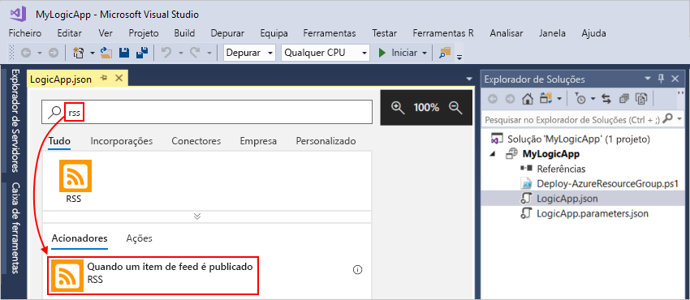
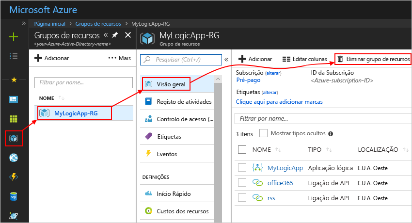

# Início rápido: Criar tarefas automatizadas, processos e fluxos de trabalho com o Azure Logic Apps – Visual Studio

Com o [Azure Logic Apps](../logic-apps/logic-apps-overview.md) e o Visual Studio, pode criar fluxos de trabalho para automatizarem tarefas e processos que integram aplicações, dados, sistemas e serviços nas empresas e organizações. Este início rápido mostra como pode conceber e criar estes fluxos de trabalho através da criação de aplicações lógicas no Visual Studio e implementar essas aplicações para o Azure na cloud. Embora seja possível executar essas tarefas no portal do Azure, o Visual Studio permite-lhe adicionar as logic apps para controle de fonte, publicar versões diferentes e criar modelos do Azure Resource Manager para ambientes de implementação diferentes.

Se não estiver familiarizado com o Azure Logic Apps e quiser apenas os conceitos básicos, experimente o [início rápido para a criação de uma aplicação lógica no portal do Azure](../logic-apps/quickstart-create-first-logic-app-workflow.md). O modo de funcionamento do Estruturador da Aplicação Lógica é semelhante tanto no portal do Azure como no Visual Studio.

Neste caso, vai criar a mesma aplicação lógica que no início rápido do portal do Azure, mas com o Visual Studio. Esta aplicação lógica monitoriza o feed RSS de um site e envia uma mensagem de e-mail por cada item novo publicado no site. Quando tiver terminado, a aplicação lógica terá um aspeto semelhante a este fluxo de trabalho de alto nível:

Antes de começar, certifique-se de que dispõe destes itens para seguir este guia de introdução:

* Se não tiver uma subscrição do Azure, <a href="https://azure.microsoft.com/free/" target="_blank">inscreva-se para obter uma conta do Azure gratuita</a>.

* Transfira e instale estas ferramentas, se ainda não as tiver:

  * <a href="https://aka.ms/download-visual-studio" target="_blank">O Visual Studio 2019, 2017 ou 2015 - Community edition ou superior</a>. 
  Este início rápido utiliza o Visual Studio Community 2017, que é gratuito.

    > [!IMPORTANT]
    > Ao instalar o Visual Studio 2019 ou 2017, certifique-se de que seleciona os **desenvolvimento do Azure** carga de trabalho.
    > Para Visual Studio 2019, o Cloud Explorer pode abrir o Estruturador da aplicação lógica no portal do Azure, mas ainda não é possível abrir o Estruturador da aplicação lógica incorporado.

  * <a href="https://azure.microsoft.com/downloads/" target="_blank">Microsoft Azure SDK para .NET (2.9.1 ou posterior)</a>. Saiba mais sobre o <a href="https://docs.microsoft.com/dotnet/azure/dotnet-tools?view=azure-dotnet">SDK do Azure para .NET</a>.

  * <a href="https://github.com/Azure/azure-powershell#installation" target="_blank">Azure PowerShell</a>

  * Ferramentas de Azure Logic Apps para a versão do Visual Studio que pretende:

    * <a href="https://aka.ms/download-azure-logic-apps-tools-visual-studio-2019" target="_blank">Visual Studio 2019</a>
    
    * <a href="https://aka.ms/download-azure-logic-apps-tools-visual-studio-2017" target="_blank">Visual Studio 2017</a>
    
    * <a href="https://aka.ms/download-azure-logic-apps-tools-visual-studio-2015" target="_blank">Visual Studio 2015</a>
  
    Pode transferir e instalar as Ferramentas do Azure Logic Apps diretamente a partir do Visual Studio Marketplace ou saiba <a href="https://docs.microsoft.com/visualstudio/ide/finding-and-using-visual-studio-extensions" target="_blank">como instalar esta extensão a partir do Visual Studio</a>. 
    Certifique-se de que reinicia o Visual Studio depois de concluir a instalação.

* Acesso à Web durante a utilização do Estruturador da Aplicação Lógica incorporado

  O estruturador precisa de uma ligação à Internet para criar recursos no Azure e ler as propriedades e os dados a partir de conectores na sua aplicação lógica. 
  Por exemplo, se utilizar o conector do Dynamics CRM Online, o estruturador verifica se a instância do CRM tem propriedades personalizadas e predefinidas disponíveis.

* Uma conta de e-mail suportada pelo Logic Apps, como o Outlook do Office 365, o Outlook.com ou o Gmail. Para outros fornecedores, <a href="https://docs.microsoft.com/connectors/" target="_blank">consulte a lista de conectores aqui</a>. Esta aplicação lógica utiliza o Outlook do Office 365. Se utilizar outro fornecedor, os passos gerais são os mesmos, mas a IU poderá ser ligeiramente diferente.

## Criar projeto do Grupo de Recursos do Azure

Para começar, crie um [Projeto do Grupo de Recursos do Azure](../azure-resource-manager/vs-azure-tools-resource-groups-deployment-projects-create-deploy.md). Saiba mais sobre [recursos e grupos de recursos do Azure](../azure-resource-manager/resource-group-overview.md).

1. Inicie o Visual Studio e inicie sessão com a sua conta do Azure.

1. No menu **Ficheiro**, selecione **Novo** > **Projeto**. (Teclado: Ctrl + Shift + N)

   

1. Em **Instalado**, selecione **Visual C#** ou **Visual Basic**. Selecione **Cloud** > **Grupo de Recursos do Azure**. Atribua um nome ao projeto, por exemplo:

   

   > [!NOTE]
   > Se o **Cloud** categoria ou **grupo de recursos do Azure** projeto não existir, certifique-se de que instalou o SDK do Azure para Visual Studio.

   Se estiver a utilizar o Visual Studio 2019, siga estes passos:

   1. Na **criar um novo projeto** caixa, selecione a **grupo de recursos do Azure** modelo de projeto para qualquer elemento Visual C# ou Visual Basic e escolha **seguinte**.

   1. Forneça o nome para o grupo de recursos do Azure que pretende utilizar e outras informações do projeto. Quando tiver terminado, escolha **Create** (Criar).

1. Na lista de modelos, selecione o **aplicação lógica** modelo.

   

   Depois de o Visual Studio criar o projeto, o Explorador de Soluções é aberto e mostra a sua solução.

   

   Na sua solução, o ficheiro **LogicApp.json** não só armazena a definição da aplicação lógica, como também é um modelo do Azure Resource Manager que pode configurar para a implementação.

## Criar uma aplicação lógica em branco

Depois de criar o seu projeto do Grupo de Recursos do Azure, crie e desenvolva a sua aplicação lógica a partir do modelo **Aplicação Lógica em Branco**.

1. No Explorador de Soluções, abra o menu de atalho do ficheiro **LogicApp.json**. 
   Selecione **Abrir com o Estruturador da Aplicação Lógica**. (Teclado: CTRL + L)

   

1. Para **Subscrição**, selecione a subscrição do Azure que pretende utilizar. 
   Para **Grupo de Recursos**, selecione **Criar Novo...**, o que cria um novo grupo de recursos do Azure.

   

   O Visual Studio precisa da sua subscrição do Azure e de um grupo de recursos para criar e implementar os recursos associados à sua aplicação lógica e ligações.

   | Definição | Valor de exemplo | Descrição |
   | ------- | ------------- | ----------- |
   | Lista do perfil de utilizador | Contoso   jamalhartnett@contoso.com | Por predefinição, a conta que utilizou para iniciar sessão |
   | **Subscrição** | "Pay As You Go"   (jamalhartnett@contoso.com) | O nome da sua subscrição do Azure e a conta associada |
   | **Grupo de Recursos** | MyLogicApp-RG   (E.U.A. Oeste) | O grupo de recursos do Azure e a localização para armazenar e implementar recursos para a sua aplicação lógica |
   | **Localização** | MyLogicApp-RG2   (E.U.A. Oeste) | Uma localização diferente, se não quiser utilizar a localização do grupo de recursos |
   ||||

1. O Estruturador da Aplicação Lógica é aberto e mostra uma página com um vídeo de introdução e os acionadores habitualmente utilizados. 
   Percorra o ecrã até passar o vídeo e os acionadores. Em **Modelos**, selecione **Aplicação Lógica em Branco**.

   

## Criar fluxo de trabalho da aplicação lógica

Em seguida, adicione um [acionador](../logic-apps/logic-apps-overview.md#logic-app-concepts) que é desencadeado quando um novo item do feed RSS é apresentado. Todas as aplicações lógicas têm de começar com um acionador, que é acionado quando são satisfeitos critérios específicos. Sempre que o acionador é acionado, o motor do Logic Apps cria uma instância da aplicação lógica que executa o fluxo de trabalho.

1. No Estruturador da Aplicação Lógica, escreva "rss" na caixa de pesquisa. Selecione este acionador: **Quando um item de feed é publicado**

   

   Agora, o acionador aparece no estruturador:

   

1. Para concluir a criação da aplicação lógica, siga os passos do fluxo de trabalho indicados no [início rápido do portal do Azure](../logic-apps/quickstart-create-first-logic-app-workflow.md#add-rss-trigger) e, em seguida, regresse a este artigo.

   Quando tiver terminado, a aplicação lógica terá o aspeto deste exemplo:

   

1. Para guardar a aplicação lógica, guarde a sua solução do Visual Studio. (Teclado: Ctrl + S)

Agora, antes de testar a aplicação lógica, implemente a aplicação no Azure.

## Implementar a aplicação lógica no Azure

Antes de executar a aplicação lógica, implemente a aplicação a partir do Visual Studio no Azure, o que envolve apenas alguns passos.

1. No Explorador de Soluções, no menu de atalho do projeto, selecione **Implementar** > **Novo...**. Se tal lhe for pedido, inicie sessão com a sua conta do Azure.

   

1. Para esta implementação, mantenha a subscrição do Azure, o grupo de recursos e outras predefinições. Quando estiver preparado, escolha **Implementar**.

   

1. Se a caixa **Editar Parâmetros** for apresentada, forneça o nome do recurso que a aplicação lógica irá utilizar na implementação e, em seguida, guarde as suas definições, por exemplo:

   

   Quando a implementação é iniciada, o estado de implementação da sua aplicação é apresentado na janela **Saída** do Visual Studio. 
   Se o estado não for apresentado, abra a lista **Mostrar saída de** e selecione o seu grupo de recursos do Azure.

   

   Se os conectores que selecionou precisarem de alguma intervenção sua, pode abrir uma janela do PowerShell no plano de fundo e pedir as palavras-passe ou chaves secretas que são precisas. Após introduzir estas informações, a implementação continua.

   

   Uma vez concluída a implementação, a aplicação lógica fica ativa no portal do Azure e consulta o feed RSS com base na agenda especificada (a cada minuto). 
   Se o feed RSS tiver itens novos, a sua aplicação lógica envia um e-mail para cada item novo. 
   Caso contrário, a aplicação lógica aguarda até o intervalo seguinte antes de realizar uma nova consulta.

   Por exemplo, seguem-se alguns exemplos de mensagens de e-mail enviadas por esta aplicação lógica. 
   Se não receber nenhum e-mail, veja a pasta de e-mail de lixo.

   

   Em termos técnicos, quando o acionador verifica o feed RSS e encontra itens novos, este é acionado e o motor do Logic Apps cria uma instância do fluxo de trabalho da aplicação lógica que executa as ações no fluxo de trabalho.
   Se o acionador não encontrar itens novos, este não é acionado e "ignora" a criação de instâncias do fluxo de trabalho.

Parabéns! Criou e implementou a aplicação lógica com o Visual Studio com êxito! Para gerir a sua aplicação lógica e analisar o respetivo histórico de execuções, consulte [Gerir aplicações lógicas com o Visual Studio](../logic-apps/manage-logic-apps-with-visual-studio.md).

## Limpar recursos

Quando já não for necessário, elimine o grupo de recursos que contém a aplicação lógica e os recursos relacionados.

1. Inicie sessão no <a href="https://portal.azure.com" target="_blank">portal do Azure</a> com a mesma conta utilizada para criar a aplicação lógica.

1. No menu principal do Azure, selecione **Grupos de recursos**.
Selecione o grupo de recursos para a sua aplicação lógica e, em seguida, selecione **Descrição geral**.

1. Na página **Descrição geral**, selecione **Eliminar grupo de recursos**. Introduza o nome do grupo de recursos como confirmação e escolha **Eliminar**.

   

1. Elimine a solução do Visual Studio do seu computador local.

## Obter suporte

* Relativamente a dúvidas, visite o <a href="https://social.msdn.microsoft.com/Forums/en-US/home?forum=azurelogicapps" target="_blank">fórum do Azure Logic Apps</a>.
* Para submeter ou votar em ideias para funcionalidades, visite o <a href="https://aka.ms/logicapps-wish" target="_blank">site de comentários dos utilizadores do Logic Apps</a>.

## Passos Seguintes

Neste artigo, criou, implementou e executou a sua aplicação lógica com o Visual Studio. Para saber mais sobre como gerir e realizar a implementação avançada para aplicações lógicas com o Visual Studio, veja estes artigos:

> [!div class="nextstepaction"]
> * [Gerir aplicações lógicas com o Visual Studio](../logic-apps/manage-logic-apps-with-visual-studio.md)
> * [Criar modelos de implementação para aplicações lógicas com o Visual Studio](../logic-apps/logic-apps-create-deploy-template.md)
