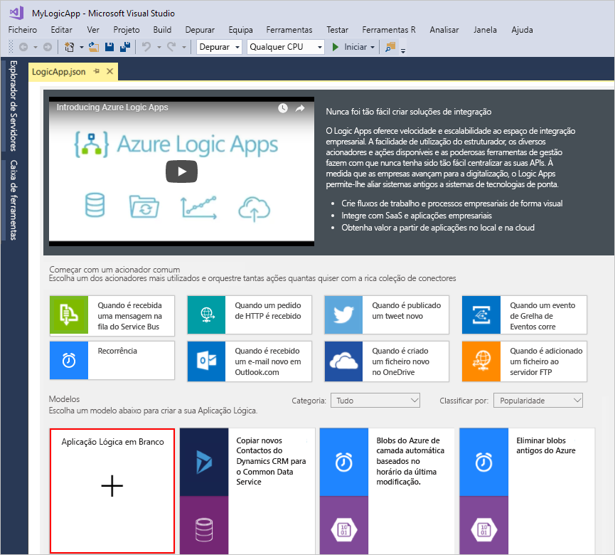

# Início rápido: Criar tarefas automatizadas, processos e fluxos de trabalho com o Azure Logic Apps – Visual Studio

Com o [Azure Logic Apps](../logic-apps/logic-apps-overview.md) e o Visual Studio, pode criar fluxos de trabalho para automatizarem tarefas e processos que integram aplicações, dados, sistemas e serviços nas empresas e organizações. Este início rápido mostra como pode conceber e criar estes fluxos de trabalho através da criação de aplicações lógicas no Visual Studio e implementar essas aplicações no Azure. Embora seja possível executar essas tarefas no portal do Azure, o Visual Studio permite-lhe adicionar as logic apps para controle de fonte, publicar versões diferentes e criar modelos do Azure Resource Manager para ambientes de implementação diferentes.

Se estiver familiarizado com o Azure Logic Apps e querem apenas os conceitos básicos, experimente o [início rápido para criar uma aplicação lógica no portal do Azure](../logic-apps/quickstart-create-first-logic-app-workflow.md). Estruturador da aplicação lógica funciona da mesma forma no portal do Azure e no Visual Studio.

Neste início rápido, vai criar a mesma aplicação lógica com o Visual Studio como o início rápido do portal do Azure. Esta aplicação lógica monitoriza o feed RSS de um site e envia um e-mail para cada item novo nesse feed. A aplicação lógica concluída é semelhante a este fluxo de trabalho de alto nível:

## Pré-requisitos

* Uma subscrição do Azure. Se não tiver uma subscrição do Azure, [inscreva-se para obter uma conta do Azure gratuita](https://azure.microsoft.com/free/).

* Transfira e instale estas ferramentas, se ainda não as tiver:

  * [O Visual Studio 2019, 2017 ou 2015 - Community edition ou superior](https://aka.ms/download-visual-studio). 
  Este início rápido utiliza o Visual Studio Community 2017.

    > [!IMPORTANT]
    > Ao instalar o Visual Studio 2019 ou 2017, certifique-se de que seleciona os **desenvolvimento do Azure** carga de trabalho.

  * [Microsoft Azure SDK para .NET (2.9.1 ou posterior)](https://azure.microsoft.com/downloads/). 
  Saiba mais sobre o [SDK do Azure para .NET](https://docs.microsoft.com/dotnet/azure/dotnet-tools?view=azure-dotnet).

  * [Azure PowerShell](https://github.com/Azure/azure-powershell#installation)

  * Ferramentas de Azure Logic Apps para a versão do Visual Studio que pretende:

    * [Visual Studio 2019](https://aka.ms/download-azure-logic-apps-tools-visual-studio-2019)

    * [Visual Studio 2017](https://aka.ms/download-azure-logic-apps-tools-visual-studio-2017)

    * [Visual Studio 2015](https://aka.ms/download-azure-logic-apps-tools-visual-studio-2015)
  
    Pode transferir e instalar as Ferramentas do Azure Logic Apps diretamente a partir do Visual Studio Marketplace ou saiba [como instalar esta extensão a partir do Visual Studio](https://docs.microsoft.com/visualstudio/ide/finding-and-using-visual-studio-extensions). 
    Certifique-se de que reinicia o Visual Studio depois de concluir a instalação.

* Acesso à Web durante a utilização do Estruturador da Aplicação Lógica incorporado

  O designer tem uma ligação à internet para criar recursos no Azure e ler propriedades e os dados a partir de conectores na sua aplicação lógica. 
  Por exemplo, para ligações de Dynamics CRM Online, o estruturador verifica se a instância do CRM para propriedades personalizadas e predefinidas.

* Uma conta de e-mail suportada pelo Logic Apps, como o Outlook do Office 365, o Outlook.com ou o Gmail. Para outros fornecedores, [consulte a lista de conectores aqui](https://docs.microsoft.com/connectors/). Este exemplo utiliza o Outlook do Office 365. Se utilizar outro fornecedor, os passos gerais são os mesmos, mas a IU poderá ser ligeiramente diferente.

## Criar projeto do Grupo de Recursos do Azure

Para começar, crie um [Projeto do Grupo de Recursos do Azure](../azure-resource-manager/vs-azure-tools-resource-groups-deployment-projects-create-deploy.md). Saiba mais sobre [recursos e grupos de recursos do Azure](../azure-resource-manager/resource-group-overview.md).

1. Inicie o Visual Studio. Inicie sessão com a sua conta do Azure.

1. No menu **Ficheiro**, selecione **Novo** > **Projeto**. (Teclado: Ctrl + Shift + N)

   

1. Em **Instalado**, selecione **Visual C#** ou **Visual Basic**. Selecione **Cloud** > **Grupo de Recursos do Azure**. Atribua um nome ao projeto, por exemplo:

   

   > [!NOTE]
   > Se **Cloud** ou **grupo de recursos do Azure** não aparecer, certifique-se de instalar o SDK do Azure para Visual Studio.

   Se estiver a utilizar o Visual Studio 2019, siga estes passos:

   1. Na **criar um novo projeto** caixa, selecione a **grupo de recursos do Azure** projeto Visual C# ou Visual Basic. Selecione **Next**.

   1. Forneça um nome para o grupo de recursos do Azure que pretende utilizar e outras informações do projeto. Selecione **Criar**.

1. Na lista de modelos, selecione o **aplicação lógica** modelo. Escolha **OK**.

   

   Depois de o Visual Studio criar o projeto, o Explorador de Soluções é aberto e mostra a sua solução. 
   Na sua solução, o **Logicapp** ficheiro não só armazena a definição da aplicação lógica, mas também é um modelo do Azure Resource Manager que pode utilizar para a implementação.

   

## Criar uma aplicação lógica em branco

Quando tiver o seu grupo de recursos do Azure do projeto, crie a sua aplicação lógica com o **aplicação lógica em branco** modelo.

1. No Explorador de soluções, abra a **Logicapp** menu de atalho do ficheiro. Selecione **Abrir com o Estruturador da Aplicação Lógica**. (Teclado: CTRL + L)

   

   > [!TIP]
   > Se não tiver este comando no Visual Studio 2019, verifique que tem as atualizações mais recentes para o Visual Studio.

   Visual Studio pede-lhe para a sua subscrição do Azure e um grupo de recursos do Azure para criar e implementar recursos para a sua aplicação lógica e ligações.

1. Para **subscrição**, selecione a sua subscrição do Azure. Para **grupo de recursos**, selecione **criar nova** para criar um novo grupo de recursos do Azure.

   

   | Definição | Valor de exemplo | Descrição |
   | ------- | ------------- | ----------- |
   | Lista do perfil de utilizador | Contoso   jamalhartnett@contoso.com | Por predefinição, a conta que utilizou para iniciar sessão |
   | **Subscrição** | "Pay As You Go"   (jamalhartnett@contoso.com) | O nome da sua subscrição do Azure e a conta associada |
   | **Grupo de Recursos** | MyLogicApp-RG   (E.U.A. Oeste) | O grupo de recursos do Azure e a localização para armazenar e implementar recursos da sua aplicação lógica |
   | **Location** | MyLogicApp-RG2   (E.U.A. Oeste) | Uma localização diferente, se não quiser utilizar a localização do grupo de recursos |
   ||||

1. O estruturador de aplicações lógicas abre uma página que mostra o vídeo de introdução e os acionadores habitualmente utilizados. Desloque-se para baixo, passar o vídeo e acionadores para **modelos**e selecione **aplicação lógica em branco**.

   

## Criar fluxo de trabalho da aplicação lógica

Em seguida, adicione um RSS [acionador](../logic-apps/logic-apps-overview.md#logic-app-concepts) que é acionado quando um item de feed novo é apresentado. Todas as aplicações lógicas começa com um acionador, que é acionado quando critérios específicos é cumprido. Sempre que o acionador é acionado, o motor do Logic Apps cria uma instância da aplicação lógica que executa o fluxo de trabalho.

1. No Estruturador da aplicação lógica, na caixa de pesquisa, escolha **todos os**.
Na caixa de pesquisa, escreva "rss". Na lista de disparadores, selecione este acionador: **Quando um item de feed é publicado - RSS**

   

1. Depois do acionador aparece no estruturador, concluir a criação da aplicação lógica, seguindo o fluxo de trabalho os passos no [início rápido do portal do Azure](../logic-apps/quickstart-create-first-logic-app-workflow.md#add-rss-trigger), em seguida, regresse a este artigo. Quando tiver terminado, a aplicação lógica terá o aspeto deste exemplo:

   

1. Guarde a sua solução Visual Studio. (Teclado: Ctrl + S)

## Implementar a aplicação lógica no Azure

Antes de poder executar e testar a sua aplicação lógica, implemente a aplicação no Azure a partir do Visual Studio.

1. No Explorador de Soluções, no menu de atalho do projeto, selecione **Implementar** > **Novo...** . Se tal lhe for pedido, inicie sessão com a sua conta do Azure.

   

1. Para esta implementação, mantenha a predefinição de subscrição do Azure, de recurso de grupos e outras definições. Escolher **implementar**.

   

1. Se o **Editar parâmetros** é apresentada a caixa, forneça um nome de recurso para a aplicação lógica. Guarde as suas definições.

   

   Quando a implementação é iniciada, o estado de implementação da sua aplicação é apresentado na janela **Saída** do Visual Studio. Se o estado não for apresentado, abra a lista **Mostrar saída de** e selecione o seu grupo de recursos do Azure.

   

   Se os conectores selecionados precisam de intervenção do utilizador, uma janela do PowerShell é aberta no segundo plano e pede-quaisquer palavras-passe necessárias ou chaves secretas. Após introduzir estas informações, a implementação continua.

   

   Após a conclusão da implementação, a aplicação lógica fica ativa no portal do Azure e é executado na agenda especificada (a cada minuto). Se o acionador encontrar novos itens de feeds, o acionador é acionado, que cria uma instância de fluxo de trabalho que executa a lógica de ações da aplicação. A aplicação lógica envia um e-mail para cada item novo. Caso contrário, se o acionador não encontrar itens novos, o acionador não dispara e "ignora" instanciar o fluxo de trabalho. A aplicação lógica aguarda até o próximo intervalo antes de a verificar.

   Seguem-se as mensagens de e-mail de exemplo que esta aplicação lógica envia. 
   Se não receber nenhum e-mail, veja a pasta de e-mail de lixo.

   

Parabéns, criou com êxito e implementada a aplicação lógica com o Visual Studio. Para gerir a sua aplicação lógica e analisar o respetivo histórico de execuções, consulte [Gerir aplicações lógicas com o Visual Studio](../logic-apps/manage-logic-apps-with-visual-studio.md).

## Limpar recursos

Quando tiver terminado com a sua aplicação lógica, elimine o grupo de recursos que contém a aplicação lógica e os recursos relacionados.

1. Inicie sessão no [portal do Azure](https://portal.azure.com) com a mesma conta utilizada para criar a aplicação lógica.

1. No menu principal do Azure, selecione **Grupos de recursos**.
Selecione o grupo de recursos da sua aplicação lógica e selecione **descrição geral**.

1. Na página **Descrição geral**, selecione **Eliminar grupo de recursos**. Introduza o nome do grupo de recursos como confirmação e escolha **Eliminar**.

   

1. Elimine a solução do Visual Studio do seu computador local.

## Passos Seguintes

Neste artigo, criou, implementou e executou a sua aplicação lógica com o Visual Studio. Para saber mais sobre como gerir e realizar a implementação avançada para aplicações lógicas com o Visual Studio, veja estes artigos:

> [!div class="nextstepaction"]
> * [Gerir aplicações lógicas com o Visual Studio](../logic-apps/manage-logic-apps-with-visual-studio.md)