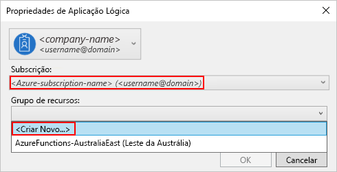
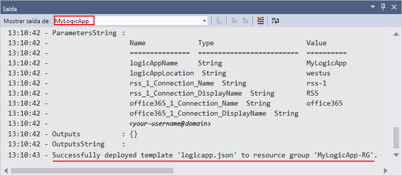

# Início rápido: criar tarefas, processos e fluxos de trabalho automatizados com os aplicativos lógicos do Azure-Visual Studio

Com o [Azure Logic Apps](../logic-apps/logic-apps-overview.md) e o Visual Studio, pode criar fluxos de trabalho para automatizarem tarefas e processos que integram aplicações, dados, sistemas e serviços nas empresas e organizações. Este guia de início rápido mostra como você pode projetar e criar esses fluxos de trabalho criando aplicativos lógicos no Visual Studio e implantando esses aplicativos no Azure. Embora você possa executar essas tarefas no portal do Azure, o Visual Studio permite que você adicione seus aplicativos lógicos ao controle do código-fonte, publique diferentes versões e crie Azure Resource Manager modelos para diferentes ambientes de implantação.

Se você for novo no aplicativo lógico do Azure e quiser apenas os conceitos básicos, experimente o guia [de início rápido para criar um aplicativo lógico no portal do Azure](../logic-apps/quickstart-create-first-logic-app-workflow.md). O designer do aplicativo lógico funciona de modo semelhante no portal do Azure e no Visual Studio.

Neste guia de início rápido, você cria o mesmo aplicativo lógico com o Visual Studio como o guia de início rápido portal do Azure. Esse aplicativo lógico monitora o RSS feed de um site e envia um email para cada novo item nesse feed. Seu aplicativo lógico concluído é semelhante a este fluxo de trabalho de alto nível:

## Pré-requisitos

* Uma subscrição do Azure. Se não tiver uma subscrição, [inscreva-se numa conta do Azure gratuita](https://azure.microsoft.com/free/).

* Transfira e instale estas ferramentas, se ainda não as tiver:

  * [Visual Studio 2019, 2017 ou 2015-Community Edition ou superior](https://aka.ms/download-visual-studio). Este guia de início rápido usa o Visual Studio Community 2017.

    > [!IMPORTANT]
    > Ao instalar o Visual Studio 2019 ou 2017, certifique-se de selecionar a carga de trabalho de **desenvolvimento do Azure** .

  * [Microsoft Azure SDK para .net (2.9.1 ou posterior)](https://azure.microsoft.com/downloads/). Saiba mais sobre o [SDK do Azure para .NET](https://docs.microsoft.com/dotnet/azure/dotnet-tools?view=azure-dotnet).

  * [O Azure PowerShell](https://github.com/Azure/azure-powershell#installation)

  * As ferramentas mais recentes dos aplicativos lógicos do Azure para a extensão do Visual Studio para a versão que você deseja:

    * [Visual Studio 2019](https://aka.ms/download-azure-logic-apps-tools-visual-studio-2019)

    * [Visual Studio 2017](https://aka.ms/download-azure-logic-apps-tools-visual-studio-2017)

    * [Visual Studio 2015](https://aka.ms/download-azure-logic-apps-tools-visual-studio-2015)
  
    Pode transferir e instalar as Ferramentas do Azure Logic Apps diretamente a partir do Visual Studio Marketplace ou saiba [como instalar esta extensão a partir do Visual Studio](https://docs.microsoft.com/visualstudio/ide/finding-and-using-visual-studio-extensions). Certifique-se de que reinicia o Visual Studio depois de concluir a instalação.

* Acesso à Web durante a utilização do Estruturador da Aplicação Lógica incorporado

  O designer precisa de uma conexão com a Internet para criar recursos no Azure e para ler propriedades e dados de conectores em seu aplicativo lógico. Por exemplo, para conexões do Dynamics CRM Online, o designer verifica a instância do CRM em busca de propriedades padrão e personalizadas.

* Uma conta de e-mail suportada pelo Logic Apps, como o Outlook do Office 365, o Outlook.com ou o Gmail. Para outros provedores, examine a [lista de conectores aqui](https://docs.microsoft.com/connectors/). Este exemplo usa o Outlook do Office 365. Se utilizar outro fornecedor, os passos gerais são os mesmos, mas a IU poderá ser ligeiramente diferente.

## Criar projeto do Grupo de Recursos do Azure

Para começar, crie um [Projeto do Grupo de Recursos do Azure](../azure-resource-manager/vs-azure-tools-resource-groups-deployment-projects-create-deploy.md). Saiba mais sobre [recursos e grupos de recursos do Azure](../azure-resource-manager/management/overview.md).

1. Inicie o Visual Studio. Entre com sua conta do Azure.

1. No menu **Ficheiro**, selecione **Novo** > **Projeto**. (Teclado: Ctrl + Shift + N)

   

1. Em **Instalado**, selecione **Visual C#** ou **Visual Basic**. Selecione **Cloud** > **Grupo de Recursos do Azure**. Atribua um nome ao projeto, por exemplo:

   

   > [!NOTE]
   > Os nomes de grupos de recursos podem conter apenas letras, números, pontos (`.`), sublinhados (`_`), hifens (`-`) e parênteses (`(`, `)`), mas não podem *terminar* com pontos (`.`).
   >
   > Se a **nuvem** ou o **grupo de recursos do Azure** não aparecer, certifique-se de instalar o SDK do Azure para Visual Studio.

   Se você estiver usando o Visual Studio 2019, siga estas etapas:

   1. Na caixa **criar um novo projeto** , selecione o projeto do **grupo de recursos do Azure** para Visual C# ou Visual Basic. Selecione **Seguinte**.

   1. Forneça um nome para o grupo de recursos do Azure que você deseja usar e outras informações do projeto. Selecione **Criar**.

1. Na lista modelo, selecione o modelo **aplicativo lógico** . Selecione **OK**.

   

   Depois de o Visual Studio criar o projeto, o Explorador de Soluções é aberto e mostra a sua solução. Em sua solução, o arquivo **LogicApp. JSON** não apenas armazena sua definição de aplicativo lógico, mas também é um modelo de Azure Resource Manager que você pode usar para a implantação.

   

## Criar uma aplicação lógica em branco

Quando você tiver seu projeto de grupo de recursos do Azure, crie seu aplicativo lógico com o modelo de **aplicativo lógico em branco** .

1. No Gerenciador de Soluções, abra o menu de atalho do arquivo **LogicApp. JSON** . Selecione **Abrir com o Estruturador da Aplicação Lógica**. (Teclado: CTRL + L)

   

   > [!TIP]
   > Se você não tiver esse comando no Visual Studio 2019, verifique se você tem as atualizações mais recentes para o Visual Studio.

   O Visual Studio solicita sua assinatura do Azure e um grupo de recursos do Azure para criar e implantar recursos para seu aplicativo lógico e conexões.

1. Para **assinatura**, selecione sua assinatura do Azure. Para **grupo de recursos**, selecione **criar novo** para criar outro grupo de recursos do Azure.

   

   | Definição | Valor de exemplo | Descrição |
   | ------- | ------------- | ----------- |
   | Conta de usuário | Fabrikam   sophia-owen@fabrikam.com | A conta que você usou quando entrou no Visual Studio |
   | **Subscrição** | "Pay-As-You-Go"   (sophia-owen@fabrikam.com) | O nome da sua subscrição do Azure e a conta associada |
   | **Grupo de Recursos** | MyLogicApp-RG   (E.U.A. Oeste) | O grupo de recursos do Azure e o local para armazenar e implantar os recursos do aplicativo lógico |
   | **Localização** | **Mesmo que o grupo de recursos** | O tipo de local e o local específico para implantar seu aplicativo lógico. O tipo de local é uma região do Azure ou um [ambiente de serviço de integração (ISE)](connect-virtual-network-vnet-isolated-environment.md)existente. 
Para este guia de início rápido, mantenha o tipo de local definido como **região** e o local definido como o **mesmo que o grupo de recursos**. 
**Observação**: depois de criar seu projeto de grupo de recursos, você pode [alterar o tipo de local e o local](manage-logic-apps-with-visual-studio.md#change-location), mas o tipo de local diferente afeta seu aplicativo lógico de várias maneiras. |
   ||||

1. O designer de aplicativos lógicos abre uma página que mostra um vídeo de introdução e gatilhos comumente usados. Role para baixo após o vídeo e os gatilhos para **modelos**e selecione **aplicativo lógico em branco**.

   

## Criar fluxo de trabalho da aplicação lógica

Em seguida, adicione um [gatilho](../logic-apps/logic-apps-overview.md#logic-app-concepts) de RSS que é acionado quando um novo item de feed é exibido. Cada aplicativo lógico começa com um gatilho, que é disparado quando critérios específicos são atendidos. Sempre que o acionador é acionado, o motor do Logic Apps cria uma instância da aplicação lógica que executa o fluxo de trabalho.

1. No designer de aplicativo lógico, na caixa de pesquisa, selecione **tudo**. Na caixa de pesquisa, digite "RSS". Na lista de gatilhos, selecione este gatilho: **quando um item de feed é publicado**

   

1. Depois que o gatilho aparecer no designer, conclua a criação do aplicativo lógico seguindo as etapas do fluxo de trabalho no [portal do Azure início rápido](../logic-apps/quickstart-create-first-logic-app-workflow.md#add-rss-trigger)e, em seguida, retorne a este artigo. Quando tiver terminado, a aplicação lógica terá o aspeto deste exemplo:

   

1. Salve sua solução do Visual Studio. (Teclado: Ctrl+S)

## Implementar a aplicação lógica no Azure

Antes de poder executar e testar seu aplicativo lógico, implante o aplicativo no Azure do Visual Studio.

1. No Explorador de Soluções, no menu de atalho do projeto, selecione **Implementar** > **Novo...** . Se tal lhe for pedido, inicie sessão com a sua conta do Azure.

   

1. Para essa implantação, mantenha a assinatura padrão do Azure, o grupo de recursos e outras configurações. Selecione **Implementar**.

   

1. Se a caixa **Editar parâmetros** for exibida, forneça um nome de recurso para seu aplicativo lógico. Salve suas configurações.

   

   Quando a implementação é iniciada, o estado de implementação da sua aplicação é apresentado na janela **Saída** do Visual Studio. Se o estado não for apresentado, abra a lista **Mostrar saída de** e selecione o seu grupo de recursos do Azure.

   

   Se os conectores selecionados precisarem de entrada de você, uma janela do PowerShell será aberta em segundo plano e solicitará as senhas ou chaves secretas necessárias. Após introduzir estas informações, a implementação continua.

   

   Após a conclusão da implantação, seu aplicativo lógico fica ativo na portal do Azure e é executado no agendamento especificado (a cada minuto). Se o gatilho encontrar novos itens de feed, o gatilho será acionado, o que cria uma instância de fluxo de trabalho que executa as ações do seu aplicativo lógico. Seu aplicativo lógico envia um email para cada novo item. Caso contrário, se o gatilho não encontrar novos itens, o gatilho não será acionado e "ignorará" instanciando o fluxo de trabalho. Seu aplicativo lógico aguarda até o próximo intervalo antes de verificar.

   Aqui estão os emails de exemplo enviados por esse aplicativo lógico. Se não receber nenhum e-mail, veja a pasta de e-mail de lixo.

   

Parabéns, você criou e implantou com êxito seu aplicativo lógico com o Visual Studio. Para gerir a sua aplicação lógica e analisar o respetivo histórico de execuções, consulte [Gerir aplicações lógicas com o Visual Studio](../logic-apps/manage-logic-apps-with-visual-studio.md).

## Adicionar novo aplicativo lógico

Quando você tiver um projeto existente do grupo de recursos do Azure, poderá adicionar um novo aplicativo lógico em branco a esse projeto usando a janela estrutura de tópicos JSON.

1. Em Gerenciador de Soluções, abra o arquivo `<logic-app-name>.json`.

1. No menu **Exibir** , selecione **outro Windows** > **estrutura de tópicos JSON**.

1. Para adicionar um recurso ao arquivo de modelo, selecione **Adicionar recurso** na parte superior da janela estrutura de tópicos JSON. Ou, na janela estrutura de tópicos JSON, abra o menu de atalho **recursos** e selecione **Adicionar novo recurso**.

   

1. Na caixa de diálogo **Adicionar recurso** , na caixa de pesquisa, localize `logic app`e selecione **aplicativo lógico**. Nomeie seu aplicativo lógico e selecione **Adicionar**.

   

## Limpar recursos

Quando você terminar seu aplicativo lógico, exclua o grupo de recursos que contém o aplicativo lógico e os recursos relacionados.

1. Inicie sessão no [portal do Azure](https://portal.azure.com) com a mesma conta utilizada para criar a aplicação lógica.

1. No menu portal do Azure, selecione **grupos de recursos**ou pesquise e selecione grupos de **recursos** em qualquer página. Selecione o grupo de recursos do aplicativo lógico.

1. Na página **visão geral** , selecione **excluir grupo de recursos**. Insira o nome do grupo de recursos como confirmação e selecione **excluir**.

   

1. Elimine a solução do Visual Studio do seu computador local.

## Passos seguintes

Neste artigo, criou, implementou e executou a sua aplicação lógica com o Visual Studio. Para saber mais sobre como gerenciar e executar a implantação avançada para aplicativos lógicos com o Visual Studio, consulte estes artigos:

> [!div class="nextstepaction"]
> [Gerir aplicações lógicas com o Visual Studio](../logic-apps/manage-logic-apps-with-visual-studio.md)
