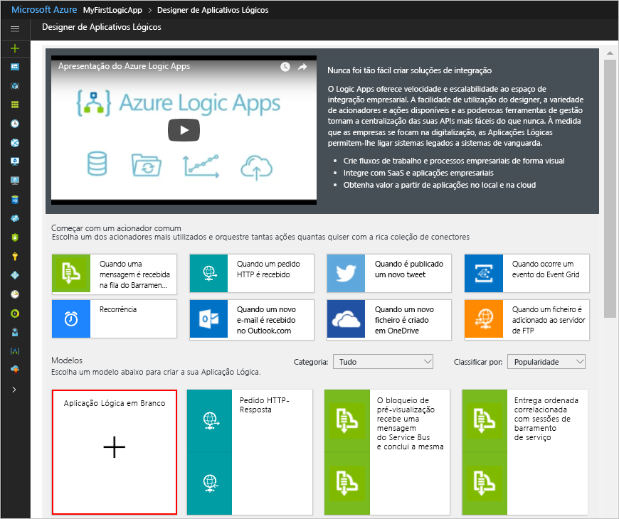

# <a name="tutorial-automate-tasks-to-process-emails-by-using-azure-logic-apps-azure-functions-and-azure-storage"></a>Tutorial: automatizar tarefas para processar emails usando aplicativos lógicos do Azure, Azure Functions e armazenamento do Azure

O Azure Logic Apps ajuda-o a automatizar fluxos de trabalho e a integrar dados nos serviços do Azure, nos serviços Microsoft, noutras aplicações de software como serviço (Saas) e em sistemas no local. Este tutorial mostra como pode criar uma [aplicação lógica](../logic-apps/logic-apps-overview.md) que processa e-mails recebidos e anexos. Esse aplicativo lógico analisa o conteúdo do email, salva o conteúdo no armazenamento do Azure e envia notificações para revisar esse conteúdo.

Neste tutorial, ficará a saber como:

> [!div class="checklist"]
> * Configurar o [Armazenamento do Azure](../storage/common/storage-introduction.md) e o Explorador de Armazenamento para verificar e-mails e anexos guardados.
> * Criar uma [função do Azure](../azure-functions/functions-overview.md) que remove o HTML dos e-mails. Este tutorial inclui o código que pode utilizar para esta função.
> * Criar uma aplicação lógica em branco.
> * Adicionar um acionador que monitoriza os e-mails para verificar se há anexos.
> * Adicionar uma condição que verifica se os e-mails têm anexos.
> * Adicionar uma ação que chama a função do Azure quando um e-mail tem anexos.
> * Adicionar uma ação que cria blobs de armazenamento para e-mails e anexos.
> * Adicionar uma ação que envia notificações de e-mail.

Quando terminar, a aplicação lógica é semelhante a este fluxo de trabalho a alto nível:


## <a name="prerequisites"></a>Pré-requisitos

* Uma subscrição do Azure. Se não tiver uma subscrição do Azure, [inscreva-se para obter uma conta do Azure gratuita](https://azure.microsoft.com/free/).

* Uma conta de e-mail de um fornecedor de e-mail que o Logic Apps suporte, como o Outlook do Office 365, o Outlook.com ou o Gmail. Para outros fornecedores, [consulte a lista de conectores aqui](https://docs.microsoft.com/connectors/).

  Esta aplicação lógica utiliza uma conta do Outlook do Office 365. Se utilizar outra conta de e-mail, os passos gerais são os mesmos, mas a IU poderá ser ligeiramente diferente.

* Transferir e instalar o [Explorador de Armazenamento do Microsoft Azure](https://storageexplorer.com/) gratuito. Esta ferramenta ajuda-o a verificar se o seu contentor de armazenamento está configurado corretamente.

## <a name="sign-in-to-azure-portal"></a>Iniciar sessão no portal do Azure

Inicie sessão no [portal do Azure](https://portal.azure.com) com as credenciais da sua conta do Azure.

## <a name="set-up-storage-to-save-attachments"></a>Configurar o armazenamento para guardar anexos

Pode guardar os e-mails e anexos recebidos como blobs num [contentor de armazenamento do Azure](../storage/common/storage-introduction.md).

1. Antes de criar um contêiner de armazenamento, [crie uma conta de armazenamento](../storage/common/storage-quickstart-create-account.md) com essas configurações na guia **noções básicas** na portal do Azure:

   | Definição | Valor | Descrição |
   |---------|-------|-------------|
   | **Subscrição** | <*Azure-subscription-name*> | O nome para a subscrição do Azure |  
   | **Grupo de recursos** | <*Azure-Resource-group*> | O nome do [grupo de recursos do Azure](../azure-resource-manager/resource-group-overview.md) utilizado para organizar e gerir os recursos relacionados. Este exemplo usa "LA-tutorial-RG". <p>**Nota:** os grupos de recursos existem dentro de regiões específicas. Embora os itens neste tutorial possam não estar disponíveis em todas as regiões, tente utilizar a mesma região sempre que possível. |
   | **Nome da conta de armazenamento** | <*Azure-Storage-Account-name* > | O nome da conta de armazenamento, que deve ter de 3-24 caracteres e pode conter apenas letras minúsculas e números. Este exemplo usa "attachmentstorageacct". |
   | **Localização** | <*Azure-region*> | A região onde armazenar informações sobre sua conta de armazenamento. Este exemplo usa "oeste dos EUA". |
   | **Performance** (Desempenho) | Padrão | Esta definição especifica os tipos de dados suportados e os suportes de dados para armazenar dados. Veja [Tipos de contas de armazenamento](../storage/common/storage-introduction.md#types-of-storage-accounts). |
   | **Account kind** (Tipo de conta) | Fins gerais | O [tipo de conta de armazenamento](../storage/common/storage-introduction.md#types-of-storage-accounts) |
   | **Replicação** | Armazenamento localmente redundante (LRS) | Esta definição especifica de que forma os seus dados são copiados, armazenados, geridos e sincronizados. Consulte [armazenamento com redundância local (LRS): redundância de dados de baixo custo para o armazenamento do Azure](../storage/common/storage-redundancy-lrs.md). |
   | **Camada de acesso (padrão)** | Mantenha a configuração atual. |
   ||||

   Na guia **avançado** , selecione esta configuração:

   | Definição | Valor | Descrição |
   |---------|-------|-------------|
   | **Secure transfer required** (Transferência segura necessária) | Desativado | Esta definição especifica a segurança necessária para pedidos provenientes de ligações. Veja [Require secure transfer](../storage/common/storage-require-secure-transfer.md) (Transferência segura necessária). |
   ||||

   Para criar a sua conta de armazenamento, também pode utilizar o [Azure PowerShell](../storage/common/storage-quickstart-create-storage-account-powershell.md) ou a [CLI do Azure](../storage/common/storage-quickstart-create-storage-account-cli.md).

1. Quando terminar, selecione **revisar + criar**.

1. Depois que o Azure implantar sua conta de armazenamento, localize sua conta de armazenamento e obtenha a chave de acesso da conta de armazenamento:

   1. No menu da conta de armazenamento, em **Definições**, selecione **Chaves de acesso**.

   1. Copie o nome da conta de armazenamento e a **key1**e salve esses valores em um local seguro.

      

   Para obter a chave de acesso à sua conta de armazenamento, também pode utilizar o [Azure PowerShell](https://docs.microsoft.com/powershell/module/az.storage/get-azstorageaccountkey) ou a [CLI do Azure](https://docs.microsoft.com/cli/azure/storage/account/keys?view=azure-cli-latest.md#az-storage-account-keys-list).

1. Crie um contentor de armazenamento de blobs para os anexos de e-mails.

   1. No menu da conta de armazenamento, selecione **Descrição Geral**. Em **Serviços**, selecione **contêineres**.

      

   1. Depois de a página **Contentores** abrir, na barra de ferramentas, selecione **Contentor**.

   1. Em **novo contêiner**, insira `attachments` como o nome do contêiner. Em **nível de acesso público**, selecione **contêiner (acesso de leitura anônimo para contêineres e blobs)**  > **OK**.

      Quando terminar, pode encontrar o contentor de armazenamento na sua conta de armazenamento aqui no portal do Azure:

      

   Para criar um contêiner de armazenamento, você também pode usar [Azure PowerShell](https://docs.microsoft.com/powershell/module/az.storage/new-azstoragecontainer) ou [CLI do Azure](https://docs.microsoft.com/cli/azure/storage/container?view=azure-cli-latest#az-storage-container-create).

Depois, ligue o Explorador de Armazenamento à conta de armazenamento.

## <a name="set-up-storage-explorer"></a>Configurar o Explorador de Armazenamento

Agora, ligue o Explorador de Armazenamento à conta de armazenamento, de modo a verificar que a sua aplicação lógica consegue guardar corretamente os anexos como blobs no contentor.

1. Iniciar Gerenciador de Armazenamento do Microsoft Azure.

   O Explorador de Armazenamento pede-lhe uma ligação à sua conta de armazenamento.

1. No painel **conectar ao armazenamento do Azure** , selecione **usar um nome de conta de armazenamento e a chave** > **Avançar**.

   

   > [!TIP]
   > Se nenhum prompt for exibido, na barra de ferramentas Gerenciador de Armazenamento, selecione **Adicionar uma conta**.

1. Em **nome de exibição**, forneça um nome amigável para sua conexão. Em **Nome da conta**, indique o nome da sua conta de armazenamento. Em **chave de conta**, forneça a chave de acesso que você salvou anteriormente e selecione **Avançar**.

1. Confirme as informações de conexão e, em seguida, selecione **conectar**.

   Gerenciador de Armazenamento cria a conexão e mostra sua conta de armazenamento na janela do Explorer, em **Local & conectado** > **contas de armazenamento**.

1. Para localizar o contêiner de armazenamento de BLOBs, em **contas de armazenamento**, expanda sua conta de armazenamento, que é **attachmentstorageacct** aqui e expanda **contêineres de blob** onde você encontra o contêiner **anexos** , por exemplo:

   

Depois, crie uma [função do Azure](../azure-functions/functions-overview.md) que remove o HTML dos e-mails recebidos.

## <a name="create-function-to-clean-html"></a>Criar uma função para limpar o HTML

Agora, utilize o fragmento de código fornecido nestes passos para criar uma função do Azure que remove o HTML de cada e-mail recebido. Desta forma, o conteúdo dos e-mails fica mais limpo e é processado mais facilmente. Depois, pode chamar esta função a partir da sua aplicação lógica.

1. Antes de poder criar uma função, [crie uma aplicação de funções](../azure-functions/functions-create-function-app-portal.md) com estas definições:

   | Definição | Valor | Descrição |
   | ------- | ----- | ----------- |
   | **Nome da aplicação** | <*Function-nome do aplicativo* > | O nome do aplicativo de funções, que deve ser globalmente exclusivo no Azure. Este exemplo já usa "CleanTextFunctionApp", portanto, forneça um nome diferente, como "MyCleanTextFunctionApp-<*your-name*>" |
   | **Subscrição** | <*your-Azure-subscription-name*> | A mesma subscrição do Azure que utilizou anteriormente |
   | **Grupo de Recursos** | LA-Tutorial-RG | O mesmo grupo de recursos do Azure que utilizou anteriormente |
   | **OS** | <*seu sistema operacional*> | Selecione o sistema operacional que dá suporte à sua linguagem de programação de função favorita. Para este exemplo, selecione **Windows**. |
   | **Plano de Alojamento** | Plano de Consumo | Esta definição determina como alocar e dimensionar os recursos, como o poder de computação, para executar a aplicação de funções. Veja [Hosting plans comparison](../azure-functions/functions-scale.md) (Comparação dos planos de alojamento). |
   | **Localização** | Oeste dos E.U.A. | A mesma região que utilizou anteriormente |
   | **Pilha de tempo de execução** | Linguagem preferencial | Selecione um tempo de execução que ofereça suporte à sua linguagem de programação de função favorita. Selecione **.net** para C# e F# funções. |
   | **Armazenamento** | cleantextfunctionstorageacct | Crie uma conta de armazenamento para a sua aplicação de funções. Utilize apenas letras minúsculas e números. <p>**Observação:** Essa conta de armazenamento contém seus aplicativos de funções e difere de sua conta de armazenamento criada anteriormente para anexos de email. |
   | **Application Insights** | Desativar | Ativa o monitoramento de aplicativos com [Application insights](../azure-monitor/app/app-insights-overview.md), mas, para este tutorial, selecione **desabilitar** > **aplicar**. |
   ||||

   Se seu aplicativo de funções não abrir automaticamente após a implantação, na caixa de pesquisa [portal do Azure](https://portal.azure.com) , localize e selecione **aplicativo de funções**. Em **aplicativo de funções**, selecione seu aplicativo de funções.

   

   Caso contrário, o Azure abre automaticamente a sua aplicação de funções, conforme mostrado aqui:

   

   Para criar um aplicativo de funções, você também pode usar [CLI do Azure](../azure-functions/functions-create-first-azure-function-azure-cli.md), ou o [PowerShell e modelos do Resource Manager](../azure-resource-manager/resource-group-template-deploy.md).

1. Na lista **aplicativos de funções** , expanda seu aplicativo de funções, se ainda não estiver expandido. Em seu aplicativo de funções, selecione **funções**. Na barra de ferramentas das funções, selecione **Nova função**.

   

1. Em **escolher um modelo abaixo ou vá para o início rápido**, selecione o modelo de **gatilho http** .

   

   O Azure cria uma função usando um modelo específico de linguagem para uma função disparada por HTTP.

1. No painel **Nova Função**, em **Nome**, introduza `RemoveHTMLFunction`. Mantenha o **nível de autorização** definido como **função**e selecione **criar**.

   

1. Quando o editor estiver aberto, substitua o código do modelo por este código de exemplo, que remove o HTML e devolve ps resultados ao chamador:

   ```CSharp
   #r "Newtonsoft.Json"

   using System.Net;
   using Microsoft.AspNetCore.Mvc;
   using Microsoft.Extensions.Primitives;
   using Newtonsoft.Json;
   using System.Text.RegularExpressions;

   public static async Task<IActionResult> Run(HttpRequest req, ILogger log) {

      log.LogInformation("HttpWebhook triggered");

      // Parse query parameter
      string emailBodyContent = await new StreamReader(req.Body).ReadToEndAsync();

      // Replace HTML with other characters
      string updatedBody = Regex.Replace(emailBodyContent, "<.*?>", string.Empty);
      updatedBody = updatedBody.Replace("\\r\\n", " ");
      updatedBody = updatedBody.Replace(@"&nbsp;", " ");

      // Return cleaned text
      return (ActionResult)new OkObjectResult(new { updatedBody });
   }
   ```

1. Quando tiver terminado, selecione **Guardar**. Para testar sua função, na borda direita do editor, sob o ícone de seta ( **<** ), selecione **testar**.

   

1. No painel de **teste** , em **corpo da solicitação**, insira essa linha e selecione **executar**.

   `{"name": "<p><p>Testing my function</br></p></p>"}`

   

   A janela **Saída** mostra o resultado da função:

   ```json
   {"updatedBody":"{\"name\": \"Testing my function\"}"}
   ```

Depois de confirmar que a função está a funcionar, crie a aplicação lógica. Embora este tutorial mostre como criar uma função que remove o HTML dos e-mails, o Logic Apps também fornece um conector **HTML para Texto**.

## <a name="create-your-logic-app"></a>Criar uma aplicação lógica

1. Na home page do Azure, na caixa de pesquisa, localize e selecione **aplicativos lógicos**.

   

1. Na página **aplicativos lógicos** , selecione **Adicionar**.

   

1. Em **Criar aplicação lógica**, forneça detalhes sobre a sua aplicação lógica, conforme aqui apresentado. Depois de terminar, selecione **criar**.

   

   | Definição | Valor | Descrição |
   | ------- | ----- | ----------- |
   | **Nome** | LA-ProcessAttachment | O nome para a aplicação lógica |
   | **Subscrição** | <*your-Azure-subscription-name*> | A mesma subscrição do Azure que utilizou anteriormente |
   | **Grupo de recursos** | LA-Tutorial-RG | O mesmo grupo de recursos do Azure que utilizou anteriormente |
   | **Localização** | Oeste dos E.U.A. | A mesma região que utilizou anteriormente |
   | **Log Analytics** | Desativado | Para este tutorial, selecione a configuração **desativado** . |
   ||||

1. Depois que o Azure implantar seu aplicativo, na barra de ferramentas do Azure, selecione o ícone notificações e selecione **ir para o recurso**.

   

1. Depois que o designer de aplicativos lógicos for aberto e mostrar uma página com um vídeo de introdução e modelos para padrões comuns do aplicativo lógico. Em **Modelos**, selecione **Aplicação Lógica em Branco**.

   

Em seguida, adicione um [acionador](../logic-apps/logic-apps-overview.md#logic-app-concepts) que escuta os e-mails recebidos que têm anexos. Todas as aplicações lógicas têm de ser iniciadas com um acionador, que é acionado quando um evento específico acontece ou quando dados novos satisfazem uma condição específica. Para obter mais informações, veja [Criar a sua primeira aplicação lógica](../logic-apps/quickstart-create-first-logic-app-workflow.md).

## <a name="monitor-incoming-email"></a>Monitorizar os e-mails recebidos

1. No designer na caixa de pesquisa, digite `when new email arrives` como filtro. Selecione o acionador para o seu fornecedor de e-mail: **Quando é recebido um e-mail novo - <*fornecedor de e-mail*>**

   Por exemplo:

   

   * Relativamente a contas escolares ou profissionais do Azure, selecione Office 365 Outlook (Outlook do Office 365).

   * Quanto a contas Microsoft pessoais, selecione Outlook.com.

1. Se lhe forem pedidas credenciais, inicie sessão na sua conta de e-mail para que o Logic Apps se possa ligar à mesma.

1. Agora, indique os critérios que o acionador utiliza para filtrar os e-mails novos.

   1. Especifique as configurações descritas abaixo para verificar emails.

      

      | Definição | Valor | Descrição |
      | ------- | ----- | ----------- |
      | **Pasta** | A Receber | A pasta de e-mail a verificar |
      | **Tem Anexo** | Sim | Obter apenas os e-mails com anexos. <p>**Nota:** o acionador não remove e-mails da sua conta; verifica apenas as mensagens novas e só processa os e-mails que correspondam ao filtro do assunto. |
      | **Incluir Anexos** | Sim | Obter os anexos como entrada para o seu fluxo de trabalho em vez de verificar apenas os anexos. |
      | **Intervalo** | 1 | O número de intervalos de espera entre verificações |
      | **Frequência** | Minuto | A unidade de tempo para cada intervalo entre verificações |
      ||||
  
   1. Na lista **Adicionar novo parâmetro** , selecione **filtro de assunto**.

   1. Depois que a caixa de **filtro de assunto** aparecer na ação, especifique o assunto como listado aqui:

      | Definição | Valor | Descrição |
      | ------- | ----- | ----------- |
      | **Filtro de Assunto** | `Business Analyst 2 #423501` | O texto a localizar no assunto do e-mail |
      ||||

1. Para ocultar os detalhes do acionador por agora, clique no interior da barra de título do mesmo.

   

1. Guarde a aplicação lógica. Na barra de ferramentas do designer, selecione **salvar**.

   A sua aplicação lógica está agora ativa, mas não faz mais nada que não verificar os e-mails. Em seguida, adicione uma condição que especifique critérios para continuar o fluxo de trabalho.

## <a name="check-for-attachments"></a>Verificar a existência de anexos

Agora, adicione uma condição que seleciona apenas os e-mails que têm anexos.

1. No gatilho, selecione **nova etapa**.

   

1. Em **escolher uma ação**, na caixa de pesquisa, digite `condition`. Selecione esta ação: **condição**

   

   1. Mude o nome da condição com uma descrição melhor. Na barra de título da condição, selecione o botão de reticências ( **...** ) > **renomear**.

      

   1. Mude o nome da condição com a descrição `If email has attachments and key subject phrase`

1. Criar uma condição que verifica se os e-mails têm anexos.

   1. Na primeira linha, em **E**, clique dentro da caixa esquerda. Na lista de conteúdo dinâmico que aparece, selecione a propriedade **Tem anexo**.

      

   1. Na caixa do meio, mantenha o operador **é igual a**.

   1. Na caixa à direita, digite **true** como o valor a ser comparado com o valor da propriedade **Attachment** do gatilho.

      

      Se ambos os valores forem iguais, o e-mail tem, pelo menos, um anexo, a condição é transmitida e o fluxo de trabalho continua.

   Na definição da aplicação lógica subjacente, que pode ver na janela do editor de código, esta condição terá um aspeto semelhante a este exemplo:

   ```json
   "Condition": {
      "actions": { <actions-to-run-when-condition-passes> },
      "expression": {
         "and": [ {
            "equals": [
               "@triggerBody()?['HasAttachment']",
                 "true"
            ]
         } ]
      },
      "runAfter": {},
      "type": "If"
   }
   ```

1. Guarde a aplicação lógica. Na barra de ferramentas do designer, selecione **salvar**.

### <a name="test-your-condition"></a>Testar a condição

Agora, teste para verificar se a condição funciona corretamente:

1. Se o seu aplicativo lógico ainda não estiver em execução, selecione **executar** na barra de ferramentas do designer.

   Este passo inicia manualmente a aplicação lógica sem ter de esperar que o intervalo que especificou passe. No entanto, nada acontece enquanto o e-mail de teste não chegar à sua caixa de entrada.

1. Envie um e-mail para si próprio que cumpra estes critérios:

   * O assunto do e-mail tem o texto que especificou no **filtro de assunto** do acionador, `Business Analyst 2 #423501`

   * O e-mail tem um anexo. Por agora, crie apenas um ficheiro de texto vazia e anexe-o ao e-mail.

   Quando o e-mail chegar, a aplicação lógica verifica a existência de anexos e o texto do assunto especificado. Se a condição for aprovada, o acionador é acionado e faz com que o motor do Logic Apps crie uma instância da aplicação lógica e inicie o fluxo de trabalho.

1. Para verificar se o gatilho foi acionado e o aplicativo lógico foi executado com êxito, no menu do aplicativo lógico, selecione **visão geral**.

   

   Se a sua aplicação lógica não for acionada ou executada, apesar de o acionador ter sido bem-sucedido, veja [Troubleshoot your logic app](../logic-apps/logic-apps-diagnosing-failures.md) (Resolver problemas da sua aplicação lógica).

Em seguida, defina as ações a realizar para o ramo **Se verdadeiro**. Para guardar o e-mail juntamente com eventuais anexos, remova todo o HTML do corpo do e-mail e crie blobs no contentor de armazenamento para a mensagem e os anexos.

> [!NOTE]
> A aplicação lógica não tem de fazer nada no ramo **Se falso** se os e-mails não tiverem anexos. Como exercício de bónus após concluir este tutorial, pode adicionar qualquer ação adequada que queira realizar no ramo **Se falso**.

## <a name="call-removehtmlfunction"></a>Chamar RemoveHTMLFunction

Este passo adiciona a função do Azure criada anteriormente à sua aplicação lógica e transmite o conteúdo do corpo de e-mail do acionador de e-mail à sua função.

1. No menu da aplicação lógica, selecione **Estruturador da Aplicação Lógica**. Na ramificação **If true** , selecione **Adicionar uma ação**.

   

1. Na caixa de pesquisa, encontre "funções do azure" e selecione a ação: **Escolher uma função do Azure - Funções do Azure**

   

1. Selecione o aplicativo de funções criado anteriormente, que é `CleanTextFunctionApp` neste exemplo:

   

1. Agora, selecione a função **RemoveHTMLFunction**

   

1. Mude o nome da forma da função com a descrição `Call RemoveHTMLFunction to clean email body`

1. Agora, especifique a entrada para a função processar.

   1. Em **Corpo do Pedido**, introduza este texto com um espaço à esquerda:

      `{ "emailBody":`

      Enquanto trabalha nesta entrada nos passos seguintes, obterá um erro relativo a JSON inválido até que a sua entrada esteja corretamente formatada como JSON. Quando testou esta função anteriormente, a entrada especificada para a mesma utilizou JavaScript Object Notation (JSON). Por isso, o corpo do pedido também tem de utilizar o mesmo formato.

      Além disso, quando o cursor está dentro da caixa **Corpo do pedido**, é apresentada uma lista de conteúdo dinâmico para que possa selecionar os valores das propriedades disponíveis de ações anteriores.

   1. Na lista de conteúdo dinâmico, em **Quando é recebido um novo e-mail**, selecione a propriedade **Corpo**. Depois desta propriedade, não se esqueça de adicionar a chaveta de fecho: `}`

      

   Quando estiver pronto, a entrada para a sua função terá o aspeto deste exemplo:

   

1. Guarde a aplicação lógica.

Em seguida, adicione uma ação que cria um blob no contentor de armazenamento para que possa guardar o corpo do e-mail.

## <a name="create-blob-for-email-body"></a>Criar blob para o corpo do e-mail

1. No bloco **If true** e, em sua função do Azure, selecione **Adicionar uma ação**.

1. Na caixa de pesquisa, insira `create blob` como seu filtro e selecione esta ação: **criar blob**

   

1. Crie uma ligação com estas definições, conforme mostrado e descrito aqui. Quando terminar, selecione **Criar**.

   

   | Definição | Valor | Descrição |
   | ------- | ----- | ----------- |
   | **Nome da Ligação** | AttachmentStorageConnection | Um nome descritivo para a ligação |
   | **Storage Account** | attachmentstorageacct | O nome da conta de armazenamento que criou anteriormente para guardar anexos |
   ||||

1. Mude o nome da ação **Create blob** pela descrição `Create blob for email body`

1. Na ação **Criar blob**, indique estas informações e selecione estes campos para criar o blob, conforme mostrado e descrito:

   

   | Definição | Valor | Descrição |
   | ------- | ----- | ----------- |
   | **Folder path** | /attachments | O caminho e o nome do contentor que criou anteriormente. Neste exemplo, clique no ícone de pasta e, em seguida, selecione o contentor "/attachments". |
   | **Blob name** | Campo **From** | Neste exemplo, utilize o nome do remetente como o nome do blob. Clique no interior desta caixa para que a lista de conteúdo dinâmico seja apresentada e, em seguida, selecione o campo **De** na ação **Quando é recebido um novo e-mail**. |
   | **Blob content** | Campo **Content** | Neste exemplo, utilize o corpo do e-mail sem HTML como o conteúdo do blob. Clique no interior desta caixa para que a lista de conteúdo dinâmico seja apresentada e, em seguida, selecione **Corpo** na ação **Call RemoveHTMLFunction to clean email body**. |
   ||||

   Quando estiver pronto, a ação terá o aspeto deste exemplo:

   

1. Guarde a aplicação lógica.

### <a name="check-attachment-handling"></a>Verificar o processamento de anexos

Agora, teste se a sua aplicação lógica processa os e-mails da forma que especificou:

1. Se o seu aplicativo lógico ainda não estiver em execução, selecione **executar** na barra de ferramentas do designer.

1. Envie um e-mail para si próprio que cumpra estes critérios:

   * O assunto do e-mail tem o texto que especificou no **filtro de assunto** do acionador, `Business Analyst 2 #423501`

   * O e-mail tem, pelo menos, um anexo. Por enquanto, basta criar um arquivo de texto vazio e anexar esse arquivo ao seu email.

   * Seu email tem algum conteúdo de teste no corpo, por exemplo: `Testing my logic app`

   Se a sua aplicação lógica não for acionada ou executada, apesar de o acionador ter sido bem-sucedido, veja [Troubleshoot your logic app](../logic-apps/logic-apps-diagnosing-failures.md) (Resolver problemas da sua aplicação lógica).

1. Confirme que a aplicação lógica guardou o e-mail no contentor de armazenamento correto.

   1. Em Gerenciador de Armazenamento, expanda **Local & conectado** > **contas de armazenamento** > **Attachmentstorageacct (chave)**  > **contêineres de blob** > **anexos**.

   1. Verifique o contentor **attachments** relativamente ao e-mail.

      Neste momento, apenas o e-mail aparece no contentor, porque a aplicação lógica ainda não processa anexos.

      

   1. Quando tiver terminado, elimine o e-mail no Explorador de Armazenamento.

1. Opcionalmente, para testar o ramo **Se falso**, que não faz nada nesta fase, pode enviar um e-mail que não cumpra os critérios.

Em seguida, adicione um ciclo para processar todos os anexos de e-mail.

## <a name="process-attachments"></a>Processar anexos

Para processar cada anexo no e-mail, adicione um ciclo **Para cada** ao fluxo de trabalho da sua aplicação lógica.

1. Na forma **criar blob para o corpo do email** , selecione **Adicionar uma ação**.

   

1. Em **escolher uma ação**, na caixa de pesquisa, insira `for each` como filtro e selecione esta ação: **para cada**

   

1. Mude o nome do ciclo com a descrição `For each email attachment`

1. Agora, especifique os dados que o ciclo vai processar. Clique no interior da caixa **Selecionar uma saída dos passos anteriores** para que a lista de conteúdo dinâmico abra e, em seguida, selecione **Anexos**.

   

   O campo **Anexos** transmite uma matriz que contém todos os anexos incluídos num e-mail. O ciclo **For each** repete as ações em cada item que é transmitido com a matriz.

1. Guarde a aplicação lógica.

Em seguida, adicione a ação que guarda cada anexo como um blob no seu contentor de armazenamento **attachments**.

## <a name="create-blob-for-each-attachment"></a>Criar blob para cada anexo

1. No loop **para cada anexo de email** , selecione **Adicionar uma ação** para que você possa especificar a tarefa a ser executada em cada anexo encontrado.

   

1. Na caixa de pesquisa, insira `create blob` como filtro e, em seguida, selecione esta ação: **criar blob**

   

1. Mude o nome da ação **Create blob 2** pela descrição `Create blob for each email attachment`

1. Na ação **Criar blob para cada anexo de e-mail**, indique estas informações e selecione as propriedades para cada blob que pretende criar, conforme mostrado e descrito:

   

   | Definição | Valor | Descrição |
   | ------- | ----- | ----------- |
   | **Folder path** | /attachments | O caminho e o nome do contentor que criou anteriormente. Neste exemplo, clique no ícone de pasta e, em seguida, selecione o contentor "/attachments". |
   | **Blob name** | Campo **Name** | Neste exemplo, utilize o nome do anexo como o nome do blob. Clique no interior desta caixa para que a lista de conteúdo dinâmico seja apresentada e, em seguida, selecione o campo **Nome** na ação **Quando é recebido um novo e-mail**. |
   | **Blob content** | Campo **Content** | Neste exemplo, utilize o campo **Conteúdo** como o conteúdo do blob. Clique no interior desta caixa para que a lista de conteúdo dinâmico seja apresentada e, em seguida, selecione **Conteúdo** na ação **Quando é recebido um novo e-mail**. |
   ||||

   Quando estiver pronto, a ação terá o aspeto deste exemplo:

   

1. Guarde a aplicação lógica.

### <a name="check-attachment-handling"></a>Verificar o processamento de anexos

Em seguida, teste se a sua aplicação lógica processa os anexos da forma que especificou:

1. Se o seu aplicativo lógico ainda não estiver em execução, selecione **executar** na barra de ferramentas do designer.

1. Envie um e-mail para si próprio que cumpra estes critérios:

   * O assunto do email tem o texto que você especificou na propriedade **filtro de assunto** do gatilho: `Business Analyst 2 #423501`

   * O seu e-mail tem, pelo menos, dois anexos. Por agora, crie apenas dois ficheiros de texto vazios e anexe-os ao e-mail.

   Se a sua aplicação lógica não for acionada ou executada, apesar de o acionador ter sido bem-sucedido, veja [Troubleshoot your logic app](../logic-apps/logic-apps-diagnosing-failures.md) (Resolver problemas da sua aplicação lógica).

1. Confirme que a aplicação lógica guardou o e-mail e os anexos no contentor de armazenamento correto.

   1. Em Gerenciador de Armazenamento, expanda **Local & conectado** > **contas de armazenamento** > **Attachmentstorageacct (chave)**  > **contêineres de blob** > **anexos**.

   1. Verifique o contentor **attachments** relativamente ao e-mail e aos anexos.

      

   1. Quando tiver terminado, elimine o e-mail e os anexos no Explorador de Armazenamento.

Em seguida, adicione uma ação para que a sua aplicação lógica envia um e-mail para rever os anexos.

## <a name="send-email-notifications"></a>Enviar notificações por e-mail

1. Na ramificação **se verdadeiro** , sob o loop **para cada anexo de email** , selecione **Adicionar uma ação**.

   

1. Na caixa de pesquisa, insira `send email` como seu filtro e, em seguida, selecione a ação "enviar email" para seu provedor de email.

   Para filtrar a lista de ações para um serviço específico, pode selecionar primeiro o conector.

   

   * Relativamente a contas escolares ou profissionais do Azure, selecione Office 365 Outlook (Outlook do Office 365).

   * Quanto a contas Microsoft pessoais, selecione Outlook.com.

1. Se lhe forem pedidas credenciais, inicie sessão na sua conta de e-mail para que o Logic Apps crie uma ligação para a sua conta de e-mail.

1. Mude o nome da ação **Send an email** pela descrição `Send email for review`

1. Indique as informações desta ação e selecione os campos que pretende incluir no e-mail, conforme mostrado e descrito. Para adicionar linhas em branco a uma caixa de edição, prima Shift + Enter.

   

   Se você não encontrar um campo esperado na lista de conteúdo dinâmico, selecione **Ver mais** ao lado de **quando um novo email chegar**.

   | Definição | Valor | Notas |
   | ------- | ----- | ----- |
   | **Para** | <*recipient-email-address*> | Para fins de teste, pode utilizar o seu próprio endereço de e-mail. |
   | **Assunto**  | ```ASAP - Review applicant for position:``` **Subject** | O assunto do e-mail que pretende incluir. Clique no interior desta caixa, introduza o texto de exemplo e, na lista de conteúdo dinâmico, selecione o campo **Assunto** em **Quando é recebido um novo e-mail**. |
   | **Corpo** | ```Please review new applicant:``` <p>```Applicant name:``` **From** <p>```Application file location:``` **Path** <p>```Application email content:``` **Body** | O conteúdo do corpo do e-mail. Clique no interior desta caixa, introduza o texto de exemplo e, na lista de conteúdo dinâmico, selecione estes campos: <p>- **From**, em **When a new email arrives** </br>- **Path**, em **Create blob for email body** </br>- **Body**, em **Call RemoveHTMLFunction to clean email body** |
   ||||

   > [!NOTE]
   > Se selecionar um campo que contém uma matriz, como o campo **Conteúdo**, que é uma matriz que contém anexos, o estruturador adiciona automaticamente um ciclo “Para cada” em torno da ação que referencia esse campo. Desta forma, a sua aplicação lógica pode realizar essa ação em cada item da matriz. Para remover o loop, remova o campo da matriz, mova a ação de referência para fora do loop, selecione as reticências ( **...** ) na barra de título do loop e selecione **excluir**.

1. Guarde a aplicação lógica.

Teste a sua aplicação lógica, que é agora semelhante a este exemplo:


## <a name="run-your-logic-app"></a>Executar a aplicação lógica

1. Envie um e-mail para si próprio que cumpra estes critérios:

   * O assunto do email tem o texto que você especificou na propriedade **filtro de assunto** do gatilho: `Business Analyst 2 #423501`

   * Seu email tem um ou mais anexos. Pode reutilizar um ficheiro de texto vazio do teste anterior. Para um cenário realista, anexe um ficheiro de currículo.

   * O corpo do e-mail tem este texto, que pode copiar e colar:

     ```text

     Name: Jamal Hartnett

     Street address: 12345 Anywhere Road

     City: Any Town

     State or Country: Any State

     Postal code: 00000

     Email address: jamhartnett@outlook.com

     Phone number: 000-000-0000

     Position: Business Analyst 2 #423501

     Technical skills: Dynamics CRM, MySQL, Microsoft SQL Server, JavaScript, Perl, Power BI, Tableau, Microsoft Office: Excel, Visio, Word, PowerPoint, SharePoint, and Outlook

     Professional skills: Data, process, workflow, statistics, risk analysis, modeling; technical writing, expert communicator and presenter, logical and analytical thinker, team builder, mediator, negotiator, self-starter, self-managing  

     Certifications: Six Sigma Green Belt, Lean Project Management

     Language skills: English, Mandarin, Spanish

     Education: Master of Business Administration
     ```

1. Execute a aplicação lógica. Se tiver êxito, a aplicação lógica envia-lhe um e-mail semelhante ao deste exemplo:

   

   Se não receber nenhuma mensagem de e-mail, verifique a pasta de lixo do e-mail. O filtro de lixo de e-mail poderá redirecionar estes tipos de mensagem de e-mail. Caso contrário, se não tiver a certeza de que a aplicação lógica foi executada corretamente, veja [Troubleshoot your logic app](../logic-apps/logic-apps-diagnosing-failures.md) (Resolver problemas da sua aplicação lógica).

Parabéns! Criou e executou uma aplicação lógica que automatiza tarefas em diferentes serviços do Azure e que chama um código personalizado.

## <a name="clean-up-resources"></a>Limpar recursos

Quando já não precisar deste exemplo, elimine o grupo de recursos que contém a aplicação lógica e os recursos relacionados.

1. No menu principal do Azure, selecione **Grupos de recursos**. Na lista grupos de recursos, selecione o grupo de recursos deste tutorial. No painel **visão geral** , selecione **excluir grupo de recursos**.

   

1. Quando o painel de confirmação for exibido, insira o nome do grupo de recursos e selecione **excluir**.

## <a name="next-steps"></a>Passos seguintes

Neste tutorial, criou uma aplicação lógica que processa e armazena anexos de e-mail através da integração de serviços do Azure, como o Armazenamento do Azure e as Funções do Azure. Agora, saiba mais sobre outros conectores que pode utilizar para criar aplicações lógicas.

> [!div class="nextstepaction"]
> [Saiba mais sobre os conectores do Logic Apps](../connectors/apis-list.md)
