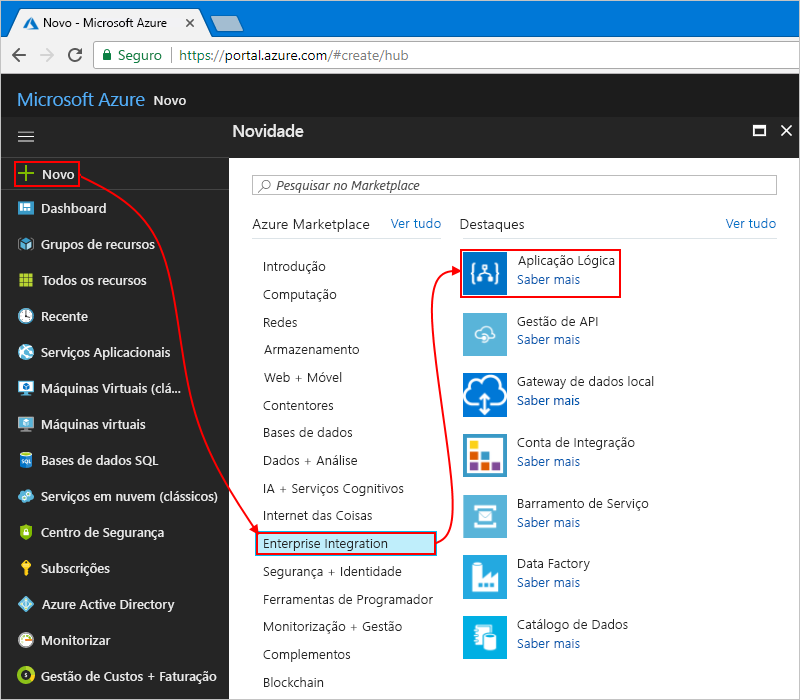

# Tutorial: Criar fluxos de trabalho baseados em aprovação automatizados usando aplicativos lógicos do Azure

Este tutorial mostra como criar um [aplicativo lógico](../logic-apps/logic-apps-overview.md) que automatiza um fluxo de trabalho baseado em aprovação. Especificamente, esse aplicativo lógico processa solicitações de assinatura para uma lista de endereçamento gerenciada pelo serviço [MailChimp](https://mailchimp.com/) . Esta aplicação lógica monitoriza uma conta de e-mail quanto a esses pedidos, envia-os para aprovação e adiciona os membros aprovados à mesma.

Neste tutorial, ficará a saber como:

> [!div class="checklist"]
> * Criar uma aplicação lógica em branco.
> * Adicionar um acionador que monitoriza os e-mails quanto a pedidos de subscrição.
> * Adicionar uma ação que envia e-mails para aprovar ou rejeitar esses pedidos.
> * Adicionar uma condição que verifica a resposta de aprovação.
> * Adicionar uma ação que adiciona os membros aprovados à lista de correio.
> * Adicionar uma condição que verifica se esses membros foram associados com êxito à lista.
> * Adicionar uma ação que envia e-mails a confirmar se esses membros foram associados com êxito à lista.

Quando terminar, a aplicação lógica é semelhante a este fluxo de trabalho a alto nível:

## Pré-requisitos

* Uma subscrição do Azure. Se você não tiver uma assinatura, [Inscreva-se para uma conta gratuita do Azure](https://azure.microsoft.com/free/) antes de começar.

* Uma conta do MailChimp que contém e uma lista denominada "Test-Members-ML", em que seu aplicativo lógico pode adicionar endereços de email para membros aprovados. Se você não tiver uma conta, [Inscreva-se para uma conta gratuita](https://login.mailchimp.com/signup/)e saiba [como criar uma lista de MailChimp](https://us17.admin.mailchimp.com/lists/#).

* Uma conta de email no Office 365 Outlook ou Outlook.com, que dá suporte a fluxos de trabalho de aprovação. Este artigo utiliza o Outlook do Office 365. Se utilizar outra conta de e-mail, os passos gerais são os mesmos, mas a IU poderá ser ligeiramente diferente.

## Iniciar sessão no portal do Azure

Inicie sessão no [portal do Azure](https://portal.azure.com) com as credenciais da sua conta do Azure.

## Criar uma aplicação lógica

1. No menu principal do Azure, selecione **criar um recurso** > **aplicativo lógico**de**integração** > .

   

1. Em **Criar aplicação lógica**, indique estas informações sobre a sua aplicação lógica, conforme mostrado e descrito. Quando terminar, selecione **Criar**.

   

   | Propriedade | Value | Descrição |
   |----------|-------|-------------|
   | **Name** | LA-MailingList | O nome do aplicativo lógico, que pode conter apenas letras, números, hifens (`-`), sublinhados (`_`), parênteses (`(`, `)`) e pontos (`.`). Este exemplo usa "LA-MailingList". |
   | **Subscrição** | <*your-Azure-subscription-name*> | O nome da sua assinatura do Azure |
   | **Grupo de recursos** | LA-MailingList-RG | O nome do [grupo de recursos do Azure](../azure-resource-manager/resource-group-overview.md), que é usado para organizar os recursos relacionados. Este exemplo usa "LA-MailingList-RG". |
   | **Location** | EUA Oeste | Região Tnão em que armazenar as informações do aplicativo lógico. Este exemplo usa "oeste dos EUA". |
   | **Log Analytics** | Desativado | Mantenha a definição **Desativado** para o registo de diagnósticos. |
   ||||

1. Depois que o Azure implantar seu aplicativo, na barra de ferramentas do Azure, selecione **notificações** > **ir para o recurso** para o aplicativo lógico implantado.

   

   Ou, você pode encontrar e selecionar seu aplicativo lógico digitando o nome na caixa de pesquisa.

   O designer de aplicativos lógicos é aberto e mostra uma página com um vídeo de introdução e os gatilhos comumente usados e os padrões de aplicativo lógico. Em **Modelos**, selecione **Aplicação Lógica em Branco**.

   

Em seguida, adicione um [acionador](../logic-apps/logic-apps-overview.md#logic-app-concepts) que escuta os e-mails recebidos que têm pedidos de subscrição. Cada aplicativo lógico deve começar com um gatilho, que é acionado quando um evento específico ocorre ou quando novos dados atendem a uma condição específica. Para obter mais informações, veja [Criar a sua primeira aplicação lógica](../logic-apps/quickstart-create-first-logic-app-workflow.md).

## Adicionar acionador para monitorizar e-mails

1. No designer do aplicativo lógico, na caixa de pesquisa, insira `when email arrives` como seu filtro. Na lista de **gatilhos** , selecione o gatilho **quando um novo email chega ao** seu provedor de email.

   Este exemplo usa o gatilho do Outlook do Office 365:

   

   * Relativamente a contas escolares ou profissionais do Azure, selecione Office 365 Outlook (Outlook do Office 365).
   * Quanto a contas Microsoft pessoais, selecione Outlook.com.

1. Se solicitado, entre em sua conta de email com suas credenciais para que os aplicativos lógicos possam criar uma conexão com sua conta de email.

1. No gatilho, forneça os critérios para verificar todos os novos emails.

   1. Especifique a pasta, o intervalo e a frequência para a verificação dos e-mails.

      

      | Propriedade | Value | Descrição |
      |----------|-------|-------------|
      | **Pasta** | `Inbox` | A pasta de e-mail a monitorizar |
      | **Intervalo** | `1` | O número de intervalos de espera entre verificações |
      | **Frequência** | `Hour` | A unidade de tempo a utilizar para a periodicidade |
      ||||

   1. Agora, adicione outra propriedade ao gatilho para que você possa filtrar por linha de assunto de email. Abra a **lista Adicionar novo parâmetro**e selecione a propriedade **filtro de assunto** .

      

      Para obter mais informações sobre as propriedades deste gatilho, consulte a referência do [conector do Outlook do Office 365](https://docs.microsoft.com/connectors/office365/) ou a [referência do conector do Outlook.com](https://docs.microsoft.com/connectors/outlook/).

   1. Depois que a propriedade for exibida no gatilho, insira este texto:`subscribe-test-members-ML`

      

1. Para ocultar os detalhes do acionador por agora, clique na barra de título do mesmo.

   

1. Guarde a aplicação lógica. Na barra de ferramentas do designer, selecione **salvar**.

A sua aplicação lógica está agora ativa, mas não faz mais nada que não verificar os e-mails recebidos. Por isso, adicione uma ação que responde quando o acionador é acionado.

## Enviar o e-mail de aprovação

Agora que tem um acionador, adicione uma [ação](../logic-apps/logic-apps-overview.md#logic-app-concepts) que envia um e-mail para aprovar ou rejeitar o pedido.

1. No gatilho, selecione **nova etapa**. 

1. Em **escolher uma ação**, na caixa de pesquisa, insira `approval` como seu filtro. Na lista ações, selecione a ação **Enviar email de aprovação** para seu provedor de email. 

   Este exemplo usa a ação do Outlook do Office 365:

   

1. Forneça as informações sobre esta ação conforme descrito: 

   

   | Propriedade | Value | Descrição |
   |----------|-------|-------------|
   | **To** | <*your-email-address*> | O endereço de e-mail do aprovador. Para fins de teste, pode utilizar o seu próprio endereço. Este exemplo usa o endereço desophia.owen@fabrikam.comemail fictício "". |
   | **Subject** | `Approve member request for test-members-ML` | Um assunto de e-mail descritivo |
   | **Opções do Utilizador** | `Approve, Reject` | As opções de resposta que o aprovador pode selecionar. Por padrão, o aprovador pode selecionar "aprovar" ou "rejeitar" como resposta. |
   ||||

   Por enquanto, ignore a lista de conteúdo dinâmico que aparece quando você clica dentro de caixas de edição específicas. Essa lista permite que você selecione a saída disponível de ações anteriores que você pode usar como entradas em seu fluxo de trabalho.

   Para obter mais informações sobre as propriedades dessa ação, consulte a referência do [conector do Outlook do Office 365](https://docs.microsoft.com/connectors/office365/) ou a [referência do conector do Outlook.com](https://docs.microsoft.com/connectors/outlook/).
 
1. Guarde a aplicação lógica.

Em seguida, adicione uma condição para verificar a resposta selecionada do aprovador.

## Verificar a resposta de aprovação

1. Na ação **Enviar email de aprovação** , selecione **nova etapa**".

1. Em **escolher uma ação**, selecione **interno**. Na caixa de pesquisa, insira `condition` como seu filtro. Na lista ações, selecione a ação **condição** .

   

1. Mude o nome da condição com uma descrição melhor.

   1. Na barra de título da condição, selecione o botão de **reticências** ( **...** ) > **renomear**.

      

   1. Mude o nome da condição com a descrição `If request approved`

1. Crie uma condição que verifica se o aprovador selecionou **aprovar**.

   1. Na condição, clique dentro da caixa **escolher um valor** no lado esquerdo da condição.

   1. Na lista de conteúdo dinâmico exibida, em **Enviar email de aprovação**, selecione a propriedade **SelectedOption** .

      

   1. Na caixa comparação intermediária, selecione o operador **é igual a** .

   1. Na caixa **escolher um valor** no lado direito da condição, digite este texto:`Approve`

      Quando terminar, a condição será parecida com este exemplo:

      

1. Guarde a aplicação lógica.

Em seguida, especifique a ação que a sua aplicação lógica executa quando o revisor aprova o pedido. 

## Adicionar membro à lista do MailChimp

Agora, adicione uma ação que adiciona o membro aprovado à sua lista de endereçamento.

1. Na ramificação **se verdadeiro** da condição, selecione **Adicionar uma ação**.

1. Em **escolher uma ação**, insira `mailchimp` como seu filtro e selecione a ação **Adicionar membro à lista** .

   

1. Se você for solicitado a fornecer acesso à sua conta do MailChimp, entre com suas credenciais do MailChimp.

1. Forneça informações sobre esta ação, conforme mostrado e descrito aqui:

   

   | Propriedade | Requerido | Value | Descrição |
   |----------|----------|-------|-------------|
   | **ID da Lista** | Sim | `test-members-ML` | O nome da sua lista de endereçamento do MailChimp. Este exemplo usa "Test-Members-ML". |
   | **Estado** | Sim | `subscribed` | Selecione o status da assinatura para o novo membro. Este exemplo usa "inscrito". 
Para obter mais informações, veja [Manage subscribers with the MailChimp API](https://developer.mailchimp.com/documentation/mailchimp/guides/manage-subscribers-with-the-mailchimp-api/) (Grir subscritores com a API do MailChimp). |
   | **Endereço de E-mail** | Sim | <*new-member-email-address*> | Na **lista de conteúdo dinâmico, selecione sob** **quando um novo email chega**, que passa o endereço de email para o novo membro. |
   ||||

   Para obter mais informações sobre as propriedades dessa ação, consulte a [referência do conector do MailChimp](https://docs.microsoft.com/connectors/mailchimp/).

1. Guarde a aplicação lógica.

Em seguida, adicione uma condição para verificar se o membro novo foi associado com êxito à sua lista de correio. Dessa forma, a aplicação lógica notifica-o se esta operação foi concluída com êxito ou se falhou.

## Verificar se a operação foi concluída com êxito ou se falhou

1. Na ramificação **se verdadeiro** , na ação **Adicionar membro à lista** , selecione **Adicionar uma ação**.

1. Em **escolher uma ação**, selecione **interno**. Na caixa de pesquisa, insira `condition` como seu filtro. Na lista ações, selecione **condição**.

1. Mude o nome da condição com a descrição `If add member succeeded`

1. Crie uma condição que verifica se o membro aprovado foi adicionado com êxito ou não à lista de correio:

   1. Na condição, clique dentro da caixa **escolher um valor** , que está no lado esquerdo da condição. Na lista de conteúdo dinâmico, em **Adicionar membro à lista**, selecione a propriedade **status** .

      Por exemplo, sua condição é semelhante a este exemplo:

      

   1. Na caixa comparação intermediária, selecione o operador **é igual a** .

   1. Na caixa **escolher um valor** no lado direito da condição, digite este texto:`subscribed`

      Quando terminar, a condição será parecida com este exemplo:

      

Depois, configure os e-mails que vão ser enviados quando a associação do membro aprovado à lista de correio for concluída com êxito ou quando falhar.

## Enviar e-mail se o membro for adicionado

1. Na condição **se adicionar membro com êxito** , na ramificação **se verdadeiro** , selecione **Adicionar uma ação**.

   

1. Em **escolher uma ação**, na caixa de pesquisa, insira `outlook send email` como seu filtro e selecione a ação **enviar um email** .

   

1. Mude o nome da ação com a descrição `Send email on success`

1. Indique informações para esta ação, conforme apresentado e descrito:

   

   | Propriedade | Requerido | Value | Descrição |
   |----------|----------|-------|-------------|
   | **To** | Sim | <*your-email-address*> | O endereço de e-mail para onde enviar o e-mail de êxito. Para fins de teste, pode utilizar o seu próprio endereço de e-mail. |
   | **Subject** | Sim | <*subject-for-success-email*> | O assunto do e-mail de êxito. Neste tutorial, introduza este texto: 
`Success! Member added to "test-members-ML": ` 
Na lista de conteúdo dinâmico, em **Adicionar membro à lista**, selecione a propriedade **endereço de email** . |
   | **Corpo** | Sim | <*body-for-success-email*> | O conteúdo do corpo do e-mail de êxito. Neste tutorial, introduza este texto: 
`New member has joined "test-members-ML":` 
Na lista conteúdo dinâmico, selecione a propriedade **endereço de email** . 
Na próxima linha, digite este texto:`Member opt-in status: ` 
 Na lista de conteúdo dinâmico, em **Adicionar membro à lista**, selecione a propriedade **status** . |
   |||||

1. Guarde a aplicação lógica.

## Enviar e-mail se o membro não for adicionado

1. Sob a condição **se adicionar membro com êxito** , na ramificação **If false** , selecione **Adicionar uma ação**.

   

1. Em **escolher uma ação**, na caixa de pesquisa, insira `outlook send email` como seu filtro e selecione a ação **enviar um email** .

   

1. Mude o nome da ação com a descrição `Send email on failure`

1. Forneça informações sobre esta ação, conforme mostrado e descrito aqui:

   

   | Propriedade | Requerido | Value | Descrição |
   |----------|----------|-------|-------------|
   | **To** | Sim | <*your-email-address*> | O endereço de e-mail para onde enviar o e-mail de falha. Para fins de teste, pode utilizar o seu próprio endereço de e-mail. |
   | **Subject** | Sim | <*subject-for-failure-email*> | O assunto do e-mail de falha. Neste tutorial, introduza este texto: 
`Failed, member not added to "test-members-ML": ` 
Na lista de conteúdo dinâmico, em **Adicionar membro à lista**, selecione a propriedade **endereço de email** . |
   | **Corpo** | Sim | <*body-for-failure-email*> | O conteúdo do corpo do e-mail de falha. Neste tutorial, introduza este texto: 
`Member might already exist. Check your MailChimp account.` |
   |||||

1. Guarde a aplicação lógica. 

Em seguida, teste a sua aplicação lógica, que é agora semelhante a este exemplo:

## Executar a aplicação lógica

1. Envie para si próprio um pedido de e-mail para aderir à sua lista de correio. Aguarde que o pedido apareça na sua caixa de entrada.

1. Para iniciar manualmente seu aplicativo lógico, na barra da barra de ferramentas do designer, selecione **executar**. 

   Se o assunto do seu e-mail corresponder ao filtro de assunto do acionador, a aplicação lógica envia-lhe o e-mail para aprovar o pedido de subscrição.

1. No email de aprovação, selecione **aprovar**.

1. Se o endereço de e-mail do subscritor não existir na sua lista de correio, a sua aplicação lógica adiciona o endereço dessa pessoa e envia-lhe a si um e-mail igual ao do exemplo abaixo:

   

   Se a sua aplicação lógica não conseguir adicionar o subscritor, receberá um e-mail igual ao do exemplo abaixo:

   

   Se não receber nenhuma mensagem de e-mail, verifique a pasta de lixo do e-mail. O filtro de lixo de e-mail poderá redirecionar estes tipos de mensagem de e-mail. Caso contrário, se não tiver a certeza de que a aplicação lógica foi executada corretamente, veja [Troubleshoot your logic app](../logic-apps/logic-apps-diagnosing-failures.md) (Resolver problemas da sua aplicação lógica).

Parabéns, acabou de criar e executar uma aplicação lógica que integra informações do Azure, dos serviços Microsoft e de outras aplicações SaaS.

## Limpar recursos

Quando você não precisar mais do aplicativo lógico de exemplo, exclua o grupo de recursos que contém o aplicativo lógico e os recursos relacionados. 

1. No menu principal do Azure, aceda a **Grupos de recursos** e selecione o grupo de recursos para a sua aplicação lógica.

1. No menu grupo de recursos, selecione **visão geral** > **excluir grupo de recursos**. 

   

1. Insira o nome do grupo de recursos como confirmação e selecione **excluir**.

## Passos seguintes

Neste tutorial, criou uma aplicação lógica que gere aprovações para pedidos de listas de correio. Agora, aprenda a criar uma aplicação lógica que processa e armazena anexos de e-mail através da integração de serviços do Azure, como o Armazenamento do Azure e as Funções do Azure.

> [!div class="nextstepaction"]
> [Processar anexos de e-mail](../logic-apps/tutorial-process-email-attachments-workflow.md)
