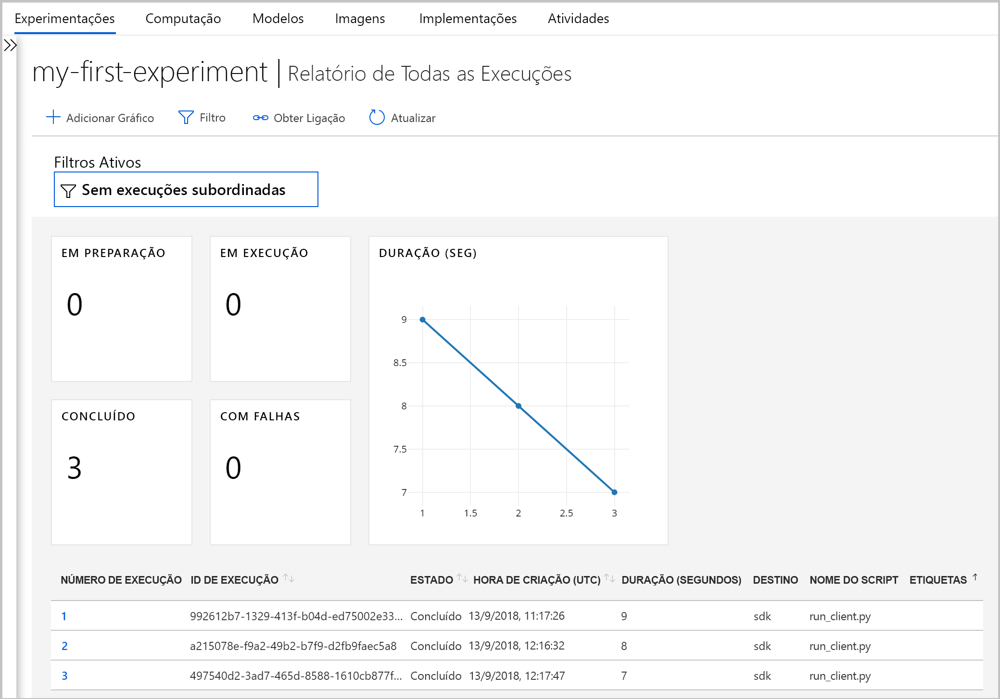
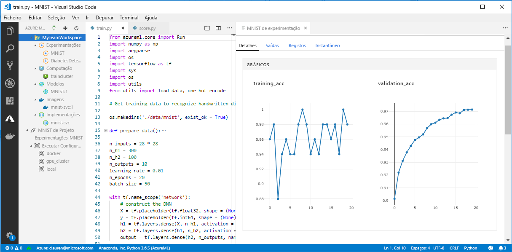

# <a name="what-happened-to-azure-machine-learning-workbench"></a>O que aconteceu ao Azure Machine Learning Workbench?

O aplicativo Azure Machine Learning Workbench e alguns recursos iniciais foram preteridos e substituídos na versão de setembro de 2018 para ter uma [arquitetura](concept-azure-machine-learning-architecture.md)aprimorada.

Para melhorar sua experiência, a versão contém muitas atualizações significativas solicitadas pelos comentários dos clientes. A funcionalidade básica do experimento é executada para modelar a implantação não mudou. Mas agora, você pode usar o <a href="https://aka.ms/aml-sdk" target="_blank">SDK</a> robusto e o [CLI do Azure](reference-azure-machine-learning-cli.md) para realizar suas tarefas e pipelines de aprendizado de máquina.

A maioria dos artefatos criados na versão anterior do Azure Machine Learning Service é armazenada em seu próprio armazenamento local ou na nuvem. Estes artefactos nunca irão desaparecer.

Neste artigo, você aprende sobre o que mudou e como ele afeta o trabalho pré-existente com o Azure Machine Learning Workbench e suas APIs.

>[!Warning]
>Este artigo não é para os utilizadores do Azure Machine Learning Studio. É para os clientes do serviço do Azure Machine Learning que instalaram a aplicação Workbench (pré-visualização) e/ou tem experimentação e contas de pré-visualização de gestão de modelo.


## <a name="what-changed"></a>O que mudou?

A versão mais recente do serviço de Azure Machine Learning inclui os seguintes recursos:
+ Um [modelo simplificado de recursos do Azure](concept-azure-machine-learning-architecture.md).
+ Uma [nova interface do usuário do portal](how-to-track-experiments.md) para gerenciar seus experimentos e destinos de computação.
+ Um <a href="https://aka.ms/aml-sdk" target="_blank">SDK</a>do Python novo e mais abrangente.
+ A nova [extensão de CLI do Azure](reference-azure-machine-learning-cli.md) expandida para aprendizado de máquina.

A [arquitetura](concept-azure-machine-learning-architecture.md) foi reprojetada para facilitar o uso. Em vez de vários recursos e contas do Azure, precisa apenas de uma [Área de Trabalho do serviço do Azure Machine Learning](concept-workspace.md). Pode criar áreas de trabalho rapidamente no [portal do Azure](how-to-manage-workspace.md). Usando um espaço de trabalho, vários usuários podem armazenar destinos de computação de treinamento e implantação, experimentos de modelo, imagens do Docker, modelos implantados e assim por diante.

Embora haja novos clientes de CLI e SDK aprimorados na versão atual, o próprio aplicativo do desktop Workbench foi desativado. Os experimentos podem ser gerenciados no [painel do espaço de trabalho em portal do Azure](how-to-track-experiments.md#view-the-experiment-in-the-azure-portal). Utilize o dashboard para obter o histórico de experimentações, gerir os destinos de computação associados à sua área de trabalho, gerir os seus modelos e imagens do Docker e até implementar serviços Web.

<a name="timeline"></a>

## <a name="support-timeline"></a>Linha cronológica de suporte

Em 9 de Janeiro, 2019 suporte para Machine Learning Workbench, Experimentação do Azure Machine Learning e contas de Gerenciamento de Modelos, e o SDK e a CLI associados foram encerrados.

Todos os recursos mais recentes estão disponíveis usando esse <a href="https://aka.ms/aml-sdk" target="_blank">SDK</a>, a [CLI](reference-azure-machine-learning-cli.md)e o [portal](how-to-manage-workspace.md).

## <a name="what-about-run-histories"></a>E em relação aos históricos de execução?

Os históricos de execução mais antigos não são mais acessíveis, como você ainda pode ver suas execuções na versão mais recente.

Os históricos de execução agorasão chamados de experimentos. Você pode coletar os experimentos do modelo e explorá-los usando o SDK, a CLI ou o portal do Azure.

O painel de espaço de trabalho do portal tem suporte apenas nos navegadores Microsoft Edge, Chrome e Firefox:

[](./media/overview-what-happened-to-workbench/image001.png#lightbox)

Inicie seus modelos de treinamento e ao controlar os históricos de execução usando a nova CLI e SDK. Pode saber como com o [Tutorial: criar modelos com o serviço Azure Machine Learning](tutorial-train-models-with-aml.md).

## <a name="can-i-still-prep-data"></a>Ainda posso preparar os dados?

Seus arquivos de preparação de dados pré-existentes não são portáteis para a versão mais recente porque não temos mais o Machine Learning Workbench. Mas você ainda pode preparar qualquer conjunto de dados de tamanho para modelagem.

Com conjuntos de dados de qualquer tamanho, você pode usar o [pacote de preparação de dados para Azure Machine Learning](https://aka.ms/data-prep-sdk) para preparar seus dados rapidamente antes de modelar escrevendo código Python.

## <a name="will-projects-persist"></a>Os projetos serão mantidos?

Não irá perder qualquer código ou trabalho. Na versão mais antiga, os projetos são entidades na cloud com um diretório local. Na versão mais recente, anexe diretórios locais ao espaço de trabalho do serviço de Azure Machine Learning usando um arquivo de configuração local. Veja um [diagrama da arquitetura mais recente](concept-azure-machine-learning-architecture.md).

Grande parte do conteúdo do projeto já estava em seu computador local. Portanto, você só precisa criar um arquivo de configuração nesse diretório e referenciá-lo em seu código para se conectar ao seu espaço de trabalho. Para continuar usando o diretório local que contém seus arquivos e scripts, especifique o nome do diretório no comando Python [' experimento. Submit '](https://docs.microsoft.com/python/api/azureml-core/azureml.core.experiment.experiment?view=azure-ml-py) ou usando o `az ml project attach` comando da CLI.  Por exemplo:
```python
run = exp.submit(source_directory=script_folder,
                 script='train.py', run_config=run_config_system_managed)
```

[Crie um espaço de trabalho](how-to-manage-workspace.md) para começar.

## <a name="what-about-my-registered-models-and-images"></a>E quanto aos meus modelos e imagens registrados?

Os modelos que registou no seu registo do modelo antigo devem ser migrados para nova área de trabalho, se quiser continuar a utilizá-los. Para migrar seus modelos, baixe os modelos e registre-os novamente em seu novo espaço de trabalho.

As imagens que você criou em seu registro de imagem antiga não podem ser migradas diretamente para o novo espaço de trabalho. Na maioria dos casos, o modelo pode ser implantado sem a necessidade de criar uma imagem. Se necessário, você pode criar uma imagem para o modelo no novo espaço de trabalho. Para obter mais informações, consulte [gerenciar, registrar, implantar e monitorar modelos de aprendizado de máquina](concept-model-management-and-deployment.md).

## <a name="what-about-deployed-web-services"></a>E em relação aos serviços Web implementados?

Agora que o suporte para a CLI antiga terminou, você não pode mais reimplantar modelos ou gerenciar os serviços Web que você implantou originalmente com sua conta de Gerenciamento de Modelos. No entanto, esses serviços web vão continuar a funcionar para, desde que o Azure Container Service (ACS) ainda é suportado.

Na versão mais recente, os modelos são implementados como serviços da web para clusters do Azure Container Instances (ACI) ou Azure Kubernetes Service (AKS). Você também pode implantar o FPGAs e para Azure IoT Edge.

Saiba mais nestes artigos:
+ [Onde e como implantar modelos](how-to-deploy-and-where.md)
+ [Tutorial: Implantar modelos com o serviço Azure Machine Learning](tutorial-deploy-models-with-aml.md)

## <a name="what-about-the-old-sdk-and-cli"></a>E quanto ao SDK e à CLI antigos?

Sim, eles continuarão a funcionar até Janeiro. Veja a [linha do tempo](#timeline)anterior. Recomendamos que você comece a criar seus novos experimentos e modelos com o SDK ou a CLI mais recente.

Usando o novo SDK do Python na versão mais recente, você pode interagir com Azure Machine Learning serviço em qualquer ambiente do Python. Saiba como instalar a versão o <a href="https://aka.ms/aml-sdk" target="_blank">SDK</a> mais recente. Você também pode usar a [extensão da CLI do Azure Machine Learning](reference-azure-machine-learning-cli.md) atualizada com o conjunto `az ml` avançado de comandos para interagir com o serviço em qualquer ambiente de linha de comando, incluindo Azure cloud Shell.

## <a name="what-about-visual-studio-code-tools-for-ai"></a>E quanto à Visual Studio Code Tools for AI?

Nesta versão mais recente, a extensão foi renomeada para Azure Machine Learning para Visual Studio Code e foi expandida e aprimorada para trabalhar com os novos recursos anteriores.

[](./media/overview-what-happened-to-workbench/vscode-big.png#lightbox)

## <a name="what-about-domain-packages"></a>E em relação aos pacotes de domínios?

Os pacotes de domínio para a pesquisa Visual computacional, análise de texto e previsão não podem ser usados com a versão mais recente do Azure Machine Learning. No entanto, você ainda pode criar e treinar modelos de visão, texto e previsão de computadores com o <a href="https://aka.ms/aml-sdk" target="_blank">SDK</a>Azure Machine Learning Python mais recente. Para saber como migrar modelos preexistentes criados usando a pesquisa Visual computacional, análise de texto e pacotes de previsão, contate [AML-Packages@microsoft.com](mailto:AML-Packages@microsoft.com).

## <a name="next-steps"></a>Passos Seguintes

Saiba mais sobre a [arquitetura mais recente para o Azure Machine Learning Service](concept-azure-machine-learning-architecture.md).

Para obter uma visão geral do serviço, leia [o que é o serviço Azure Machine Learning?](overview-what-is-azure-ml.md).

Crie seu primeiro experimento com o tutorial de duas partes para [Configurar o ambiente e o espaço de trabalho](tutorial-1st-experiment-sdk-setup.md) e [treinar seu primeiro modelo](tutorial-1st-experiment-sdk-train.md)

Para obter uma experiência mais aprofundada desse fluxo de trabalho, siga o [tutorial de tamanho completo](tutorial-train-models-with-aml.md) que contém etapas detalhadas para treinar e implantar modelos com o serviço de Azure Machine Learning.
