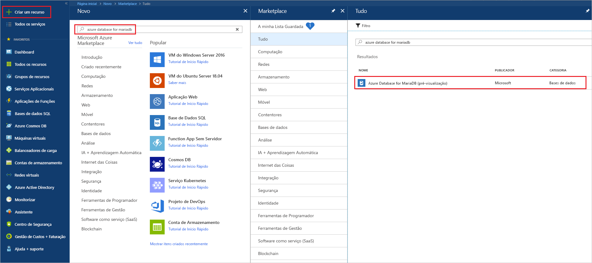
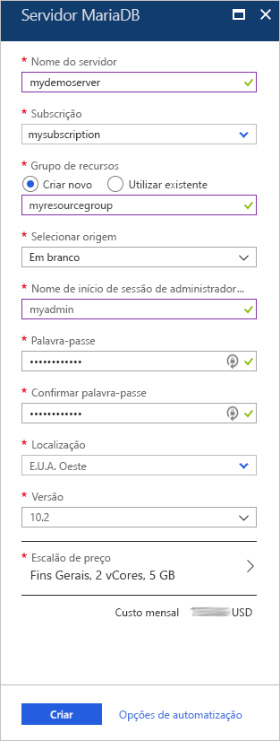
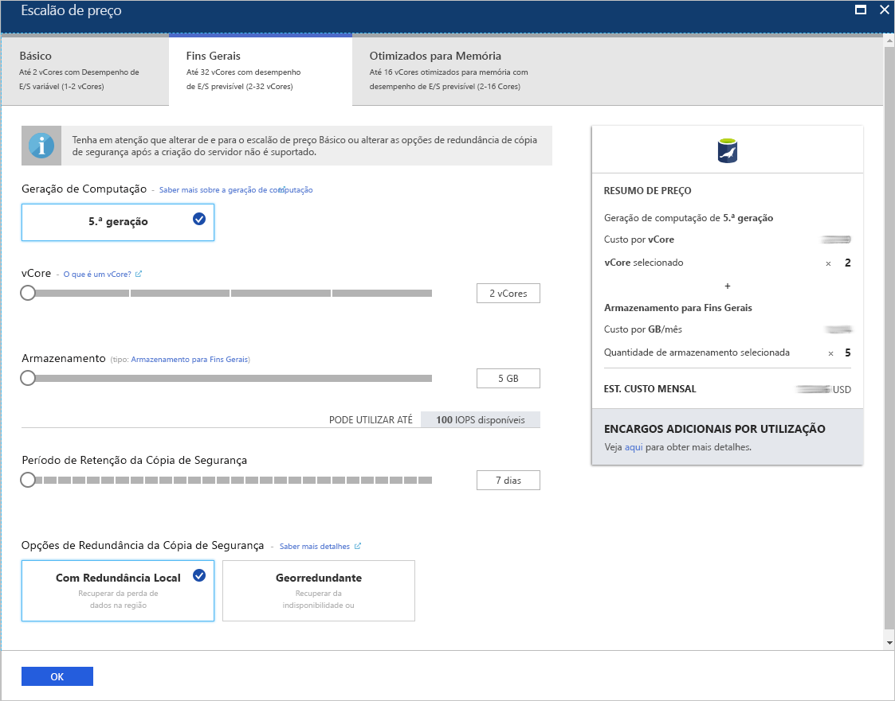
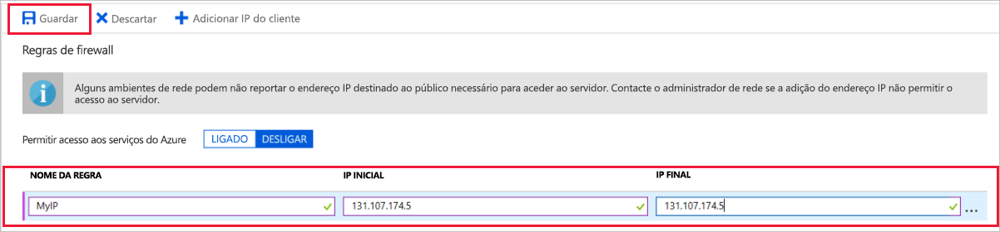
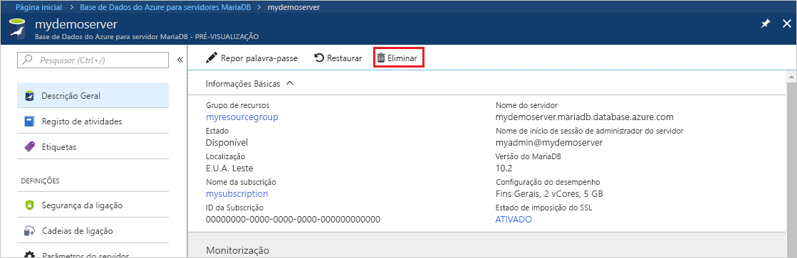

# <a name="quickstart-create-an-azure-database-for-mariadb-server-by-using-the-azure-portal"></a>Quickstart: Criar uma Base de Dados Azure para servidor MariaDB utilizando o portal Azure

O Azure Database for MariaDB é um serviço gerido que pode utilizar para executar, gerir e dimensionar as bases de dados MariaDB de elevada disponibilidade na cloud. Este início rápido mostra-lhe como criar um Azure Database for MariaDB Server em cerca de cinco minutos com o portal do Azure.  

Se não tiver uma subscrição do Azure, crie uma [conta do Azure gratuita](https://azure.microsoft.com/free/) antes de começar.

## <a name="sign-in-to-the-azure-portal"></a>Iniciar sessão no portal do Azure

No browser, aceda ao [portal do Azure](https://portal.azure.com/). Introduza as suas credenciais para iniciar sessão no portal. A vista predefinida é o dashboard de serviço.

## <a name="create-an-azure-database-for-mariadb-server"></a>Criar um Azure Database for MariaDB Server

Vai criar um Azure Database for MariaDB Server com um conjunto definido de [recursos de armazenamento e computação](concepts-pricing-tiers.md). Irá criar o servidor dentro de um [grupo de recursos do Azure](../azure-resource-manager/management/overview.md).

Para criar um Azure Database for MariaDB Server:

1. Selecione o botão (+) **Criar um recurso**, no canto superior esquerdo do portal.

2. Selecione **Base de Dados**  >  **Azure Databases para MariaDB**. Também pode escrever **MariaDB** na caixa de pesquisa para encontrar o serviço.

   

3. Introduza ou selecione os detalhes seguintes do servidor:

   

    Definição | Valor sugerido | Descrição
    ---|---|---
    Nome do servidor | *um nome de servidor exclusivo* | Escolha um nome exclusivo que identifique o seu Azure Database for MariaDB Server. Por exemplo, **mydemoserver**. O nome de domínio *.mariadb.database.azure.com* é anexado ao nome do servidor que introduzir. O nome do servidor pode conter apenas letras minúsculas, números e o caráter de hífen (-). Tem de conter entre 3 e 63 carateres.
    Subscrição | *a sua subscrição* | Selecione a subscrição do Azure que quer utilizar para o servidor. Se tiver várias subscrições, escolha a subscrição na qual é cobrado pelo recurso.
    Grupo de recursos | **grupo myresource** | Introduza um novo nome do grupo de recursos ou selecione um grupo já existente. 
    Selecionar origem | **Em branco** | Selecione **Em branco** para criar um novo servidor de raiz. (Selecione **Cópia de Segurança** se estiver a criar um servidor a partir de uma cópia de segurança de área geográfica de um Azure Database for MariaDB Server existente.)
    Início de sessão de administrador do servidor | **myadmin** | Uma conta de início de sessão para utilizar quando ligar ao servidor. O nome de início de sessão de administrador não pode ser **azure_superuser**, **admin**, **administrator**, **root**, **guest** ou **public**.
    Palavra-passe | *a sua escolha* | Introduza uma nova palavra-passe para a conta de administrador do servidor. Tem de conter entre 8 e 128 carateres. A palavra-passe tem de conter carateres das três categorias seguintes: letras em maiúscula inglesas, letras em minúscula inglesas, números (0 - 9) e carateres não alfanuméricos (!, $, #, %, etc.).
    Confirmar palavra-passe | *a sua escolha*| Confirme a palavra-passe da conta de administrador.
    Localização | *a região mais próxima dos seus utilizadores*| Escolha a localização que estiver mais próxima dos seus utilizadores ou das suas outras aplicações do Azure.
    Versão | *a versão mais recente*| A versão mais recente (a não ser que tenha requisitos específicos que exijam uma versão diferente).
    Escalão de preço | Veja a descrição. | As configurações de computação, armazenamento e cópia de segurança do seu novo servidor. **Selecione o nível de preços**  >  **Finalidade Geral**. Mantenha os valores predefinidos para as seguintes definições:<br><ul><li>**Geração de Computação** (Ger 5)</li><li>**vCore** (4 vCores)</li><li>**Armazenamento** (100 GB)</li><li>**Período de Retenção da Cópia de Segurança** (7 dias)</li></ul><br>Para ativar as cópias de segurança do servidor no armazenamento georredundante, em **Backup Redundancy Options** (Opções de Redundância da Cópia de Segurança), selecione **Geographically Redundant** (Geograficamente Redundante). <br><br>Para guardar a seleção deste escalão de preço, selecione **OK**. A captura de ecrã seguinte captura estas seleções.
  
   > [!NOTE]
   > Considere usar o nível de preços básico se o cálculo leve e a I/O forem adequados para a sua carga de trabalho. Note que os servidores criados no nível de preços básicos não podem ser posteriormente dimensionados para Final Geral ou Memória Otimizada. Consulte [a página de preços](https://azure.microsoft.com/pricing/details/mariadb/) para mais informações.

   

4. Selecione **Review + criar** para obter o servidor. O aprovisionamento pode demorar até 20 minutos.

5. Para monitorizar o processo de implementação, selecione **Notifications** (Notificações), na barra de ferramentas (o ícone da campainha).

Por predefinição, as seguintes bases de dados são criadas no seu servidor: **information_schema**, **mysql**, **performance_schema** e **sys**.

## <a name="configure-a-server-level-firewall-rule"></a><a name="configure-firewall-rule"></a>Configurar uma regra de firewall ao nível do servidor

O serviço Azure Database for MariaDB cria uma firewall ao nível do servidor. A firewall impede que as aplicações e ferramentas externas se liguem ao servidor ou às bases de dados dentro do mesmo, a menos que seja criada uma regra de firewall para abrir a firewall a endereços IP específicos. 

Para criar uma regra de firewall ao nível do servidor:

1. Após a conclusão da implementação, localize o servidor. Se for preciso, pode procurá-lo. Por exemplo, no menu do lado esquerdo, selecione **All Resources** (Todos os recursos). Depois, introduza o nome do servidor. Por exemplo, introduza **mydemoserver** para encontrar o servidor acabado de criar. Selecione o nome do servidor da lista de resultados de pesquisa. A página **Descrição Geral** do seu servidor abre-se. Pode alterar definições adicionais nesta página.

2. Na página de descrição geral do servidor, selecione **Connection security** (Segurança da ligação).

3. Em **Firewall rules** (Regras de firewall), selecione a caixa de texto em branco na coluna **Rule Name** (Nome da Regra) para começar a criar a regra de firewall. Especifique o intervalo de IPs exato dos clientes que se vão ligar a este servidor.

   

4. Na barra de ferramentas superior da página **Segurança da ligação**, selecione **Guardar**. Antes de continuar, aguarde até ver a notificação que indica que a atualização foi concluída com êxito.

   > [!NOTE]
   > As ligações à Azure Database for MariaDB comunicam através da porta 3306. Se tentar ligar a partir de uma rede empresarial, o tráfego de saída através da porta 3306 poderá não ser permitido. Neste caso, para ligar ao seu servidor, o departamento de TI tem de abrir a porta 3306.

## <a name="get-connection-information"></a>Obter informações da ligação

Para ligar ao seu servidor de bases de dados, precisa do nome completo do servidor e das credenciais de início de sessão de administrador. Poderá ter apontado esses valores anteriormente neste artigo. Se não o tiver feito, pode encontrar facilmente o nome do servidor e as informações de início de sessão na página **Overview** (Descrição Geral) do servidor ou na página **Propriedades** do portal do Azure:

1. Aceda à página **Overview** (Descrição Geral) do servidor. Anote os valores de **Server name** (Nome do servidor) e **Server admin login name** (Nome de início de sessão de administrador do servidor).

2. Para copiar os valores, coloque o cursor por cima do campo que quer copiar. O ícone de cópia aparece à direita do texto. Selecione o ícone de cópia conforme necessário para copiar os valores.

No nosso exemplo, o nome do servidor é **mydemoserver.mariadb.database.azure.com** e o nome de login do administrador do servidor é **myadmin \@ mydemoserver**.

## <a name="connect-to-azure-database-for-mariadb-by-using-the-mysql-command-line"></a>Utilizar a linha de comandos mysql para ligar ao Azure Database for MariaDB

Pode utilizar diversas aplicações para ligar ao seu Azure Database for MariaDB Server.

Primeiro, vamos utilizar a ferramenta de linha de comandos [mysql](https://dev.mysql.com/doc/refman/5.7/en/mysql.html) para ilustrar como ligar ao servidor. Também pode utilizar um browser e o Azure Cloud Shell sem instalar software. Se tiver o utilitário mysql instalado localmente, também pode ligar a partir do mesmo.

1. Inicie o Azure Cloud Shell através do ícone de terminal (**>_**), na barra de ferramentas do canto superior direito do portal do Azure.
   

2. O Azure Cloud Shell abre-se no browser. Pode utilizar comandos da shell de bash no Cloud Shell.

   

3. Na linha de comandos do Cloud Shell, introduza a linha de comandos mysql para ligar ao Azure Database for MariaDB Server.

    Para ligar a um Azure Database for MariaDB Server com o utilitário mysql, utilize o seguinte formato:

    ```cmd
    mysql --host <fully qualified server name> --user <server admin login name>@<server name> -p
    ```

    Por exemplo, o comando seguinte liga ao nosso servidor de exemplo:

    ```cmd
    mysql --host mydemoserver.mariadb.database.azure.com --user myadmin@mydemoserver -p
    ```

    mysql parameter |Valor sugerido|Descrição
    ---|---|---
    --host | *nome do servidor* | O valor do nome do servidor que utilizou para criar o Azure Database for MariaDB Server. O nosso servidor de exemplo é **mydemoserver.mariadb.database.azure.com**. Utilize o nome de domínio totalmente qualificado **\* (.mariadb.database.azure.com)** como mostrado no exemplo. Se não se lembrar do nome do servidor, conclua os passos na secção anterior para obter as informações da ligação.
    --user | *nome de login de administrador do servidor* |O valor do nome de utilizador de início de sessão de administrador do servidor que utilizou para criar o Azure Database for MariaDB Server. Se não se lembrar do nome de utilizador, conclua os passos na secção anterior para obter as informações da ligação. O formato é *nome de utilizador \@ servername*.
    -p | *sua senha*<br>(aguarde até que seja pedida) |Quando for pedida, introduza a palavra-passe que utilizou para criar o servidor. Os carateres da palavra-passe introduzida não são apresentados na linha de comandos bash ao escrevê-los. Depois de introduzir a palavra-passe, prima Enter.

   Quando é ligado, o utilitário mysql apresenta mostra a linha `mysql>`. Pode introduzir comandos na linha.

   Eis um exemplo de uma saída de mysql:

    ```output
    Welcome to the MySQL monitor.  Commands end with ; or \g.
    Your MySQL connection id is 65505
    Server version: 5.6.39.0 MariaDB Server
    
    Copyright (c) 2000, 2017, Oracle and/or its affiliates. All rights reserved.
    
    Oracle is a registered trademark of Oracle Corporation and/or its
    affiliates. Other names may be trademarks of their respective
    owners.

    Type 'help;' or '\h' for help. Type '\c' to clear the current input statement.
    
    mysql>
    ```
    
    > [!TIP]
    > Se a firewall não estiver configurada para permitir o endereço IP do Azure Cloud Shell, ocorre o seguinte erro:
    >
    >   ERROR 2003 (28000): Client with IP address 123.456.789.0 is not allowed to access the server. (ERRO 2003 (28000): o cliente com o endereço IP 123.456.789.0 não tem permissão para aceder ao servidor.)
    >
    > Para resolver o erro, certifique-se de que a configuração do servidor corresponde aos passos descritos em [Configurar uma regra de firewall ao nível do servidor](#configure-firewall-rule).

4. Para verificar a ligação, introduza **status** na linha `mysql>` para ver o estado da ligação.

    ```sql
    status
    ```

   > [!TIP]
   > Para obter comandos adicionais, veja [MySQL 5.7 Reference Manual - Chapter 4.5.1](https://dev.mysql.com/doc/refman/5.7/en/mysql.html) (Manual de Referência do MySQL 5.7 - Capítulo 4.5.1).

5. Crie uma base de dados vazia na linha de comandos `mysql>` com o seguinte comando:

   ```sql
   CREATE DATABASE quickstartdb;
   ```
   O comando pode demorar alguns minutos a concluir. 

   Pode criar uma ou várias bases de dados num Azure Database for MariaDB Server. Pode criar uma base de dados individual por servidor para utilizar todos os recursos ou criar várias bases de dados para os partilhar. Não há limite para o número de bases de dados que pode criar; contudo, se criar múltiplas bases de dados, estas partilharão os mesmos recursos do servidor. 

6. Para listar as bases de dados, na linha de comandos `mysql>`, introduza o seguinte comando:

    ```sql
    SHOW DATABASES;
    ```

7. Introduza **\q** e prima Enter para fechar a ferramenta mysql. Em seguida, pode fechar o Azure Cloud Shell.

Está agora ligado ao Azure Database for MariaDB Server e criou uma base de dados de utilizador vazia. Na próxima secção, vai utilizar outra ferramenta comum, o MySQL Workbench, para ligar ao mesmo servidor.

## <a name="connect-to-the-server-by-using-mysql-workbench"></a>Ligar ao servidor com o MySQL Workbench

Para ligar ao servidor com o MySQL Workbench:

1. Abra o MySQL Workbench no computador cliente. Para transferir e instalar o MySQL Workbench, aceda a [Download MySQL Workbench](https://dev.mysql.com/downloads/workbench/) (Transferir MySQL Workbench).

2. Para criar uma nova ligação, selecione o ícone plus **+** () ao lado do título **MySQL Connections.**

3. Na caixa de diálogo **Setup New Connection** (Configurar Ligação Nova), no separador **Parameters** (Parâmetros), introduza as informações de ligação do servidor. Os valores de marcador de posição são apresentados como exemplo. Substitua **Hostname** (Nome do anfitrião), **Username** (Nome de utilizador) e **Password** (Palavra-passe) pelos seus próprios valores.

   

    |Definição |Valor sugerido|Descrição do campo|
    |---|---|---|
     Nome da ligação | **Ligação de demonstração** | Uma etiqueta para esta ligação. |
    Método de ligação | **Standard (TCP/IP)** | Standard (TCP/IP) é suficiente. |
    Hostname (Nome do anfitrião) | *nome do servidor* | O valor do nome do servidor que utilizou para criar o Azure Database for MariaDB Server. O nosso servidor de exemplo é **mydemoserver.mariadb.database.azure.com**. Utilize o nome de domínio totalmente qualificado **\* (.mariadb.database.azure.com)** como mostrado no exemplo. Se não se lembrar do nome do servidor, conclua os passos descritos acima no artigo para obter as informações da ligação.|
     Porta | 3306 | A porta a utilizar quando ligar ao seu Azure Database for MariaDB Server. |
    Nome de utilizador |  *nome de login de administrador do servidor* | A informação de início de sessão de administrador do servidor que utilizou para criar o Azure Database for MariaDB Server. O nosso nome de utilizador exemplo é **\@ myadmin mydemoserver**. Se não se lembrar do nome de utilizador, conclua os passos descritos acima no artigo para obter as informações da ligação. O formato é *nome de utilizador \@ servername*.
    Palavra-passe | *sua senha* | Para guardar a palavra-passe, selecione **Store in Vault** (Armazenar no Cofre). |

4. Para verificar se todos os parâmetros estão configurados corretamente, selecione **Test Connection** (Testar Ligação). Em seguida, selecione **OK** para guardar a ligação. 

    > [!NOTE]
    > O SSL é aplicado por predefinição ao servidor. Para se ligar com êxito, requer uma configuração adicional. Para obter mais informações, consulte [Configure SSL connectivity in your application to securely connect to Azure Database for MariaDB](./howto-configure-ssl.md) (Configurar a conectividade SSL na sua aplicação para ligar em segurança à Azure Database for MariaDB). Para desativar o SSL neste início rápido, na página de descrição geral do servidor no portal do Azure, selecione **Connection security** (Segurança da ligação), no menu. Em **Enforce SSL connection** (Impor ligação SSL), selecione **Disabled** (Desativado).

## <a name="clean-up-resources"></a>Limpar os recursos

Pode limpar os recursos que criou neste início rápido de duas formas. Pode eliminar o [grupo de recursos do Azure](../azure-resource-manager/management/overview.md). Esta opção elimina todos os recursos no grupo de recursos. Se pretender manter os outros recursos intactos, elimine apenas o recurso de um servidor.

> [!TIP]
> Outros inícios rápidos desta coleção têm por base este início rápido. Se pretender continuar a trabalhar com os inícios rápidos do Azure Database for MariaDB, não limpe os recursos que criou neste início rápido. Se não quiser continuar, utilize os passos seguintes para eliminar todos os recursos que criou neste início rápido.

Para eliminar o grupo de recursos inteiro, incluindo o servidor criado recentemente:

1. No portal do Azure, localize o grupo de recursos. No menu do lado esquerdo, selecione **Grupos de recursos** e selecione o nome do seu grupo de recursos (**myresourcegroup**, no nosso exemplo).

2. Na página do grupo de recursos, selecione **Eliminar**. Depois, escreva o nome do grupo de recursos, (**myresourcegroup**, no nosso exemplo) para confirmar a eliminação. Selecione **Eliminar**.

Para eliminar o servidor criado recentemente:

1. No portal do Azure, localize o servidor, se ainda não estiver aberto. No menu do lado esquerdo, selecione **Todos os recursos**. Em seguida, procure o servidor que criou.

2. Na página **Descrição geral**, selecione **Eliminar**.

   

3. Confirme o nome do servidor que pretende eliminar. Mostre as bases de dados no servidor que vão ser afetadas pela eliminação. Introduza o nome do servidor (**mydemoserver**, no nosso exemplo) para confirmar a eliminação. Selecione **Eliminar**.

## <a name="next-steps"></a>Próximos passos

- [Conceber a sua primeira base de dados da Azure Database for MariaDB](./tutorial-design-database-using-portal.md)
