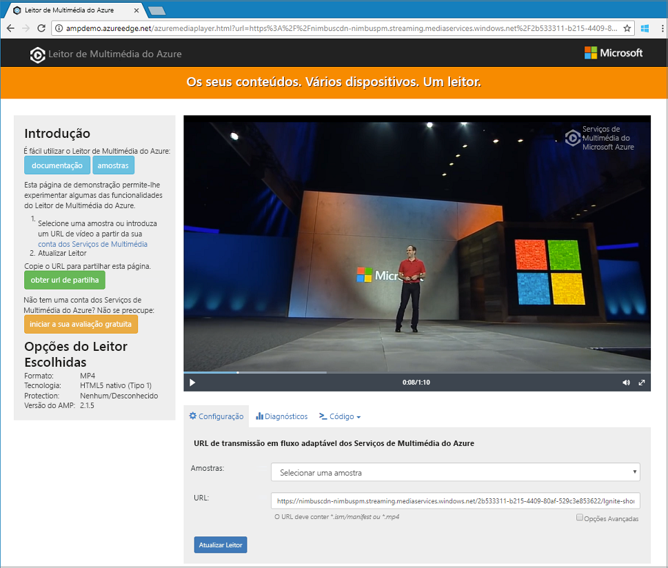

# <a name="quickstart-stream-video-files---cli"></a>Início rápido: Transmitir ficheiros de vídeo - CLI

Este guia de introdução mostra como facilmente codificar e transmitir vídeos numa variedade de navegadores e dispositivos através da utilização dos serviços de multimédia do Azure e a CLI do Azure. Pode especificar o conteúdo de entrada através de HTTPS ou URLs de SAS ou caminhos para ficheiros no armazenamento de Blobs do Azure.

O exemplo neste artigo codifica o conteúdo que disponibilizar através de um URL HTTPS. Serviços de multimédia v3 atualmente não suporta a codificação através de HTTPS URLs da transferência.

No final deste início rápido, vai ser capaz de transmitir um vídeo.  



[!INCLUDE [quickstarts-free-trial-note](../../../includes/quickstarts-free-trial-note.md)]

## <a name="create-a-media-services-account"></a>Criar uma conta dos Media Services

Antes de poder encriptar, codificar, analisar, gerir e transmitir em fluxo conteúdo de multimédia do Azure, terá de criar uma conta de Media Services. Essa conta tem de ser associada a uma ou mais contas de armazenamento.

Conta dos Media Services e todas as contas de armazenamento associado tem de ser na mesma subscrição do Azure. Recomendamos que utilize contas de armazenamento que estão no mesmo local que a conta de serviços de multimédia para limitar os custos de saída de dados e de latência.

### <a name="create-a-resource-group"></a>Criar um grupo de recursos

```azurecli
az group create -n amsResourceGroup -l westus2
```

### <a name="create-an-azure-storage-account"></a>Criar uma conta do Storage do Azure

Neste exemplo, vamos criar um para fins gerais v2 conta de LRS padrão.

Se quiser experimentar as contas de armazenamento, utilize `--sku Standard_LRS`. Quando estiver a escolher um SKU para produção, considere a utilização de `--sku Standard_RAGRS`, que fornece replicação geográfica para continuidade do negócio. Para obter mais informações, consulte [contas de armazenamento](https://docs.microsoft.com/cli/azure/storage/account?view=azure-cli-latest).
 
```azurecli
az storage account create -n amsstorageaccount --kind StorageV2 --sku Standard_LRS -l westus2 -g amsResourceGroup
```

### <a name="create-an-azure-media-services-account"></a>Criar uma conta dos Azure Media Services

```azurecli
az ams account create --n amsaccount -g amsResourceGroup --storage-account amsstorageaccount -l westus2
```

Obtém uma resposta como esta:

```
{
  "id": "/subscriptions/<id>/resourceGroups/amsResourceGroup/providers/Microsoft.Media/mediaservices/amsaccount",
  "location": "West US 2",
  "mediaServiceId": "8b569c2e-d648-4fcb-9035-c7fcc3aa7ddf",
  "name": "amsaccount",
  "resourceGroup": "amsResourceGroupTest",
  "storageAccounts": [
    {
      "id": "/subscriptions/<id>/resourceGroups/amsResourceGroup/providers/Microsoft.Storage/storageAccounts/amsstorageaccount",
      "resourceGroup": "amsResourceGroupTest",
      "type": "Primary"
    }
  ],
  "tags": null,
  "type": "Microsoft.Media/mediaservices"
}
```

## <a name="start-the-streaming-endpoint"></a>Iniciar o ponto final da transmissão em fluxo

O seguinte comando da CLI do Azure começa a predefinição **ponto final de Sstreaming**.

```azurecli
az ams streaming-endpoint start  -n default -a amsaccount -g amsResourceGroup
```

Obtém uma resposta como esta:

```
az ams streaming-endpoint start  -n default -a amsaccount -g amsResourceGroup
{
  "accessControl": null,
  "availabilitySetName": null,
  "cdnEnabled": true,
  "cdnProfile": "AzureMediaStreamingPlatformCdnProfile-StandardVerizon",
  "cdnProvider": "StandardVerizon",
  "created": "2019-02-06T21:58:03.604954+00:00",
  "crossSiteAccessPolicies": null,
  "customHostNames": [],
  "description": "",
  "freeTrialEndTime": "2019-02-21T22:05:31.277936+00:00",
  "hostName": "amsaccount-usw22.streaming.media.azure.net",
  "id": "/subscriptions/<id>/resourceGroups/amsResourceGroup/providers/Microsoft.Media/mediaservices/amsaccount/streamingendpoints/default",
  "lastModified": "2019-02-06T21:58:03.604954+00:00",
  "location": "West US 2",
  "maxCacheAge": null,
  "name": "default",
  "provisioningState": "Succeeded",
  "resourceGroup": "amsResourceGroup",
  "resourceState": "Running",
  "scaleUnits": 0,
  "tags": {},
  "type": "Microsoft.Media/mediaservices/streamingEndpoints"
}
```

Se o ponto final de transmissão em fluxo já está em execução, receberá esta mensagem:

```
(InvalidOperation) The server cannot execute the operation in its current state.
```

## <a name="create-a-transform-for-adaptive-bitrate-encoding"></a>Criar uma transformação para a codificação de velocidade de transmissão adaptável

Criar uma **transformar** para configurar as tarefas comuns de codificação ou analisar vídeos. Neste exemplo, podemos fazer a codificação de velocidade de transmissão adaptável. Em seguida, iremos submeter uma tarefa sob a transformação que criamos. A tarefa é o pedido para os serviços de multimédia para aplicar a transformação para o determinado vídeo ou áudio de entrada de conteúdo.

```azurecli
az ams transform create --name testEncodingTransform --preset AdaptiveStreaming --description 'a simple Transform for Adaptive Bitrate Encoding' -g amsResourceGroup -a amsaccount
```

Obtém uma resposta como esta:

```
{
  "created": "2019-02-15T00:11:18.506019+00:00",
  "description": "a simple Transform for Adaptive Bitrate Encoding",
  "id": "/subscriptions/<id>/resourceGroups/amsResourceGroup/providers/Microsoft.Media/mediaservices/amsaccount/transforms/testEncodingTransform",
  "lastModified": "2019-02-15T00:11:18.506019+00:00",
  "name": "testEncodingTransform",
  "outputs": [
    {
      "onError": "StopProcessingJob",
      "preset": {
        "odatatype": "#Microsoft.Media.BuiltInStandardEncoderPreset",
        "presetName": "AdaptiveStreaming"
      },
      "relativePriority": "Normal"
    }
  ],
  "resourceGroup": "amsResourceGroup",
  "type": "Microsoft.Media/mediaservices/transforms"
}
```

## <a name="create-an-output-asset"></a>Criar um elemento de saída

Criar uma saída **Asset** para utilizar como o resultado da tarefa de codificação.

```azurecli
az ams asset create -n testOutputAssetName -a amsaccount -g amsResourceGroup
```

Obtém uma resposta como esta:

```
{
  "alternateId": null,
  "assetId": "96427438-bbce-4a74-ba91-e38179b72f36",
  "container": null,
  "created": "2019-02-14T23:58:19.127000+00:00",
  "description": null,
  "id": "/subscriptions/<id>/resourceGroups/amsResourceGroup/providers/Microsoft.Media/mediaservices/amsaccount/assets/testOutputAssetName",
  "lastModified": "2019-02-14T23:58:19.127000+00:00",
  "name": "testOutputAssetName",
  "resourceGroup": "amsResourceGroup",
  "storageAccountName": "amsstorageaccount",
  "storageEncryptionFormat": "None",
  "type": "Microsoft.Media/mediaservices/assets"
}
```

## <a name="start-a-job-by-using-https-input"></a>Iniciar uma tarefa através de HTTPS de entrada

Ao submeter tarefas para processar os vídeos, terá de informar os serviços de multimédia onde encontrar o vídeo de entrada. Uma opção é especificar um URL HTTPS como a entrada da tarefa, conforme mostrado neste exemplo.

Quando executa `az ams job start`, pode definir uma etiqueta de saída da tarefa. Em seguida, pode utilizar a etiqueta para identificar o que é o elemento de saída para.

- Se atribuir um valor para a etiqueta, defina '--recursos de saída para "assetname = etiqueta".
- Se não atribuir um valor para a etiqueta, defina '--recursos de saída para "assetname =".

  Observe que adicionamos "=" para o `output-assets`.

```azurecli
az ams job start --name testJob001 --transform-name testEncodingTransform --base-uri 'https://nimbuscdn-nimbuspm.streaming.mediaservices.windows.net/2b533311-b215-4409-80af-529c3e853622/' --files 'Ignite-short.mp4' --output-assets testOutputAssetName= -a amsaccount -g amsResourceGroup 
```

Obtém uma resposta como esta:

```
{
  "correlationData": {},
  "created": "2019-02-15T05:08:26.266104+00:00",
  "description": null,
  "id": "/subscriptions/<id>/resourceGroups/amsResourceGroup/providers/Microsoft.Media/mediaservices/amsaccount/transforms/testEncodingTransform/jobs/testJob001",
  "input": {
    "baseUri": "https://nimbuscdn-nimbuspm.streaming.mediaservices.windows.net/2b533311-b215-4409-80af-529c3e853622/",
    "files": [
      "Ignite-short.mp4"
    ],
    "label": null,
    "odatatype": "#Microsoft.Media.JobInputHttp"
  },
  "lastModified": "2019-02-15T05:08:26.266104+00:00",
  "name": "testJob001",
  "outputs": [
    {
      "assetName": "testOutputAssetName",
      "error": null,
      "label": "",
      "odatatype": "#Microsoft.Media.JobOutputAsset",
      "progress": 0,
      "state": "Queued"
    }
  ],
  "priority": "Normal",
  "resourceGroup": "amsResourceGroup",
  "state": "Queued",
  "type": "Microsoft.Media/mediaservices/transforms/jobs"
}
```

### <a name="check-status"></a>Verificar o estado

Em cinco minutos, verifique o estado da tarefa. Ele deve ser "concluído". Não foi concluída, verifique novamente dentro de alguns minutos. Quando estiver concluído, avance para o passo seguinte e criar um **localizador de transmissão em fluxo**.

```azurecli
az ams job show -a amsaccount -g amsResourceGroup -t testEncodingTransform -n testJob001
```

## <a name="create-a-streaming-locator-and-get-a-path"></a>Criar um localizador de transmissão em fluxo e obter um caminho

Depois da codificação estiver concluída, a próxima etapa é tornar o vídeo no recurso de saída disponíveis para os clientes para a reprodução. Para tal, crie primeiro um localizador de transmissão em fluxo. Em seguida, crie URLs que os clientes podem utilizar de transmissão em fluxo.

### <a name="create-a-streaming-locator"></a>Criar um localizador de transmissão

```azurecli
az ams streaming-locator create -n testStreamingLocator --asset-name testOutputAssetName --streaming-policy-name Predefined_ClearStreamingOnly  -g amsResourceGroup -a amsaccount 
```

Obtém uma resposta como esta:

```
{
  "alternativeMediaId": null,
  "assetName": "output-3b6d7b1dffe9419fa104b952f7f6ab76",
  "contentKeys": [],
  "created": "2019-02-15T04:35:46.270750+00:00",
  "defaultContentKeyPolicyName": null,
  "endTime": "9999-12-31T23:59:59.999999+00:00",
  "id": "/subscriptions/<id>/resourceGroups/amsResourceGroup/providers/Microsoft.Media/mediaservices/amsaccount/streamingLocators/testStreamingLocator",
  "name": "testStreamingLocator",
  "resourceGroup": "amsResourceGroup",
  "startTime": null,
  "streamingLocatorId": "e01b2be1-5ea4-42ca-ae5d-7fe704a5962f",
  "streamingPolicyName": "Predefined_ClearStreamingOnly",
  "type": "Microsoft.Media/mediaservices/streamingLocators"
}
```

### <a name="get-streaming-locator-paths"></a>Transmissão em fluxo em obter caminhos de localizador

```azurecli
az ams streaming-locator get-paths -a amsaccount -g amsResourceGroup -n testStreamingLocator
```

Obtém uma resposta como esta:

```
{
  "downloadPaths": [],
  "streamingPaths": [
    {
      "encryptionScheme": "NoEncryption",
      "paths": [
        "/e01b2be1-5ea4-42ca-ae5d-7fe704a5962f/ignite.ism/manifest(format=m3u8-aapl)"
      ],
      "streamingProtocol": "Hls"
    },
    {
      "encryptionScheme": "NoEncryption",
      "paths": [
        "/e01b2be1-5ea4-42ca-ae5d-7fe704a5962f/ignite.ism/manifest(format=mpd-time-csf)"
      ],
      "streamingProtocol": "Dash"
    },
    {
      "encryptionScheme": "NoEncryption",
      "paths": [
        "/e01b2be1-5ea4-42ca-ae5d-7fe704a5962f/ignite.ism/manifest"
      ],
      "streamingProtocol": "SmoothStreaming"
    }
  ]
}
```

Copie o HTTP live streaming (HLS) caminho. Neste caso, ele tem `/e01b2be1-5ea4-42ca-ae5d-7fe704a5962f/ignite.ism/manifest(format=m3u8-aapl)`.

## <a name="build-the-url"></a>Crie o URL 

### <a name="get-the-streaming-endpoint-host-name"></a>Obter o nome de anfitrião do ponto de extremidade transmissão em fluxo

```azurecli
az ams streaming-endpoint list -a amsaccount -g amsResourceGroup -n default
```
Copiar o `hostName` valor. Neste caso, ele tem `amsaccount-usw22.streaming.media.azure.net`.

### <a name="assemble-the-url"></a>Montar o URL

"https://" + &lt;valor de nome de anfitrião&gt; + &lt;Hls o valor do caminho&gt;

Segue-se um exemplo:

`https://amsaccount-usw22.streaming.media.azure.net/7f19e783-927b-4e0a-a1c0-8a140c49856c/ignite.ism/manifest(format=m3u8-aapl)`

## <a name="test-playback-by-using-azure-media-player"></a>Reprodução de teste com o leitor de multimédia do Azure

> [!NOTE]
> Se um leitor está hospedado num site HTTPS, certifique-se iniciar o URL com "https".

1. Abra um browser e aceda à [ https://aka.ms/azuremediaplayer/ ](https://aka.ms/azuremediaplayer/).
2. Na **URL** caixa, cole o URL que criou na secção anterior. Pode colar o URL no formato uniforme, Dash ou HLS. O leitor de multimédia do Azure utilizarão automaticamente um protocolo de transmissão em fluxo apropriado para reprodução em seu dispositivo.
3. Selecione **atualizar Player**.

>[!NOTE]
>O Leitor de Multimédia do Azure pode ser utilizado para fins de teste, mas não deve ser utilizado num ambiente de produção.

## <a name="clean-up-resources"></a>Limpar recursos

Se já não precisar de qualquer um dos recursos no grupo de recursos, incluindo os serviços de suporte de dados e contas de armazenamento que criou neste início rápido, elimine o grupo de recursos.

Execute este comando da CLI:

```azurecli
az group delete --name amsResourceGroup
```

## <a name="see-also"></a>Consulte também

Ver [códigos de erro da tarefa](https://docs.microsoft.com/rest/api/media/jobs/get#joberrorcode).

## <a name="next-steps"></a>Passos Seguintes

> [Amostras de CLI](cli-samples.md)
