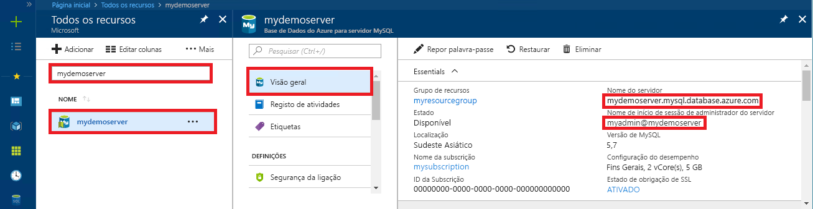

# <a name="quickstart-use-python-to-connect-and-query-data-with-azure-database-for-mysql"></a>Início rápido: usar o Python para se conectar e consultar dados com o Azure Database para MySQL

Neste arranque rápido, ligue-se a uma Base de Dados Azure para MySQL utilizando python. Em seguida, utiliza declarações SQL para consultar, inserir, atualizar e eliminar dados na base de dados das plataformas Mac, Ubuntu Linux e Windows. 

Este tópico pressupõe que está familiarizado com o desenvolvimento usando Python, mas é novo em trabalhar com a Base de Dados Azure para o MySQL.

## <a name="prerequisites"></a>Pré-requisitos

- Uma conta Azure com uma subscrição ativa. [Crie uma conta gratuitamente.](https://azure.microsoft.com/free/?ref=microsoft.com&utm_source=microsoft.com&utm_medium=docs&utm_campaign=visualstudio)
- Uma base de dados Azure para servidor MySQL. [Crie uma base de dados Azure para servidor MySQL utilizando o portal Azure](quickstart-create-mysql-server-database-using-azure-portal.md) ou [crie uma base de dados Azure para o servidor MySQL utilizando o Azure CLI](quickstart-create-mysql-server-database-using-azure-cli.md).

## <a name="install-python-and-the-mysql-connector"></a>Instalar o Python e o conector de MySQL

Instale o Python e o conector do MySQL para Python em seu computador usando as seguintes etapas: 

> [!NOTE]
> Este guia de início rápido usa uma abordagem de consulta SQL bruta para se conectar ao MySQL. Se você estiver usando uma estrutura da Web, use o conector recomendado para a estrutura, por exemplo, [mysqlclient](https://pypi.org/project/mysqlclient/) para Django.

1. Baixe e instale o [Python 3,7 ou superior](https://www.python.org/downloads/) para seu sistema operacional. Certifique-se de adicionar o Python ao seu `PATH`, pois o conector do MySQL exige isso.
   
1. Abra um prompt de comando ou `bash` Shell e verifique sua versão do Python executando `python -V` com a opção V em maiúsculas.
   
1. O instalador do pacote `pip` está incluído nas versões mais recentes do Python. Atualize `pip` para a versão mais recente executando `pip install -U pip`. 
   
   Se `pip` não estiver instalado, você poderá baixá-lo e instalá-lo com `get-pip.py`. Para obter mais informações, consulte [instalação](https://pip.pypa.io/en/stable/installing/). 
   
1. Use `pip` para instalar o conector do MySQL para Python e suas dependências:
   
   ```bash
   pip install mysql-connector-python
   ```
   
   Você também pode instalar o conector Python para MySQL em [MySQL.com](https://dev.mysql.com/downloads/connector/python/). Para obter mais informações sobre o conector do MySQL para Python, consulte o [Guia do desenvolvedor do MySQL Connector/Python](https://dev.mysql.com/doc/connector-python/en/). 

## <a name="get-connection-information"></a>Obter informações da ligação

Obtenha as informações de conexão necessárias para se conectar ao banco de dados do Azure para MySQL do portal do Azure. Você precisa do nome do servidor, do nome do banco de dados e das credenciais de logon.

1. Inicie sessão no [Portal do Azure](https://portal.azure.com/).
   
1. Na barra de pesquisa do portal, procure e selecione o servidor de banco de dados do Azure para MySQL que você criou, como **mydemoserver**.
   
   
   
1. Na página **visão geral** do servidor, anote o nome do **servidor** e o **nome de logon do administrador do servidor**. Se você esquecer sua senha, também poderá redefinir a senha nesta página.
   
   

## <a name="run-the-python-examples"></a>Executar os exemplos do Python

Para cada exemplo de código neste artigo:

1. Crie um novo arquivo em um editor de texto.
1. Adicione o exemplo de código ao arquivo. No código, substitua os espaços reservados `<mydemoserver>`, `<myadmin>`, `<mypassword>`e `<mydatabase>` pelos valores do servidor MySQL e do banco de dados.
1. Salve o arquivo em uma pasta do projeto com uma extensão *. py* , como *C:\pythonmysql\createtable.py* ou */home/username/pythonmysql/CreateTable.py*.
1. Para executar o código, abra um prompt de comando ou `bash` Shell e altere o diretório para a pasta do projeto, por exemplo `cd pythonmysql`. Digite o comando `python` seguido pelo nome do arquivo, por exemplo, `python createtable.py`e pressione Enter. 
   
   > [!NOTE]
   > No Windows, se *Python. exe* não for encontrado, talvez seja necessário adicionar o caminho do Python em sua variável de ambiente Path ou fornecer o caminho completo para *Python. exe*, por exemplo `C:\python27\python.exe createtable.py`.

## <a name="create-a-table-and-insert-data"></a>Criar uma tabela e inserir dados

Use o código a seguir para conectar-se ao servidor e ao banco de dados, criar uma tabela e carregar os dados usando uma instrução SQL **Insert** . 

O código importa a biblioteca mysql. Connector e usa a função [Connect ()](https://dev.mysql.com/doc/connector-python/en/connector-python-api-mysql-connector-connect.html) para se conectar ao banco de dados do Azure para MySQL usando os [argumentos](https://dev.mysql.com/doc/connector-python/en/connector-python-connectargs.html) na coleção de configuração. O código usa um cursor na conexão e o método [cursor. Execute ()](https://dev.mysql.com/doc/connector-python/en/connector-python-api-mysqlcursor-execute.html) executa a consulta SQL no banco de dados MySQL. 

```python
import mysql.connector
from mysql.connector import errorcode

# Obtain connection string information from the portal
config = {
  'host':'<mydemoserver>.mysql.database.azure.com',
  'user':'<myadmin>@<mydemoserver>',
  'password':'<mypassword>',
  'database':'<mydatabase>'
}

# Construct connection string
try:
   conn = mysql.connector.connect(**config)
   print("Connection established")
except mysql.connector.Error as err:
  if err.errno == errorcode.ER_ACCESS_DENIED_ERROR:
    print("Something is wrong with the user name or password")
  elif err.errno == errorcode.ER_BAD_DB_ERROR:
    print("Database does not exist")
  else:
    print(err)
else:
  cursor = conn.cursor()

  # Drop previous table of same name if one exists
  cursor.execute("DROP TABLE IF EXISTS inventory;")
  print("Finished dropping table (if existed).")

  # Create table
  cursor.execute("CREATE TABLE inventory (id serial PRIMARY KEY, name VARCHAR(50), quantity INTEGER);")
  print("Finished creating table.")

  # Insert some data into table
  cursor.execute("INSERT INTO inventory (name, quantity) VALUES (%s, %s);", ("banana", 150))
  print("Inserted",cursor.rowcount,"row(s) of data.")
  cursor.execute("INSERT INTO inventory (name, quantity) VALUES (%s, %s);", ("orange", 154))
  print("Inserted",cursor.rowcount,"row(s) of data.")
  cursor.execute("INSERT INTO inventory (name, quantity) VALUES (%s, %s);", ("apple", 100))
  print("Inserted",cursor.rowcount,"row(s) of data.")

  # Cleanup
  conn.commit()
  cursor.close()
  conn.close()
  print("Done.")
```

## <a name="read-data"></a>Ler dados

Utilize o código seguinte para se ligar e ler dados com uma instrução SQL **SELECT**. 

O código importa a biblioteca mysql. Connector e usa a função [Connect ()](https://dev.mysql.com/doc/connector-python/en/connector-python-api-mysql-connector-connect.html) para se conectar ao banco de dados do Azure para MySQL usando os [argumentos](https://dev.mysql.com/doc/connector-python/en/connector-python-connectargs.html) na coleção de configuração. O código usa um cursor na conexão e o método [cursor. Execute ()](https://dev.mysql.com/doc/connector-python/en/connector-python-api-mysqlcursor-execute.html) executa a consulta SQL no banco de dados MySQL. 

O código lê as linhas de dados usando o método [fetchAll ()](https://dev.mysql.com/doc/connector-python/en/connector-python-api-mysqlcursor-fetchall.html) , mantém o conjunto de resultados em uma linha de coleção e usa um `for` iterador para executar um loop sobre as linhas.

```python
import mysql.connector
from mysql.connector import errorcode

# Obtain connection string information from the portal
config = {
  'host':'<mydemoserver>.mysql.database.azure.com',
  'user':'<myadmin>@<mydemoserver>',
  'password':'<mypassword>',
  'database':'<mydatabase>'
}

# Construct connection string
try:
   conn = mysql.connector.connect(**config)
   print("Connection established")
except mysql.connector.Error as err:
  if err.errno == errorcode.ER_ACCESS_DENIED_ERROR:
    print("Something is wrong with the user name or password")
  elif err.errno == errorcode.ER_BAD_DB_ERROR:
    print("Database does not exist")
  else:
    print(err)
else:
  cursor = conn.cursor()

  # Read data
  cursor.execute("SELECT * FROM inventory;")
  rows = cursor.fetchall()
  print("Read",cursor.rowcount,"row(s) of data.")

  # Print all rows
  for row in rows:
    print("Data row = (%s, %s, %s)" %(str(row[0]), str(row[1]), str(row[2])))

  # Cleanup
  conn.commit()
  cursor.close()
  conn.close()
  print("Done.")
```

## <a name="update-data"></a>Atualizar dados

Utilize o código seguinte para se ligar e atualizar os dados com uma instrução SQL **UPDATE**. 

O código importa a biblioteca mysql. Connector e usa a função [Connect ()](https://dev.mysql.com/doc/connector-python/en/connector-python-api-mysql-connector-connect.html) para se conectar ao banco de dados do Azure para MySQL usando os [argumentos](https://dev.mysql.com/doc/connector-python/en/connector-python-connectargs.html) na coleção de configuração. O código usa um cursor na conexão e o método [cursor. Execute ()](https://dev.mysql.com/doc/connector-python/en/connector-python-api-mysqlcursor-execute.html) executa a consulta SQL no banco de dados MySQL. 

```python
import mysql.connector
from mysql.connector import errorcode

# Obtain connection string information from the portal
config = {
  'host':'<mydemoserver>.mysql.database.azure.com',
  'user':'<myadmin>@<mydemoserver>',
  'password':'<mypassword>',
  'database':'<mydatabase>'
}

# Construct connection string
try:
   conn = mysql.connector.connect(**config)
   print("Connection established")
except mysql.connector.Error as err:
  if err.errno == errorcode.ER_ACCESS_DENIED_ERROR:
    print("Something is wrong with the user name or password")
  elif err.errno == errorcode.ER_BAD_DB_ERROR:
    print("Database does not exist")
  else:
    print(err)
else:
  cursor = conn.cursor()

  # Update a data row in the table
  cursor.execute("UPDATE inventory SET quantity = %s WHERE name = %s;", (200, "banana"))
  print("Updated",cursor.rowcount,"row(s) of data.")

  # Cleanup
  conn.commit()
  cursor.close()
  conn.close()
  print("Done.")
```

## <a name="delete-data"></a>Eliminar dados

Utilize o código seguinte para se ligar e remover os dados com uma instrução SQL **DELETE**. 

O código importa a biblioteca mysql. Connector e usa a função [Connect ()](https://dev.mysql.com/doc/connector-python/en/connector-python-api-mysql-connector-connect.html) para se conectar ao banco de dados do Azure para MySQL usando os [argumentos](https://dev.mysql.com/doc/connector-python/en/connector-python-connectargs.html) na coleção de configuração. O código usa um cursor na conexão e o método [cursor. Execute ()](https://dev.mysql.com/doc/connector-python/en/connector-python-api-mysqlcursor-execute.html) executa a consulta SQL no banco de dados MySQL. 

```python
import mysql.connector
from mysql.connector import errorcode

# Obtain connection string information from the portal
config = {
  'host':'<mydemoserver>.mysql.database.azure.com',
  'user':'<myadmin>@<mydemoserver>',
  'password':'<mypassword>',
  'database':'<mydatabase>'
}

# Construct connection string
try:
   conn = mysql.connector.connect(**config)
   print("Connection established.")
except mysql.connector.Error as err:
  if err.errno == errorcode.ER_ACCESS_DENIED_ERROR:
    print("Something is wrong with the user name or password.")
  elif err.errno == errorcode.ER_BAD_DB_ERROR:
    print("Database does not exist.")
  else:
    print(err)
else:
  cursor = conn.cursor()

  # Delete a data row in the table
  cursor.execute("DELETE FROM inventory WHERE name=%(param1)s;", {'param1':"orange"})
  print("Deleted",cursor.rowcount,"row(s) of data.")

  # Cleanup
  conn.commit()
  cursor.close()
  conn.close()
  print("Done.")
```

## <a name="next-steps"></a>Passos seguintes

> [!div class="nextstepaction"]
> [Migrar a base de dados com Exportar e Importar](./concepts-migrate-import-export.md)
