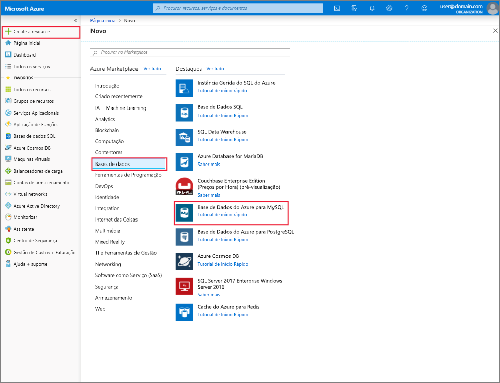

# Criar e gerenciar o servidor de banco de dados do Azure para MySQL usando o portal do Azure
Este tópico descreve como você pode criar rapidamente um novo servidor de banco de dados do Azure para MySQL. Ele também inclui informações sobre como gerenciar o servidor usando o portal do Azure. O gerenciamento de servidor inclui a exibição de detalhes do servidor e bancos de dados, a redefinição da senha, o dimensionamento de recursos e a exclusão do servidor.

## Iniciar sessão no portal do Azure
Inicie sessão no [Portal do Azure](https://portal.azure.com).

## Criar uma Base de Dados do Azure para o servidor MySQL
Siga estas etapas para criar um servidor de banco de dados do Azure para MySQL chamado "mydemoserver".

1. Clique no botão **criar um recurso** localizado no canto superior esquerdo da portal do Azure.

2. Na página novo, selecione **bancos**de dados e, em seguida, na página bancos de dados, selecione **Azure Database para MySQL**.

    > Um banco de dados do Azure para servidor MySQL é criado com um conjunto definido de recursos de [computação e armazenamento](./concepts-pricing-tiers.md) . O banco de dados é criado dentro de um grupo de recursos do Azure e em um servidor de banco de dados do Azure para MySQL.

   

3. Preencha o formulário do banco de dados do Azure para MySQL usando as seguintes informações:

    | **Campo do Formulário** | **Descrição do Campo** |
    |----------------|-----------------------|
    | *Nome do servidor* | mydemoserver (o nome do servidor é globalmente exclusivo) |
    | *Subscrição* | mysubscription (selecione no menu suspenso) |
    | *Grupo de recursos* | MyResource Group (criar um novo grupo de recursos ou usar um existente) |
    | *Selecionar origem* | Em branco (criar um servidor MySQL em branco) |
    | *Início de sessão de administrador do servidor* | myadmin (configure o nome da conta de administração) |
    | *Palavra-passe* | Definir senha da conta de administrador |
    | *Confirmar palavra-passe* | confirme a palavra-passe da conta de administrador |
    | *Location* | Sudeste Asiático (selecione entre Europa Setentrional e oeste dos EUA) |
    | *Versão* | 5,7 (escolha o banco de dados do Azure para a versão do servidor MySQL) |

   

4. Clique em **tipo de preço** para especificar a camada de serviço e o nível de desempenho para o novo servidor. Selecione a guia **uso geral** . *Geração 5*, *2 vCores*, *5 GB* e *7 dias* são os valores predefinidos de **Geração de Computação**, **vCore**, **Armazenamento** e **Período de Retenção da Cópia de Segurança**. Pode deixar os controlos de deslize como estão. Para ativar as cópias de segurança do servidor no armazenamento georredundante, selecione **Geograficamente Redundante** nas **Opções de Redundância da Cópia de Segurança**.

   

5. Clique em **Criar** para aprovisionar o servidor. O aprovisionamento demora alguns minutos.

    > Selecione a opção **fixar no painel** para permitir o controle fácil de suas implantações.

## Atualizar um banco de dados do Azure para servidor MySQL
Depois que o novo servidor tiver sido provisionado, o usuário terá várias opções para configurar o servidor existente, incluindo a redefinição da senha do administrador, a alteração do tipo de preço e a expansão ou redução vertical do servidor, alterando vCore ou armazenamento

### Alterar a senha de usuário do administrador
1. Na **visão geral**do servidor, clique em **Redefinir senha** para mostrar a janela de redefinição de senha.

   

2. Insira uma nova senha e confirme a senha na janela, conforme mostrado:

   

3. Clique em **OK** para salvar a nova senha.

### Alterar o tipo de preço
> [!NOTE]
> O dimensionamento só tem suporte de Uso Geral para camadas de serviço com otimização de memória e vice-versa. Observe que a alteração de e para o tipo de preço básico após a criação do servidor não tem suporte no banco de dados do Azure para MySQL.
> 
1. Clique em **tipo de preço**, localizado em **configurações**.
2. Selecione o **tipo de preço** para o qual você deseja alterar.

    

4. Clique em **OK** para guardar as alterações. 

### Dimensionar vCores para cima/para baixo

1. Clique em **tipo de preço**, localizado em **configurações**.

2. Altere a configuração de **vCore** movendo o controle deslizante para o valor desejado.

    

3. Clique em **OK** para guardar as alterações.

### Escalar o armazenamento verticalmente

1. Clique em **tipo de preço**, localizado em **configurações**.

2. Altere a configuração de **armazenamento** movendo o controle deslizante para o valor desejado.

    

3. Clique em **OK** para guardar as alterações.

## Excluir um servidor de banco de dados do Azure para MySQL

1. Na **visão geral**do servidor, clique no botão **excluir** para abrir o prompt de confirmação de exclusão.

    

2. Digite o nome do servidor na caixa de entrada para confirmação dupla.

    

3. Clique no botão **excluir** para confirmar a exclusão do servidor. Aguarde até que o pop-up "servidor MySQL excluído com êxito" apareça na barra de notificação.

## Listar os bancos de dados do Azure para MySQL
Na **visão geral**do servidor, role para baixo até ver o bloco do banco de dados na parte inferior. Todos os bancos de dados no servidor são listados na tabela.

   

## Mostrar detalhes de um servidor de banco de dados do Azure para MySQL
Clique em **Propriedades**, localizado em **configurações** , para exibir informações detalhadas sobre o servidor.

## Passos seguintes

[Quickstart: Criar banco de dados do Azure para servidor MySQL usando portal do Azure](./quickstart-create-mysql-server-database-using-azure-portal.md)