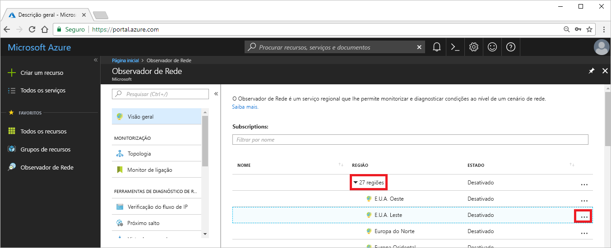
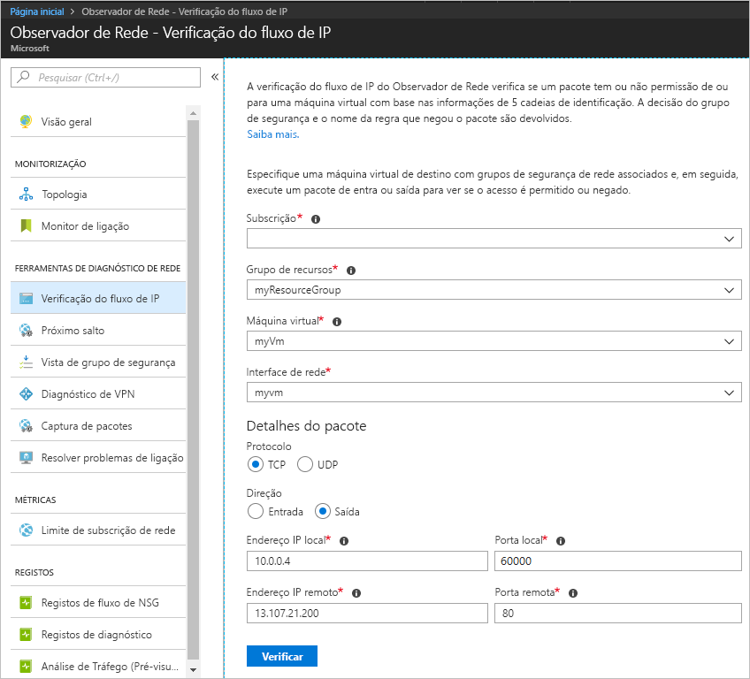
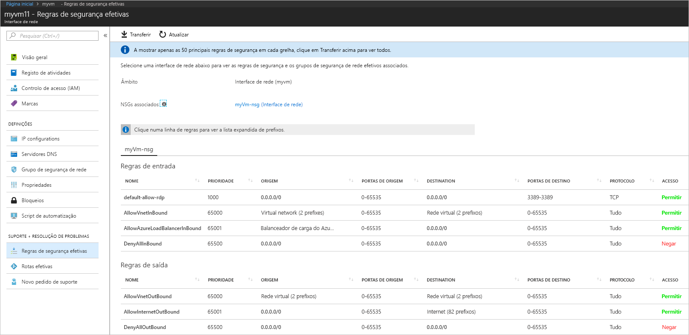
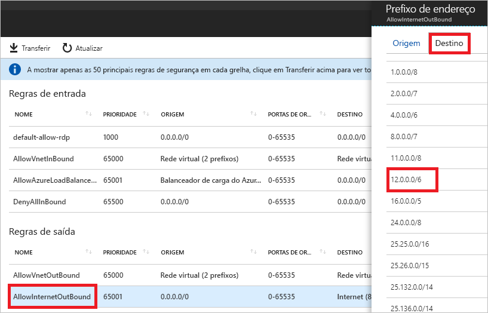

# Guia de Início Rápido: Diagnosticar um problema de filtro de tráfego de rede na máquina virtual com o portal do Azure

Neste guia de início rápido, implemente uma máquina virtual (VM) e, em seguida, verifique as comunicações para um endereço IP e URL e de um endereço IP. Vai determinar a causa de uma falha de comunicação e aprender a resolvê-la.

Se não tiver uma subscrição do Azure, crie uma [conta gratuita](https://azure.microsoft.com/free/?WT.mc_id=A261C142F) antes de começar.

## Iniciar sessão no Azure

Inicie sessão no portal do Azure em https://portal.azure.com.

## Criar uma VM

1. Selecione **+ Criar um recurso**, disponível no canto superior esquerdo do portal do Azure.
2. **Selecione Compute** e, em seguida, selecione **o Centro de Dados do Windows Server 2016** ou uma versão do **Ubuntu Server**.
3. Introduza ou selecione as seguintes informações, aceite as predefinições para as definições restantes e, em seguida, selecione **OK**:

    |Definição|Valor|
    |---|---|
    |Nome|myVm|
    |Nome de utilizador| Introduza um nome de utilizador à sua escolha.|
    |Palavra-passe| Introduza uma palavra-passe à sua escolha. A palavra-passe deve ter pelo menos 12 caracteres de comprimento e satisfazer os requisitos de complexidade definidos.|
    |Subscrição| Selecione a sua subscrição.|
    |Grupo de recursos| Selecione **Criar novo** e introduza **myResourceGroup**.|
    |Localização| Selecione **E.U.A. Leste**.|

4. Escolha um tamanho para a VM e selecione **Selecionar**.
5. Em **Definições**, aceite todas as predefinições e selecione **OK**.
6. Em **Criar** no **Resumo**, selecione **Criar** para iniciar a implementação da VM. A implementação da VM demora alguns minutos. Aguarde que a VM conclua a implementação antes de continuar com os restantes passos.

## Testar a comunicação de rede

Para testar a comunicação de rede com o Observador de Rede, deve primeiro ativar um observador de rede em pelo menos uma região do Azure e, em seguida, utilizar a função de verificação do fluxo IP do Observador de Rede.

### Ativar o observador de rede

Se já tiver um observador de rede ativado em pelo menos uma região, salte para o [fluxo IP de utilização verificar](#use-ip-flow-verify).

1. No portal, selecione **Todos os serviços**. Na caixa **Filtro**, introduza *Observador de Rede*. Quando **o Observador de Rede** aparecer nos resultados, selecione-o.
2. Ative um observador de rede na região E.U.A. Leste, uma vez que é a região onde a VM foi implementada num passo anterior. Selecione **Regiões**, para expandir e, em seguida, selecione **...** à direita de **E.U.A. Leste**, conforme apresentado na seguinte imagem:

    

3. Selecione **Ativar Observador de Rede**.

### Utilizar a verificação do fluxo IP

Quando cria uma VM, o Azure permite e recusa o tráfego de rede de e para a VM, por predefinição. Mais tarde, poderá substituir as predefinições do Azure, ao permitir ou recusar tipos adicionais de tráfego.

1. No portal, selecione **Todos os serviços**. Na caixa **Todos os serviços,** *Filtro*, introduza *Observador de Rede*. Quando **o Observador de Rede** aparecer nos resultados, selecione-o.
2. Selecione **Verificação do fluxo de IP**, em **FERRAMENTAS DE DIAGNÓSTICO DE REDE**.
3. Selecione a sua subscrição, introduza ou selecione os seguintes valores e, em seguida, selecione **Verificar**, conforme apresentado na imagem que se segue:

    |Definição            |Valor                                                                                              |
    |---------          |---------                                                                                          |
    | Grupo de recursos    | Selecionar myResourceGroup                                                                            |
    | Máquina virtual   | Selecionar myVm                                                                                       |
    | Interface de rede | myvm – O nome da interface de rede que o portal criou quando criou a VM é diferente. |
    | Protocolo          | TCP                                                                                               |
    | Direção         | Saída                                                                                          |
    | Endereço IP local  | 10.0.0.4                                                                                          |
    | Porta local      | 60000                                                                                                |
    | Endereço IP remoto | 13.107.21.200 - Um dos endereços para <www.bing.com>.                                             |
    | Porta remota       | 80                                                                                                |

    

    Após alguns segundos, o resultado devolvido informa-o de que é permitido o acesso devido a uma regra de segurança denominada **AllowInternetOutbound**. Quando executou a verificação, o Observador de Rede criou automaticamente um observador de rede na região E.U.A. Leste, se já tinha um observador de rede existente numa região diferente da região E.U.A. Leste antes de executar a verificação.
4. Conclua o passo 3 novamente, mas altere o **Endereço IP remoto** para **172.31.0.100**. O resultado devolvido informa-o de que o acesso foi recusado devido a uma regra de segurança denominada **DefaultOutboundDenyAll**.
5. Conclua o passo 3 novamente, mas altere a **Direção** para **Entrada**, a **Porta local** para **80** e a **Porta remota** para **60000**. O resultado devolvido informa-o de que o acesso foi recusado devido a uma regra de segurança denominada **DefaultInboundDenyAll**.

Agora que sabe quais as regras de segurança que estão a permitir ou a recusar tráfego de ou para uma VM, pode determinar como resolver os problemas.

## Ver detalhes de uma regra de segurança

1. Para determinar o motivo pelo qual as regras nos passos 3 a 5 de **Utilizar a verificação do fluxo IP** permitem ou recusam a comunicação, reveja as regras de segurança efetivas para a interface de rede na VM. Na caixa de pesquisa na parte superior do portal, introduza *myvm*. Quando a interface de rede **myvm** (ou qualquer que seja o nome da interface de rede) for apresentada nos resultados da pesquisa, selecione-a.
2. Selecione **Regras de segurança efetivas** em **SUPORTE + RESOLUÇÃO DE PROBLEMAS**, conforme apresentado na seguinte imagem:

    

    No passo 3 para **Utilizar a verificação do fluxo IP**, aprendeu que o motivo pelo qual foi autorizada a comunicação se deve à regra **AllowInternetOutbound**. Pode ver na imagem anterior que o **DESTINO** para a regra é **Internet**. No entanto, não é claro como 13.107.21.200, o endereço testado no passo 3 de **Utilizar a verificação do fluxo IP**, está relacionado com **Internet**.
3. Selecione a regra **AllowInternetOutBound** e, em seguida, selecione **Destino**, conforme apresentado na seguinte imagem:

    

    Um dos prefixos na lista é **12.0.0.0/6**, que abrange o intervalo 12.0.0.1-15.255.255.254 de endereços IP. Uma vez que 13.107.21.200 está dentro desse intervalo de endereços, a regra **AllowInternetOutBound** permite o tráfego de saída. Além disso, não existem regras com prioridade superior (número inferior) apresentadas na imagem no passo 2 que substituam esta regra. Feche a caixa **Prefixos de endereço**. Para recusar comunicações de saída para 13.107.21.200, pode adicionar uma regra de segurança com uma prioridade mais elevada, que recusa a saída da porta 80 para o endereço IP.
4. Quando executou a verificação de saída para 172.131.0.100 no passo 4 para **Utilizar a verificação do fluxo IP**, aprendeu que a regra **DefaultOutboundDenyAll** recusou a comunicação. Essa regra equivale à regra **DenyAllOutBound** apresentada na imagem no passo 2, que especifica **0.0.0.0/0** como o **DESTINO**. Esta regra recusa a comunicação de saída para 172.131.0.100, porque o endereço não se encontra dentro do **DESTINO** de qualquer uma das outras **Regras de saída** apresentadas na imagem. Para permitir a comunicação de saída, pode adicionar uma regra de segurança com uma prioridade mais elevada, que permite o tráfego de saída para a porta 80 para o endereço 172.131.0.100.
5. Quando executou a verificação de entrada de 172.131.0.100 no passo 5 de **Utilizar a verificação do fluxo IP**, aprendeu que a regra **DefaultInboundDenyAll** recusou a comunicação. Essa regra equivale à regra **DenyAllInBound** apresentada na imagem no passo 2. A regra **DenyAllInBound** é imposta porque não existe nenhuma outra regra de prioridade superior que permita a entrada da porta 80 para a VM de 172.31.0.100. Para permitir a comunicação de entrada, pode adicionar uma regra de segurança com uma prioridade superior que permita a entrada da porta 80 de 172.31.0.100.

As verificações neste guia de início rápido testaram a configuração do Azure. Se as verificações devolverem os resultados esperados e continuar a ter problemas de rede, certifique-se de que não tem uma firewall entre a VM e o ponto final com o qual está a comunicar e que o sistema operativo na VM não tem uma firewall que esteja a permitir ou a recusar a comunicação.

## Limpar os recursos

Quando já não for necessário, elimine o grupo de recursos e todos os recursos contidos no mesmo:

1. Introduza *myResourceGroup* na caixa **Pesquisar**, na parte superior do portal. Quando vir o **myResourceGroup** nos resultados da pesquisa, selecione-o.
2. Selecione **Eliminar grupo de recursos**.
3. Introduza *myResourceGroup* em **ESCREVER O NOME DO GRUPO DE RECURSOS:** e selecione **Eliminar**.

## Passos seguintes

Neste guia de início rápido, criou uma VM e diagnosticou filtros de tráfego de rede de entrada e saída. Aprendeu que as regras do grupo de segurança de rede permitem ou recusam tráfego de e para uma VM. Saiba mais sobre [regras de segurança](../virtual-network/network-security-groups-overview.md?toc=%252fazure%252fnetwork-watcher%252ftoc.json) e como [criar regras de segurança](../virtual-network/manage-network-security-group.md?toc=%2fazure%2fnetwork-watcher%2ftoc.json#create-a-security-rule).

Mesmo com os filtros de tráfego de rede adequados ativados, a comunicação para uma VM ainda pode falhar, devido à configuração de encaminhamento. Para saber como diagnosticar problemas de encaminhamento de rede de VM, veja [Diagnosticar problemas de encaminhamento de VM](diagnose-vm-network-routing-problem.md) ou, para diagnosticar problemas de encaminhamento de saída, latência e filtro de tráfego, com uma ferramenta, veja [Resolver problemas de ligação](network-watcher-connectivity-portal.md).