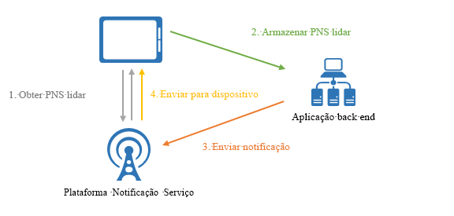
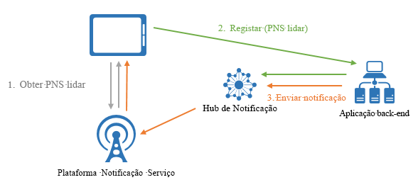

# O que são os Hubs de Notificação do Azure?

Os Hubs de Notificação do Azure oferecem um motor de envio de escalamento horizontal e utilização fácil que lhe permite enviar notificações para qualquer plataforma (iOS, Android, Windows, Kindle, Baidu, etc.) a partir de qualquer back-end (cloud ou no local). Os Hubs de Notificação funcionam perfeitamente para cenários de utilização empresarial e de consumo. Eis alguns exemplos de cenários:

- Enviar notificações de notícias de última hora para milhões com baixa latência.
- Enviar cupões com base na localização a segmentos de utilizadores interessados.
- Enviar notificações relacionadas com eventos a utilizadores ou grupos para aplicações de multimédia/desporto/finanças/jogos.
- Enviar conteúdos promocionais às aplicações, para interação e comercialização junto dos clientes.
- Notificar os utilizadores de eventos da empresa, como mensagens e itens de trabalho novos.
- Enviar códigos para a autenticação multifator.

## O que são as notificações push?

Notificações por push é uma forma de comunicação de aplicativo para usuário em que os usuários de aplicativos móveis são notificados sobre determinadas informações desejadas, geralmente em uma caixa de diálogo ou pop-up em um dispositivo móvel. Os usuários geralmente optam por exibir ou ignorar a mensagem; escolher o primeiro abre o aplicativo móvel que comunica a notificação. Algumas notificações são fornecidas silenciosamente nos bastidores para que o aplicativo seja processado nos bastidores e decida o que fazer.

As notificações push são essenciais para as aplicações de consumidor, para aumentar a interação e a utilização da aplicação, e para as aplicações empresariais, para comunicar informações da empresa atualizadas. É a melhor comunicação de aplicativo para o usuário porque é eficiente em termos de energia para dispositivos móveis, flexível para os remetentes de notificações e disponível quando os aplicativos correspondentes não estão ativos.

Para obter mais informações sobre as notificações push para algumas plataformas populares, veja os tópicos seguintes:

- [Android](https://developer.android.com/guide/topics/ui/notifiers/notifications.html)
- [iOS](https://developer.apple.com/notifications/)
- [Windows](https://msdn.microsoft.com/library/windows/apps/hh779725.aspx)

## Como funcionam as notificações push?

As notificações push são entregues através de infraestruturas específicas da plataforma denominadas *Sistemas de Notificação de Plataforma* (PNS). Oferecem funcionalidades de push barebone para entregar mensagens a dispositivos com um identificador fornecido e não têm uma interface comum. Para enviar uma notificação para todos os clientes nas versões do Android, iOS e Windows de um aplicativo, o desenvolvedor deve trabalhar com Apple Push Notification Service (APNS), firebase Cloud Messaging (FCM) e Windows Notification Service (WNS) separadamente.

A um nível elevado, eis como o push funciona:

1. Um aplicativo decide que deseja receber notificação, portanto, ele entra em contato com PNS para a plataforma de destino onde o aplicativo está em execução e solicita um identificador de push exclusivo e temporário. O tipo de identificador depende do sistema (por exemplo, o WNS usa URIs enquanto o APNS usa Tokens).
2. O aplicativo cliente armazena esse identificador no back-end ou no provedor do aplicativo.
3. Para enviar uma notificação por push, o back-end do aplicativo entra em contato com o PNS usando o identificador para direcionar um aplicativo cliente específico.
4. O PNS reencaminha a notificação para o dispositivo especificado pelo identificador.

## Os desafios das notificações push

Os PNS são poderosos. Contudo, deixam muito trabalho ao programador da aplicação para implementar até mesmo cenários de notificações push comuns, como difundi-las para utilizadores segmentados.

O envio de notificações exige uma infraestrutura complexa que não está relacionada com a lógica de negócio principal da aplicação. Alguns dos desafios em termos de infraestrutura são:

- **Dependência da plataforma**
  - O back-end exige uma lógica dependente de plataforma complexa e difícil de manter para enviar notificações para dispositivos em várias plataformas, já que PNS não são unificados.
- **Dimensionamento**
  - De acordo com as diretrizes do PNS, os tokens dos dispositivos têm de ser atualizados sempre que a aplicação é iniciada. O back-end lida com uma grande quantidade de tráfego e acesso ao banco de dados apenas para manter os tokens atualizados. Quando o número de dispositivos cresce para centenas, milhares ou milhões, o custo de criar e manter essa infraestrutura é maciço.
  - A maioria dos PNS não suporta a difusão para vários dispositivos. Uma simples difusão para um milhão de dispositivos resulta num milhão de chamadas para os PNS. Dimensionar esta quantidade de tráfico com latência mínima não é algo trivial.
- **Encaminhamento**
  - Embora os PNS proporcionem uma forma de enviar mensagens para dispositivos, a maioria das notificações das aplicações são segmentadas para os utilizadores ou para grupos de interesses. O back-end tem de manter um registo para associar os dispositivos aos grupos de interesses, utilizadores, propriedades, etc. Esta sobrecarga soma-se ao tempo de comercialização e aos custos de manutenção das aplicações.

## Porquê utilizar os Hubs de Notificação?

Os hubs de notificação eliminam todas as complexidades associadas ao envio por push de notificações por conta própria do back-end do aplicativo. A infraestrutura de notificações push de escalamento horizontal e multiplataforma reduz a programação relacionada com pushes e simplifica o seu back-end. Com os Hubs de Notificação, os seus dispositivos são meramente responsáveis pelo registo dos respetivos identificadores do PNS hum hub, ao passo que o back-end envia mensagens aos utilizadores ou grupos de interesse, conforme mostrado na seguinte figura:

Os Hubs de Notificação são o seu motor pronto a usar e oferecem as seguintes vantagens:

- **Várias plataformas**
  - Suporte para todas as principais plataformas de push, incluindo iOS, Android, Windows, Kindle e Baidu.
  - Uma interface comum para enviar para todas plataformas em formatos específicos para uma plataforma ou formatos independentes de plataforma sem qualquer trabalho para uma plataforma específica.
  - Gestão de identificadores dos dispositivos num único local.
- **Vários back-ends**
  - Cloud ou no local
  - .NET, Node. js, Java, Python, etc.
- **Conjunto de padrões de entrega rico**
  - Transmissão para uma ou várias plataformas: Você pode transmitir instantaneamente para milhões de dispositivos entre plataformas com uma única chamada à API.
  - Enviar por push para o dispositivo: Você pode direcionar notificações para dispositivos individuais.
  - Enviar por push para o usuário: Os recursos de marcas e modelos ajudam você a alcançar todos os dispositivos de plataforma cruzada de um usuário.
  - Enviar por push para segmento com marcas dinâmicas: O recurso de marcas ajuda a segmentar dispositivos e enviá-los de acordo com suas necessidades, quer você esteja enviando para um segmento ou uma expressão de segmentos (por exemplo, ativo e vive em Seattle não novo usuário). Em vez de estar limitado a publicação-subscrição, pode atualizar as etiquetas dos dispositivos em qualquer lugar e em qualquer altura.
  - Push localizado: O recurso de modelos ajuda a obter localização sem afetar o código de back-end.
  - Push silencioso: Você pode habilitar o padrão Push a pull enviando notificações silenciosas para dispositivos e disparando-os para concluir determinadas ações ou pull.
  - Push agendado: Você pode agendar para enviar notificações a qualquer momento.
  - Push direto: Você pode ignorar o registro de dispositivos com o serviço de hubs de notificação e enviar por push de lote diretamente para uma lista de identificadores de dispositivo.
  - Push personalizado: As variáveis de push de dispositivo ajudam a enviar notificações por push personalizadas específicas do dispositivo com pares chave-valor personalizados.
- **Telemetria avançada**
  - Está disponível telemetria de pushes, dispositivos, erros e operações no portal do Azure e programaticamente.
  - A Telemetria por Mensagem regista cada push a partir da chamada de pedido inicial ao serviço Hubs de Notificação, processando os pushes por lotes corretamente.
  - O Feedback do Sistema de Notificação de Plataforma comunica todos os feedbacks do Sistema de Notificação de Plataforma, para ajudar na depuração.
- **Escalabilidade**
  - Enviar mensagens rápidas para milhões de dispositivos sem alterar a arquitetura ou fragmentar os dispositivos.
- **Segurança**
  - Segredo de Acesso Partilhado (SAS) ou autenticação federada.

## Passos Seguintes

Comece a criar e usar um hub de notificação seguindo o [tutorial: Notificações por push para aplicativos](notification-hubs-android-push-notification-google-fcm-get-started.md)móveis.

[0]: ./media/notification-hubs-overview/registration-diagram.png
[1]: ./media/notification-hubs-overview/notification-hub-diagram.png

[How customers are using Notification Hubs]: https://azure.microsoft.com/services/notification-hubs
[Notification Hubs tutorials and guides]: https://azure.microsoft.com/documentation/services/notification-hubs
[iOS]: https://azure.microsoft.com/documentation/articles/notification-hubs-ios-get-started
[Android]: https://azure.microsoft.com/documentation/articles/notification-hubs-android-get-started
[Windows Universal]: https://azure.microsoft.com/documentation/articles/notification-hubs-windows-store-dotnet-get-started
[Windows Phone]: https://azure.microsoft.com/documentation/articles/notification-hubs-windows-phone-get-started
[Kindle]: https://azure.microsoft.com/documentation/articles/notification-hubs-kindle-get-started
[Xamarin.iOS]: https://azure.microsoft.com/documentation/articles/partner-xamarin-notification-hubs-ios-get-started
[Xamarin.Android]: https://azure.microsoft.com/documentation/articles/partner-xamarin-notification-hubs-android-get-started
[Microsoft.WindowsAzure.Messaging.NotificationHub]: https://msdn.microsoft.com/library/microsoft.windowsazure.messaging.notificationhub.aspx
[Microsoft.ServiceBus.Notifications]: https://msdn.microsoft.com/library/microsoft.servicebus.notifications.aspx
[App Service Mobile Apps]: https://azure.microsoft.com/documentation/articles/app-service-mobile-value-prop/
[templates]: notification-hubs-templates-cross-platform-push-messages.md
[Azure portal]: https://portal.azure.com
[tags]: (https://msdn.microsoft.com/library/azure/dn530749.aspx)
