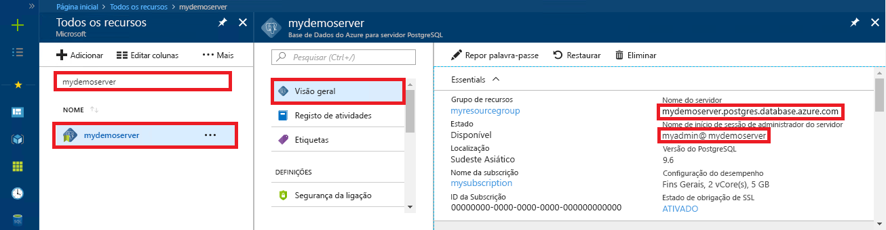

# <a name="azure-database-for-postgresql-use-ruby-to-connect-and-query-data"></a>Base de dados do Azure para PostgreSQL: Utilizar Ruby para se ligar e consultar dados
Este início rápido explica como se pode ligar a uma Base de Dados do Azure para PostgreSQL através de uma aplicação [Ruby](https://www.ruby-lang.org). Explica como utilizar as instruções SQL para consultar, inserir, atualizar e eliminar dados da base de dados. Os passos neste artigo pressupõem que está familiarizado com a programação com Ruby e que nunca trabalhou com a Base de Dados do Azure para PostgreSQL.

## <a name="prerequisites"></a>Pré-requisitos
Este guia de início rápido utiliza os recursos criados em qualquer um destes guias como ponto de partida:
- [Criar BD - Portal](quickstart-create-server-database-portal.md)
- [Criar BD - CLI do Azure](quickstart-create-server-database-azure-cli.md)

Terá também de ter instalado:
- [Ruby](https://www.ruby-lang.org/en/downloads/)
- Ruby pg, o módulo PostgreSQL para Ruby

## <a name="get-connection-information"></a>Obter informações da ligação
Obtenha as informações de ligação necessárias para se ligar à Base de Dados do Azure para PostgreSQL. Necessita do nome do servidor e das credenciais de início de sessão totalmente qualificados.

1. Inicie sessão no [Portal do Azure](https://portal.azure.com/).
2. No menu esquerdo do portal do Azure, clique em **Todos os recursos** e, em seguida, procure o servidor que acabou de criar, (por exemplo, **mydemoserver**).
3. Clique no nome do servidor.
4. No painel **Descrição geral** do servidor, tome nota do **Nome do servidor** e do **Nome de início de sessão de administrador do servidor**. Caso se esqueça da sua palavra-passe, também pode repor a palavra-passe neste painel.
 

> [!NOTE]
> O `@` símbolo o nome de utilizador do Azure Postgres tem sido url codificados como `%40` em todas as cadeias de ligação. 

## <a name="connect-and-create-a-table"></a>Ligar-se e criar uma tabela
Utilize o código seguinte para ligar e criar uma tabela com a instrução SQL **CREATE TABLE**, seguida das instruções SQL **INSERT INTO** para adicionar linhas à tabela.

O código utiliza um objeto [PG::Connection](https://www.rubydoc.info/gems/pg/PG/Connection) com o construtor [new()](https://www.rubydoc.info/gems/pg/PG%2FConnection:initialize) para se ligar à Base de Dados do Azure para PostgreSQL. Em seguida, chama o método [exec()](https://www.rubydoc.info/gems/pg/PG/Connection#exec-instance_method) para executar os comandos DROP, CREATE TABLE e INSERT INTO. O código procura erros através da classe [PG::Error](https://www.rubydoc.info/gems/pg/PG/Error). Em seguida, chama o método [close()](https://www.rubydoc.info/gems/pg/PG/Connection#lo_close-instance_method) para fechar a ligação antes de terminar.

Substitua as cadeias `host`, `database`, `user` e `password` pelos seus próprios valores. 


```ruby
require 'pg'

begin
    # Initialize connection variables.
    host = String('mydemoserver.postgres.database.azure.com')
    database = String('postgres')
    user = String('mylogin%40mydemoserver')
    password = String('<server_admin_password>')

    # Initialize connection object.
    connection = PG::Connection.new(:host => host, :user => user, :dbname => database, :port => '5432', :password => password)
    puts 'Successfully created connection to database'

    # Drop previous table of same name if one exists
    connection.exec('DROP TABLE IF EXISTS inventory;')
    puts 'Finished dropping table (if existed).'

    # Drop previous table of same name if one exists.
    connection.exec('CREATE TABLE inventory (id serial PRIMARY KEY, name VARCHAR(50), quantity INTEGER);')
    puts 'Finished creating table.'

    # Insert some data into table.
    connection.exec("INSERT INTO inventory VALUES(1, 'banana', 150)")
    connection.exec("INSERT INTO inventory VALUES(2, 'orange', 154)")
    connection.exec("INSERT INTO inventory VALUES(3, 'apple', 100)")
    puts 'Inserted 3 rows of data.'

rescue PG::Error => e
    puts e.message 
    
ensure
    connection.close if connection
end
```

## <a name="read-data"></a>Ler dados
Utilize o código seguinte para se ligar e ler dados com uma instrução SQL **SELECT**. 

O código utiliza um objeto [PG::Connection](https://www.rubydoc.info/gems/pg/PG/Connection) com o construtor [new()](https://www.rubydoc.info/gems/pg/PG%2FConnection:initialize) para se ligar à Base de Dados do Azure para PostgreSQL. Em seguida, chama o método [exec()](https://www.rubydoc.info/gems/pg/PG/Connection#exec-instance_method) para executar o comando SELECT, mantendo os resultados num conjunto de resultados. A coleção do conjunto de resultados é iterada através do loop `resultSet.each do`, mantendo os valores de linha atuais na variável `row`. O código procura erros através da classe [PG::Error](https://www.rubydoc.info/gems/pg/PG/Error). Em seguida, chama o método [close()](https://www.rubydoc.info/gems/pg/PG/Connection#lo_close-instance_method) para fechar a ligação antes de terminar.

Substitua as cadeias `host`, `database`, `user` e `password` pelos seus próprios valores. 

```ruby
require 'pg'

begin
    # Initialize connection variables.
    host = String('mydemoserver.postgres.database.azure.com')
    database = String('postgres')
    user = String('mylogin%40mydemoserver')
    password = String('<server_admin_password>')

    # Initialize connection object.
    connection = PG::Connection.new(:host => host, :user => user, :database => dbname, :port => '5432', :password => password)
    puts 'Successfully created connection to database.'

    resultSet = connection.exec('SELECT * from inventory;')
    resultSet.each do |row|
        puts 'Data row = (%s, %s, %s)' % [row['id'], row['name'], row['quantity']]
    end

rescue PG::Error => e
    puts e.message 
    
ensure
    connection.close if connection
end
```

## <a name="update-data"></a>Atualizar dados
Utilize o código seguinte para se ligar e atualizar os dados com a instrução SQL **UPDATE**.

O código utiliza um objeto [PG::Connection](https://www.rubydoc.info/gems/pg/PG/Connection) com o construtor [new()](https://www.rubydoc.info/gems/pg/PG%2FConnection:initialize) para se ligar à Base de Dados do Azure para PostgreSQL. Em seguida, chama o método [exec()](https://www.rubydoc.info/gems/pg/PG/Connection#exec-instance_method) para executar o comando UPDATE. O código procura erros através da classe [PG::Error](https://www.rubydoc.info/gems/pg/PG/Error). Em seguida, chama o método [close()](https://www.rubydoc.info/gems/pg/PG/Connection#lo_close-instance_method) para fechar a ligação antes de terminar.

Substitua as cadeias `host`, `database`, `user` e `password` pelos seus próprios valores. 

```ruby
require 'pg'

begin
    # Initialize connection variables.
    host = String('mydemoserver.postgres.database.azure.com')
    database = String('postgres')
    user = String('mylogin%40mydemoserver')
    password = String('<server_admin_password>')

    # Initialize connection object.
    connection = PG::Connection.new(:host => host, :user => user, :dbname => database, :port => '5432', :password => password)
    puts 'Successfully created connection to database.'

    # Modify some data in table.
    connection.exec('UPDATE inventory SET quantity = %d WHERE name = %s;' % [200, '\'banana\''])
    puts 'Updated 1 row of data.'

rescue PG::Error => e
    puts e.message 
    
ensure
    connection.close if connection
end
```


## <a name="delete-data"></a>Eliminar dados
Utilize o código seguinte para se ligar e ler os dados com a instrução SQL **DELETE**. 

O código utiliza um objeto [PG::Connection](https://www.rubydoc.info/gems/pg/PG/Connection) com o construtor [new()](https://www.rubydoc.info/gems/pg/PG%2FConnection:initialize) para se ligar à Base de Dados do Azure para PostgreSQL. Em seguida, chama o método [exec()](https://www.rubydoc.info/gems/pg/PG/Connection#exec-instance_method) para executar o comando UPDATE. O código procura erros através da classe [PG::Error](https://www.rubydoc.info/gems/pg/PG/Error). Em seguida, chama o método [close()](https://www.rubydoc.info/gems/pg/PG/Connection#lo_close-instance_method) para fechar a ligação antes de terminar.

Substitua as cadeias `host`, `database`, `user` e `password` pelos seus próprios valores. 

```ruby
require 'pg'

begin
    # Initialize connection variables.
    host = String('mydemoserver.postgres.database.azure.com')
    database = String('postgres')
    user = String('mylogin%40mydemoserver')
    password = String('<server_admin_password>')

    # Initialize connection object.
    connection = PG::Connection.new(:host => host, :user => user, :dbname => database, :port => '5432', :password => password)
    puts 'Successfully created connection to database.'

    # Modify some data in table.
    connection.exec('DELETE FROM inventory WHERE name = %s;' % ['\'orange\''])
    puts 'Deleted 1 row of data.'

rescue PG::Error => e
    puts e.message 
    
ensure
    connection.close if connection
end
```

## <a name="next-steps"></a>Passos Seguintes
> [!div class="nextstepaction"]
> [Migrar a base de dados com Exportar e Importar](./howto-migrate-using-export-and-import.md)
