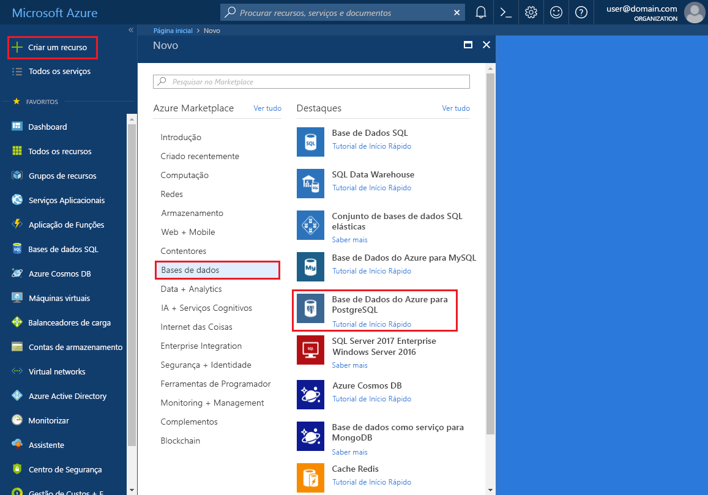
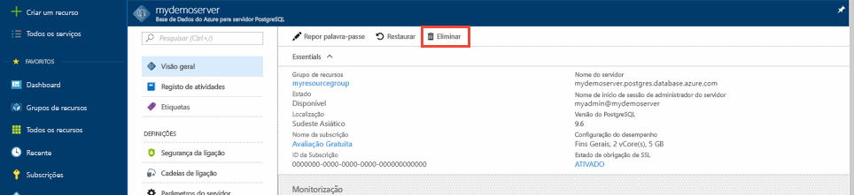

# <a name="quickstart-create-an-azure-database-for-postgresql-server-in-the-azure-portal"></a>Início Rápido: Criar um servidor da Base de Dados do Azure para PostgreSQL no portal do Azure

A Base de Dados do Azure para o PostgreSQL é um serviço gerido com o qual pode executar, gerir e dimensionar as bases de dados de elevada disponibilidade do PostgreSQL na cloud. Este Início Rápido mostra-lhe como criar um servidor da Base de Dados do Azure para PostgreSQL no portal do Azure em cerca de cinco minutos.

Se não tiver uma subscrição do Azure, crie uma [conta do Azure gratuita](https://azure.microsoft.com/free/) antes de começar.

## <a name="sign-in-to-the-azure-portal"></a>Iniciar sessão no portal do Azure
Abra o browser e aceda ao [portal do Azure](https://portal.azure.com/). Introduza as suas credenciais para iniciar sessão no portal. A vista predefinida é o dashboard de serviço.

## <a name="create-an-azure-database-for-postgresql-server"></a>Criar um servidor da Base de Dados do Azure para PostgreSQL

É criado um servidor da Base de Dados do Azure para PostgreSQL com um conjunto de [recursos de armazenamento e computação](./concepts-pricing-tiers.md) configurado. O servidor é criado dentro de um [grupo de recursos do Azure](../azure-resource-manager/management/overview.md).

Para criar uma Base de Dados do Azure para o servidor PostgreSQL, siga os passos abaixo:
1. **Selecione Criar um recurso** (+) no canto superior esquerdo do portal.

2. Selecione **Base de Dados**  >  **Azure Databases para PostgreSQL**.

   > [!div class="mx-imgBorder"]
   > 

3. Selecione a opção de implementação **do servidor único.**

   > [!div class="mx-imgBorder"]
   > 

4. Preencha o formulário Básico com as **seguintes** informações:

   > [!div class="mx-imgBorder"]
   > 

   Definição|Valor sugerido|Descrição
   ---|---|---
   Subscrição|Nome da sua subscrição|A subscrição do Azure que quer utilizar para o servidor. Se tiver várias subscrições, escolha a subscrição na qual o recurso é cobrado.
   Grupo de recursos|*grupo myresource*| Um nome de grupo de recursos novo ou um já existente na sua subscrição.
   Nome do servidor |*mydemoserver*|Um nome exclusivo que identifique a sua Base de Dados do Azure para o servidor PostgreSQL. O nome de domínio *postgres.database.azure.com* é acrescentado ao nome de servidor que indicar. O servidor só pode conter letras minúsculas, números e o caráter de hífen (-). Tem de conter, pelo menos, 3 a 63 carateres.
   Origem de dados | *Nenhuma* | Selecione *Nenhum* para criar um novo servidor a partir do zero. (Selecione *Cópia de segurança* se estiver a criar um servidor a partir de uma cópia de segurança geo de um servidor da Base de Dados do Azure para PostgreSQL existente).
   Nome de utilizador admin |*myadmin*| A sua própria conta de início de sessão quando se ligar ao servidor. O nome de login não pode ser **azure_superuser**, **azure_pg_admin,** **administrador,** **administrador,** **raiz,** **hóspede,** ou **público.** Não pode começar com **pg_.**
   Palavra-passe |A sua palavra-passe| Uma palavra-passe nova para a conta de administrador do servidor. Tem de conter entre 8 e 128 carateres. A sua palavra-passe tem de conter carateres de três das categorias seguintes: letras em maiúscula inglesas, letras em minúscula inglesas, números (0 a 9) e carateres não alfanuméricos (!, $, #, %, etc.).
   Localização|A região mais próxima dos seus utilizadores| A localização que esteja mais próxima dos seus utilizadores.
   Versão|A versão principal mais recente| A versão principal mais recente do PostgreSQL, a não ser que tenha requisitos específicos.
   Computação e armazenamento | **Fins Gerais**, **Geração 5**, **2 vCores**, **5 GB**, **7 dias**, **Geograficamente Redundante** | As configurações de computação, armazenamento e cópia de segurança do seu novo servidor. Selecione **o servidor Configurar**. Em seguida, selecione o nível de preços apropriado, para obter mais informações, consulte [detalhes de preços](https://azure.microsoft.com/pricing/details/postgresql/server/). Para ativar as cópias de segurança do servidor no armazenamento geo-redundante, selecione **Geographically Redundante** das **Opções de Redundância de Backup**. Selecione **OK**.

   > [!NOTE]
   > Considere usar o nível de preços básico se o cálculo leve e a I/O forem adequados para a sua carga de trabalho. Note que os servidores criados no nível de preços básicos não podem ser posteriormente dimensionados para Final Geral ou Memória Otimizada. 
   
5. Selecione **Review + crie** para rever as suas seleções. Selecione **Criar** para aprovisionar o servidor. Esta operação poderá demorar alguns minutos.

6. Na barra de ferramentas, selecione o ícone **Notificações** (um sino) para monitorizar o processo de implementação. Uma vez concluída a implementação, selecione **Ir para o recurso** abre a página de **Visão Geral** do servidor.

Uma base de dados vazia, **postgres** é criado. Também encontrará **azure_maintenance** base de dados que é usada para separar os processos de serviço geridos das ações do utilizador. Não pode aceder **azure_maintenance** base de dados.

## <a name="configure-a-server-level-firewall-rule"></a>Configurar uma regra de firewall ao nível do servidor
Por predefinição, o servidor criado não é acessível ao público e precisa de dar permissões ao seu IP. Para dar acesso ao seu IP, aceda ao seu recurso de servidor no portal Azure e selecione a segurança de **ligação** do menu lateral esquerdo para o seu recurso do servidor. Se não sabe como encontrar o seu recurso, consulte [como abrir um recurso](https://docs.microsoft.com/azure/azure-resource-manager/management/manage-resources-portal#open-resources).

> [!div class="mx-imgBorder"]
> 
  
Agora **selecione Adicionar o endereço IP do cliente atual** e, em seguida, selecione **Guardar**. Pode adicionar IPs adicionais ou fornecer uma gama IP para ligar ao seu servidor a partir desses IPs. Para mais informações, consulte [Como gerir as regras de firewall](./concepts-firewall-rules.md)
   
> [!NOTE]
> Verifique se a sua rede permite tráfego de saída sobre a porta 5432 que é utilizada pela Azure Database para PostgreSQL para evitar problemas de conectividade.  

## <a name="connect-to-azure-database-for-postgresql-server-using-psql"></a>Ligue à Base de Dados de Azure para servidor PostgreSQL usando psql

Você pode usar [psql](http://postgresguide.com/utilities/psql.html) ou [pgAdmin](https://www.pgadmin.org/docs/pgadmin4/latest/connecting.html) que são clientes postgreSQL populares. Para este arranque rápido, vamos conectar-nos usando psql em [Azure Cloud Shell](https://docs.microsoft.com/azure/cloud-shell/overview) dentro do portal Azure.

1. Tome nota do nome do seu servidor, nome de login de administrador do servidor, palavra-passe e Id de subscrição para o seu servidor recém-criado a partir da secção **de visão geral** do seu servidor, tal como mostrado na imagem abaixo.

2. Lance Azure Cloud Shell no portal selecionando o ícone no lado superior esquerdo, como realçada na imagem abaixo.

   > [!NOTE]
   > Se estiver a lançar a Cloud Shell pela primeira vez, verá um pedido para criar um grupo de recursos, uma conta de armazenamento. Este é um passo único e será automaticamente anexado para todas as sessões. 

   > [!div class="mx-imgBorder"]
   > 

3. Executar este comando no terminal Azure Cloud Shell. Substitua os valores pelo nome real do servidor e pelo nome de início de sessão do utilizador administrativo. Utilize os **postgres vazios** da base de dados com o utilizador de administração neste formato '<nome de administração-utilizador>@ <servername> como mostrado abaixo para Azure Database for PostgreSQL.

   ```azurecli-interactive
   psql --host=mydemoserver.postgres.database.azure.com --port=5432 --username=myadmin@mydemoserver --dbname=postgres
   ```
 
   Eis como a experiência se parece no terminal Cloud Shell
   
   ```bash
    Requesting a Cloud Shell.Succeeded.
    Connecting terminal...

    Welcome to Azure Cloud Shell
 
    Type "az" to use Azure CLI
    Type "help" to learn about Cloud Shell

    user@Azure:~$psql --host=mydemoserver.postgres.database.azure.com --port=5432 --username=myadmin@mydemoserver --dbname=postgres
    Password for user myadmin@mydemoserver.postgres.database.azure.com:
    psql (12.2 (Ubuntu 12.2-2.pgdg16.04+1), server 11.6)
    SSL connection (protocol: TLSv1.2, cipher: ECDHE-RSA-AES256-GCM-SHA384, bits: 256, compression: off)
    Type "help" for help.

    postgres=>
    ```
4. No mesmo terminal Azure Cloud Shell, crie um **hóspede** de base de dados
   ```bash
   postgres=> CREATE DATABASE guest;
   ```

5. Agora, para mudar as ligações para o **recém-criado convidado** de base de dados

   ```bash
   \c guest
   ```
6. Escreva `\q` , e, em seguida, selecione a tecla Entrar para sair do PSQL. 

## <a name="clean-up-resources"></a>Limpar recursos
Criou com sucesso uma Base de Dados Azure para servidor PostgreSQL num grupo de recursos.  Se não espera precisar destes recursos no futuro, pode eliminá-los eliminando o grupo de recursos ou simplesmente eliminar o servidor PostgreSQL. Para eliminar o grupo de recursos, siga estes passos:

1. No portal Azure, procure e selecione **grupos de Recursos.** 
2. Na lista de grupos de recursos, escolha o nome do seu grupo de recursos.
3. Na página geral do seu grupo de recursos, selecione **Delete resource group**.
4. Na caixa de diálogo de confirmação, digite o nome do seu grupo de recursos e, em seguida, selecione **Delete**.

Para eliminar o servidor, pode clicar no botão **Eliminar** na página **de visão geral** do seu servidor, tal como mostrado abaixo:
> [!div class="mx-imgBorder"]
> 

## <a name="next-steps"></a>Próximos passos
> [!div class="nextstepaction"]
> [Migrar a base de dados com Exportar e Importar](./howto-migrate-using-export-and-import.md)
