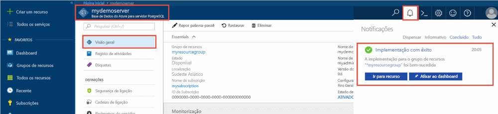
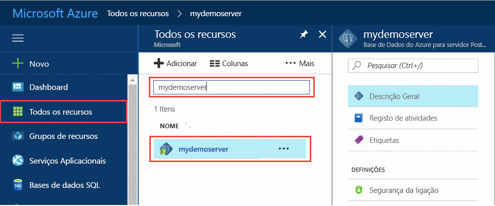
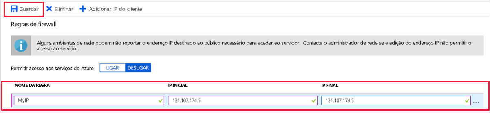
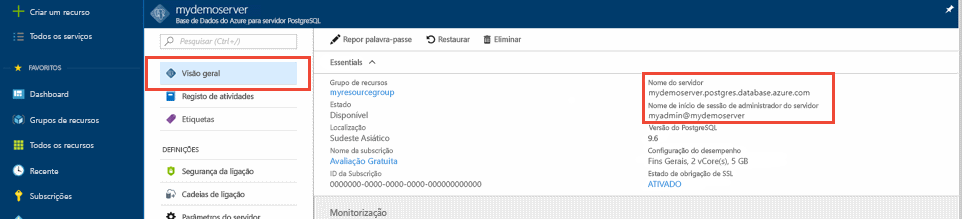

# <a name="quickstart-create-an-azure-database-for-postgresql-server-in-the-azure-portal"></a>Início Rápido: Criar um servidor da Base de Dados do Azure para PostgreSQL no portal do Azure

A Base de Dados do Azure para o PostgreSQL é um serviço gerido com o qual pode executar, gerir e dimensionar as bases de dados de elevada disponibilidade do PostgreSQL na cloud. Este Início Rápido mostra-lhe como criar um servidor da Base de Dados do Azure para PostgreSQL no portal do Azure em cerca de cinco minutos.

Se não tiver uma subscrição do Azure, crie uma [conta do Azure gratuita](https://azure.microsoft.com/free/) antes de começar.

## <a name="sign-in-to-the-azure-portal"></a>Iniciar sessão no portal do Azure
Abra o browser e aceda ao [portal do Azure](https://portal.azure.com/). Introduza as suas credenciais para iniciar sessão no portal. A vista predefinida é o dashboard de serviço.

## <a name="create-an-azure-database-for-postgresql-server"></a>Criar uma Base de Dados do Azure para o servidor PostgreSQL

É criado um servidor da Base de Dados do Azure para PostgreSQL com um conjunto de [recursos de armazenamento e computação](./concepts-pricing-tiers.md) configurado. O servidor é criado dentro de um [grupo de recursos do Azure](../azure-resource-manager/management/overview.md).

Para criar uma Base de Dados do Azure para o servidor PostgreSQL, siga os passos abaixo:
1. Selecione **criar um recurso** (+) no canto superior esquerdo do Portal.

2. Selecione **Bases de Dados** > **Base de Dados do Azure para PostgreSQL**.

    

3. Selecione a opção de implantação de **servidor único** .

   

4. Preencha o formulário **básico** com as seguintes informações:

    

    Definição|Valor sugerido|Descrição
    ---|---|---
    Subscrição|Nome da sua subscrição|A subscrição do Azure que quer utilizar para o servidor. Se tiver várias subscrições, escolha a subscrição na qual o recurso é cobrado.
    Grupo de recursos|*myresourcegroup*| Um nome de grupo de recursos novo ou um já existente na sua subscrição.
    Nome do servidor |*mydemoserver*|Um nome exclusivo que identifique a sua Base de Dados do Azure para o servidor PostgreSQL. O nome de domínio *postgres.database.azure.com* é acrescentado ao nome de servidor que indicar. O servidor só pode conter letras minúsculas, números e o caráter de hífen (-). Tem de conter, pelo menos, 3 a 63 carateres.
    Origem de dados | *Nenhum* | Selecione *nenhum* para criar um novo servidor do zero. (Selecione *Cópia de segurança* se estiver a criar um servidor a partir de uma cópia de segurança geo de um servidor da Base de Dados do Azure para PostgreSQL existente).
    Nome de usuário do administrador |*myadmin*| A sua própria conta de início de sessão quando se ligar ao servidor. O nome de início de sessão de administrador não pode ser **azure_superuser**, **azure_pg_admin**, **admin**, **administrator**, **root**, **guest** ou **public**. Não pode começar por **pg_** .
    Palavra-passe |A sua palavra-passe| Uma palavra-passe nova para a conta de administrador do servidor. Tem de conter entre 8 e 128 carateres. A sua palavra-passe tem de conter carateres de três das categorias seguintes: letras em maiúscula inglesas, letras em minúscula inglesas, números (0 a 9) e carateres não alfanuméricos (!, $, #, %, etc.).
    Localização|A região mais próxima dos seus utilizadores| A localização que esteja mais próxima dos seus utilizadores.
    Versão|A versão principal mais recente| A versão principal mais recente do PostgreSQL, a não ser que tenha requisitos específicos.
    Computação e armazenamento | **Fins Gerais**, **Geração 5**, **2 vCores**, **5 GB**, **7 dias**, **Geograficamente Redundante** | As configurações de computação, armazenamento e cópia de segurança do seu novo servidor. Selecione **Configurar servidor**. Em seguida, selecione a guia **uso geral** . *Gen 5*, *4 vCores*, *100 GB*e *7 dias* são os valores padrão para **geração de computação**, **vCore**, **armazenamento**e **período de retenção de backup**. Você pode deixar esses controles deslizantes como estão ou ajustá-los. Para ativar as cópias de segurança do servidor no armazenamento georredundante, selecione **Geograficamente Redundante** nas **Opções de Redundância da Cópia de Segurança**. Para guardar a seleção deste escalão de preço, selecione **OK**. A captura de ecrã seguinte captura estas seleções.

   > [!NOTE]
   > Considere o uso do tipo de preço básico se a computação leve e e/s forem adequadas para sua carga de trabalho. Observe que os servidores criados no tipo de preço básico não podem ser escalados posteriormente para Uso Geral ou com otimização de memória. Consulte a [página de preços](https://azure.microsoft.com/pricing/details/postgresql/) para obter mais informações.
   > 

    

5. Selecione **revisão + criar** para revisar suas seleções. Selecione **Criar** para aprovisionar o servidor. Esta operação poderá demorar alguns minutos.

6. Na barra de ferramentas, selecione o ícone **Notificações** (um sino) para monitorizar o processo de implementação. Uma vez concluída a implementação, pode selecionar **Afixar ao dashboard**, o que cria um mosaico para este servidor no dashboard do portal do Azure como um atalho para a página **Descrição geral** do servidor. Selecionar **Ir para recurso** abre a página **Descrição geral** do servidor.

    
   
   Por predefinição, é criada uma base de dados **postgres** no servidor. A base de dados [postgres](https://www.postgresql.org/docs/9.6/static/app-initdb.html) é uma base de dados predefinida que se destina a ser utilizada por utilizadores, utilitários e aplicações de terceiros. (A outra base de dados predefinida é **azure_maintenance**. A sua função é separar os processos de serviço geridos das ações dos utilizadores. Não pode aceder a esta base de dados.)

## <a name="configure-a-server-level-firewall-rule"></a>Configurar uma regra de firewall ao nível do servidor

A Base de Dados do Azure para o PostgreSQL cria uma firewall ao nível do servidor. Impede que as aplicações e ferramentas externas se liguem ao servidor e a quaisquer bases de dados no mesmo, a menos que crie uma regra de firewall para abrir a firewall aos endereços IP específicos. 

1. Depois de concluída a implementação, localize o seu servidor. Se necessário, pode procurá-lo. Por exemplo, no menu do lado esquerdo, selecione **Todos os recursos**. Insira o nome do servidor, como o exemplo, **mydemoserver**, para pesquisar o servidor recém-criado. Selecione o nome do servidor na lista de resultados de pesquisa. É apresentada a página **Descrição Geral** do servidor, que fornece opções para configuração adicional.
 
    

2. Na página do servidor, selecione **Segurança da ligação**.

3. Em **Regras da firewall**, na coluna **Nome da Regra**, selecione a caixa de texto em branco para começar a criar a regra da firewall. 

   Preencha as caixas de texto com um nome e o intervalo IP inicial e final dos clientes que irão aceder ao seu servidor. Se for um IP único, utilize o mesmo valor para o IP inicial e o IP final.

   
     

4. Na barra de ferramentas superior da página **Segurança da ligação**, selecione **Guardar**. Antes de continuar, aguarde até que a notificação apareça e indique que a atualização da segurança da ligação foi concluída com êxito.

    > [!NOTE]
    > As ligações à Base de Dados do Azure para o servidor PostgreSQL comunicam através da porta 5432. Quando tenta ligar a partir de uma rede empresarial, a firewall da rede poderá não permitir o tráfego de saída através da porta 5432. Se for este o caso, não pode ligar ao servidor, a menos que o seu departamento de TI abra a porta 5432.
    >

## <a name="get-the-connection-information"></a>Obter as informações da ligação

Quando cria a Base de Dados do Azure para o servidor PostgreSQL, também é criada uma base de dados predefinida, com o nome **postgres**. Para ligar ao seu servidor de bases de dados, precisa do nome completo do servidor e as credenciais de início de sessão de administrador. Poderá ter apontado esses valores anteriormente no artigo Guia de Introdução. Se não, pode encontrar facilmente o nome do servidor e as informações de início de sessão na página **Descrição Geral** do servidor, no portal.

Abra a página **Descrição Geral** do servidor. Anote o **Nome do servidor** e o **Nome de início de sessão de administrador do servidor**. Coloque o cursor sobre cada campo e o símbolo de cópia é apresentado à direita do texto. Selecione o símbolo de cópia conforme necessário para copiar os valores.

 

## <a name="connect-to-the-postgresql-database-using-psql"></a>Ligar à base de dados do PostgreSQL com psql

Estão disponíveis diversas aplicações para ligar à sua Base de Dados do Azure para o servidor PostSQL. Se o seu computador cliente tiver o PostgreSQL instalado, pode utilizar uma instância local de [psql](https://www.postgresql.org/docs/current/static/app-psql.html) para ligar a um servidor PostgreSQL do Azure. Vamos utilizar agora o utilitário da linha de comandos psql para ligar ao servidor PostgreSQL do Azure.

1. Execute o comando psql seguinte para ligar a uma Base de Dados do Azure para o servidor PostgreSQL
   ```bash
   psql --host=<servername> --port=<port> --username=<user@servername> --dbname=<dbname>
   ```

   Por exemplo, o comando seguinte liga à base de dados predefinida com o nome **postgres** no servidor PostgreSQL **mydemoserver.postgres.database.azure.com** com as credenciais de acesso. Introduza o `<server_admin_password>` que escolheu quando lhe for pedida a palavra-passe.
  
   ```bash
   psql --host=mydemoserver.postgres.database.azure.com --port=5432 --username=myadmin@mydemoserver --dbname=postgres
   ```

   > [!TIP]
   > Se você preferir usar um caminho de URL para se conectar ao Postgres, codifique a URL do @ Sign no nome de usuário com `%40`. Por exemplo, a cadeia de conexão para PSQL seria, 
   > ```
   > psql postgresql://myadmin%40mydemoserver@mydemoserver.postgres.database.azure.com:5432/postgres
   > ```

   Quando estiver ligado, o utilitário psql apresenta uma linha de comandos postgres onde escreve os comandos de sql. Na saída da ligação inicial, poderá aparecer um aviso, porque o psql que está a utilizar pode ter uma versão diferente da versão do servidor da Base de Dados do Azure para PostgreSQL. 

   Exemplo de saída psql:
   ```bash
   psql (9.5.7, server 9.6.2)
   WARNING: psql major version 9.5, server major version 9.6.
    Some psql features might not work.
    SSL connection (protocol: TLSv1.2, cipher: ECDHE-RSA-AES256-SHA384, bits: 256, compression: off)
   Type "help" for help.

   postgres=> 
   ```

   > [!TIP]
   > Se a firewall não estiver configurada para permitir o endereço IP do seu cliente, ocorre o seguinte erro:
   > 
   > "psql: FATAL: nenhuma entrada pg_hba. conf para o host `<IP address>`, usuário" MyAdmin ", banco de dados" postgres ", SSL em FATAL: a conexão SSL é necessária. Especifique as opções de SSL e volte a tentar.
   > 
   > Confirme se o IP do seu cliente é permitido na etapa regras de firewall acima.

2. Crie uma base de dados vazia com o nome "mypgsqldb" ao escrever o seguinte comando:
    ```bash
    CREATE DATABASE mypgsqldb;
    ```

3. Na linha de comandos, execute o comando seguinte para mudar a ligação para a base de dados **mypgsqldb** recentemente criada:
    ```bash
    \c mypgsqldb
    ```

4. Escreva `\q` e selecione a tecla Enter para sair do psql. 

Ligou-se ao servidor da Base de Dados do Azure para PostgreSQL através do psql e criou uma base de dados de utilizador em branco. Avance para a secção seguinte para se ligar com outra ferramenta comum, pgAdmin.

## <a name="connect-to-the-postgresql-server-using-pgadmin"></a>Ligar-se ao Servidor PostgreSQL com pgAdmin

pgAdmin é uma ferramenta de código aberto utilizada com o PostgreSQL. Pode instalar a pgAdmin a partir do site da [pgAdmin](https://www.pgadmin.org/). A versão de pgAdmin que estiver a utilizar poderá ser diferente da utilizada neste Início Rápido. Leia a documentação de pgAdmin se precisar de orientação adicional.

1. Abra a aplicação pgAdmin no computador cliente.

2. Na barra de ferramentas, vá a **Objeto**, paire o rato sobre **Criar** e selecione **Servidor**.

3. Na caixa de diálogo **Criar - Servidor**, no separador **Geral**, introduza um nome amigável exclusivo para o servidor, tal como **mydemoserver**.

    

4. Na caixa de diálogo **Criar - Servidor**, no separador **Ligação**, preencha a tabela de definições.

   

    parâmetro pgAdmin |Valor|Descrição
    ---|---|---
    Nome/endereço do anfitrião | Nome do servidor | O valor do nome de servidor que foi utilizado quando criou anteriormente a Base de Dados do Azure para o servidor PostgreSQL. O nosso servidor de exemplo é **mydemoserver.postgres.database.azure.com.** Utilize o nome de domínio completamente qualificado ( **\*.postgres.database.azure.com**), conforme mostrado no exemplo. Se não se lembrar do nome do servidor, siga os passos na secção anterior para obter as informações da ligação. 
    Porta | 5432 | A porta a utilizar quando se liga à Base de Dados do Azure para o servidor PostgreSQL. 
    Base de dados de manutenção | *postgres* | O nome predefinido da base de dados gerado pelo sistema.
    Nome de utilizador | Nome de início de sessão de administrador do servidor | O nome de utilizador de início de sessão de administrador do servidor que foi fornecido quando criou a Base de Dados do Azure para o servidor PostgreSQL anteriormente. Se não se lembrar do nome de utilizador, siga os passos na secção anterior para obter as informações da ligação. O formato é *username\@ServerName*.
    Palavra-passe | A sua palavra-passe de administrador | A palavra-passe que escolheu quando criou o servidor anteriormente neste Início Rápido.
    Função | Deixar em branco | Não é necessário indicar um nome de função neste momento. Deixe o campo em branco.
    Modo SSL | *Requerer* | Você pode definir o modo SSL na guia SSL do pgAdmin. Por padrão, todos os servidores do banco de dados do Azure para PostgreSQL são criados com a imposição de SSL ativada. Para desativar a imposição de SSL, veja [Impor SSL](./concepts-ssl-connection-security.md).
    
5. Selecione **Guardar**.

6. No painel **Browser** do lado esquerdo, expanda o nó **Servidores**. Selecione o servidor, por exemplo, **mydemoserver**, para se conectar a ele.

7. Expanda o nó de servidor e, em seguida, expanda **Bases de Dados** sob o mesmo. A lista deve incluir a sua base de dados *postgres* existente e quaisquer outras bases de dados que tenha criado. Pode criar várias bases de dados por servidor com a Base de Dados do Azure para PostgreSQL.

8. Clique com o botão direito do mouse em **bancos**de dados, selecione o menu **criar** e, em seguida, selecione **Database**.

9. Insira um nome de banco de dados de sua escolha no campo de **banco de dados** , como **mypgsqldb2**.

10. Selecione o **Proprietário** da base de dados na caixa de listagem. Selecione o nome de logon do administrador do servidor, como o exemplo **meu administrador**.

    

11. Seleione **Guardar** para criar uma base de dados vazia nova.

12. No painel **Browser**, pode ver a base de dados que criou na lista de bases de dados, no nome do seu servidor.


## <a name="clean-up-resources"></a>Limpar recursos
Pode limpar os recursos que criou no Início Rápido de duas formas. Pode eliminar o [grupo de recursos do Azure](../azure-resource-manager/management/overview.md), que inclui todos os recursos no grupo de recursos. Se quiser manter os outros recursos intactos, elimine apenas o recurso do servidor.

> [!TIP]
> Outros Guias de Introdução desta coleção compilados com base neste Guia de Introdução. Se pretender continuar a trabalhar com Guias de Introdução, não limpe os recursos que criou neste Guia de Introdução. Se não quiser continuar, siga estes passos para eliminar os recursos criados por este Início Rápido no portal.

Para eliminar o grupo de recursos inteiro, incluindo o servidor criado recentemente:
1. Localize o grupo de recursos no portal. No menu do lado esquerda, selecione **Grupos de recursos**. Em seguida, selecione o nome do grupo de recursos, como o exemplo **myresourcegroup**.

2. Na página do grupo de recursos, selecione **Eliminar**. Insira o nome do grupo de recursos, como o exemplo, **MyResource**Group, na caixa de texto para confirmar a exclusão. Selecione **Eliminar**.

Para eliminar o servidor criado recentemente:
1. Localize o seu servidor no portal, se não estiver aberto. No menu do lado esquerdo, selecione **Todos os recursos**. Em seguida, procure o servidor que criou.

2. Na página **Descrição geral**, selecione **Eliminar**.

    

3. Confirme o nome do servidor que quer eliminar e veja as bases de dados incluídas que são afetadas. Insira o nome do servidor na caixa de texto, como o exemplo **mydemoserver**. Selecione **Eliminar**.

## <a name="next-steps"></a>Passos seguintes
> [!div class="nextstepaction"]
> [Migrar a base de dados com Exportar e Importar](./howto-migrate-using-export-and-import.md)
