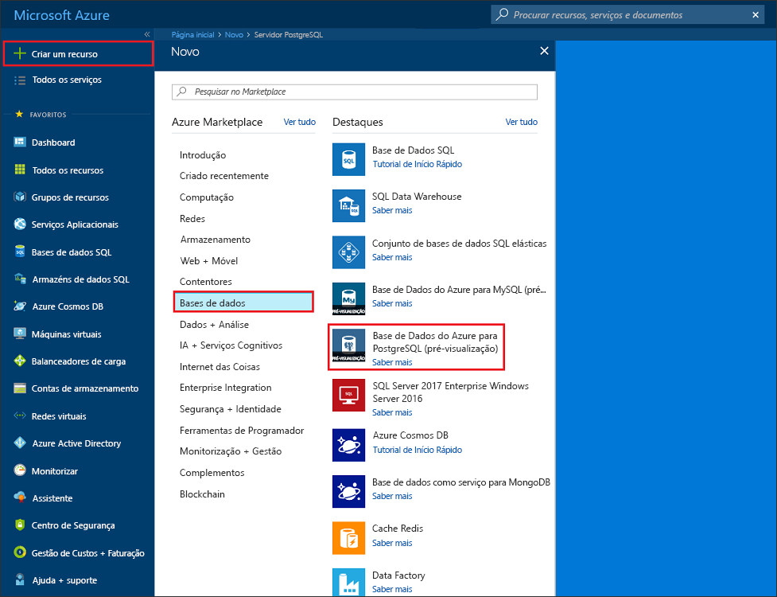
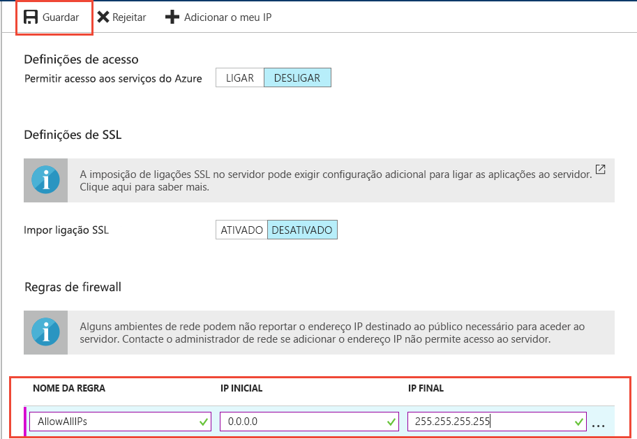
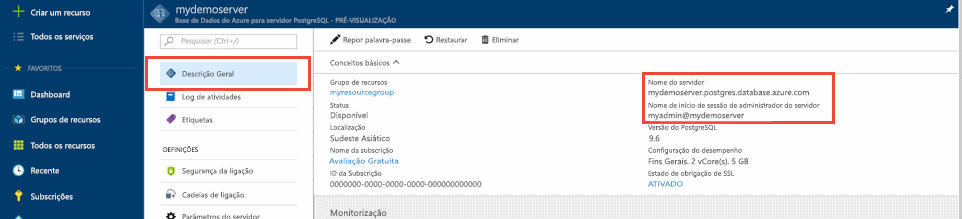

# <a name="tutorial-design-an-azure-database-for-postgresql---single-server-using-the-azure-portal"></a>Tutorial: Conceber uma base de dados do Azure para PostgreSQL - servidor único com o portal do Azure

A Base de Dados do Azure para o PostgreSQL é um serviço gerido que lhe permite executar, gerir e dimensionar as bases de dados de alta disponibilidade do PostgreSQL na cloud. No portal do Azure, pode facilmente gerir o seu servidor e criar uma base de dados.

Neste tutorial, irá utilizar o Portal do Azure para aprender a:
> [!div class="checklist"]
> * Criar uma Base de Dados do Azure para o servidor PostgreSQL
> * Configurar a firewall do servidor
> * Utilize o utilitário [**psql**](https://www.postgresql.org/docs/9.6/static/app-psql.html) para criar uma base de dados
> * Carregar os dados de exemplo
> * Consultar dados
> * Atualizar dados
> * Restaurar dados

## <a name="prerequisites"></a>Pré-requisitos
Se não tiver uma subscrição do Azure, crie uma conta [gratuita](https://azure.microsoft.com/free/) antes de começar.

## <a name="create-an-azure-database-for-postgresql"></a>Criar uma Base de Dados do Azure para o PostgreSQL

É criada uma Base de Dados do Azure para o servidor PostgreSQL com um conjunto definido de [recursos de armazenamento e computação](./concepts-compute-unit-and-storage.md). O servidor é criado dentro de um [grupo de recursos do Azure](../azure-resource-manager/resource-group-overview.md).

Siga estes passos para criar uma Base de Dados do Azure para o servidor PostgreSQL:
1. Clique em **Criar um recurso**, no canto superior esquerdo do portal do Azure.
2. Selecione **Bases de Dados**, na página **Nova**, e selecione **Base de Dados do Azure para o PostgreSQL**, na página **Bases de Dados**.
   

3. Selecione o **único servidor** opção de implementação.

   

4. Preencha os **Noções básicas** formulário com as seguintes informações:

    

    Definição|Valor sugerido|Descrição
    ---|---|---
    Subscrição|Nome da sua subscrição|A subscrição do Azure que quer utilizar para o servidor. Se tiver várias subscrições, escolha a subscrição na qual o recurso é cobrado.
    Grupo de recursos|*myresourcegroup*| Um nome de grupo de recursos novo ou um já existente na sua subscrição.
    Nome do servidor |*mydemoserver*|Um nome exclusivo que identifique a sua Base de Dados do Azure para o servidor PostgreSQL. O nome de domínio *postgres.database.azure.com* é acrescentado ao nome de servidor que indicar. O servidor só pode conter letras minúsculas, números e o caráter de hífen (-). Tem de conter, pelo menos, 3 a 63 carateres.
    Origem de dados | *Nenhum* | Selecione *None* para criar um novo servidor a partir do zero. (Selecione *Cópia de segurança* se estiver a criar um servidor a partir de uma cópia de segurança geo de um servidor da Base de Dados do Azure para PostgreSQL existente).
    Nome de utilizador administrador |*myadmin*| A sua própria conta de início de sessão quando se ligar ao servidor. O nome de início de sessão de administrador não pode ser **azure_superuser**, **azure_pg_admin**, **admin**, **administrator**, **root**, **guest** ou **public**. Não pode começar por **pg_** .
    Palavra-passe |A sua palavra-passe| Uma palavra-passe nova para a conta de administrador do servidor. Tem de conter entre 8 e 128 carateres. A palavra-passe tem de conter carateres de três das seguintes categorias: Letras em maiúscula letras, em minúscula inglesas, números (0 a 9) e carateres não alfanuméricos (!, $, #, %, etc.).
    Location|A região mais próxima dos seus utilizadores| A localização que esteja mais próxima dos seus utilizadores.
    Version|A versão principal mais recente| A versão principal mais recente do PostgreSQL, a não ser que tenha requisitos específicos.
    Computação + armazenamento | **Fins Gerais**, **Geração 5**, **2 vCores**, **5 GB**, **7 dias**, **Geograficamente Redundante** | As configurações de computação, armazenamento e cópia de segurança do seu novo servidor. Selecione **configurar servidor**. Em seguida, selecione o separador **Fins Gerais**. *Fins gerais 5*, *4 vCores*, *100 GB*, e *7 dias* são os valores predefinidos para **geração de computação**,  **vCore**, **armazenamento**, e **período de retenção de cópia de segurança**. Pode deixar os controlos de deslize, tal como estão ou ajustá-los. Para ativar as cópias de segurança do servidor no armazenamento georredundante, selecione **Geograficamente Redundante** nas **Opções de Redundância da Cópia de Segurança**. Para guardar a seleção deste escalão de preço, selecione **OK**. A captura de ecrã seguinte captura estas seleções.

   > [!NOTE]
   > Considere utilizar o escalão de preços básico se capacidades de computação e e/s são adequadas para sua carga de trabalho. Tenha em atenção que os servidores que criou no escalão de preço básico mais tarde não podem ser ampliadas para fins gerais ou com otimização de memória. Consulte a [página de preços](https://azure.microsoft.com/pricing/details/postgresql/) para obter mais informações.
   > 

    

    > [!TIP]
    > Com o **aumento automático** ativado para o seu servidor aumenta o armazenamento, quando está prestes a atingir o limite alocado, sem afetar a carga de trabalho.

5. Selecione **rever + criar** para rever as suas seleções. Selecione **Criar** para aprovisionar o servidor. Esta operação poderá demorar alguns minutos.

6. Na barra de ferramentas, selecione o ícone **Notificações** (um sino) para monitorizar o processo de implementação. Uma vez concluída a implementação, pode selecionar **Afixar ao dashboard**, o que cria um mosaico para este servidor no dashboard do portal do Azure como um atalho para a página **Descrição geral** do servidor. Selecionar **Ir para recurso** abre a página **Descrição geral** do servidor.

    
   
   Por predefinição, é criada uma base de dados **postgres** no servidor. A base de dados [postgres](https://www.postgresql.org/docs/9.6/static/app-initdb.html) é uma base de dados predefinida que se destina a ser utilizada por utilizadores, utilitários e aplicações de terceiros. (A outra base de dados predefinida é **azure_maintenance**. A sua função é separar os processos de serviço geridos das ações dos utilizadores. Não pode aceder a esta base de dados.)


## <a name="configure-a-server-level-firewall-rule"></a>Configurar uma regra de firewall ao nível do servidor

O serviço Base de Dados do Azure para PostgreSQL utiliza uma firewall ao nível do servidor. Por predefinição, esta firewall impede que todas as aplicações e ferramentas externas se liguem ao servidor e a quaisquer bases de dados no servidor, a menos que seja criada uma regra de firewall para abrir a firewall a uma gama de endereços IP específicos. 

1. Uma vez concluída a implementação, clique em **Todos os Recursos** no menu da esquerda e escreva o nome **mydemoserver** para procurar o servidor que acabou de criar. Clique no nome do servidor listado no resultado da pesquisa. É apresentada a página **Descrição Geral** do servidor, que fornece opções para configuração adicional.

   

2. Na página do servidor, selecione **Segurança da ligação**. 

3. Clique na caixa de texto em **Nome da Regra** e adicione uma nova regra de firewall para colocar na lista de permissões o intervalo IP para conectividade. Introduza o seu intervalo de IP. Clique em **Guardar**.

   

4. Clique em **Guardar** e, em seguida, no **X** para fechar a página **Segurança das ligações**.

   > [!NOTE]
   > O servidor PostgreSQL do Azure comunica através da porta 5432. Se estiver a tentar ligar a partir de uma rede empresarial, o tráfego de saída através da porta 5432 poderá não ser permitido pela firewall da rede. Se assim for, não poderá ligar ao servidor da Base de Dados SQL do Azure, a menos que o departamento de TI abra a porta 5432.
   >

## <a name="get-the-connection-information"></a>Obter as informações da ligação

Quando criou o servidor da Base de Dados do Azure para PostgreSQL, também criou a base de dados **postgres** predefinida. Para ligar ao servidor da base de dados, terá de fornecer as credenciais de acesso e as informações de anfitrião.

1. No menu da esquerda no portal do Azure, clique em **Todos os recursos** e procure o servidor que acabou de criar.

   

2. Clique no nome do servidor **mydemoserver**.

3. Selecione a página **Descrição Geral** do servidor. Anote o **Nome do servidor** e **Nome de início de sessão de administrador do servidor**.

   


## <a name="connect-to-postgresql-database-using-psql-in-cloud-shell"></a>Ligar-se à base de dados do PostgreSQL com o psql no Cloud Shell

Agora, vamos utilizar o utilitário da linha de comandos [psql](https://www.postgresql.org/docs/9.6/static/app-psql.html) para ligar ao servidor da Base de Dados do Azure para PostgreSQL. 
1. Inicie o Azure Cloud Shell através do ícone de terminal no painel de navegação superior.

   

2. O Azure Cloud Shell é aberto no browser, onde poderá escrever os comandos bash.

   

3. Na linha de comandos do Cloud Shell, estabeleça ligação à Base de Dados do Azure para o servidor PostgreSQL com os comandos psql. O formato seguinte é utilizado para estabelecer ligação a uma Base de Dados do Azure para o servidor PostgreSQL com o utilitário [psql](https://www.postgresql.org/docs/9.6/static/app-psql.html):
   ```bash
   psql --host=<myserver> --port=<port> --username=<server admin login> --dbname=<database name>
   ```

   Por exemplo, o comando seguinte liga à base de dados predefinida com o nome **postgres** no servidor PostgreSQL **mydemoserver.postgres.database.azure.com**, com as credenciais de acesso. Quando lhe for pedido, introduza a palavra-passe de administrador do servidor.

   ```bash
   psql --host=mydemoserver.postgres.database.azure.com --port=5432 --username=myadmin@mydemoserver --dbname=postgres
   ```

## <a name="create-a-new-database"></a>Criar uma nova base de dados
Assim que estiver ligado ao servidor, crie uma base de dados vazia na linha de comandos.
```bash
CREATE DATABASE mypgsqldb;
```

Na linha de comandos, execute o comando seguinte para mudar a ligação para a base de dados **mypgsqldb** recentemente criada.
```bash
\c mypgsqldb
```
## <a name="create-tables-in-the-database"></a>Criar tabelas na base de dados
Agora que sabe como ligar à Base de Dados do Azure para PostgreSQL, pode concluir algumas tarefas básicas:

Em primeiro lugar, crie uma tabela e carregue-a com alguns dados. Vamos criar uma tabela que controla as informações de inventário com este código SQL:
```sql
CREATE TABLE inventory (
    id serial PRIMARY KEY, 
    name VARCHAR(50), 
    quantity INTEGER
);
```

Agora pode ver a tabela criada recentemente na lista de tabelas ao escrever:
```sql
\dt
```

## <a name="load-data-into-the-tables"></a>Carregar dados para as tabelas
Agora que tem uma tabela, insira alguns dados na mesma. Na janela da linha de comandos aberta, execute a seguinte consulta para inserir algumas linhas de dados.
```sql
INSERT INTO inventory (id, name, quantity) VALUES (1, 'banana', 150); 
INSERT INTO inventory (id, name, quantity) VALUES (2, 'orange', 154);
```

Tem agora duas linhas de dados de exemplo na tabela de inventário que criou anteriormente.

## <a name="query-and-update-the-data-in-the-tables"></a>Consultar e atualizar os dados nas tabelas
Execute a seguinte consulta para obter informações da tabela de base de dados de inventário. 
```sql
SELECT * FROM inventory;
```

Também pode atualizar os dados nas tabelas.
```sql
UPDATE inventory SET quantity = 200 WHERE name = 'banana';
```

Pode ver os valores atualizados ao obter os dados.
```sql
SELECT * FROM inventory;
```

## <a name="restore-data-to-a-previous-point-in-time"></a>Restaurar dados para um ponto anterior no tempo
Imagine que eliminou acidentalmente esta tabela. Esta situação é algo de que não é fácil recuperar. A Base de Dados do Azure para PostgreSQL permite-lhe regressar a qualquer ponto anterior no tempo para o qual o seu servidor tenha cópias de segurança (determinado pelo período de retenção da cópia de segurança configurado por si) e restaurar este ponto anterior no tempo num novo servidor. Pode utilizar este servidor novo para recuperar os dados eliminados. Os passos seguintes restauram o servidor **mydemoserver** para um ponto anterior à adição da tabela de inventário.

1. Na página de **Descrição Geral** da Base de Dados do Azure para PostgreSQL para o seu servidor, clique em **Restaurar** na barra de ferramentas. É aberta a página **Restaurar**.

   

2. Preencha o formulário **Restaurar** com as informações necessárias:

   

   - **Ponto de restauro**: Selecione um ponto anterior no tempo que ocorre antes do servidor foi alterado
   - **Servidor de destino**: Forneça um novo nome de servidor que pretende restaurar para
   - **Localização**: Não é possível selecionar a região, por predefinição é igual ao servidor de origem
   - **Escalão de preço**: Não é possível alterar este valor quando restaurar um servidor. É igual ao servidor de origem. 
3. Clique em **OK** para [restaurar o servidor para um ponto anterior no tempo](./howto-restore-server-portal.md) antes da eliminação da tabela. Restaurar um servidor para outro ponto anterior no tempo cria um novo servidor duplicado como servidor original a partir do ponto anterior no tempo que especificar, desde que esteja dentro do período de retenção do seu [escalão de preço](./concepts-pricing-tiers.md).

## <a name="next-steps"></a>Passos Seguintes
Neste tutorial, aprendeu a utilizar o portal do Azure e outros utilitários para:
> [!div class="checklist"]
> * Criar uma Base de Dados do Azure para o servidor PostgreSQL
> * Configurar a firewall do servidor
> * Utilize o utilitário [**psql**](https://www.postgresql.org/docs/9.6/static/app-psql.html) para criar uma base de dados
> * Carregar os dados de exemplo
> * Consultar dados
> * Atualizar dados
> * Restaurar dados

Em seguida, para saber como utilizar a CLI do Azure para realizar tarefas semelhantes, reveja este tutorial: [Conceber a sua primeira base de dados do Azure para PostgreSQL com a CLI do Azure](tutorial-design-database-using-azure-cli.md)
