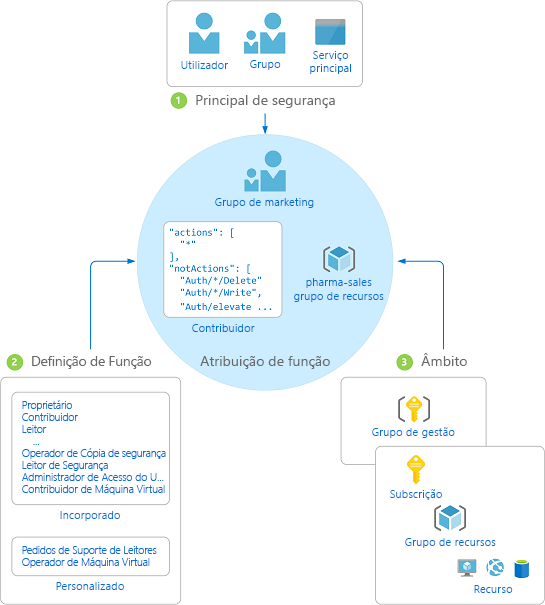

# O que é o controlo de acesso baseado em funções do Azure (Azure RBAC)?

A gestão de acesso para recursos na cloud é uma função crítica para qualquer organização que está a utilizar a cloud. O controlo de acesso baseado em funções (Azure RBAC) ajuda-o a gerir quem tem acesso aos recursos Azure, o que podem fazer com esses recursos e a que áreas têm acesso.

O Azure RBAC é um sistema de autorização construído na [Azure Resource Manager](../azure-resource-manager/management/overview.md) que fornece uma gestão de acesso fino dos recursos Azure.

Este vídeo fornece uma visão geral rápida do Azure RBAC.

>[!VIDEO https://www.youtube.com/embed/Dzhm-garKBM]

## O que posso fazer com Azure RBAC?

Aqui estão alguns exemplos do que pode fazer com a Azure RBAC:

- Permitir a um utilizador gerir máquinas virtuais numa subscrição e a outro utilizador gerir redes virtuais
- Permitir a um grupo DBA gerir bases de dados SQL numa subscrição
- Permitir a um utilizador gerir todos os recursos num grupo de recursos, como máquinas virtuais, sites e sub-redes
- Permitir a uma aplicação aceder a todos os recursos num grupo de recursos

## Como funciona o Azure RBAC

A forma como controla o acesso aos recursos usando o Azure RBAC é criar atribuições de papéis. Este é um conceito chave para entender – é como as permissões são aplicadas. Uma atribuição de função é composta por três elementos: principal de segurança, definição de função e âmbito.

### Principal de segurança

Um *principal de segurança* é um objeto que representa um utilizador, grupo, principal de serviço ou identidade gerida que solicita o acesso aos recursos do Azure. Pode atribuir um papel a qualquer um destes diretores de segurança.

### Definição de função

Uma *definição de função* é uma coleção de permissões. Normalmente chama-se *um papel.* Uma definição de função lista as operações que podem ser efetuadas, por exemplo, ler, escrever e eliminar. As funções podem ser de nível elevado, como proprietário, ou específicas, como leitor de máquina virtual.

O Azure inclui vários [papéis incorporados](built-in-roles.md) que podes usar. Por exemplo, a função [Contribuidor de Máquina Virtual](built-in-roles.md#virtual-machine-contributor) permite a um utilizador criar e gerir máquinas virtuais. Se as funções incorporadas não corresponderem às necessidades específicas da sua organização, pode criar os seus [próprios papéis personalizados Azure.](custom-roles.md)

Este vídeo fornece uma visão geral rápida de papéis incorporados e papéis personalizados.

>[!VIDEO https://www.youtube.com/embed/I1mefHptRgo]

O Azure tem operações de dados que lhe permitem conceder acesso a dados dentro de um objeto. Por exemplo, se um utilizador tiver acesso a dados de leitura a uma conta de armazenamento, pode ler os blobs ou as mensagens nessa conta de armazenamento.

Para obter mais informações, consulte [as definições de funções do Azure.](role-definitions.md)

### Âmbito

*Âmbito* é o conjunto de recursos a que o acesso se aplica. Quando atribui uma função, pode limitar ainda mais as ações permitidas ao definir um âmbito. Isto é útil se quiser fazer de alguém um [Colaborador do Website,](built-in-roles.md#website-contributor)mas apenas para um grupo de recursos.

Em Azure, pode especificar um âmbito a quatro níveis: [grupo de gestão,](../governance/management-groups/overview.md)subscrição, [grupo de recursos](../azure-resource-manager/management/overview.md#resource-groups)ou recurso. Os âmbitos são estruturados numa relação de principal-subordinado. Pode atribuir funções em qualquer um destes níveis de âmbito.

Para obter mais informações sobre o âmbito, consulte [o âmbito de aplicação.](scope-overview.md)

### Atribuições de funções

Uma *atribuição de funções* é o processo de anexação de uma definição de papel a um utilizador, grupo, principal de serviço ou identidade gerida num determinado âmbito para a concessão de acesso. O acesso é concedido ao criar uma atribuição de função e o acesso é revogado ao remover uma atribuição de função.

O diagrama seguinte mostra um exemplo de uma atribuição de função. Neste exemplo, foi atribuída a função [Contribuidor](built-in-roles.md#contributor) ao grupo Marketing para o grupo de recursos de vendas farmacêuticas. Isto significa que os utilizadores no grupo Marketing podem criar ou gerir qualquer recurso do Azure no grupo de recursos de vendas farmacêuticas. Os utilizadores do grupo Marketing não têm acesso aos recursos fora o grupo de recursos de vendas farmacêuticas, a menos que façam parte de outra atribuição de função.

Pode criar atribuições de funções no portal do Azure, CLI do Azure, Azure PowerShell, SDKs do Azure ou APIs REST.

Para obter mais informações, consulte [Passos para adicionar uma atribuição de funções](role-assignments-steps.md).

## Atribuições múltiplas de papéis

Então, o que acontece se tiver várias atribuições de papéis sobrepostos? O Azure RBAC é um modelo aditivo, por isso as suas permissões eficazes são a soma das suas atribuições de papel. Considere o exemplo a seguir quando um utilizador recebe o papel de Contribuinte no âmbito de subscrição e a função Reader num grupo de recursos. A soma das permissões do Contribuinte e das permissões do Leitor é efetivamente a função contribuinte para o grupo de recursos. Portanto, neste caso, a atribuição de funções reader não tem impacto.

## Atribuições de negação

Anteriormente, o Azure RBAC era um modelo só de admissão sem qualquer negação, mas agora o Azure RBAC suporta a negação de atribuições de forma limitada. Semelhante a uma atribuição de funções, uma *atribuição de negação* anexa um conjunto de ações de negação a um utilizador, grupo, principal de serviço ou identidade gerida num determinado âmbito para o propósito de negar o acesso. Uma atribuição de funções define um conjunto de ações que são *permitidas,* enquanto uma atribuição de negação define um conjunto de ações que não são *permitidas*. Por outras palavras, as atribuições de negação impedem os utilizadores de executarem ações especificadas, mesmo que uma atribuição de função lhes conceda acesso. As atribuições de negação têm precedência sobre as atribuições de funções.

Para obter mais informações, consulte [Understand Azure negar atribuições.](deny-assignments.md)

## Como o Azure RBAC determina se um utilizador tem acesso a um recurso

Seguem-se os passos de alto nível que o Azure RBAC utiliza para determinar se tem acesso a um recurso no plano de gestão. Isto pode ser útil para compreender se estiver a tentar resolver um problema de acesso.

1. Um utilizador (ou principal de serviço) obtém um token para o Azure Resource Manager.

    O token inclui as associações a grupos do utilizador (incluindo as associações de grupo transitivas).

1. O utilizador faz uma chamada da API de REST para o Azure Resource Manager com o token anexado.

1. O Azure Resource Manager obtém todas as atribuições de função e de negação que se aplicam ao recurso no qual a ação é executada.

1. O Azure Resource Manager restringe as atribuições de funções que se aplicam a este utilizador ou ao respetivo grupo e determina que funções o utilizador tem para este recurso.

1. O Azure Resource Manager determina se a ação na chamada de API está incluída nas funções que utilizador tem para este recurso.

1. Se o utilizador não tiver um papel na ação no âmbito solicitado, o acesso não é concedido. Caso contrário, o Azure Resource Manager verifica se uma atribuição de negação se aplica.

1. Se uma atribuição de negação se aplicar, o acesso é bloqueado. Caso contrário, o acesso é concedido.

## Requisitos de licença

[!INCLUDE [Azure AD free license](../../includes/active-directory-free-license.md)]

## Passos seguintes

- [Adicionar ou remover atribuições de funções do Azure com o portal do Azure](role-assignments-portal.md)
- [Compreender as diferentes funções](rbac-and-directory-admin-roles.md)
- [Cloud Adopt Framework: Gestão do acesso a recursos em Azure](/azure/cloud-adoption-framework/govern/resource-consistency/resource-access-management)
