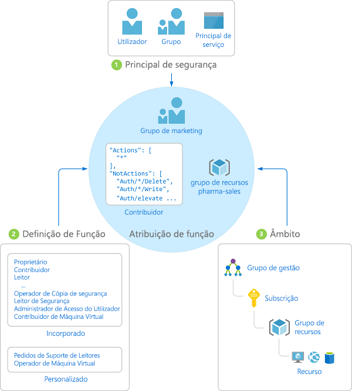

# O que é o RBAC (controle de acesso baseado em função) para recursos do Azure?

A gestão de acesso para recursos na cloud é uma função crítica para qualquer organização que está a utilizar a cloud. O controlo de acesso baseado em funções (RBAC) ajuda-o a gerir quem tem acesso aos recursos do Azure, o que fazem com esses recursos e a que áreas têm acesso.

O RBAC é um sistema de autorização criado em [Azure Resource Manager](../azure-resource-manager/resource-group-overview.md) que fornece gerenciamento de acesso refinado de recursos do Azure.

## O que posso fazer com o RBAC?

Seguem-se alguns exemplos do que pode fazer com o RBAC:

- Permitir a um utilizador gerir máquinas virtuais numa subscrição e a outro utilizador gerir redes virtuais
- Permitir a um grupo DBA gerir bases de dados SQL numa subscrição
- Permitir a um utilizador gerir todos os recursos num grupo de recursos, como máquinas virtuais, sites e sub-redes
- Permitir a uma aplicação aceder a todos os recursos num grupo de recursos

## Melhor prática para utilizar o RBAC

Ao utilizar o RBAC, pode segregar funções na sua equipa e conceder apenas a quantidade de acesso a utilizadores que precisam para desempenhar as suas funções. Em vez de dar a todas as pessoas permissões sem restrições na sua subscrição do Azure ou recursos, pode permitir apenas determinadas ações num âmbito específico.

Quando planear a estratégia de controlo de acesso, é boa prática conceder aos utilizadores o privilégio menor de que precisam para trabalhar. O diagrama seguinte mostra um padrão sugerido para utilizar o RBAC.

## Como funciona o RBAC

A forma de controlar o acesso a recursos com o RBAC é criar atribuições de funções. Este é um conceito fundamental para compreender de que forma as permissões são impostas. Uma atribuição de função é composta por três elementos: principal de segurança, definição de função e âmbito.

### Principal de segurança

Uma *entidade de segurança* é um objeto que representa um usuário, grupo, entidade de serviço ou identidade gerenciada que está solicitando acesso aos recursos do Azure.

- Utilizador – Um indivíduo que tem um perfil no Azure Active Directory. Também pode atribuir funções a utilizadores noutros inquilinos. Para obter informações sobre utilizadores noutras organizações, veja [Azure Active Directory B2B](../active-directory/b2b/what-is-b2b.md).
- Grupo – Um conjunto de utilizadores criado no Azure Active Directory. Quando atribui uma função a um grupo, todos os utilizadores nesse grupo têm essa função. 
- Principal de serviço – Uma identidade de segurança utilizada por aplicações ou serviços para aceder a recursos específicos do Azure. Pode considerá-lo como uma *identidade de utilizador* (nome de utilizador e palavra-passe ou certificado) para uma aplicação.
- Identidade gerenciada-uma identidade no Azure Active Directory que é gerenciada automaticamente pelo Azure. Normalmente, você usa [identidades gerenciadas](../active-directory/managed-identities-azure-resources/overview.md) ao desenvolver aplicativos de nuvem para gerenciar as credenciais para autenticação nos serviços do Azure.

### Definição de função

Uma *definição de função* é uma coleção de permissões. Por vezes é denominada apenas *função*. Uma definição de função lista as operações que podem ser efetuadas, por exemplo, ler, escrever e eliminar. As funções podem ser de nível elevado, como proprietário, ou específicas, como leitor de máquina virtual.

O Azure inclui várias [funções incorporadas](built-in-roles.md) que pode utilizar. São apresentadas em seguida quatro funções incorporadas fundamentais. As três primeiras aplicam-se a todos os tipos de recursos.

- [Proprietário](built-in-roles.md#owner) – Tem acesso total a todos os recursos, incluindo o direito de delegar o acesso a outras pessoas.
- [Contribuidor](built-in-roles.md#contributor) – Pode criar e gerir todos os tipos de recursos do Azure, mas não pode conceder acesso a outras pessoas.
- [Leitor](built-in-roles.md#reader) – Pode ver os recursos do Azure existentes.
- [Administrador de Acesso do Utilizador](built-in-roles.md#user-access-administrator) – Permite gerir o acesso do utilizador aos recursos do Azure.

As restantes funções incorporadas permitem a gestão de recursos específicos do Azure. Por exemplo, a função [Contribuidor de Máquina Virtual](built-in-roles.md#virtual-machine-contributor) permite a um utilizador criar e gerir máquinas virtuais. Se as funções internas não atenderem às necessidades específicas de sua organização, você poderá criar suas próprias [funções personalizadas para recursos do Azure](custom-roles.md).

O Azure tem operações de dados que permitem que você conceda acesso a dados dentro de um objeto. Por exemplo, se um utilizador tiver acesso a dados de leitura a uma conta de armazenamento, pode ler os blobs ou as mensagens nessa conta de armazenamento. Para obter mais informações, consulte [noções básicas sobre definições de função para recursos do Azure](role-definitions.md).

### Scope

*Escopo* é o conjunto de recursos aos quais o acesso se aplica. Quando atribui uma função, pode limitar ainda mais as ações permitidas ao definir um âmbito. Isto é útil se quiser tornar alguém [Contribuidor de Site](built-in-roles.md#website-contributor), mas apenas para um grupo de recursos.

No Azure, pode especificar um âmbito a vários níveis: [grupo de gestão](../governance/management-groups/index.md), subscrição, grupo de recursos ou recurso. Os âmbitos são estruturados numa relação de principal-subordinado.

Quando concede acesso a um âmbito principal, os âmbitos secundários herdam essas permissões. Por exemplo:

- Se atribuir a função [Proprietário](built-in-roles.md#owner) a um utilizador no âmbito de grupo de gestão, esse utilizador pode gerir tudo em todas as subscrições no grupo de gestão.
- Se atribuir a função [Leitor](built-in-roles.md#reader) a um grupo no âmbito da subscrição, os membros desse grupo pode ver cada grupo de recursos e recurso na subscrição.
- Se atribuir a função [Contribuidor](built-in-roles.md#contributor) a uma aplicação no âmbito do grupo de recursos, pode gerir recursos de todos os tipos no grupo de recursos, mas não outros grupos de recursos na subscrição.

### Atribuições de funções

Uma *atribuição de função* é o processo de anexar uma definição de função a um usuário, grupo, entidade de serviço ou identidade gerenciada em um determinado escopo com a finalidade de conceder acesso. O acesso é concedido ao criar uma atribuição de função e o acesso é revogado ao remover uma atribuição de função.

O diagrama seguinte mostra um exemplo de uma atribuição de função. Neste exemplo, foi atribuída a função [Contribuidor](built-in-roles.md#contributor) ao grupo Marketing para o grupo de recursos de vendas farmacêuticas. Isto significa que os utilizadores no grupo Marketing podem criar ou gerir qualquer recurso do Azure no grupo de recursos de vendas farmacêuticas. Os utilizadores do grupo Marketing não têm acesso aos recursos fora o grupo de recursos de vendas farmacêuticas, a menos que façam parte de outra atribuição de função.

Pode criar atribuições de funções no portal do Azure, CLI do Azure, Azure PowerShell, SDKs do Azure ou APIs REST. Você pode ter até **2000** atribuições de função em cada assinatura e **500** atribuições de função em cada grupo de gerenciamento. Para criar e remover atribuições de funções, precisa de ter a permissão `Microsoft.Authorization/roleAssignments/*`. Esta permissão é concedida através das funções [Proprietário](built-in-roles.md#owner) ou [Administrador de Acesso de Utilizador](built-in-roles.md#user-access-administrator).

## Atribuições de função múltipla

E o que acontece se você tiver várias atribuições de função sobrepostas? O RBAC é um modelo aditivo, portanto, suas permissões efetivas são a adição de suas atribuições de função. Considere o exemplo a seguir, em que um usuário recebe a função de colaborador no escopo da assinatura e a função de leitor em um grupo de recursos. A adição das permissões de colaborador e das permissões de leitor é efetivamente a função colaborador do grupo de recursos. Portanto, nesse caso, a atribuição de função de leitor não tem impacto.

## Negar atribuições

Anteriormente, o RBAC era um modelo apenas de permissão sem negação, mas agora suporta atribuições de negação de forma limitada. De forma semelhante a uma atribuição de função, uma *atribuição de negação* anexa um conjunto de ações Deny a um usuário, grupo, entidade de serviço ou identidade gerenciada em um determinado escopo, com a finalidade de negar o acesso. Uma atribuição de função define um conjunto de ações que são *permitidas*, enquanto uma atribuição de negação define um conjunto de ações que *não são permitidas*. Por outras palavras, as atribuições de negação impedem os utilizadores de executarem ações especificadas, mesmo que uma atribuição de função lhes conceda acesso. As atribuições de negação têm precedência sobre as atribuições de funções. Para obter mais informações, consulte [entender as atribuições de negação para recursos do Azure](deny-assignments.md).

## De que forma o RBAC determina se um utilizador tem acesso a um recurso

Seguem-se as etapas de alto nível que o RBAC utiliza para determinar se tem acesso a um recurso no plano de gestão. Isto pode ser útil para compreender se estiver a tentar resolver um problema de acesso.

1. Um utilizador (ou principal de serviço) obtém um token para o Azure Resource Manager.

    O token inclui as associações a grupos do utilizador (incluindo as associações de grupo transitivas).

1. O utilizador faz uma chamada da API de REST para o Azure Resource Manager com o token anexado.

1. O Azure Resource Manager obtém todas as atribuições de função e de negação que se aplicam ao recurso no qual a ação é executada.

1. O Azure Resource Manager restringe as atribuições de funções que se aplicam a este utilizador ou ao respetivo grupo e determina que funções o utilizador tem para este recurso.

1. O Azure Resource Manager determina se a ação na chamada de API está incluída nas funções que utilizador tem para este recurso.

1. Se o utilizador não tiver uma função com a ação no âmbito solicitado, o acesso não é concedido. Caso contrário, o Azure Resource Manager verifica se uma atribuição de negação se aplica.

1. Se uma atribuição de negação se aplicar, o acesso é bloqueado. Caso contrário, o acesso é concedido.

## Requisitos de licença

[!INCLUDE [Azure AD free license](../../includes/active-directory-free-license.md)]

## Passos Seguintes

- [Quickstart: Exibir o acesso que um usuário tem aos recursos do Azure usando o portal do Azure](check-access.md)
- [Manage access to Azure resources using RBAC and the Azure portal](role-assignments-portal.md) (Gerir o acesso a recursos do Azure com RBAC e o portal do Azure)
- [Compreender as diferentes funções no Azure](rbac-and-directory-admin-roles.md)
- [Adoção da nuvem corporativa: Gerenciamento de acesso a recursos no Azure](/azure/architecture/cloud-adoption/governance/resource-consistency/azure-resource-access)
