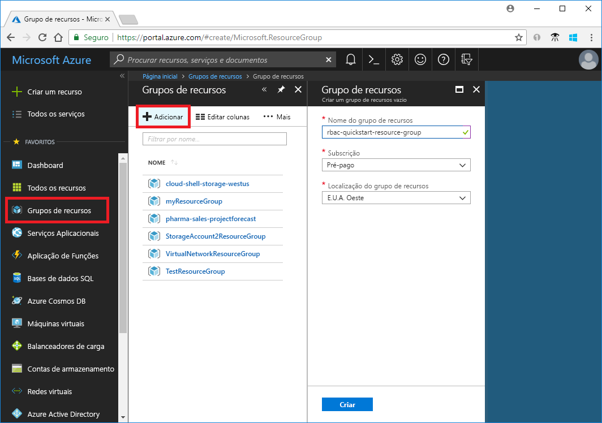
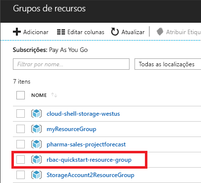
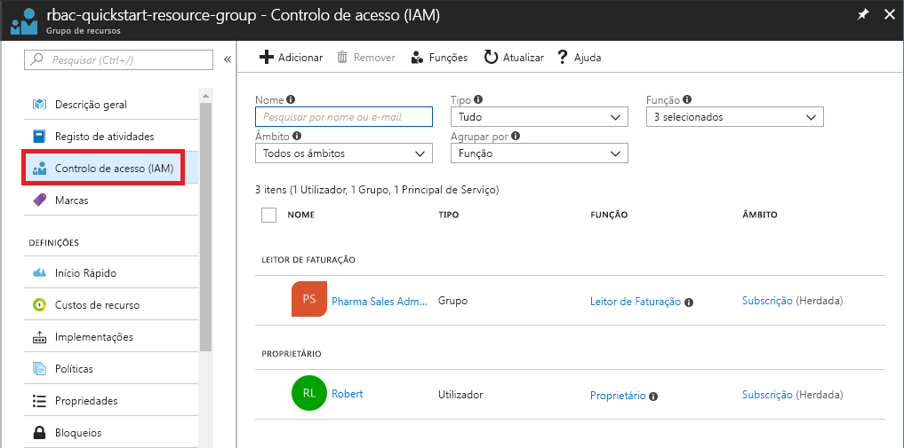
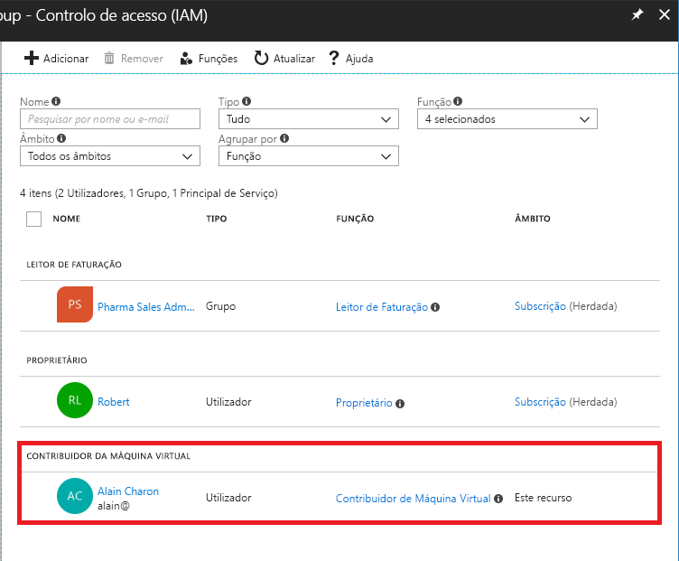
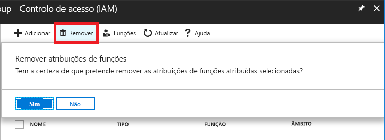
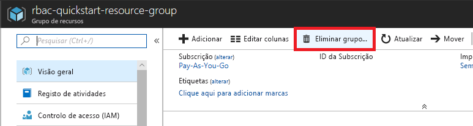

# Tutorial: Conceder ao utilizador acesso aos recursos azure utilizando o portal Azure

O [controlo de acesso baseado em funções azure (Azure RBAC)](overview.md) é a forma como gere o acesso aos recursos azure. Neste tutorial, você concede a um utilizador acesso para criar e gerir máquinas virtuais em um grupo de recursos.

Neste tutorial, ficará a saber como:

> [!div class="checklist"]
> * Conceder acesso a um utilizador num âmbito de grupo de recursos
> * Remover o acesso

Se não tiver uma subscrição Azure, crie uma [conta gratuita](https://azure.microsoft.com/free/?WT.mc_id=A261C142F) antes de começar.

## Iniciar sessão no Azure

Inicie sessão no portal do Azure em https://portal.azure.com.

## Criar um grupo de recursos

1. Na lista de navegação, clique em **Grupos de recursos**.

1. Clique **em Adicionar** para abrir a lâmina do grupo **Recursos.**

   

1. Para nome de **grupo de recursos,** insira o **grupo rbac-resource**.

1. Selecione uma subscrição e uma localização.

1. Clique em **Criar** para criar o grupo de recursos.

1. Clique em **Refresh** para atualizar a lista de grupos de recursos.

   O novo grupo de recursos é apresentado na lista de grupos de recursos.

   

## Conceder acesso

No Azure RBAC, para conceder acesso, cria-se uma atribuição de funções.

1. Na lista de **grupos**de Recursos, clique no novo grupo de recursos do **grupo rbac-resource.**

1. Clique em **Controlo de acesso (IAM)**.

1. Clique no separador **Atribuições de funções** para ver a lista de atribuições de funções atual.

   

1. Clique em **Adicionar** > **atribuição de função** para abrir o painel de atribuição de funções Adicionar.

   Se não tiver permissão para atribuir funções, a opção de atribuição de funções Add será desativada.

   

   

1. Na lista pendente **Função**, selecione **Contribuidor de Máquina Virtual**.

1. Na lista **Selecionar**, selecione-se a si mesmo ou outro utilizador.

1. Clique em **Guardar** para criar a atribuição de função.

   Após alguns momentos, o utilizador é atribuído ao fator Virtual Machine Contributor no âmbito do grupo de recursos do grupo de recursos rbac-resource.

   

## Remover o acesso

No Azure RBAC, para remover o acesso, remove-se uma atribuição de funções.

1. Na lista de atribuições de funções, adicione uma marca de verificação ao lado do utilizador com a função De Colaborador da Máquina Virtual.

1. Clique em **Remover**.

   

1. Na mensagem de atribuição de funções de remoção que aparece, clique **em Sim**.

## Limpeza

1. Na lista de navegação, clique em **Grupos de recursos**.

1. Clique no **grupo de recursos rbac-resource** para abrir o grupo de recursos.

1. Clique em Eliminar o **grupo de recursos** para eliminar o grupo de recursos.

   

1. No **Caso certifique-se de que pretende eliminar a** lâmina, escreva o nome do grupo de recursos: grupo de recursos **rbac**.

1. Clique em **Apagar** para eliminar o grupo de recursos.

## Passos seguintes

> [!div class="nextstepaction"]
> [Tutorial: Conceder ao utilizador acesso aos recursos Azure utilizando o Azure PowerShell](tutorial-role-assignments-user-powershell.md)
