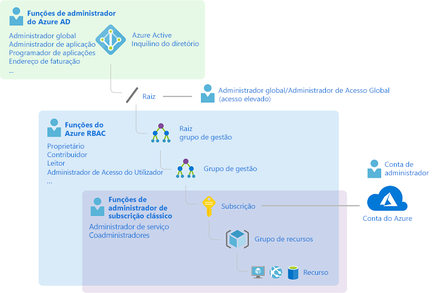
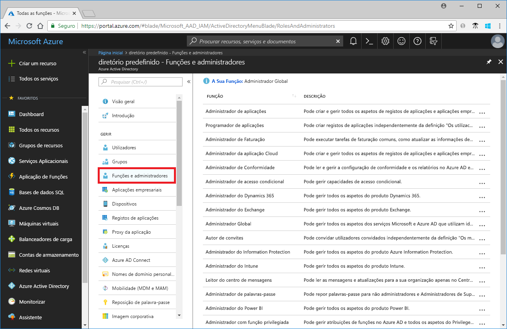
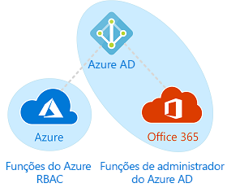

# Funções clássicas de administrador de subscrição, funções de Azure e Azure AD

Se não estiver familiarizado com o Azure, pode ser um pouco difícil compreender todas as diferentes funções. Este artigo ajuda a explicar as funções seguintes e quando utilizar cada uma:
- Funções de administrador de subscrição clássica
- Funções do Azure
- Funções de Diretório Ativo Azure (Azure AD)

## De que forma estão relacionadas as funções

Para compreender melhor as funções no Azure, ajuda conhecer alguma da história. Quando o Azure foi lançado inicialmente, o acesso aos recursos era gerido com apenas três funções de administrador: Administrador de Conta, Administrador de Serviços e Coadministrador. Mais tarde, a Azure foi adicionado o controlo de acesso baseado em funções (Azure RBAC). O RBAC do Azure é um sistema de autorização mais recente que fornece gestão pormenorizada de acesso para recursos do Azure. O Azure RBAC inclui muitos papéis incorporados, pode ser atribuído em diferentes âmbitos, e permite-lhe criar as suas próprias funções personalizadas. Para gerir recursos em Azure AD, tais como utilizadores, grupos e domínios, existem vários papéis AD AZure.

O diagrama seguinte é uma visão de alto nível de como as funções clássicas de administrador de subscrição, funções de Azure e AD Estão relacionadas.

## Funções de administrador de subscrição clássica

Administrador de Conta, Administrador de Serviços e Coadministrador são as três funções de administrador de subscrição clássica no Azure. Os administradores de subscrição clássica têm acesso total à subscrição do Azure. Podem gerir recursos com o portal do Azure, as APIs do Azure Resource Manager e as APIs do modelo de implementação clássica. A conta utilizada para se inscrever no Azure é definida automaticamente como Administrador de Conta e Administrador de Serviços. Em seguida, podem ser adicionados outros Coadministradores. O Administrador de Serviço e o Co-Administrators têm o acesso equivalente aos utilizadores a quem foi atribuída a função De proprietário (uma função Azure) no âmbito de subscrição. A tabela seguinte descreve as diferenças entre estas três funções administrativas de subscrição clássica.

| Administrador de subscrição clássica | Limite | Permissões | Notas |
| --- | --- | --- | --- |
| Administrador de Conta | 1 por conta do Azure | <ul><li>Gerir faturação no [portal Azure](https://portal.azure.com/#blade/Microsoft_Azure_Billing/SubscriptionsBlade)</li><li>Gerir todas as subscrições numa conta</li><li>Criar novas subscrições</li><li>Cancelar subscrições</li><li>Alterar a faturação de uma subscrição</li><li>Alterar o Administrador de Serviços</li></ul> | Conceitualmente, o proprietário de faturação da subscrição. |
| Administrador de Serviços | 1 por subscrição do Azure | <ul><li>Gerir os serviços no [portal do Azure](https://portal.azure.com)</li><li>Cancelar a subscrição</li><li>Atribuir utilizadores à função Coadministrador</li></ul> | Por predefinição, para uma nova subscrição, o Administrador de Conta também é o Administrador de Serviços. O Administrador de Serviços tem o acesso equivalente de um utilizador com a função Proprietário atribuída no âmbito da subscrição. O Administrador de Serviços tem acesso total ao portal do Azure. |
| Coadministrador | 200 por subscrição | <ul><li>Tem os mesmos privilégios de acesso do Administrador de Serviços, mas não pode alterar a associação de subscrições a diretórios do Azure</li><li>Atribuir utilizadores à função Coadministrador, mas não pode alterar o Administrador de Serviços</li></ul> | O Coadministrador tem o acesso equivalente de um utilizador com a função Proprietário atribuída no âmbito da subscrição. |

No portal Azure, pode gerir Co-Administrators ou ver o Administrador de Serviço utilizando o separador **Administradores Clássicos.**

No portal Azure, pode visualizar ou alterar o Administrador de Serviço ou ver o Administrador de Conta na lâmina de propriedades da sua subscrição.

Para mais informações, consulte os [administradores de subscrição clássicos da Azure.](classic-administrators.md)

### Conta e subscrições do Azure

Uma conta do Azure representa uma relação de faturação. Uma conta do Azure é uma identidade de utilizador, uma ou mais subscrições do Azure e um conjunto associado de recursos do Azure. A pessoa que cria a conta é o Administrador de Conta de todas as subscrições criadas nessa conta. Essa pessoa também é o Administrador de Serviços predefinido da subscrição.

As subscrições do Azure ajudam a organizar o acesso aos recursos do Azure. Também ajudam a controlar de que forma é que a utilização dos recursos é comunicada, faturada e paga. Cada subscrição pode ter uma configuração de faturação e pagamento diferente, para que possa ter subscrições e planos diferentes por escritório, departamento, projeto e assim sucessivamente. Cada serviço pertence a uma subscrição e o ID de subscrição pode ser necessário para operações de programação.

Cada subscrição está associada a um diretório AD Azure. Para encontrar o diretório a que a subscrição está associada, abra **subscrições** no portal Azure e, em seguida, selecione uma subscrição para ver o diretório.

As contas e subscrições são geridas no [portal Azure](https://portal.azure.com/#blade/Microsoft_Azure_Billing/SubscriptionsBlade).

## Funções do Azure

O RBAC do Azure é um sistema de autorização criado com base no [Azure Resource Manager](../azure-resource-manager/management/overview.md) que fornece gestão pormenorizada de acesso para recursos do Azure, como computação e armazenamento. O RBAC do Azure inclui mais de 70 funções incorporadas. Há quatro papéis fundamentais do Azure. As três primeiras aplicam-se a todos os tipos de recursos:

| Função do Azure | Permissões | Notas |
| --- | --- | --- |
| [Proprietário](built-in-roles.md#owner) | <ul><li>Acesso total a todos os recursos</li><li>Delegar o acesso a outras pessoas</li></ul> | É atribuída a função Proprietário ao Administrador de Serviços e aos Coadministradores no âmbito da subscrição Aplica-se a todos os tipos de recursos. |
| [Contribuinte](built-in-roles.md#contributor) | <ul><li>Criar e gerir todos os tipos de recursos do Azure</li><li>Criar um novo inquilino no Azure Ative Directory</li><li>Não é possível conceder acesso a outras pessoas</li></ul> | Aplica-se a todos os tipos de recursos. |
| [Leitor](built-in-roles.md#reader) | <ul><li>Ver os recursos do Azure</li></ul> | Aplica-se a todos os tipos de recursos. |
| [Administrador de Acesso do Utilizador](built-in-roles.md#user-access-administrator) | <ul><li>Gerir o acesso de utilizador aos recursos do Azure</li></ul> |  |

As restantes funções incorporadas permitem a gestão de recursos específicos do Azure. Por exemplo, a função [Contribuidor de Máquina Virtual](built-in-roles.md#virtual-machine-contributor) permite ao utilizador criar e gerir máquinas virtuais. Para obter uma lista de todos os papéis incorporados, consulte [as funções incorporadas do Azure.](built-in-roles.md)

Apenas o portal Azure e as APIs do Gestor de Recursos Azure apoiam o Azure RBAC. Os utilizadores, grupos e aplicações que lhes são atribuídas funções Azure não podem utilizar o [modelo de implementação clássico Azure APIs](../azure-resource-manager/management/deployment-models.md).

No portal Azure, as atribuições de funções utilizando o Azure RBAC aparecem na lâmina **do controlo de acesso (IAM).** Esta lâmina pode ser encontrada em todo o portal, como grupos de gestão, subscrições, grupos de recursos e vários recursos.

Ao clicar no **separador 'Funções',** verá a lista de funções incorporadas e personalizadas.

Para obter mais informações, consulte [as funções De Atribuição Azure utilizando o portal Azure](role-assignments-portal.md).

## Funções do Azure AD

As funções AD do Azure são usadas para gerir os recursos Azure AD num diretório como criar ou editar utilizadores, atribuir funções administrativas a outros, redefinir palavras-passe do utilizador, gerir licenças de utilizador e gerir domínios. A tabela seguinte descreve alguns dos papéis AD Azure mais importantes.

| Papel de AD AZure | Permissões | Notas |
| --- | --- | --- |
| [Administrador Global](../active-directory/roles/permissions-reference.md#global-administrator) | <ul><li>Gerir o acesso a todas as funcionalidades administrativas no Azure Active Directory, bem como serviços com federação para o Azure Active Directory</li><li>Atribuir funções de administrador a outras pessoas</li><li>Repor a palavra-passe para qualquer utilizador e todos os outros administradores</li></ul> | A pessoa que se inscreve no inquilino do Azure Active Directory torna-se um Administrador Global. |
| [Administrador do Utilizador](../active-directory/roles/permissions-reference.md#user-administrator) | <ul><li>Criar e gerir todos os aspetos de utilizadores e grupos</li><li>Gerir pedidos de suporte</li><li>Monitorizar o estado de funcionamento do serviço</li><li>Alterar palavras-passe para utilizadores, administradores de suporte técnico e outros Administradores de Utilizadores</li></ul> |  |
| [Administrador de Faturação](../active-directory/roles/permissions-reference.md#billing-administrator) | <ul><li>Efetuar compras</li><li>Gerir subscrições</li><li>Gerir pedidos de suporte</li><li>Monitoriza o estado de funcionamento do serviço</li></ul> |  |

No portal Azure, pode ver a lista de funções AD Azure na lâmina **de Funções e administradores.** Para obter uma lista de todas as funções da AD Azure, consulte [as permissões de função de administrador no Diretório Ativo Azure](../active-directory/roles/permissions-reference.md).

## Diferenças entre as funções do Azure e as funções do Azure AD

A um nível elevado, as funções Azure controlam permissões para gerir os recursos do Azure, enquanto as funções AZure AD controlam permissões para gerir os recursos do Azure Ative Directory. A tabela seguinte compara algumas das diferenças.

| Funções do Azure | Funções do Azure AD |
| --- | --- |
| Gerir o acesso aos recursos do Azure | Gerir o acesso aos recursos do Azure Active Directory |
| Suporta funções personalizadas | Suporta funções personalizadas |
| O âmbito pode ser especificado em vários níveis (grupo de gestão, subscrição, grupo de recursos, recurso) | [O âmbito](../active-directory/roles/custom-overview.md#scope) pode ser especificado ao nível do inquilino (a nível da organização) ou num objeto individual (por exemplo, uma aplicação específica) |
| As informações das funções podem ser acedidas no portal do Azure, CLI do Azure, Azure PowerShell, modelos do Azure Resource Manager, API REST | As informações sobre funções podem ser acedidas no portal de administração Azure, Microsoft 365, Microsoft Graph, AzureAD PowerShell |

### Os papéis de Azure e Ad Azure sobrepõem-se?

Por padrão, os papéis de Azure e Azure AD não abrangem Azure e Azure AD. No entanto, se um Administrador Global elevar o seu acesso escolhendo a gestão de acesso para a switch **de recursos Azure** no portal Azure, o Administrador Global receberá a função [de Administrador de Acesso](built-in-roles.md#user-access-administrator) ao Utilizador (uma função Azure) em todas as subscrições de um determinado inquilino. A função Administrador de Acesso de Utilizador permite ao utilizador conceder a outros utilizadores o acesso aos recursos do Azure. Esta opção pode ser útil para recuperar o acesso a uma subscrição. Para obter mais informações, consulte [o acesso da Elevate para gerir todas as subscrições e grupos de gestão da Azure.](elevate-access-global-admin.md)

Vários funções de AD Azure abrangem Azure AD e Microsoft 365, tais como as funções de Administrador Global e Administrador de Utilizador. Por exemplo, se for membro do papel de Administrador Global, tem capacidades de administrador global em AD e Microsoft 365, tais como fazer alterações no Microsoft Exchange e microsoft SharePoint. No entanto, por predefinição, o Administrador Global não tem acesso aos recursos do Azure.

## Passos seguintes

- [O que é o controlo de acesso baseado em funções do Azure (Azure RBAC)?](overview.md)
- [Administrator role permissions in Azure Active Directory](../active-directory/roles/permissions-reference.md) (Permissões de cargos de administrador no Azure Active Directory)
- [Administradores de subscrição clássicos do Azure](classic-administrators.md)
