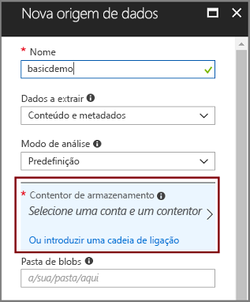
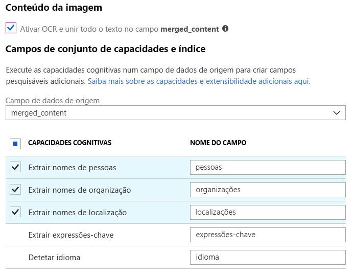
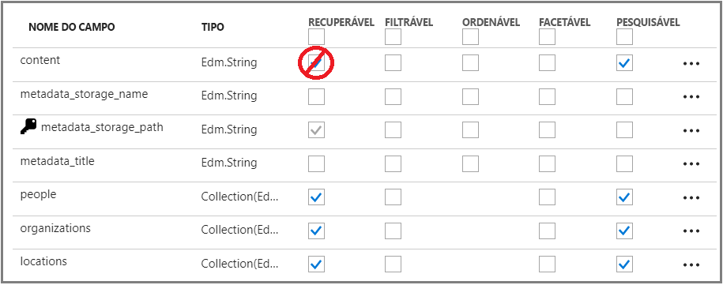
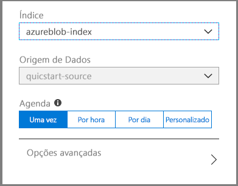
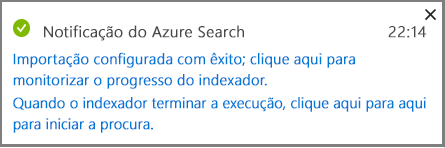
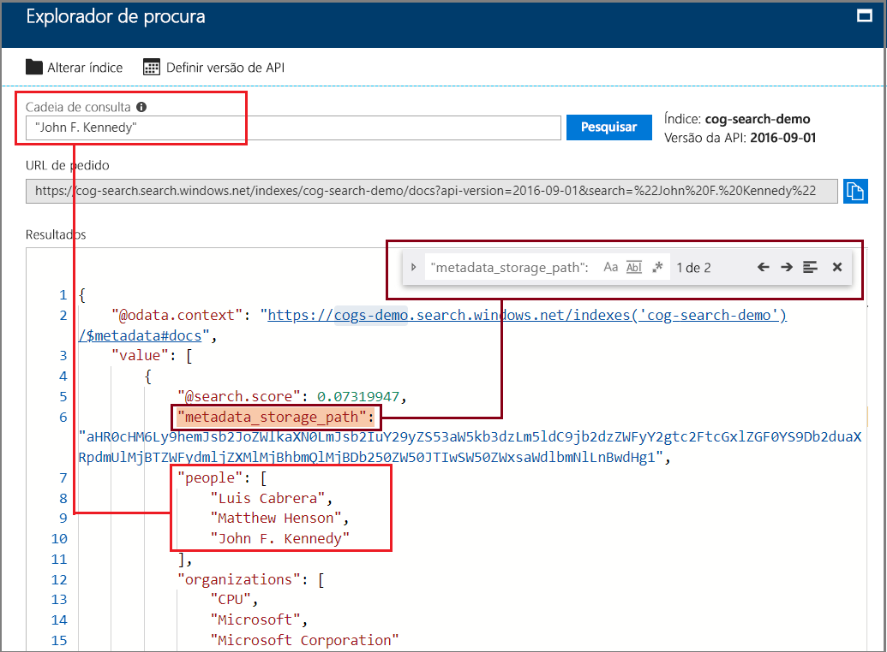

# Início rápido: Criar um pipeline de enriquecimento de ia usando habilidades cognitivas no Azure Search

O Azure Search integra-se com [Serviços cognitivas](https://azure.microsoft.com/services/cognitive-services/), adicionando extração de conteúdo, NLP (processamento de linguagem natural) e habilidades de processamento de imagem a um pipeline de indexação de Azure Search, tornando o conteúdo não pesquisável ou não estruturado mais pesquisável. 

Muitos recursos de serviços cognitivas, como [OCR](cognitive-search-skill-ocr.md), [detecção de idioma](cognitive-search-skill-language-detection.md), reconhecimento de [entidade](cognitive-search-skill-entity-recognition.md) para citar alguns, podem ser anexados a um processo de indexação. Os algoritmos de ia de serviços cognitivas são usados para encontrar padrões, recursos e características em dados de origem, como retornar estruturas e conteúdo textual que podem ser usados em soluções de pesquisa de texto completo com base em Azure Search.

Neste guia de início rápido, crie seu primeiro pipeline de enriquecimento no [portal do Azure](https://portal.azure.com) antes de escrever uma única linha de código:

> [!div class="checklist"]
> * Comece com dados de exemplo no armazenamento de Blobs do Azure
> * Configurar o assistente de [**importação de dados**](search-import-data-portal.md) para indexação e enriquecimento cognitiva 
> * Execute o assistente (uma capacidade de entidades deteta as pessoas, a localização e as organizações)
> * Usar o [**Search Explorer**](search-explorer.md) para consultar os dados aprimorados

Este guia de início rápido é executado no serviço gratuito, mas o número de transações gratuitas é limitado a 20 documentos por dia. Se você quiser executar este início rápido mais de uma vez por dia, use um conjunto de arquivos menor para que você possa se ajustar a mais execuções.

> [!NOTE]
> Ao expandir o escopo aumentando a frequência de processamento, adicionando mais documentos ou adicionando mais algoritmos de ia, você precisará [anexar um recurso de serviços cognitivas cobráveis](cognitive-search-attach-cognitive-services.md). As cobranças são acumuladas ao chamar APIs em serviços cognitivas e para extração de imagem como parte do estágio de quebra de documento no Azure Search. Não há encargos para a extração de texto de documentos.
>
> A execução de habilidades internas é cobrada pelo [preço pago pelo uso dos serviços cognitivas](https://azure.microsoft.com/pricing/details/cognitive-services/)existentes. O preço de extração de imagem é descrito na [página de preços de Azure Search](https://go.microsoft.com/fwlink/?linkid=2042400).

Se não tiver uma subscrição do Azure, crie uma [conta gratuita](https://azure.microsoft.com/free/?WT.mc_id=A261C142F) antes de começar.

## Pré-requisitos

[Crie um serviço de Azure Search](search-create-service-portal.md) ou [Localize um serviço existente](https://ms.portal.azure.com/#blade/HubsExtension/BrowseResourceBlade/resourceType/Microsoft.Search%2FsearchServices) em sua assinatura atual. Você pode usar um serviço gratuito para este guia de início rápido.

Os [Serviços cognitivas](https://azure.microsoft.com/services/cognitive-services/) fornecem o ia. Este guia de início rápido inclui etapas para adicionar esses recursos em linha ao especificar o pipeline. Não é necessário configurar contas com antecedência.

Os serviços do Azure são necessários para fornecer as entradas para o pipeline de indexação. Você pode usar qualquer fonte de dados com suporte dos [indexadores Azure Search](search-indexer-overview.md). Este guia de início rápido usa o [armazenamento de BLOBs do Azure](https://azure.microsoft.com/services/storage/blobs/) como um contêiner para arquivos de dados de origem. 

### Configurar o serviço Blob do Azure e carregar dados de exemplo

1. A [transferência de dados de exemplo](https://1drv.ms/f/s!As7Oy81M_gVPa-LCb5lC_3hbS-4) é constituída por um pequeno conjunto de ficheiros de diferentes tipos. 

1. [Inscreva-se no armazenamento de BLOBs do Azure](https://docs.microsoft.com/azure/storage/common/storage-quickstart-create-account?tabs=azure-portal), crie uma conta de armazenamento, abra as páginas dos serviços de BLOB e crie um contêiner.  Crie a conta de armazenamento na mesma região que Azure Search.

1. No contêiner que você criou, clique em **carregar** para carregar os arquivos de exemplo que você baixou em uma etapa anterior.

   

## Criar o pipeline de melhoramento

Retorne à página do painel do serviço Azure Search e clique em **importar dados** na barra de comandos para configurar o enriquecimento avançado em quatro etapas.

  

### Passo 1: Criar uma origem de dados

Em **conectar-se aos seus dados**, escolha **armazenamento de BLOBs do Azure**, selecione a conta e o contêiner que você criou. Dê um nome à origem de dados e utilize os valores predefinidos para o resto. 

  

Vá para a próxima página.

  

### Passo 2: Adicionar habilidades cognitivas

Em seguida, adicione passos de melhoramento ao pipeline de indexação. Se você não tiver um recurso de serviços cognitivas, poderá se inscrever para obter uma versão gratuita que oferece 20 transações por dia. Os dados de exemplo consistem em 14 arquivos, de modo que sua alocação diária será usada principalmente quando você executar esse assistente.

1. Expanda **anexar serviços cognitivas** para exibir opções de origem do API de serviços cognitivos. Para os fins deste tutorial, você pode usar o recurso **gratuito** .

   

2. Expanda **Adicionar aprimoramentos** e selecione as habilidades que executam o processamento de idioma natural. Para este início rápido, escolha o reconhecimento de entidades de pessoas, organizações e localizações.

   

   O portal oferece habilidades internas para processamento de OCR e análise de texto. No portal, um conjunto de competências funciona através de um campo de origem exclusivo. Tal poderá parecer como um destino pequeno, mas, para os blobs do Azure, o campo `content` contém a maior parte do documento de blobs (por exemplo, um documento Word ou uma apresentação do PowerPoint). Como tal, este campo é uma entrada ideal uma vez que contém todo o conteúdo de um blob.

3. Vá para a próxima página.

   

> [!NOTE]
> As competências de processamento de linguagem natural funcionam através de conteúdo de texto no conjunto de dados de exemplo. Como não selecionamos a opção OCR, os arquivos JPEG e PNG encontrados no conjunto de dados de exemplo não serão processados neste guia de início rápido. 

### Passo 3: Configurar o índice

O assistente normalmente pode inferir um índice padrão. Nesta etapa, você pode exibir o esquema de índice gerado e possivelmente revisar as configurações. Abaixo está o índice padrão criado para o conjunto de dados de blob de demonstração.

Para este início rápido, o assistente é muito útil, pois define predefinições razoáveis: 

+ O nome padrão é *azureblob* com base no tipo de fonte de dados. 

+ Os campos padrão são baseados no campo de dados de origem`content`original (), além dos campos`people`de `organizations`saída ( `locations`, e) criados pelo pipeline cognitiva. Os tipos de dados padrão são inferidos de metadados e amostragem de dados.

+ A chave padrão é *metadata_storage_path* (esse campo contém valores exclusivos).

+ Os atributos padrão são **recuperáveis** e **pesquisáveis** para esses campos. **Pesquisável** indica que um campo pode ser pesquisado. **Recuperável** significa que ele pode ser retornado nos resultados. O assistente pressupõe que você deseja que esses campos sejam recuperáveis e pesquisáveis porque você os criou por meio de um contratador de habilidades.

  

Observe o tachado e o ponto de interrogação no atributo **recuperável** pelo `content` campo. Para documentos de blob com texto pesado, `content` o campo contém a massa do arquivo, potencialmente em milhares de linhas. Se você precisar passar o conteúdo do arquivo para o código do cliente, certifique-se de que **recuperável** permaneça selecionado. Caso contrário, considere limpar esse atributo `content` se os elementos extraídos`people`( `organizations`,, `locations`e) forem suficientes para suas finalidades.

Marcar um campo como **recuperável** não significa que o campo *deve* estar presente nos resultados da pesquisa. Você pode controlar precisamente a composição dos resultados da pesquisa usando o parâmetro de consulta **$Select** para especificar quais campos incluir. Para campos com texto pesado como `content`, o parâmetro **$Select** é sua solução para fornecer resultados de pesquisa gerenciáveis para os usuários humanos de seu aplicativo, ao mesmo tempo em que garante que o código do cliente tenha acesso a todas as informações necessárias por meio do  **Atributo recuperável** .
  
Vá para a próxima página.

  

### Passo 4: Configurar o indexador

O indexador é um recurso de alto nível que impulsiona o processo de indexação. Especifica o nome da fonte de dados, um índice de destino e a frequência de execução. O resultado final do assistente para **Importar dados** é sempre um indexador que pode executar repetidamente.

Na página **indexador** , você pode aceitar o nome padrão e usar a opção agenda de **execução única** para executá-lo imediatamente. 

  

Clique em **Enviar** para criar e executar o indexador simultaneamente.

## Indexação de monitor

As etapas de enriquecimento levam mais tempo para serem concluídas do que a indexação típica baseada em texto. O assistente deve abrir a lista indexador na página Visão geral para que você possa acompanhar o progresso. Para navegação automática, vá para a página Visão geral e clique em **indexadores**.

O aviso ocorre porque os arquivos JPG e PNG são arquivos de imagem e omitimos a habilidade de OCR deste pipeline. Você também encontrará notificações de truncamento. Azure Search limita a extração a 32.000 caracteres na camada gratuita.

  

A indexação e o melhoramento podem demorar algum tempo, motivo pelo qual os conjuntos de dados mais pequenos são recomendados para uma exploração antecipada. 

## Consultar no Explorador de procura

Depois de criar um índice, pode submeter consultas para devolver documentos do índice. No portal, utilize **Explorador de procura** para executar consultas e ver resultados. 

1. Na página do dashboard do serviço de procura, clique em **Explorador de procura** na barra de comandos.

1. Selecione **Alterar Índice**, na parte superior, para selecionar o índice que criou.

1. Insira uma cadeia de caracteres de pesquisa para consultar o índice `search=Microsoft&searchFields=organizations`, como.

Os resultados são devolvidos em JSON, que podem ser verbosos e difíceis de ler, especialmente em documentos grandes provenientes de blobs do Azure. Se não conseguir analisar os resultados facilmente, utilize CTRL-F para procurar nos documentos. Para essa consulta, você pode pesquisar dentro do JSON para termos específicos. 

CTRL-F pode igualmente ajudá-lo a determinar o número de documentos num determinado conjunto de resultados. Para os blobs do Azure, o portal escolhe “metadata_storage_path” como a chave, porque cada valor é exclusivo para o documento. Com CTRL-F, pesquise “metadata_storage_path” para obter uma contagem de documentos. 

  

## Conclusões

Agora você concluiu seu primeiro exercício de indexação aprimorado de cognitiva. Este início rápido tinha como objetivo introduzir conceitos importantes e orientá-lo através do assistente para que possa criar rapidamente um protótipo de uma solução de pesquisa cognitiva com os seus próprios dados.

Alguns dos conceitos-chave que esperamos que tenha assimilado incluem a dependência das origens de dados do Azure. O melhoramento da pesquisa cognitiva está vinculado aos indexadores e, por sua vez, os indexadores são específicos do Azure e da origem. Embora este início rápida utilize o armazenamento de Blobs do Azure, pode utilizar outras origens de dados do Azure. Para obter mais informações, veja [Indexadores no Azure Search](search-indexer-overview.md).

Outro conceito importante é que as competências funcionam através de campos de texto. No portal, tem de escolher um campo de origem exclusivo para todas as competências. No código, as entradas podem ser outros campos ou o resultado de uma competência de origem.

 As entradas para uma competência estão mapeadas num campo de saída num índice. Internamente, o portal configura as [anotações](cognitive-search-concept-annotations-syntax.md) e define um [conjunto de competências](cognitive-search-defining-skillset.md) ao estabelecer a ordem das operações e o fluxo geral. Estes passos estão ocultos no portal, mas quando começar a escrever código, estes conceitos tornam-se importantes.

Por fim, aprendeu que pode visualizar resultados através da consulta do índice. No final, o Azure Search fornece um índice pesquisável, que pode consultar com a sintaxe de consulta [simples](https://docs.microsoft.com/rest/api/searchservice/simple-query-syntax-in-azure-search) ou [completamente expandida](https://docs.microsoft.com/rest/api/searchservice/lucene-query-syntax-in-azure-search). Um índice com campos melhorados é igual a qualquer outro. Se pretender incorporar [analisadores personalizados](search-analyzers.md) ou standard, [perfis de classificação](https://docs.microsoft.com/rest/api/searchservice/add-scoring-profiles-to-a-search-index), [sinónimos](search-synonyms.md), [filtros por facetas](search-filters-facets.md), pesquisa geográfica ou qualquer outra funcionalidade do Azure Search, pode certamente fazê-lo.

## Limpeza

Quando você está trabalhando em sua própria assinatura, é uma boa ideia no final de um projeto identificar se você ainda precisa dos recursos que criou. Os recursos deixados em execução podem custar dinheiro. Você pode excluir os recursos individualmente ou excluir o grupo de recursos para excluir o conjunto inteiro de recursos.

Você pode encontrar e gerenciar recursos no portal, usando o link **todos os recursos** ou **grupos de recursos** no painel de navegação esquerdo.

Se você estiver usando um serviço gratuito, lembre-se de que você está limitado a três índices, indexadores e fontes de dados. Você pode excluir itens individuais no portal para permanecer abaixo do limite. 

## Passos seguintes

Dependendo de como você provisionou o recurso de serviços cognitivas, você pode experimentar a indexação e o enriquecimento executando novamente o assistente com diferentes habilidades e campos de dados de origem. Para repetir os passos, elimine o índice e o indexador e, em seguida, recrie o indexador com uma nova combinação de seleções.

+ Em **Descrição geral** > **Índices**, selecione o índice criado e clique em **Eliminar**.

+ Na **Descrição geral**, faça duplo clique no mosaico **Indexadores**. Localize o indexador que criou e elimine-o.

Alternativamente, reutilize os dados de exemplo e os serviços que criou e saiba como realizar as mesmas tarefas programaticamente no próximo tutorial. 

> [!div class="nextstepaction"]
> [Tutorial: Conheça as APIs REST de pesquisa cognitiva](cognitive-search-tutorial-blob.md)
