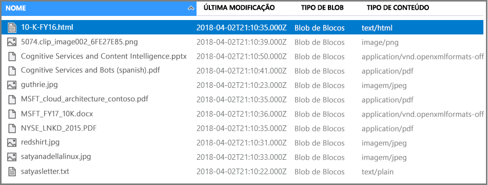

# <a name="tutorial-ai-generated-searchable-content-from-azure-blobs-using-the-net-sdk"></a>Tutorial: Conteúdo pesmável gerado pela IA a partir de bolhas Azure usando o .NET SDK

Se tiver texto ou imagens não estruturados no armazenamento de Azure Blob, um [oleoduto de enriquecimento de IA](cognitive-search-concept-intro.md) pode extrair informações e criar novos conteúdos para a pesquisa completa de texto ou cenários de mineração de conhecimento. 

Neste tutorial, vai aprender a:

> [!div class="checklist"]
> * Criar um ambiente de desenvolvimento.
> * Defina um pipeline que sobre bolhas utilizando OCR, deteção de linguagem, entidade e reconhecimento de frases-chave.
> * Execute o oleoduto para invocar transformações e para criar e carregar um índice de pesquisa.
> * Explore resultados utilizando a pesquisa completa por texto e uma sintaxe de consulta rica.

Se não tiver uma subscrição do Azure, abra uma [conta gratuita](https://azure.microsoft.com/free/?WT.mc_id=A261C142F) antes de começar.

## <a name="overview"></a>Descrição geral

Este tutorial usa C# e aAzure.Search.Docbiblioteca **de clientes uments** para criar uma fonte de dados, índice, indexante e skillset.

O skillset usa habilidades incorporadas baseadas em APIs de Serviços Cognitivos. Os passos no oleoduto incluem reconhecimento de caracteres óticos (OCR) em imagens, deteção de linguagem em texto, extração de frases-chave e reconhecimento de entidades (organizações). Novas informações são armazenadas em novos campos que pode alavancar em consultas, facetas e filtros.

## <a name="prerequisites"></a>Pré-requisitos

* [Visual Studio](https://visualstudio.microsoft.com/downloads/)
* [Azure.Search.Docpacote uments 11.x NuGet](https://www.nuget.org/packages/Azure.Search.Documents) 
* [Armazenamento do Azure](https://azure.microsoft.com/services/storage/)
* [Azure Cognitive Search](https://azure.microsoft.com/services/search/)

> [!Note]
> Pode utilizar o serviço de pesquisa gratuita para este tutorial. Um serviço de pesquisa gratuito limita-o a três índices, três indexantes e três fontes de dados. Este tutorial cria um de cada. Antes de começar, certifique-se de ter espaço no seu serviço para aceitar os novos recursos.

## <a name="download-sample-data"></a>Transferir os dados de exemplo

Os dados da amostra consistem em 14 ficheiros do tipo de conteúdo misto que irá enviar para o armazenamento da Azure Blob num passo posterior.

1. Abra esta [pasta OneDrive](https://1drv.ms/f/s!As7Oy81M_gVPa-LCb5lC_3hbS-4) e no canto superior esquerdo, clique em **Baixar** para copiar os ficheiros para o seu computador. 

1. Clique com o botão direito no ficheiro zip e selecione **Extract All** . Existem 14 ficheiros de vários tipos. Vais usar 7 para este exercício.

Também pode baixar o código fonte para este tutorial. O código fonte está na pasta **tutorial-ai-enriquecimento/v11** no repositório [de amostras de pesquisa de azul-dotnet.](https://github.com/Azure-Samples/azure-search-dotnet-samples)

## <a name="1---create-services"></a>1 - Criar serviços

Este tutorial usa a Azure Cognitive Search para indexar e consultas, Serviços Cognitivos no backend para enriquecimento de IA, e armazenamento Azure Blob para fornecer os dados. Este tutorial fica sob a alocação gratuita de 20 transações por indexante por dia em Serviços Cognitivos, pelo que os únicos serviços que precisa de criar são a pesquisa e armazenamento.

Se possível, crie tanto na mesma região como no grupo de recursos para proximidade e gestão. Na prática, a sua conta de Armazenamento Azure pode estar em qualquer região.

### <a name="start-with-azure-storage"></a>Comece com o armazenamento Azure

1. [Inscreva-se no portal Azure](https://portal.azure.com/) e clique **+ Criar Recurso.**

1. Procure a *conta de armazenamento* e selecione a oferta de Conta de Armazenamento da Microsoft.

   

1. No separador Básicos, são necessários os seguintes itens. Aceite os incumprimentos para tudo o resto.

   * **Grupo de recursos** . Selecione um existente ou crie um novo, mas use o mesmo grupo para todos os serviços para que possa geri-los coletivamente.

   * **Nome da conta de armazenamento** . Se acha que pode ter múltiplos recursos do mesmo tipo, use o nome para desambiguar por tipo e região, por *exemplo, blobstoragewestus* . 

   * **Localização** . Se possível, escolha o mesmo local utilizado para a Azure Cognitive Search and Cognitive Services. Um único local anula as cargas de largura de banda.

   * **Tipo de Conta** . Escolha o predefinido, *StorageV2 (finalidade geral v2)* .

1. Clique **em 'Rever + Criar'** para criar o serviço.

1. Uma vez criado, clique em **Ir ao recurso** para abrir a página 'Vista Geral'.

1. Clique no serviço **Blobs.**

1. Clique **em + Recipiente** para criar um recipiente e nomeie-o *cog-search-demo* .

1. Selecione *a demonstração de pesquisa de cog e,* em seguida, clique em **Upload** para abrir a pasta onde guardou os ficheiros de descarregamento. Selecione todos os catorze ficheiros e clique **em OK** para carregar.

   

1. Antes de sair do Azure Storage, obtenha uma cadeia de ligação para que possa formular uma ligação na Pesquisa Cognitiva Azure. 

   1. Procure de volta à página geral da sua conta de armazenamento *(usamos blobstoragewestus* como exemplo). 

   1. No painel de navegação esquerdo, selecione **as teclas de acesso** e copie uma das cordas de ligação. 

   A cadeia de ligação é um URL semelhante ao seguinte exemplo:

      ```http
      DefaultEndpointsProtocol=https;AccountName=blobstoragewestus;AccountKey=<your account key>;EndpointSuffix=core.windows.net
      ```

1. Guarde o fio de ligação para o Bloco de Notas. Vai precisar mais tarde ao configurar a ligação à fonte de dados.

### <a name="cognitive-services"></a>Serviços Cognitivos

O enriquecimento de IA é apoiado por Serviços Cognitivos, incluindo Análise de Texto e Visão Computacional para o processamento de linguagem natural e imagem. Se o seu objetivo fosse completar um protótipo ou projeto real, você iria neste momento providenciar Serviços Cognitivos (na mesma região que a Azure Cognitive Search) para que você possa anexá-lo a operações de indexação.

Para este exercício, no entanto, você pode ignorar o fornecimento de recursos porque a Azure Cognitive Search pode ligar-se aos Serviços Cognitivos nos bastidores e dar-lhe 20 transações gratuitas por indexer executado. Uma vez que este tutorial utiliza 14 transações, a atribuição gratuita é suficiente. Para projetos maiores, planeie o fornecimento de Serviços Cognitivos no nível S0 pay-as-you-go. Para obter mais informações, consulte [Os Serviços Cognitivos anexados.](cognitive-search-attach-cognitive-services.md)

### <a name="azure-cognitive-search"></a>Azure Cognitive Search

O terceiro componente é a Azure Cognitive Search, que pode [criar no portal](search-create-service-portal.md) ou encontrar um serviço de pesquisa [existente](https://ms.portal.azure.com/#blade/HubsExtension/BrowseResourceBlade/resourceType/Microsoft.Search%2FsearchServices) na sua subscrição.

Pode utilizar o nível Free para completar este walkthrough. 

### <a name="copy-an-admin-api-key-and-url-for-azure-cognitive-search"></a>Copie uma chave api-chave de administrador e URL para pesquisa cognitiva Azure

Para interagir com o seu serviço de Pesquisa Cognitiva Azure, necessitará do URL de serviço e de uma chave de acesso. Um serviço de pesquisa é criado com ambos, por isso, se adicionar Azure Cognitive Search à sua subscrição, siga estes passos para obter as informações necessárias:

1. [Inscreva-se no portal Azure,](https://portal.azure.com/)e na página **geral do** seu serviço de pesquisa, obtenha o URL. Um ponto final de exemplo poderá ser parecido com `https://mydemo.search.windows.net`.

1. Nas **Settings**  >  **Teclas de** Definições, copie uma chave de administração para obter plenos direitos sobre o serviço. Existem duas chaves de administração intercambiáveis, previstas para a continuidade do negócio, caso precise de rolar uma. Pode utilizar a tecla primária ou secundária nos pedidos de adição, modificação e eliminação de objetos.

   Pegue a chave de consulta também. É uma boa prática emitir pedidos de consulta com acesso apenas de leitura.

   

Ter uma chave válida estabelece fidedignidade, numa base por pedido, entre a aplicação a enviar o pedido e o serviço que o processa.

## <a name="2---set-up-your-environment"></a>2 - Configurar o seu ambiente

Comece por abrir o Visual Studio e criar um novo projeto de App de Consola que pode funcionar em .NET Core.

### <a name="install-azuresearchdocuments"></a>Instale Azure.Search.Documents

O [Azure Cognitive Search .NET SDK](/dotnet/api/overview/azure/search) é composto por uma biblioteca de clientes que lhe permite gerir os seus índices, fontes de dados, indexadores e skillsets, bem como carregar e gerir documentos e executar consultas, tudo sem ter de lidar com os detalhes de HTTP e JSON. Esta biblioteca de clientes é distribuída como um pacote NuGet.

Para este projeto, instale a versão 11 ou mais tarde da `Azure.Search.Documents` versão mais recente de `Microsoft.Extensions.Configuration` .

1. No Estúdio Visual, selecione **Tools**  >  **NuGet Package Manager**  >  **Gerencie pacotes nuget para solução...**

1. Procure [ porAzure.Search.Document](https://www.nuget.org/packages/Azure.Search.Documents).

1. Selecione a versão mais recente e, em seguida, clique **em Instalar** .

1. Repita os passos anteriores para instalar [Microsoft.Extensions.Configa uação](https://www.nuget.org/packages/Microsoft.Extensions.Configuration) e [Microsoft.Extensions.Configuration.Js.](https://www.nuget.org/packages/Microsoft.Extensions.Configuration.Json)

### <a name="add-service-connection-information"></a>Adicionar informações de ligação de serviço

1. Clique com o botão direito no seu projeto no Solution Explorer e **selecione Add**  >  **New Item...** . 

1. Nomeie o ficheiro `appsettings.json` e **selecione Adicionar** . 

1. Inclua este ficheiro no seu diretório de saída.
    1. Clique com o direito `appsettings.json` e selecione **Propriedades.** 
    1. Altere o valor da **Cópia para o Diretório de Saída** para Copiar se for mais **recente** .

1. Copie o JSON abaixo no seu novo ficheiro JSON.

    ```json
    {
      "SearchServiceUri": "Put your search service URI here",
      "SearchServiceAdminApiKey": "Put your primary or secondary API key here",
      "SearchServiceQueryApiKey": "Put your query API key here",
      "AzureBlobConnectionString": "Put your Azure Blob connection string here",
    }
    ```

Adicione o seu serviço de pesquisa e informações de conta de armazenamento blob. Lembre-se que pode obter esta informação a partir das etapas de prestação de serviços indicadas na secção anterior.

Para **SearchServiceUri,** insira o URL completo.

### <a name="add-namespaces"></a>Adicionar espaços de nome

In `Program.cs` , adicione os seguintes espaços de nome.

```csharp
using Azure;
using Azure.Search.Documents.Indexes;
using Azure.Search.Documents.Indexes.Models;
using Microsoft.Extensions.Configuration;
using System;
using System.Collections.Generic;
using System.Linq;

namespace EnrichwithAI
```

### <a name="create-a-client"></a>Criar um cliente

Criar um exemplo de a `SearchIndexClient` e um `SearchIndexerClient` abaixo `Main` .

```csharp
public static void Main(string[] args)
{
    // Create service client
    IConfigurationBuilder builder = new ConfigurationBuilder().AddJsonFile("appsettings.json");
    IConfigurationRoot configuration = builder.Build();

    string searchServiceUri = configuration["SearchServiceUri"];
    string adminApiKey = configuration["SearchServiceAdminApiKey"];
    string cognitiveServicesKey = configuration["CognitiveServicesKey"];

    SearchIndexClient indexClient = new SearchIndexClient(new Uri(searchServiceUri), new AzureKeyCredential(adminApiKey));
    SearchIndexerClient indexerClient = new SearchIndexerClient(new Uri(searchServiceUri), new AzureKeyCredential(adminApiKey));
}
```

> [!NOTE]
> Os clientes ligam-se ao seu serviço de pesquisa. Para evitar a abertura de demasiadas ligações, deverá tentar partilhar uma única instância na sua aplicação, se possível. Os métodos são seguros para permitir tal partilha.
> 

### <a name="add-function-to-exit-the-program-during-failure"></a>Adicionar função para sair do programa durante a falha

Este tutorial destina-se a ajudá-lo a entender cada passo do pipeline de indexação. Se houver um problema crítico que impeça o programa de criar a fonte de dados, skillset, indexar ou indexar, o programa irá produzir a mensagem de erro e sair para que o problema possa ser compreendido e abordado.

Adicione `ExitProgram` `Main` para lidar com cenários que requerem a saída do programa.

```csharp
private static void ExitProgram(string message)
{
    Console.WriteLine("{0}", message);
    Console.WriteLine("Press any key to exit the program...");
    Console.ReadKey();
    Environment.Exit(0);
}
```

## <a name="3---create-the-pipeline"></a>3 - Criar o gasoduto

Na Pesquisa Cognitiva Azure, o processamento de IA ocorre durante a indexação (ou ingestão de dados). Esta parte do walkthrough cria quatro objetos: fonte de dados, definição de índice, skillset, indexante. 

### <a name="step-1-create-a-data-source"></a>Passo 1: criar uma origem de dados

`SearchIndexerClient` tem uma [`DataSourceName`](/dotnet/api/azure.search.documents.indexes.models.searchindexer.datasourcename) propriedade que pode definir para um `SearchIndexerDataSourceConnection` objeto. Este objeto fornece todos os métodos necessários para criar, listar, atualizar ou eliminar fontes de dados de Pesquisa Cognitiva Azure.

Crie um novo `SearchIndexerDataSourceConnection` exemplo chamando `indexerClient.CreateOrUpdateDataSourceConnection(dataSource)` . O seguinte código cria uma fonte de dados do tipo `AzureBlob` .

```csharp
private static SearchIndexerDataSourceConnection CreateOrUpdateDataSource(SearchIndexerClient indexerClient, IConfigurationRoot configuration)
{
    SearchIndexerDataSourceConnection dataSource = new SearchIndexerDataSourceConnection(
        name: "demodata",
        type: SearchIndexerDataSourceType.AzureBlob,
        connectionString: configuration["AzureBlobConnectionString"],
        container: new SearchIndexerDataContainer("cog-search-demo"))
    {
        Description = "Demo files to demonstrate cognitive search capabilities."
    };

    // The data source does not need to be deleted if it was already created
    // since we are using the CreateOrUpdate method
    try
    {
        indexerClient.CreateOrUpdateDataSourceConnection(dataSource);
    }
    catch (Exception ex)
    {
        Console.WriteLine("Failed to create or update the data source\n Exception message: {0}\n", ex.Message);
        ExitProgram("Cannot continue without a data source");
    }

    return dataSource;
}
```

Para um pedido bem sucedido, o método devolverá a fonte de dados que foi criada. Se houver um problema com o pedido, como um parâmetro inválido, o método lançará uma exceção.

Agora adicione uma linha `Main` para chamar a `CreateOrUpdateDataSource` função que acabou de adicionar.

```csharp
// Create or Update the data source
Console.WriteLine("Creating or updating the data source...");
SearchIndexerDataSourceConnection dataSource = CreateOrUpdateDataSource(indexerClient, configuration);
```

Crie e execute a solução. Uma vez que este é o seu primeiro pedido, consulte o portal Azure para confirmar que a fonte de dados foi criada na Azure Cognitive Search. Na página geral do serviço de pesquisa, verifique se a lista de Fontes de Dados tem um novo item. Poderá ter de aguardar alguns minutos para a página do portal atualizar.

  

### <a name="step-2-create-a-skillset"></a>Passo 2: Criar um skillset

Nesta secção, define um conjunto de passos de enriquecimento que pretende aplicar aos seus dados. Cada passo de enriquecimento é chamado de *habilidade* e o conjunto de passos de enriquecimento, um *skillset* . Este tutorial usa [habilidades cognitivas incorporadas](cognitive-search-predefined-skills.md) para o skillset:

* [Reconhecimento de Caracteres Óticos](cognitive-search-skill-ocr.md) para reconhecer texto impresso e manuscrito em ficheiros de imagem.

* [Fusão de texto](cognitive-search-skill-textmerger.md) para consolidar texto de uma coleção de campos num único campo.

* [Deteção de Idioma](cognitive-search-skill-language-detection.md) para identificar o idioma do conteúdo.

* [Texto Dividido](cognitive-search-skill-textsplit.md) para dividir grandes conteúdos em pedaços menores antes de chamar a habilidade de extração da frase chave e a habilidade de reconhecimento da entidade. A extração de frases-chave e o reconhecimento de entidades aceitam entradas de 50.000 caracteres ou menos. Alguns dos ficheiros de exemplo precisam de ser divididos para caberem dentro deste limite.

* [Reconhecimento de Entidades](cognitive-search-skill-entity-recognition.md) para extrair os nomes das organizações do conteúdo do recipiente blob.

* [Extração de Expressões-Chave](cognitive-search-skill-keyphrases.md) para solicitar as principais expressões-chaves.

Durante o processamento inicial, a Azure Cognitive Search quebra cada documento para extrair conteúdo de diferentes formatos de ficheiros. O texto originário do ficheiro de origem é colocado num `content` campo gerado, um para cada documento. Como tal, desa estada a entrada para `"/document/content"` utilizar este texto. O conteúdo da imagem é colocado num `normalized_images` campo gerado, especificado num skillset como `/document/normalized_images/*` .

As saídas podem ser mapeadas para um índice, utilizadas como entradas para uma competência a jusante ou ambas, como é o caso do código de idioma. No índice, o código de idioma é útil para a filtragem. Como entrada, o código de idioma é utilizado pelas competências de análise de texto para informar sobre as regras linguísticas em torno da separação de palavras.

Para obter mais informações acerca das noções básicas do conjunto de competências, veja [Como definir um conjunto de competências](cognitive-search-defining-skillset.md).

### <a name="ocr-skill"></a>Habilidade de OCR

A habilidade **OCR** extrai texto de imagens. Esta habilidade pressupõe que existe um campo normalized_images. Para gerar este campo, mais tarde no tutorial vamos definir a ```"imageAction"``` configuração na definição de indexante para ```"generateNormalizedImages"``` .

```csharp
private static OcrSkill CreateOcrSkill()
{
    List<InputFieldMappingEntry> inputMappings = new List<InputFieldMappingEntry>();
    inputMappings.Add(new InputFieldMappingEntry("image")
    {
        Source = "/document/normalized_images/*"
    });

    List<OutputFieldMappingEntry> outputMappings = new List<OutputFieldMappingEntry>();
    outputMappings.Add(new OutputFieldMappingEntry("text")
    {
        TargetName = "text"
    });

    OcrSkill ocrSkill = new OcrSkill(inputMappings, outputMappings)
    {
        Description = "Extract text (plain and structured) from image",
        Context = "/document/normalized_images/*",
        DefaultLanguageCode = OcrSkillLanguage.En,
        ShouldDetectOrientation = true
    };

    return ocrSkill;
}
```

### <a name="merge-skill"></a>Fusão de habilidades

Nesta secção, irá criar uma habilidade **de fusão** que funde o campo de conteúdo documental com o texto produzido pela habilidade OCR.

```csharp
private static MergeSkill CreateMergeSkill()
{
    List<InputFieldMappingEntry> inputMappings = new List<InputFieldMappingEntry>();
    inputMappings.Add(new InputFieldMappingEntry("text")
    {
        Source = "/document/content"
    });
    inputMappings.Add(new InputFieldMappingEntry("itemsToInsert")
    {
        Source = "/document/normalized_images/*/text"
    });
    inputMappings.Add(new InputFieldMappingEntry("offsets")
    {
        Source = "/document/normalized_images/*/contentOffset"
    });

    List<OutputFieldMappingEntry> outputMappings = new List<OutputFieldMappingEntry>();
    outputMappings.Add(new OutputFieldMappingEntry("mergedText")
    {
        TargetName = "merged_text"
    });

    MergeSkill mergeSkill = new MergeSkill(inputMappings, outputMappings)
    {
        Description = "Create merged_text which includes all the textual representation of each image inserted at the right location in the content field.",
        Context = "/document",
        InsertPreTag = " ",
        InsertPostTag = " "
    };

    return mergeSkill;
}
```

### <a name="language-detection-skill"></a>Habilidade de deteção de linguagem

A habilidade **de Deteção de Idiomas** deteta a linguagem do texto de entrada e reporta um único código linguístico para cada documento submetido no pedido. Usaremos a saída da habilidade de **Deteção de Idiomas** como parte da entrada para a habilidade **de Divisão de Texto.**

```csharp
private static LanguageDetectionSkill CreateLanguageDetectionSkill()
{
    List<InputFieldMappingEntry> inputMappings = new List<InputFieldMappingEntry>();
    inputMappings.Add(new InputFieldMappingEntry("text")
    {
        Source = "/document/merged_text"
    });

    List<OutputFieldMappingEntry> outputMappings = new List<OutputFieldMappingEntry>();
    outputMappings.Add(new OutputFieldMappingEntry("languageCode")
    {
        TargetName = "languageCode"
    });

    LanguageDetectionSkill languageDetectionSkill = new LanguageDetectionSkill(inputMappings, outputMappings)
    {
        Description = "Detect the language used in the document",
        Context = "/document"
    };

    return languageDetectionSkill;
}
```

### <a name="text-split-skill"></a>Habilidade de divisão de texto

A habilidade abaixo **split** dividirá texto por páginas e limitará o comprimento da página a 4.000 caracteres medido por `String.Length` . O algoritmo tentará dividir o texto em pedaços que são no máximo `maximumPageLength` de tamanho. Neste caso, o algoritmo fará o seu melhor para quebrar a frase num limite de sentença, pelo que o tamanho do pedaço pode ser ligeiramente inferior `maximumPageLength` a .

```csharp
private static SplitSkill CreateSplitSkill()
{
    List<InputFieldMappingEntry> inputMappings = new List<InputFieldMappingEntry>();
    inputMappings.Add(new InputFieldMappingEntry("text")
    {
        Source = "/document/merged_text"
    });
    inputMappings.Add(new InputFieldMappingEntry("languageCode")
    {
        Source = "/document/languageCode"
    });

    List<OutputFieldMappingEntry> outputMappings = new List<OutputFieldMappingEntry>();
    outputMappings.Add(new OutputFieldMappingEntry("textItems")
    {
        TargetName = "pages",
    });

    SplitSkill splitSkill = new SplitSkill(inputMappings, outputMappings)
    {
        Description = "Split content into pages",
        Context = "/document",
        TextSplitMode = TextSplitMode.Pages,
        MaximumPageLength = 4000,
        DefaultLanguageCode = SplitSkillLanguage.En
    };

    return splitSkill;
}
```

### <a name="entity-recognition-skill"></a>Competência de reconhecimento de entidade

Este `EntityRecognitionSkill` caso está definido para reconhecer o tipo de `organization` categoria. A competência **de Reconhecimento de Entidades** também pode reconhecer tipos de `person` categorias e `location` .

Note que o campo "contexto" é definido ```"/document/pages/*"``` com um asterisco, o que significa que o passo de enriquecimento é chamado para cada página em ```"/document/pages"``` .

```csharp
private static EntityRecognitionSkill CreateEntityRecognitionSkill()
{
    List<InputFieldMappingEntry> inputMappings = new List<InputFieldMappingEntry>();
    inputMappings.Add(new InputFieldMappingEntry("text")
    {
        Source = "/document/pages/*"
    });

    List<OutputFieldMappingEntry> outputMappings = new List<OutputFieldMappingEntry>();
    outputMappings.Add(new OutputFieldMappingEntry("organizations")
    {
        TargetName = "organizations"
    });

    EntityRecognitionSkill entityRecognitionSkill = new EntityRecognitionSkill(inputMappings, outputMappings)
    {
        Description = "Recognize organizations",
        Context = "/document/pages/*",
        DefaultLanguageCode = EntityRecognitionSkillLanguage.En
    };
    entityRecognitionSkill.Categories.Add(EntityCategory.Organization);

    return entityRecognitionSkill;
}
```

### <a name="key-phrase-extraction-skill"></a>Habilidade de extração de frase-chave

Tal como o `EntityRecognitionSkill` caso que acabou de ser criado, a habilidade **de extração de frase-chave** é chamada para cada página do documento.

```csharp
private static KeyPhraseExtractionSkill CreateKeyPhraseExtractionSkill()
{
    List<InputFieldMappingEntry> inputMappings = new List<InputFieldMappingEntry>();
    inputMappings.Add(new InputFieldMappingEntry("text")
    {
        Source = "/document/pages/*"
    });
    inputMappings.Add(new InputFieldMappingEntry("languageCode")
    {
        Source = "/document/languageCode"
    });

    List<OutputFieldMappingEntry> outputMappings = new List<OutputFieldMappingEntry>();
    outputMappings.Add(new OutputFieldMappingEntry("keyPhrases")
    {
        TargetName = "keyPhrases"
    });

    KeyPhraseExtractionSkill keyPhraseExtractionSkill = new KeyPhraseExtractionSkill(inputMappings, outputMappings)
    {
        Description = "Extract the key phrases",
        Context = "/document/pages/*",
        DefaultLanguageCode = KeyPhraseExtractionSkillLanguage.En
    };

    return keyPhraseExtractionSkill;
}
```

### <a name="build-and-create-the-skillset"></a>Construir e criar o skillset

Construa o `Skillset` uso das habilidades que criou.

```csharp
private static SearchIndexerSkillset CreateOrUpdateDemoSkillSet(SearchIndexerClient indexerClient, IList<SearchIndexerSkill> skills,string cognitiveServicesKey)
{
    SearchIndexerSkillset skillset = new SearchIndexerSkillset("demoskillset", skills)
    {
        Description = "Demo skillset",
        CognitiveServicesAccount = new CognitiveServicesAccountKey(cognitiveServicesKey)
    };

    // Create the skillset in your search service.
    // The skillset does not need to be deleted if it was already created
    // since we are using the CreateOrUpdate method
    try
    {
        indexerClient.CreateOrUpdateSkillset(skillset);
    }
    catch (RequestFailedException ex)
    {
        Console.WriteLine("Failed to create the skillset\n Exception message: {0}\n", ex.Message);
        ExitProgram("Cannot continue without a skillset");
    }

    return skillset;
}
```

Adicione as seguintes linhas a `Main` .

```csharp
// Create the skills
Console.WriteLine("Creating the skills...");
OcrSkill ocrSkill = CreateOcrSkill();
MergeSkill mergeSkill = CreateMergeSkill();
EntityRecognitionSkill entityRecognitionSkill = CreateEntityRecognitionSkill();
LanguageDetectionSkill languageDetectionSkill = CreateLanguageDetectionSkill();
SplitSkill splitSkill = CreateSplitSkill();
KeyPhraseExtractionSkill keyPhraseExtractionSkill = CreateKeyPhraseExtractionSkill();

// Create the skillset
Console.WriteLine("Creating or updating the skillset...");
List<SearchIndexerSkill> skills = new List<SearchIndexerSkill>();
skills.Add(ocrSkill);
skills.Add(mergeSkill);
skills.Add(languageDetectionSkill);
skills.Add(splitSkill);
skills.Add(entityRecognitionSkill);
skills.Add(keyPhraseExtractionSkill);

SearchIndexerSkillset skillset = CreateOrUpdateDemoSkillSet(indexerClient, skills, cognitiveServicesKey);
```

### <a name="step-3-create-an-index"></a>Passo 3: Criar um índice

Nesta secção, pode definir o esquema de índice ao especificar os campos a incluir no índice pesquisável e os atributos de pesquisa para cada campo. Os campos têm um tipo e podem ter atributos que determinam a forma como o campo é utilizado (pesquisável, ordenável e assim por diante). Os nomes dos campos num índice não têm necessariamente de corresponder aos nomes dos campos na origem. Num passo posterior, vai adicionar mapeamentos de campos num indexador para ligar campos de origem-destino. Para este passo, defina o índice com convenções de nomenclatura de campo relevantes para a aplicação de pesquisa.

Neste exercício, utiliza os seguintes campos e tipos de campo:

| Nomes de campo | Tipos de campo |
| --- | --- |
| `id` | Edm.String |
| `content` | Edm.String |
| `languageCode` | Edm.String |
| `keyPhrases` | List<Edm.String> |
| `organizations` | List<Edm.String> |

#### <a name="create-demoindex-class"></a>Criar Classe DemoIndex

Os campos para este índice são definidos usando uma classe modelo. Cada propriedade da classe do modelo tem atributos que determinam os comportamentos relacionados com a pesquisa do campo de índice correspondente. 

Vamos adicionar a classe modelo a um novo ficheiro C#. Clique no seu projeto e **selecione Adicionar**  >  **Novo Item...** selecione "Class" e nomeie o `DemoIndex.cs` ficheiro, em seguida, selecione **Add** .

Certifique-se de que pretende utilizar tipos dos `Azure.Search.Documents.Indexes` espaços e `System.Text.Json.Serialization` nomes.

Adicione a definição de classe abaixo do modelo `DemoIndex.cs` e inclua-a no mesmo espaço de nome onde irá criar o índice.

```csharp
using Azure.Search.Documents.Indexes;
using System.Text.Json.Serialization;

namespace EnrichwithAI
{
    // The SerializePropertyNamesAsCamelCase is currently unsupported as of this writing. 
    // Replace it with JsonPropertyName
    public class DemoIndex
    {
        [SearchableField(IsSortable = true, IsKey = true)]
        [JsonPropertyName("id")]
        public string Id { get; set; }

        [SearchableField]
        [JsonPropertyName("content")]
        public string Content { get; set; }

        [SearchableField]
        [JsonPropertyName("languageCode")]
        public string LanguageCode { get; set; }

        [SearchableField]
        [JsonPropertyName("keyPhrases")]
        public string[] KeyPhrases { get; set; }

        [SearchableField]
        [JsonPropertyName("organizations")]
        public string[] Organizations { get; set; }
    }
}
```

Agora que definiu uma classe modelo, `Program.cs` pode criar uma definição de índice com bastante facilidade. O nome deste índice será `demoindex` . Se um índice já existir com esse nome, será eliminado.

```csharp
private static SearchIndex CreateDemoIndex(SearchIndexClient indexClient)
{
    FieldBuilder builder = new FieldBuilder();
    var index = new SearchIndex("demoindex")
    {
        Fields = builder.Build(typeof(DemoIndex))
    };

    try
    {
        indexClient.GetIndex(index.Name);
        indexClient.DeleteIndex(index.Name);
    }
    catch (RequestFailedException ex) when (ex.Status == 404)
    {
        //if the specified index not exist, 404 will be thrown.
    }

    try
    {
        indexClient.CreateIndex(index);
    }
    catch (RequestFailedException ex)
    {
        Console.WriteLine("Failed to create the index\n Exception message: {0}\n", ex.Message);
        ExitProgram("Cannot continue without an index");
    }

    return index;
}
```

Durante os testes, poderá descobrir que está a tentar criar o índice mais de uma vez. Por causa disso, verifique se o índice que está prestes a criar já existe antes de tentar criá-lo.

Adicione as seguintes linhas a `Main` .

```csharp
// Create the index
Console.WriteLine("Creating the index...");
SearchIndex demoIndex = CreateDemoIndex(indexClient);
```

Adicione a seguinte declaração de utilização para resolver a referência de desambiguado.

```csharp
using Index = Azure.Search.Documents.Indexes.Models;
```

Para saber mais sobre conceitos de índice, consulte [Create Index (REST API)](/rest/api/searchservice/create-index).

### <a name="step-4-create-and-run-an-indexer"></a>Passo 4: Criar e executar um indexador

Até ao momento, criou uma origem de dados, um conjunto de competências e um índice. Estes três componentes tornam-se parte de um [indexador](search-indexer-overview.md) que une cada uma das peças numa única operação de várias fases. Para as associar num indexador, tem de definir os mapeamentos de campo.

* Os fieldMappings são processados antes do skillset, mapeando campos de origem da fonte de dados para campos alvo em um índice. Se os nomes e tipos de campo forem os mesmos em ambas as extremidades, não é necessário mapear.

* As saídasFieldMappings são processadas após o skillset, referindo-se a origemFieldNames que não existem até que o documento de cracking ou enriquecimento os crie. O targetFieldName é um campo num índice.

Além de ligar entradas às saídas, também pode usar mapeamentos de campo para achatar estruturas de dados. Para mais informações, consulte [como mapear campos enriquecidos para um índice pescável.](cognitive-search-output-field-mapping.md)

```csharp
private static SearchIndexer CreateDemoIndexer(SearchIndexerClient indexerClient, SearchIndexerDataSourceConnection dataSource, SearchIndexerSkillset skillSet, SearchIndex index)
{
    IndexingParameters indexingParameters = new IndexingParameters()
    {
        MaxFailedItems = -1,
        MaxFailedItemsPerBatch = -1,
    };
    indexingParameters.Configuration.Add("dataToExtract", "contentAndMetadata");
    indexingParameters.Configuration.Add("imageAction", "generateNormalizedImages");

    SearchIndexer indexer = new SearchIndexer("demoindexer", dataSource.Name, index.Name)
    {
        Description = "Demo Indexer",
        SkillsetName = skillSet.Name,
        Parameters = indexingParameters
    };

    FieldMappingFunction mappingFunction = new FieldMappingFunction("base64Encode");
    mappingFunction.Parameters.Add("useHttpServerUtilityUrlTokenEncode", true);

    indexer.FieldMappings.Add(new FieldMapping("metadata_storage_path")
    {
        TargetFieldName = "id",
        MappingFunction = mappingFunction

    });
    indexer.FieldMappings.Add(new FieldMapping("content")
    {
        TargetFieldName = "content"
    });

    indexer.OutputFieldMappings.Add(new FieldMapping("/document/pages/*/organizations/*")
    {
        TargetFieldName = "organizations"
    });
    indexer.OutputFieldMappings.Add(new FieldMapping("/document/pages/*/keyPhrases/*")
    {
        TargetFieldName = "keyPhrases"
    });
    indexer.OutputFieldMappings.Add(new FieldMapping("/document/languageCode")
    {
        TargetFieldName = "languageCode"
    });

    try
    {
        indexerClient.GetIndexer(indexer.Name);
        indexerClient.DeleteIndexer(indexer.Name);
    }
    catch (RequestFailedException ex) when (ex.Status == 404)
    {
        //if the specified indexer not exist, 404 will be thrown.
    }

    try
    {
        indexerClient.CreateIndexer(indexer);
    }
    catch (RequestFailedException ex)
    {
        Console.WriteLine("Failed to create the indexer\n Exception message: {0}\n", ex.Message);
        ExitProgram("Cannot continue without creating an indexer");
    }

    return indexer;
}
```

Adicione as seguintes linhas a `Main` .

```csharp
// Create the indexer, map fields, and execute transformations
Console.WriteLine("Creating the indexer and executing the pipeline...");
SearchIndexer demoIndexer = CreateDemoIndexer(indexerClient, dataSource, skillset, demoIndex);
```

Espere que o processamento do indexante leve algum tempo para ser concluído. Apesar de o conjunto de dados ser pequeno, as competências analíticas realizam um processo de computação intensa. Algumas competências, como a análise de imagem, são de execução longa.

> [!TIP]
> A criação de um indexador invoca o pipeline. Se houver problemas em atingir os dados, com o mapeamento de entradas e saídas ou com a ordem das operações, estes vão surgir nesta fase.

### <a name="explore-creating-the-indexer"></a>Explore a criação do indexante

O código `"maxFailedItems"`  define-se para -1, que instrui o motor de indexação a ignorar erros durante a importação de dados. Esta definição é útil pois existem poucos documentos na origem de dados de demonstração. Para uma origem de dados maior, deve definir o valor com um número maior que 0.

Note também que o `"dataToExtract"` está definido para `"contentAndMetadata"` . Esta instrução informa o indexador para extrair automaticamente o conteúdo a partir de formatos de ficheiros diferentes, bem como de metadados relativos a cada ficheiro.

Quando o conteúdo é extraído, pode definir `imageAction` para extrair texto das imagens existentes na origem de dados. O `"imageAction"` conjunto de `"generateNormalizedImages"` configuração, combinado com a Habilidade de Fusão de OCR e A Capacidade de Fusão de Texto, diz ao indexante para extrair texto das imagens (por exemplo, a palavra "parar" de um sinal de stop de tráfego), e incorpora-o como parte do campo de conteúdo. Este comportamento aplica-se tanto às imagens incorporadas nos documentos (tal como uma imagem num PDF) como às imagens existentes na origem de dados, por exemplo, um ficheiro JPG.

<a name="check-indexer-status"></a>

## <a name="4---monitor-indexing"></a>4 - Monitorização da indexação

Assim que o indexador é definido, este é executado automaticamente quando submete o pedido. Consoante as competências cognitivas que definiu, a indexação pode demorar mais do que o esperado. Para saber se o indexante ainda está em funcionamento, use o `GetStatus` método.

```csharp
private static void CheckIndexerOverallStatus(SearchIndexerClient indexerClient, SearchIndexer indexer)
{
    try
    {
        var demoIndexerExecutionInfo = indexerClient.GetIndexerStatus(indexer.Name);

        switch (demoIndexerExecutionInfo.Value.Status)
        {
            case IndexerStatus.Error:
                ExitProgram("Indexer has error status. Check the Azure Portal to further understand the error.");
                break;
            case IndexerStatus.Running:
                Console.WriteLine("Indexer is running");
                break;
            case IndexerStatus.Unknown:
                Console.WriteLine("Indexer status is unknown");
                break;
            default:
                Console.WriteLine("No indexer information");
                break;
        }
    }
    catch (RequestFailedException ex)
    {
        Console.WriteLine("Failed to get indexer overall status\n Exception message: {0}\n", ex.Message);
    }
}
```

`demoIndexerExecutionInfo` representa o estado atual e o histórico de execução de um indexante.

Os avisos são comuns com algumas combinações de ficheiros de origem e competências e nem sempre indicam um problema. Neste tutorial, os avisos são benignos (por exemplo, os ficheiros JPEG não têm entradas de texto).

Adicione as seguintes linhas a `Main` .

```csharp
// Check indexer overall status
Console.WriteLine("Check the indexer overall status...");
CheckIndexerOverallStatus(indexerClient, demoIndexer);
```

## <a name="5---search"></a>5 - Pesquisar

Nas aplicações de consolas tutoriais Azure Cognitive Search, normalmente adicionamos um atraso de 2 segundos antes de executar consultas que devolvem resultados, mas como o enriquecimento leva vários minutos a ser concluído, vamos fechar a aplicação da consola e usar outra abordagem em vez disso.

A opção mais fácil é [pesquisar o explorador](search-explorer.md) no portal. Primeiro pode executar uma consulta vazia que devolve todos os documentos, ou uma pesquisa mais direcionada que devolve novos conteúdos de campo criados pelo pipeline. 

1. No portal Azure, na página 'Visão Geral' de pesquisa, selecione **Índices** .

1. Encontre **`demoindex`** na lista. Deve ter 14 documentos. Se a contagem de documentos for zero, o indexante ainda está em execução ou a página ainda não foi atualizada. 

1. Selecione **`demoindex`** . O explorador de pesquisa é o primeiro separador.

1. O conteúdo é pesmável assim que o primeiro documento é carregado. Para verificar se o conteúdo existe, execute uma consulta não especificada clicando **em Procurar** . Esta consulta devolve todos os documentos atualmente indexados, dando-lhe uma ideia do que o índice contém.

1. Em seguida, cole na seguinte cadeia para obter resultados mais manejáveis: `search=*&$select=id, languageCode, organizations`

<a name="reset"></a>

## <a name="reset-and-rerun"></a>Repor e executar novamente

Nas fases experimentais iniciais de desenvolvimento, a abordagem mais prática para a iteração de design é eliminar os objetos da Azure Cognitive Search e permitir que o seu código os reconstrua. Os nomes dos recursos são exclusivos. Quando elimina um objeto, pode recriá-lo com o mesmo nome.

O código de amostra deste tutorial verifica os objetos existentes e elimina-os para que possa voltar a verificar o seu código. Também pode utilizar o portal para eliminar índices, indexadores, fontes de dados e skillsets.

## <a name="takeaways"></a>Conclusões

Este tutorial demonstrou os passos básicos para a construção de um gasoduto de indexação enriquecido através da criação de componentes: uma fonte de dados, skillset, índice e indexante.

[Foram introduzidas competências incorporadas,](cognitive-search-predefined-skills.md) juntamente com a definição de skillset e a mecânica das habilidades de acorrentamento em conjunto através de entradas e saídas. Também aprendeu que `outputFieldMappings` na definição do indexante é necessário encaminhar valores enriquecidos do pipeline para um índice pesmável num serviço de Pesquisa Cognitiva Azure.

Por fim, aprendeu como testar os resultados e repor o sistema para iterações futuras. Aprendeu que a emissão de consultas acerca do índice devolve o resultado criado pelo pipeline de indexação melhorado. Também aprendeu como verificar o estado do indexador e quais os objetos a eliminar antes de executar novamente um pipeline.

## <a name="clean-up-resources"></a>Limpar os recursos

Quando se está a trabalhar na sua própria subscrição, no final de um projeto, é uma boa ideia remover os recursos de que já não precisa. Os recursos que deixar em execução podem custar-lhe dinheiro. Pode eliminar recursos individualmente ou eliminar o grupo de recursos para eliminar todo o conjunto de recursos.

Pode encontrar e gerir recursos no portal, utilizando a ligação de todos os recursos ou grupos de recursos no painel de navegação à esquerda.

## <a name="next-steps"></a>Passos seguintes

Agora que está familiarizado com todos os objetos num oleoduto de enriquecimento de IA, vamos olhar mais de perto as definições de skillset e habilidades individuais.

> [!div class="nextstepaction"]
> [Como criar um skillset](cognitive-search-defining-skillset.md)